# Spring Security - RememberMeAuthenticationFilter

#### RememberMeAuthenticationFilter
- 세션이 사라지거나 만료가 되더라도 쿠키 또는 DB를 사용하여 저장된 토큰 기반 인증을 지원하는 필터

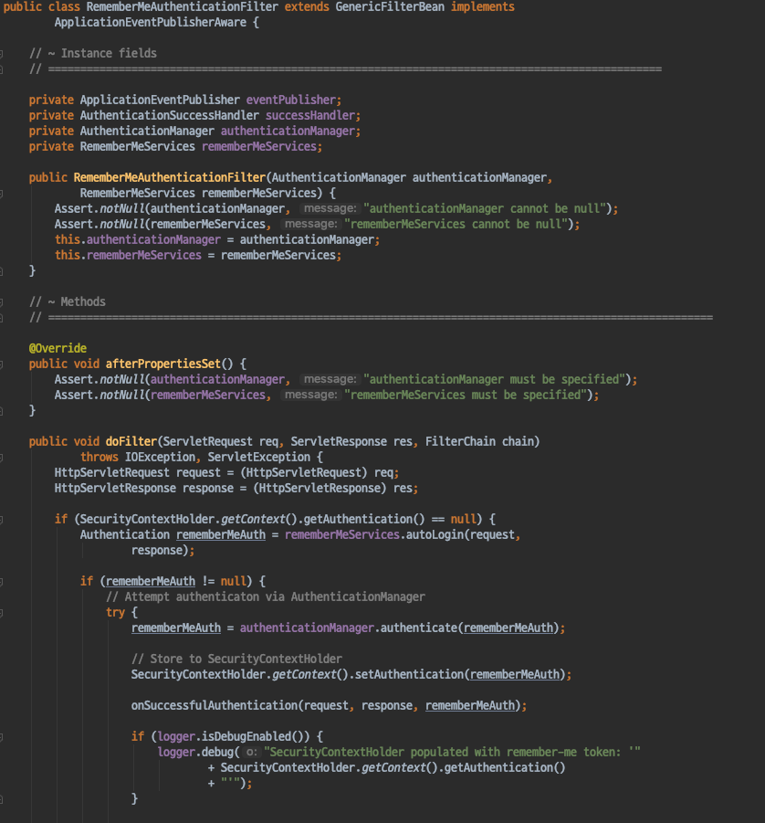

##### RememberMe ?
- RememberMeAuthenticationFilter를 살펴보기 이전에 먼저 RememberMe 기능에 대해 간단히 알아보자.
- 보통 로그인시 로그인 저장하기 등 체크박스가 존재하는 페이지를 많이 봤을것이다.
- 그런 로그인 페이지는 명시적으로 로그아웃하거나 하지 않는이상 세션보다 긴 수명의 로그인이 유지된다.
- 쿠키나, 서버의 DB에 토큰이 저장되어있는 토큰 기반의 인증을 말한다.

##### EditThisCookie
- RememberMe는 Cookie정보를 기반으로 동작한다.
- EditThisCookie 라는 크롬 플러그인을 사용하면 현재 웹사이트와 관련있는 쿠키정보를 쉽게 확인이 가능하다.
    - https://chrome.google.com/webstore/search/edit%20this%20cookie?hl=ko

EditThisCookie 플러그인을 설치하면 다음과 같이 정말 **쿠키 모양의 아이콘** 이 추가된다.

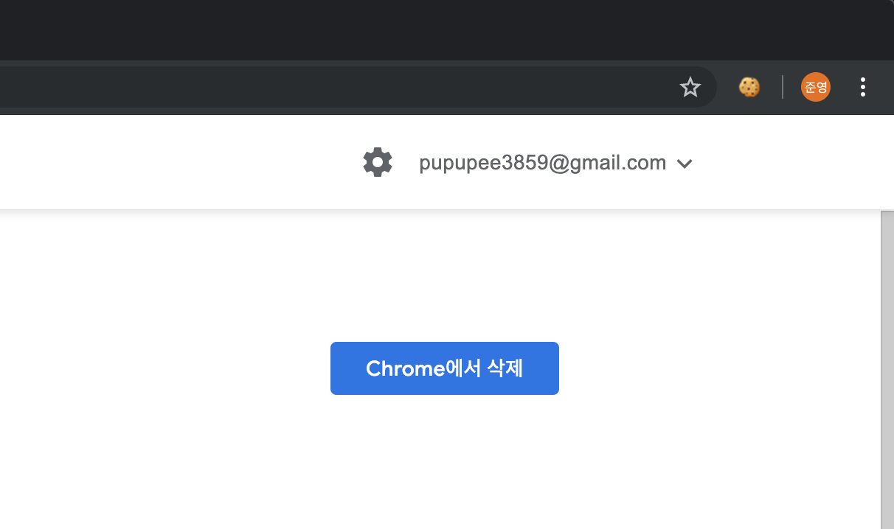

해당 쿠키 모양의 아이콘을 클릭하면 다음과 같이 현재 웹사이트와 관련된 쿠키정보를 쉽게 확인이 가능하다.
- 물론 개발자 도구를 통해 확인이 가능하지만 보기 편하기 때문에 사용한다.

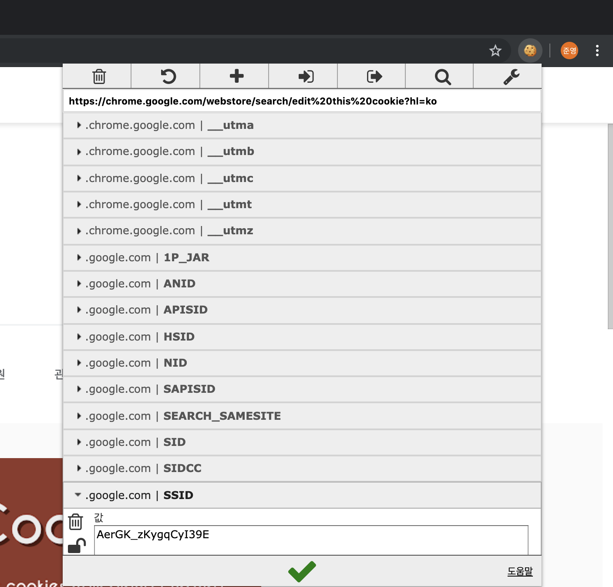

##### Cookie 기반 인증
- 다시 본론으로 돌아와서 Cookie 기반 인증에 대해 간단히 알아보자.
- Cookie에 특정 Key, Value 를 지정해 직접 쿠키 기반인증을 구현할수도 있겠지만 이해하기 가장 가까운 예로는 Session 이 있다.
- 우리는 사용자의 로그인 상태를 유지하기 위해 Cookie에 직접 사용자의 인증정보를 담을 수도 있지만 그러지 않는다.
- 왜 ? 보안상 취약하니까, 그래서 Session을 통해 사용자의 인증 정보를 서버에 저장한다.
- 하지만 현재 브라우저가 동일한 Session을 사용하는 브라우저 라는것 을 어떻게 알수 있을까?
    - HTTP는 stateless하다. 클라이언트의 정보를 가지고 있지 않는다.
- 이럴때 사용하는것이 Cookie이다.
- Session이 생성될때마다 SessionID가 생성이 된다. 이러한 SessionID를 Cookie를 통해 브라우저에게 전달한다.
- 그리고 브라우저는 다음번 요청에는 SessionID를 함께 보내어 이전 브라우저와 동일한 요청이라는 것을 서버에게 알린다.
- 서버는 해당 SessionID에 맞는 Session을 사용하여 해당 브라우저는 동일한 세션을 사용할수 있는 것이다.
- Java를 기준으로 **JSessionID**라는 쿠키가 존재하기 때문에 현재 브라우저가 이전과 동일한 브라우저에서 요청(동일 Session 사용)을 보낸다는 정보를 서버가 알수 있는것이다.
- 해당 쿠키가 사라지면 현재 동일한 브라우저라는 정보가 사라지기 때문에 다시금 인증을 해야한다.

##### RememberMe기능 사용하기
- RememberMe 파라메터 기본값이 remember-me 이다.
- 해당 파라메터값이 넘어오게 되면 Spring Security는 RememberMe를 사용, RememberMeToken(Cookie) 을 발급하게된다.
    - 해당 쿠키에는 Username과 Expired와 관련된 정보를 가지고 있다.
- RememberMe 쿠키가 존재하는 상태에서 JSessionID 쿠키가 사라져도, 다시금 인증을 하지않는다.

간단한 테스트를 통해 앞서 설명한 내용을 직접 확인해보자.

`Login.html`
- RememberMe 를 사용한느 파라메터 기본값은 remember-me 이다.
- LoginForm에 remember-me 사용 유무를 체크하는 checkbox를 추가해주었다.

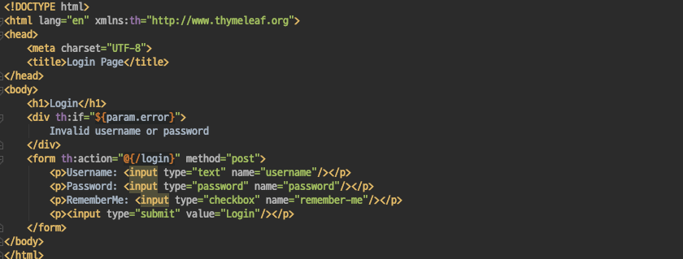

현재 브라우저가 가지고 있는 Cookie정보는 JSessionID만 존재한다.
이 상태에서 RememberMe를 체크한뒤 인증을 시도해보자.

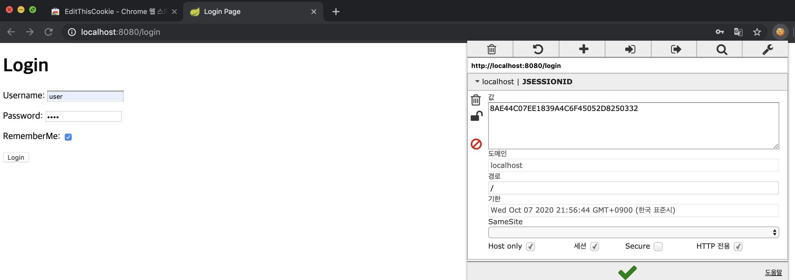

다음과 같이 RememberMeToken이 생성 된것을 확인할 수 있다.
그렇다면 RememberMeToken이 존재하는 상태에서 `JSessionID쿠키를 제거한다면` 어떻게 될지 테스트해보자.

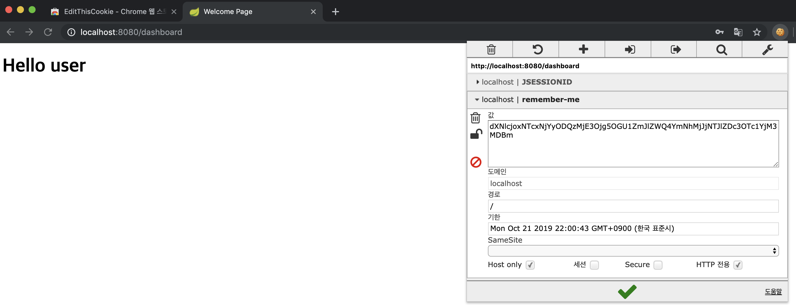

JSessionID Cookie를 제거하고 RememberMeToken만 존재하는 상태로 인증을 필요로하는 /dashboard로 요청을 보내면..

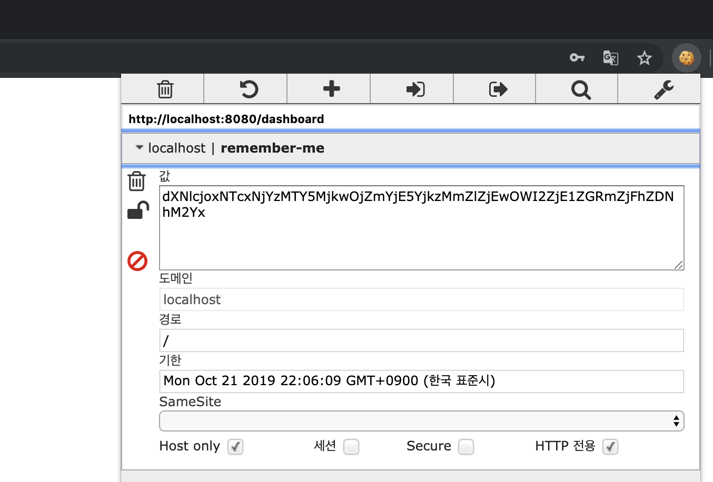

인증을 요구하지 않고 dashboard페이지로 정상적으로 접근이 되며, JSessionID가 다시 생성되었다.

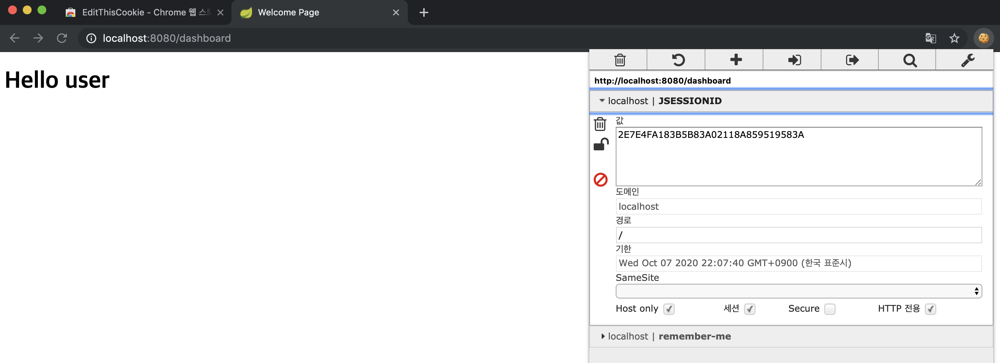

AnonmymousAutheticationFilter 이전에 RememberMeAuthenticationFilter가 추가된다.

##### RememberMeAuthenticationFilterProcess
- RememberMeAuthenticationFilter의 프로세스는 다음과 같다.
- 1.현재 인증된 사용자가 있는지 먼저 확인한다.
    - 인증된 사용자가 존재한다면 pass
- 2.인증된 사용자가 없다면 rememberMeService를 통해 인증을 시도한다.
    - JSessionID가 사라진 상태이기 때문에 인증된 사용자가 존재하지 않는다.
    - RememberMe 쿠키를 사용해 인증을 하는것이다.

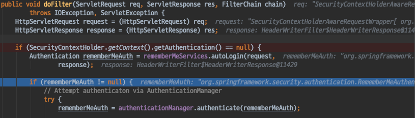

- 3.RememberMeToken을 통해 인증된 Authentication을 SecurityContextHolder에 넣어준다.
    - 이때 인증된 토큰은 UsernamePasswordAuthenticationToken이 아닌 RememberMeAuthenticationToken이다.

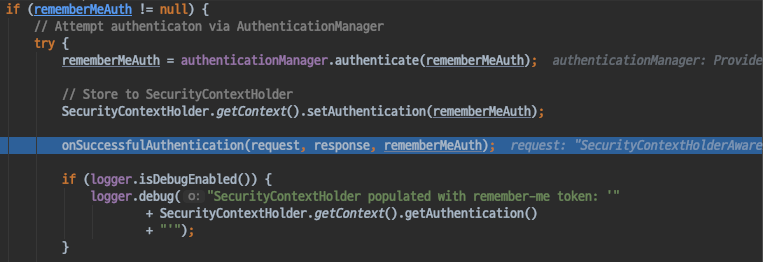

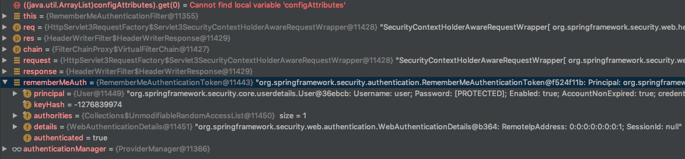

#### RememberMeFilter 커스터마이징 하기
- RememberMeFilter를 커스터마이징 하는 방법을 간단히 살펴보자.
- 다른 Filter들과 마찬가지로 HttpSecurity를 활용하여 커스터마이징이 가능하다.

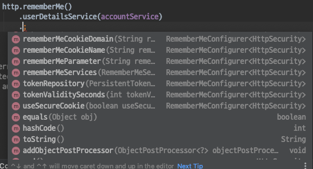

- rememberMeParameter
    - RememberMeParamter명 변경 가능
    - 기본값: remember-me
- tokenValiditySeconds
    - 토큰 만료 시간
    - 기본값은 2주.
- useSecureCookie
    - SecureCookie설정을 하면 https 에서만 사용이 가능하다.
    - 기본값은 false
- alwaysRemember
    - 폼에서 rememberMe값을 넘겨주지않아도 항상 사용한다. 
    - 기본값은 false
