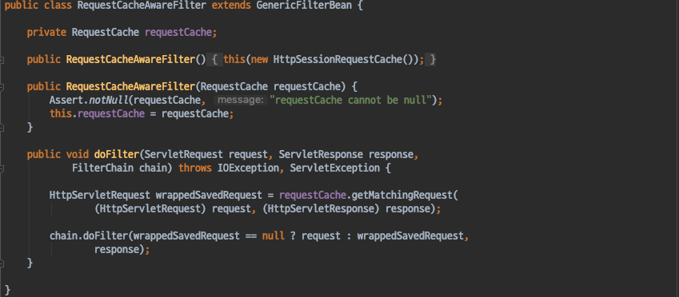

# Spring Security - RequestCacheWareFilter
- Spring Security에서 인증을 필요로 하는 리소스에 대한 요청을 할경우 인증을 먼저 하고 해당 리소스로 이동하게 된다.
- 이 때 Spring Security는 이전 요청을 캐시해 두었다가 인증 요청을 먼저 처리하고, 캐시해두었던 요청을 처리하는 방식을 사용한다.
- RequestCacheWareFilter 가 이런 역할을 담당한다.

#### RequestCacheWareFilter
- 현재 요청과 관련된 캐시된 요청이 있는지 찾아서 적용하는 필터이다.
    - 캐시된 요청이 없다면 현재요청을 처리한다.
    - 캐시된 요청이 있다면 해당 캐시된 요청을 처리한다.

