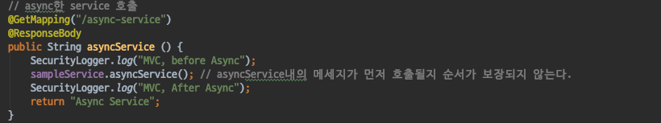
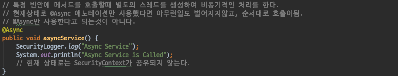
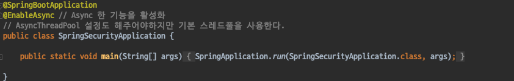
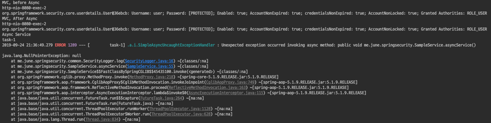
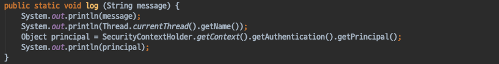
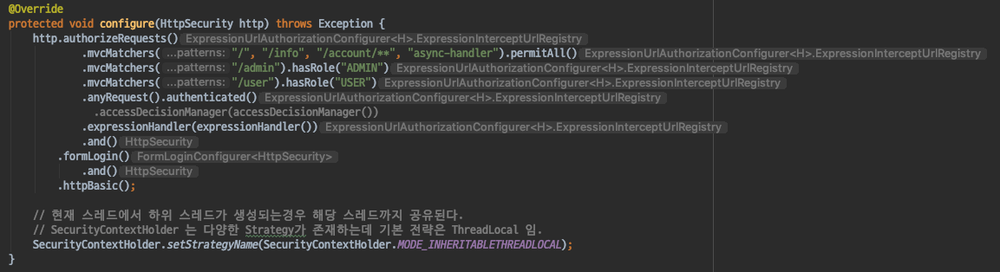
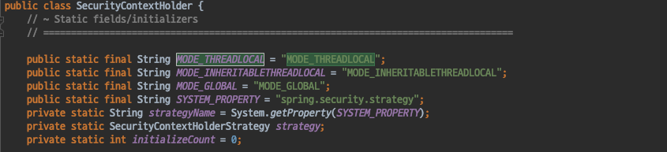
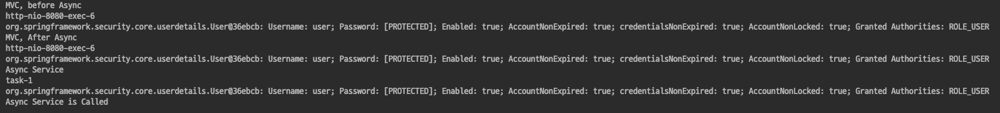

# Spring Security - @Async
- Async한 기능과 스프링 시큐리티가 어떻게 동작하는지 살펴본다.

#### Async-Service
- 이번에는 Async한 Handler가 아닌 Service를 생성한다.

다음은 Async-Service를 호출하는 간단한 Handler 코드이다.
- Async-Service를 호출하기 전 후로 SecurityLogger를 사용하여 로깅을 하는 매우 간단한 핸들러이다.
- Async한 동작을 한다면, SecurityLogger를 활용한 로그가 순서대로 출력을 보장하지 않는다.

다음은 Async-Service 코드를 살펴보자
- 마찬가지로 SecurityLogger를 활용하여 로깅을 하는 매우 간단한 메서드이다.
- @Async 애노테이션을 활용하여 Async하게 동작하는 메서드를 정의했다.
- 하지만 @Async 애노테이션만 사용했다고해서 Async한 동작을 하는것은 아니다.

`@EnableAsync`
- Spring이 제공하는 @Async를 사용하려면 @EnableAsync애노테이션을 사용하여 설정을 해주어야한다.
- Async한 Task를 수행할 ThreadPool도 추가적으로 설정을 해주어야 하지만, 본래 목적에서 어긋나므로 기본적으로 제공하는 스레드풀을 사용하도록 하자.

#### 테스트
- Account를 생성하고, /async-service를 호출한 결과는 다음과 같다.

`NullPointerException`
- 우리가 예상한대로 /async-service 핸들러의 코드는 호출 순서가 보장되지 않았지만 NullPointerException이 발생하였다.
- 예외 발생 원인을 파악해본 결과 SecurityContextHolder에서 Principal을 가져오는 코드에서 NullPointerException이 발생하고 있다.

#### 발생원인
- NullPointerException이 발생한 이유를 잘 생각해보자.
- SecurityContextHolder는 기본 전략이 **ThreadLocal** 이다.
- 즉 **같은 Thread 내에서만 SecurityContext 를 공유** 한다.
- 하지만 로그를 살펴보면 async-service를 호출하는 핸들러와 async-service의 Thread가 다른것을 확인할 수 있다.
- `SecurityContext가 공유되지 않아 발생한 문제`인 것이다.

#### 해결방법
SecurityConfig 에서 SecurityContextHolder의 기본전략을 변경해주자.
- SecurityContextHolder의 기본 전략은 ThreadLocal 이다.
- SecurityContextHolder의 전략을 **MODE_INHERITABLETHREADLOCAL** 로 변경하면 현재 스레드에서 하위로 생성된 스레드까지 SecurityContext가 공유된다.

#### SecurityContextHolder의 전략
- 1. MODE_THREADLOCAL
    - 기본 전략이다.
    - 같은 Thread 내에서만 SecurityContext가 공유된다.
- 2. MODE_INHERITABLETHREADLOCAL
    - 하위 Thread가 생성되면 해당 Thread까지 SecurityContext가 공유된다.
- 3. MODE_GLOBAL
    - 애플리케이션 전체에서 SecurityContexet가 공유된다.

#### 결과
- SecurityContext가 하위 Thread까지 공유되어 이번에는 정상적으로 동작한것 을 확인할 수 있다.

#### 정리
- SecurityContextHolder는 여러 전략들이 존재하며 기본전략은 **ThreadLocal** 이다.
- Async한 기능을 사용한다면, SecurityContextHolder의 기본전략에 의해 SecurityContext가 공유가 되지않는 문제가 발생할 수 있다.
- SecurityContextHolder의 **MODE_INHERITABLETHREADLOCAL**를 사용하면 현재 스레드에서 하위로 생성된 스레드까지 SecurityContext가 공유되어 문제를 해결할 수 있다.
