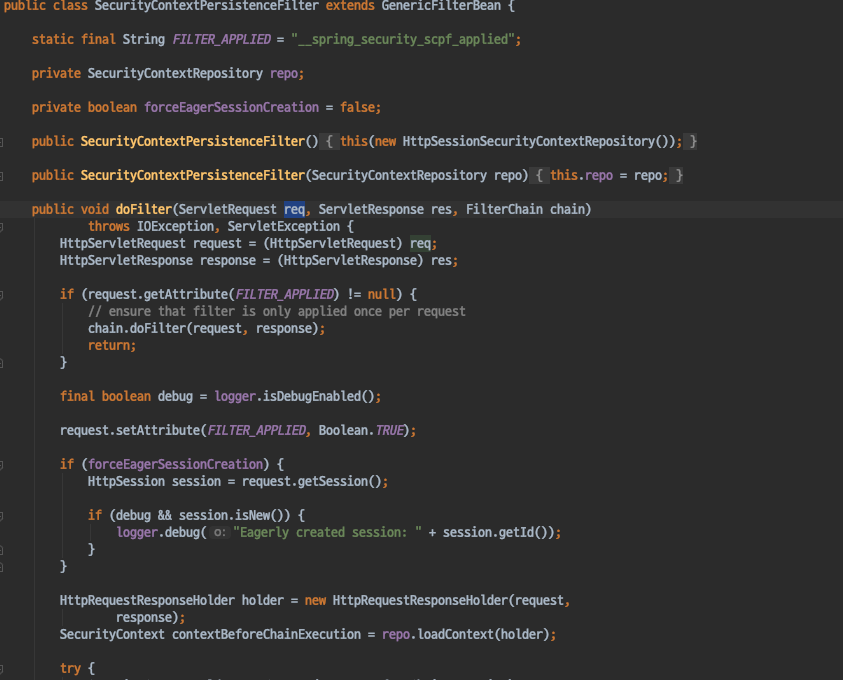
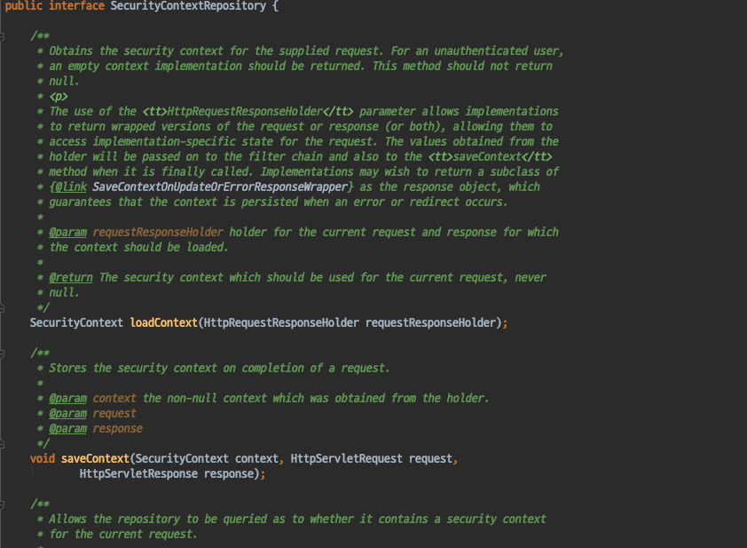
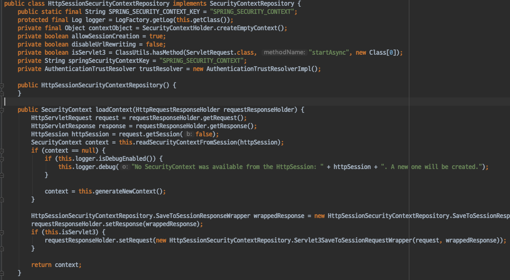

# Spring Security - SecurityContextPersistenceFilter

#### SecurityContextPersistenceFilter
- SpringSecurity FilterChain에서 2번째로 실행되는 Filter이다.
- 기존에 인증된 정보가 있다면 다음 요청에서도 다시 인증을 하지않도록 SecurityContext를 공유하는 기능을 제공한다.
- **Spring Session** 을 활용하여 세션 클러스터를 구현할 수 있다.

`SecurityContextRepository`
- SecurityContextPersistenceFilter가 기존의 SecurityContext를 로드 및 초기화하는데 사용한다.
    - 기본 전략은 **HttpSession** 이다.

