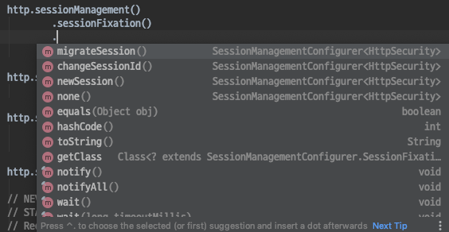
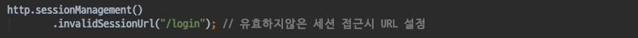
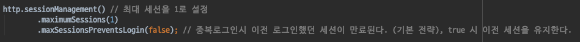
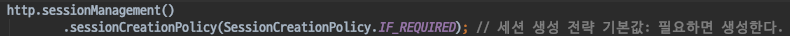
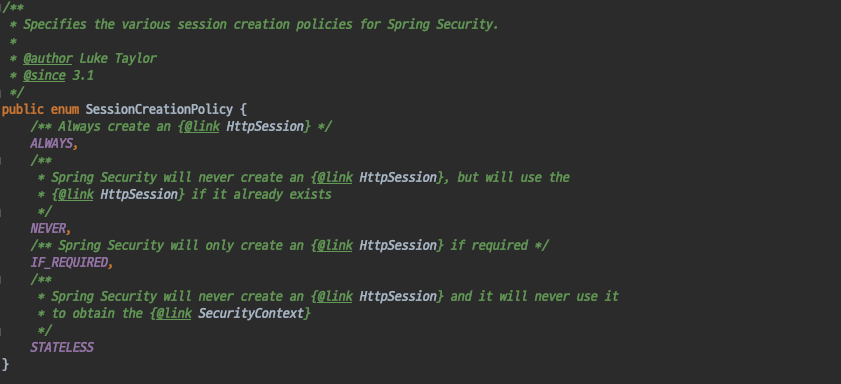

# Spring Security - SessionManagementFilter
- Spring Security 에서 중요한 역할을 하는 필터

#### SessionManagementFilter
- Session 변조 공격 방지 기능
    - 공격을 방지하는 방법 : 인증을 한뒤 세션을 변경하는것
    - 서블릿 컨테이너 버전따라 다르게 사용한다.
    - migrateSession (서블릿 3.0- 컨테이너 사용시 기본값)
        - 인증이 됬을때 새로운 세션을 생성한뒤, 기존 세션의 attribute들을 복사해 온다.
    - changeSessionId (서블릿 3.1+ 컨테이너 사용시 기본값)

  

- 유효하지 않은 세션으로 접근했을때 어디로 보낼것인지 URL을 설정하는 기능.
    - 로그아웃 했을경우 세션을 만료시킨다.
    - 유효하지 않은 세션이 접근했을때 어디로 보낼것인지 URL 설정할 수 있다.

- 최대 세션수를 설정하는 기능 
    - 동시 접속을 제한하는 기능이다.
    - true로 값을주면 기존에 생성된 세션을 유지하고, 이후에 로그인을 시도하면 로그인을 막아버린다.
        - 계정이 탈취당하는는 일이 발생하면 매우 위험함
    - false로 값을 주면 새로이 로그인한 세션을 유지하고 이전 세션을 만료시킨다.
    - 기본 전략은 false이다.

- 세션 생성전략 을 설정하는 기능
    - IF_REQUIRED: 세션생성 전략의 기본값이다. 필요시 생성한다.
    - NEVER : 시큐리티에서는 생성하지 않는다.
        - NEVER라고 해서 세션을 사용하지않는것이 아니다.
        - 기존에 세션이 있대면 사용하는 전략.
        - 대부분의 경우에는 이미 세션이 존재하기 때문에 사용하게 된다.
    - STATELESS : 세션이 존재하여도 쓰지않는다. (세션을 정말 사용하고 싶지않을때 사용하는 전략)
        - SecurityContext를 캐싱을 하여 사용해야하는데 캐싱을 하지않는다.
        - RESTAPI 에서 사용해야하는 전략, 폼인증과는 어울리지 않는다.
        - RequestCacheAwareFilter도 Session을 사용하기 때문에 이 전략을 사용한다면 해당 필터의 기능도 동작하지 않는다.
    - AWAYS : 세션을 항상 생성한다.

