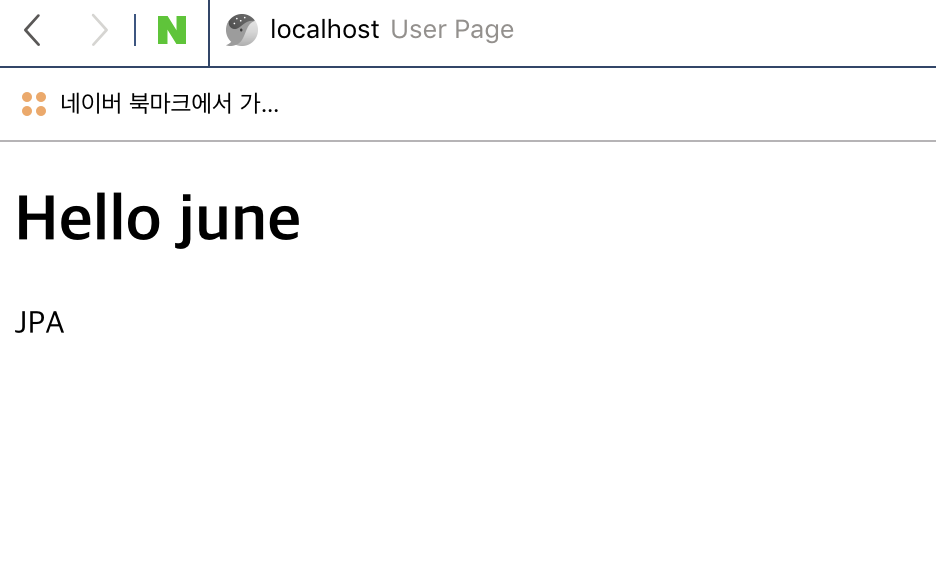
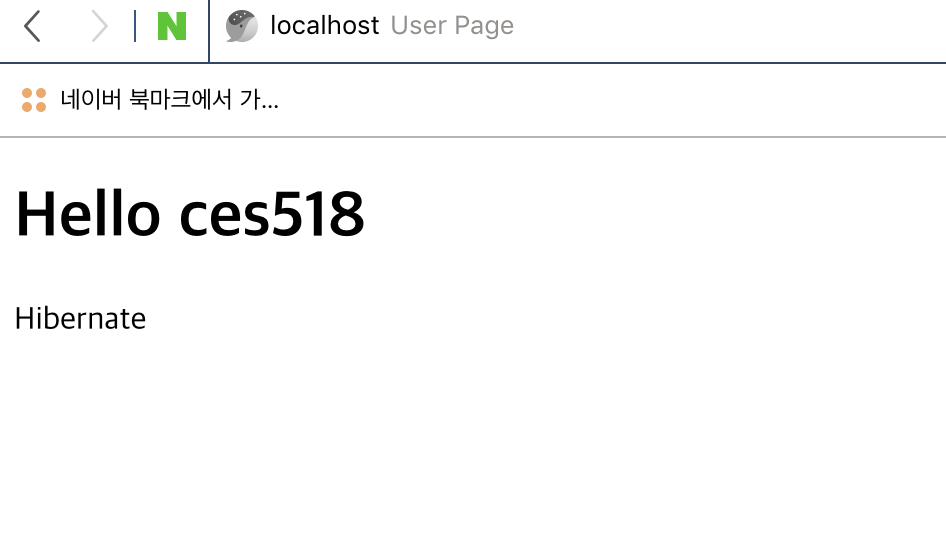

# Spring Security - Spring Data 연동
- Spring Security 가 제공하는 Spring Data 연동기능에 대해 살펴보자

#### Spring Data 의존성 추가하기
Spring Security Data는 Spring Boot가 Version 관리를 해주고 있지 않은 의존성이다.

따라서 Spring Boot Property에 존재하는 spring security version을 따르도록 하자.
- 이 경우에는 boot version이 바뀌면 security의 버전도 바뀌기때문에 버전관리에 용이하다.
```xml
<dependency>
    <groupId>org.springframework.security</groupId>
    <artifactId>spring-security-data</artifactId>
    <version>${spring-security.version}</version>
</dependency>
```


#### 연관관계 추가하기
Spring Security Data 기능을 테스트하기위해 엔티티하나를 추가하고 간단한 연관관계를 맺도록 한다.

`Book`
- Book 엔티티와 Account엔티티는 Author라는 관계로 1:N 매핑되어 있다.

```java
@Entity
@Getter @Setter
public class Book {

    @Id @GeneratedValue
    private Integer id;

    private String title;

    /* 1:N 관계로 Account를 참조한다. */
    @ManyToOne
    private Account author;
}
```

`BookRepository`
```java
public interface BookRepository extends JpaRepository<Book, Integer> {

}
```

#### 테스트 데이터 생성하기
- june 이라는 Account는 JPA책의 Author이고, ces518 이라는 Account는 Hibernate 책의 Author인 테스트 데이터를 생성하는 코드이다.
- Spring Boot에서 제공하는 ApplicationRunner를 이용해 애플리케이션이 구동될때 자동으로 생성되도록 하였다.
```java
@Component
public class DefaultDataGenerator implements ApplicationRunner {

    @Autowired
    AccountService accountService;

    @Autowired
    BookRepository bookRepository;

    @Override
    public void run(ApplicationArguments args) throws Exception {
        Account june = createUser("june");
        Account ces518 = createUser("ces518");

        createBook(june, "JPA");
        createBook(ces518,"Hibernate");
    }

    private Book createBook(Account june, String title) {
        Book book = new Book();
        book.setAuthor(june);
        book.setTitle(title);
        return bookRepository.save(book);
    }

    private Account createUser(String username) {
        Account account = new Account();
        account.setUsername(username);
        account.setPassword("1234");
        account.setRole("USER");
        return accountService.createAccount(account);
    }
}
```

#### 현재 로그인한 유저의 책 목록
기존의 /user 페이지에 현재 로그인한 유저의 책 목록을 보여주도록 코드를 수정하자

`SampleController`
- bookRepository를 통해 현재 로그인한 사용자의 책 목록을 조회하도록 변경
```java
@GetMapping("/user")
public String user (Model model, Principal principal) {
    model.addAttribute("message", "Hello " + principal.getName());
    // 현재 user가 가지고있는 책의 목록
    model.addAttribute("books", bookRepository.findCurrentUserBooks());
    return "user";
}
```

`user.html`
- /user 핸들러에서 model로 넘겨준 books를 참조해 현재 로그인한 사용자의 책 목록을 출력히도록 변경
```html
<!DOCTYPE html>
<html lang="en" xmlns:th="http://www.thymeleaf.org">
<head>
    <meta charset="UTF-8">
    <title>User Page</title>
</head>
<body>
    <h1 th:text="${message}">User</h1>

    <tr th:each="book: ${books}">
        <td><span th:text="${book.title}">title</span></td>
    </tr>
</body>
</html>
```

SampleController 클래스에 bookRepository 의존성을 추가한뒤 bookRepository를 이용해 현재 로그인한 유저의 책목록을 가져오도록 한다.
- 이때 쿼리메서드를 사용해서 현재 로그인한 사용자의 id를 인자로 받아 book의 목록을 받아올 수도 있다.
    - ex) findByAuthorId(Integer id);
- 하지만 Spring Security가 제공하는 Spring Data 연동기능을 사용하면 사용자의 id를 인자로 받을 필요가 없다.

`BookRepository`
```java
public interface BookRepository extends JpaRepository<Book, Integer> {
    /* Spring Security 는 Query 애노테이션 내부에서 principal을 제공한다.*/
    @Query("select b from Book b where b.author.id = ?#{principal.account.id}")
    List<Book> findCurrentUserBooks();
}
```

Spring Security Data 를 이용하면 Spring data jpa 의 @Query 애노테이션 내에서 Spring Security의 principal을 참조할 수 있다.
> 현재 로그인한 사용자의 Principal (Account) 정보를 참조할 수 있다.

#### 실행 결과

애플리케이션을 실행하고 june, ces518 사용자로 각각 로그인하면 다음과 같이 JPA, Hibernate 책 목록이 함께 출력된다.


