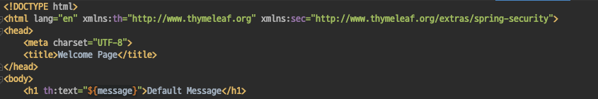
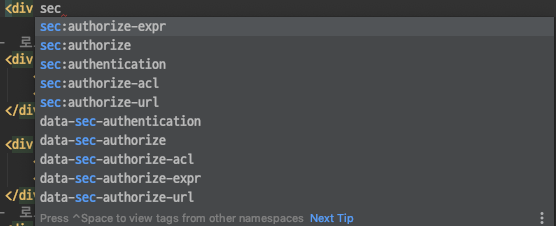
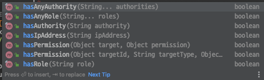
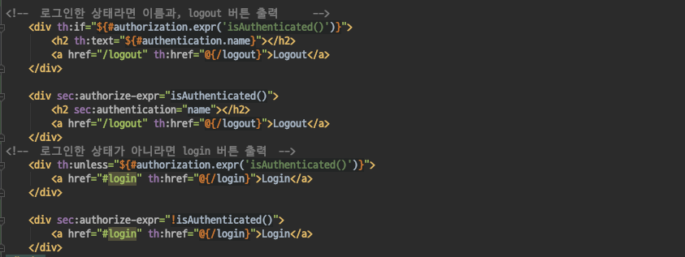

# Spring Security - Spring Security Thymleaf: SEC

#### Spring Security Thymleaf - SEC
- 이번에는 Thymeaf에서 제공하는 Security 관련 name space를 지정하여 이전 시간에 사용한 기능을 좀 더 편리하게 사용하는 방법을 살펴보자.

`sec 네임스페이스 선언하기`
- th 네임스페이스를 선언하는것과 같이 sec 네임 스페이스를 상단에 선언해준다.
- sec 네임스페이스를 선언해주면, thymleaf에서 제공하는 extras 기능을 좀 더 쉽게 사용이 가능하다.

`Thymeleaf/extras 자동완성기능`
- 이전시간에 사용했던 authorize-expr 과 같은 기능을 자동완성을 통해 type-safe하게 사용이 가능하다.
- 또한 hasRole, hasAuthority와 같은 기능도 자동완성으로 제공을 한다.
- 이전에 th 네임스페이스를 사용한것 보다 비교적 type-safe한 코딩이 가능해진다. 

#### Thymeleaf/extras 사용해보기
- th네임스페이스를 사용한것과, sec 네임스페이스를 사용한것의 차이가 보이는가
- #을통해 thymeleaf의 객체참조를 이용한것과 달리 Thymeleaf/extras가 제공하는 기능을 이용해 type-safe한 코드가 되었다.

