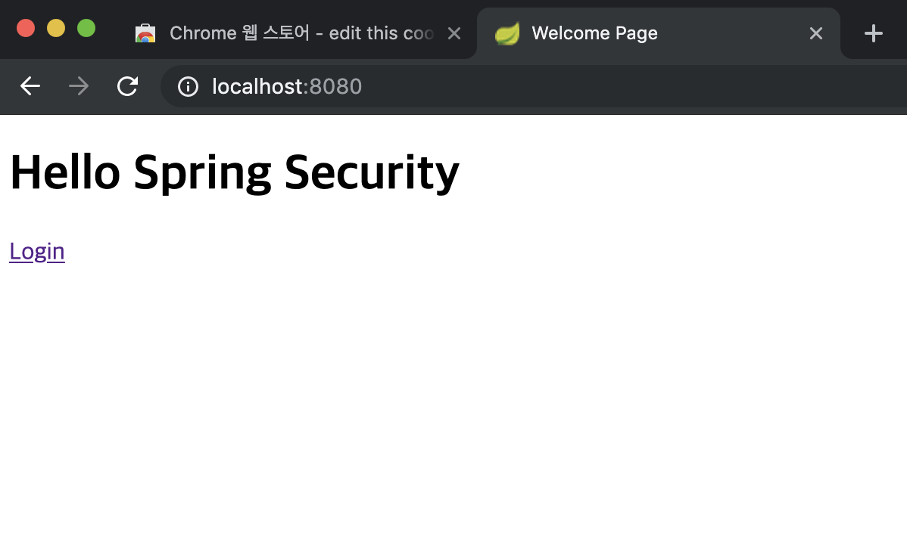
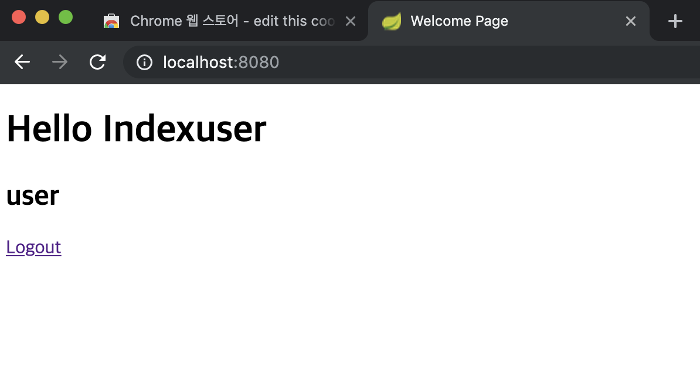

# Spring Security - Spring Security Thymeleaf Library


#### Spring Security Thymleaf Library

- Thymeleaf를 사용하면 View 페이지에서 사용자의 인증 정보를 참조하고 싶은경우
- Thymeleaf에서 제공하는 라이브러리를 하나 추가하면 간단하게 사용할 수 있다.
- 이는 Spring Security가 아닌 타임리프에서 제공하는 것이다.

`의존성 추가`
```xml
<dependency>
    <groupId>org.thymeleaf.extras</groupId>
    <artifactId>thymeleaf-extras-spiringsecurity5</artifactId>
</dependency>
```
- 만약 스프링 부트를 사용중이라면 별다른 설정이 필요없다.


##### 사용자의 인증 상태에 따른 출력하기
- 사용자의 인증 상태에 따라 특정한 버튼 등을 보여주고싶은 경우 다음과 같이 진행할 수 있다.

`index.html`
```html
<!DOCTYPE html>
<html lang="en" xmlns:th="http://www.thymeleaf.org">
<head>
    <meta charset="UTF-8">
    <title>Welcome Page</title>
</head>
<body>
    <h1 th:text="${message}">Default Message</h1>

<!--  로그인한 상태라면 이름과, logout 버튼 출력      -->
    <div th:if="${#authorization.expr('isAuthenticated()')}">
        <h2 th:text="${#authentication.name}"></h2>
        <a href="/logout" th:href="@{/logout}">Logout</a>
    </div>
<!--  로그인한 상태가 아니라면 login 버튼 출력  -->
    <div th:unless="${#authorization.expr('isAuthenticated()')}">
        <a href="#login" th:href="@{/login}">Login</a>
    </div>
</body>
</html>
```

index.html의 수정된 내용은 다음과 같다.
- 1.만약 인증된 상태라면 인증객체에서 name값 (인증된 사용자의 이름) 을 꺼내와 Logout버튼과 함께 출력한다.
    - th:if 조건문과 thymeleaf security의 authorization.expr를 활용한다.
- 2.인증된 상태가 아닌경우 login버튼을 출력한다.
    - th:unless 활용
```html
<!--  로그인한 상태라면 이름과, logout 버튼 출력      -->
    <div th:if="${#authorization.expr('isAuthenticated()')}">
        <h2 th:text="${#authentication.name}"></h2>
        <a href="/logout" th:href="@{/logout}">Logout</a>
    </div>
<!--  로그인한 상태가 아니라면 login 버튼 출력  -->
    <div th:unless="${#authorization.expr('isAuthenticated()')}">
        <a href="#login" th:href="@{/login}">Login</a>
    </div>
```

`적용결과`
- 인증을 하지않은 상태에서 / 인덱스 페이지로 접근하면 th:unless조건에 따라 Login 버튼만 출력되고



- 인증을 한뒤 / 인덱스로 접근하면 다음과 같이 사용자의 이름과 Logout버튼이 출력되는걸 확인할 수 있다.


