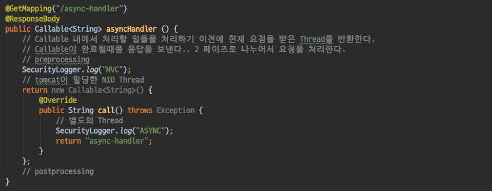
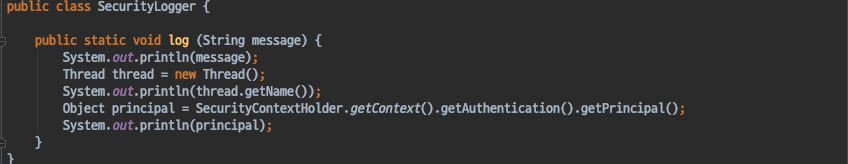
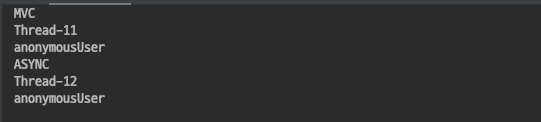

# Spring Security - WebAsyncManagerIntegrationFilter
- SpringSecurityContextHolder는 ThreadLocal기반으로 동작한다.
- 즉 같은 Thread내에서만 SecurityContext가 공유된다.
- WebAsyncManagerIntegrationFilter는 SpringMVC에서 Async과 관련된 기능을 사용할때 SecurityContext를 공유할수있도록 도와주는 필터이다.

#### Callable
- java에서 지원하는 기능이고, SpringMVC에서 Async한 요청을 처리할때 응답으로 사용할 수 있다.
- return 타입을 Callable로 지정하면 asyncHandler() 내에서의 Thread는 Tomcat에서 할당한 NIO Thread를 사용한다.
- Callable 내에서 처리해야할 일들을 처리하기 이전에 현재 요청받은 Thread 자원을 반환한다.
- 다른 Thread에서도 현재 Thread의 Spring SecurityContext를 사용할수 있도록하는 전처리 작업을 진행한다.
- 이를 **PreProcessing** 이라고 한다.
- PreProcessing 작업후 Callable이 실행되며, 이때 Callable을 실행하는데 사용되는 Thread는 별도의 Thread이다.
- Callable작업이 종료된 후 Spring SecurityContext를 정리하는 작업을 진행한다.
- 이를 **PostProcessing** 이라고 한다.

`AsyncHandler`

`SecurityLogger`
- message를 인자로 받아 현재 Thread의 이름과, SecurityContext에서 Principal객체를 꺼내 출력하는 간단한 Logger 클래스이다.

`AsyncHandler 출력 결과`

#### 정리
- WebAsyncManagerIntegrationFilter는 SpringMVC에서 Async관련 기능을 사용할때 SecurityContext를 서로 다른 Thread간에 공유할 수 있도록 도와주는 필터이다.
- Callable 실행 이전의 작업을 진행후 Preprocessing (SecurityContext를 공유하기위한 작업) 을 진행한다.
- Callable 실행 이후 PostProcessing (SecurityContext 를 정리)을 진행한다.
- Callable 이전의 작업은 Tomcat에서 할당한 NIO Thread가 사용되며, Callable 작업을 실행할때는 다른 Thread가 할당되어 작업을 진행하게 된다.
