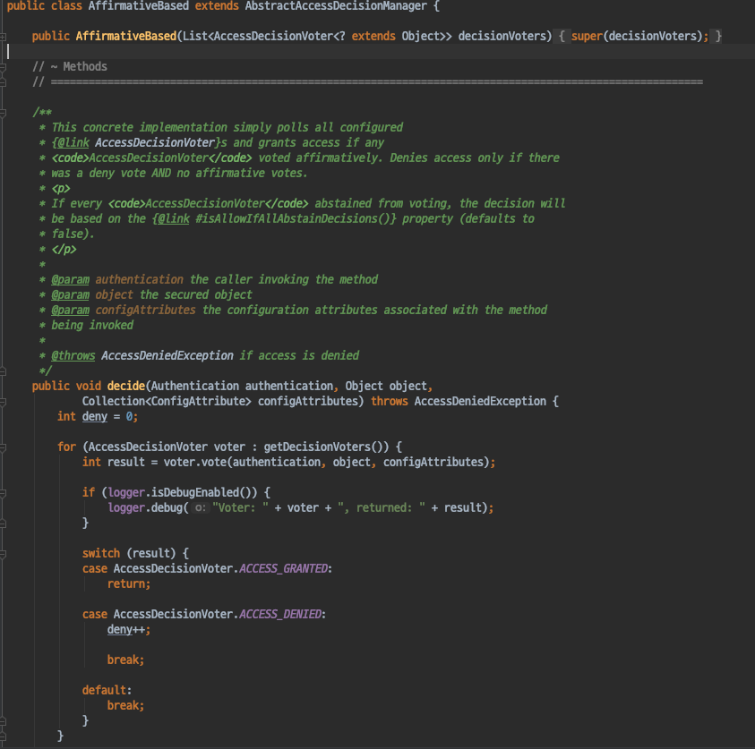
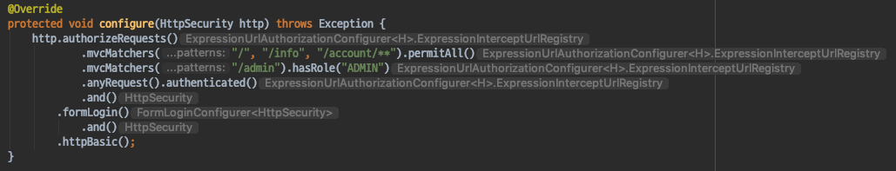
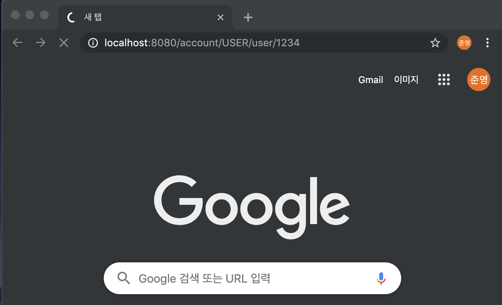
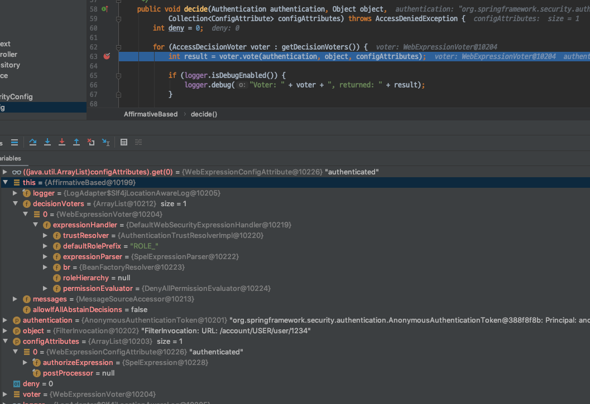
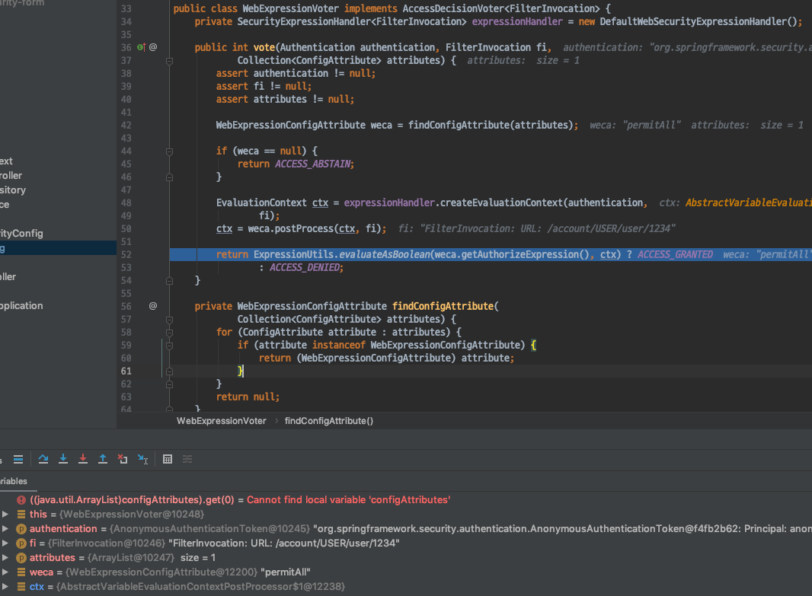
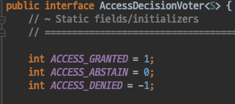
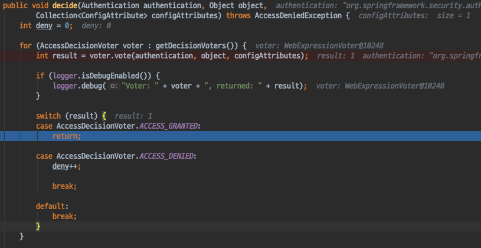
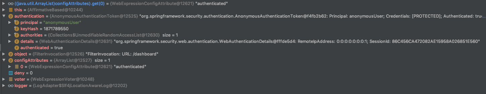

# Spring Security - ArcheTecher_AccessDecision Manager
- SpringSecurity에서 사용하는 권한처리(인가)와 관련된 인터페이스를 살펴보자.

#### AccessDecisionManager
- Access Control or Authorization 결정을 내리는 인터페이스 이다.
- 인증이 완료된 사용자가 리소스에 접근하려고 할때 해당 요청을 허용할것인지 판단하는 인터페이스이다.

- 인터페이스 구현체는 3가지를 기본으로 제공한다.
    - Voter라는 개념을 가지고 있다.
    - Voter는 의사결정을 내리는데 사용 하며 여러개의 Voter를 가질 수 있다.
    - **AffirmativeBased**: 여러 Voter중에 하나라도 허용하면 허용된다. (기본 전략)
    - ConsensusBased: 다수결
    - UnanimousBased: 만장일치

- 모든 Voter가 허용하지 않는다면 예외를 발생시킨다.
- AccessDecisionManager 를 구현하는데 필수적으로 구현해야하는 메서드는 decide() 메서드이다.

`AffirmativeBased`

#### AccessDecisionVoter
- 해당 Authentication이 특정한 **Object** 에 접근할때 필요한 **ConfigAttributes** 를 만족하는지 확인한다.
- **WebExpressionVoter**: 웹 시큐리티에서 사용하는 기본 구현체이다. 현재 인증된 사용자가 가지고있는 권한이 ROLE_XXXX 가 매치되는지 확인하는 역할을 한다.
- RoleHierarchyVoter: 계층형 ROLE을 지원한다. ADMIN > MANAGER > USER ..
- ... 

`ConfigAttributes 외 Object`
- Security 설정과 관련이 있다. SecurityConfig 클래스를 살펴보며 알아보자.
- HttpSecurity를 커스터마이징하여 시큐리티 설정을 입맛에 맞게 변경할수 있었다.
- 이러한 HttpSecurity를 커스터마이징 하는과정에서 사용된 메서드들이 **ConfigAttributes**와 관련이 있다.
- 권한을 허용하거나, 인가를 필요로 하는부분 permitAll() 혹은 hasRole() 과 같은 부분이 ConfigAttributes가 되고
- mvcMatchers() 에서 지정한 리소스들이 바로 **Object**에 해당하게 된다. 

#### Voter들이 사용되는 예제
- Security를 적용한 상태에서 리소스에 요청을 하며 AccessDesicionManager와 AccessDecisionVoter들이 어떻게 동작하는지 살펴보도록 하자.

##### 인가에 성공하는 경우
우선 다음과 같이 Account를 생성하는 요청을 하게되면 Spring Security는 권한체크(인가)를 하기위해 AccessDecisionManager의 기본 전략인 AffirmativeBased의 decide메서드를 호출한다.

> - decide메서드는 AccessDecisionVoter목록들을 가져와 인가를 진행하는데 이때 기본 전략으로 사용되는 Voter는 **WebExpressionVoter** 이다.
> - 앞서 설명한것과 동일하게 권한코드는 ROLE_를 기본 prefix 전략으로 가지고 있다.
디버거 기능인 StepInto 를 통해 메서드 안으로 진입해 좀 더 자세히 살펴보자.

WebExpressVoter의 vote 메서드이다.
ConfigAttributes는의 값이 permitAll인걸 확인할 수 있으며 FilterInvocationURL은 우리가 Account를 생성할때 요청한 URL과 동일한것을 확인할 수 있다. voter에 의해 판단이 완료되면 결과에 따라 1, -1, 0 의 값을 반환환다.

WebExpressVoter의 vote 메서드가 종료되면 Voter에 의한 판단이 종료된 상태이다.
voter에 의해 판단이 끝난뒤 반환된 결과에 따라 인가처리가 된다.
- 반환된 결과는 AccessDecisionVoter 인터페이스에 정의된 상수를 따르게 된다.
- 1: ACCESS_GRANTED: 허용
- 0: ACCESS_ABSTAIN: 중립
- -1: ACCESS_DEINED: 허용되지 않음

현재 요청한 리소스는 SecurityConfig에 의하면 모두 허용 (permitAll) 이기 때문에 WebExpressionVoter에 의해 허용된 상태이고 **AffirmativeBased** 의 전략에 따라 하나의 Voter라도 허용된다면 권한이 허용되는 것이다.

따라서 다음과 같이 성공적으로 유저가 생성되는것을 확인할 수 있다.

##### 인가에 실패하는 경우
- 이번에는 인가에 실패하는 경우를 살펴보자.

Account를 생성만 한 상태에서 다음과 같이 /dashboard로 요청을 해보자.
- authentication으로 anonymousUser가 들어있고, FilterInvocationURL 도 이전과 마찬가지로 /dashboard 요청이 들어있다.
- 하지만 이번엔 ConfigAttributes의 값이 authenticated로 들어와있는것을 확인할 수 있다.
    - 인가가 필요한 것이다.

WebExpressionVoter의 판단에 의해 결과는 ACCESS_DENIED(-1). 
- SecuriyConfig에 의하면 인증된 사용자를 필요로 하는 리소스이다. 현재는 사용자를 생성만 했을뿐, 인증을 하지않은 상태이기 때문에 당연한 결과이다.
- 인가에 실패한 것이다.
- 인가에 실패하면 다른 Voter들에게 게속해서 인가를 시도하게 되는데 현재 가지고 있는 Voter목록에는 WebExpressionVoter가 유일하기 때문에 결과적으로 인가는 실패하게 된다.

#### 정리
- 이번에는 AccessDecisionManager와 AccessDecisionVoter에 대해 알아보았다.
- AccessDecisionManager는 여러 기본 구현체들이 있는데 그중에 SpringSecurity의 기본전략은 AffirmativeBased (Voter들중 하나라도 허용한다면 인가에 성공) 이다.
- AccessDecisionVoter의 기본 전략은 WebExpressionVoter 이며 권한에 대한 인가시 ROLE_XXXX 를 prefix 기본전략으로 사용한다.
- AccessDecisionVoter가 사용하는 ConfigAttributes는 permitAll, hasRole, Authenticated와 같이 인가와 직접적인 연관이있는 설정과 동일하고 Object는 mvcMatcher등에 설정한 리소스에 해당한다.
