# Spring Security - ArcheTecher_AccessDecision Manager Customizing
- 리소스 접근에 대한 권한 관련 설정을 하다보면, 특정 권한이 다른 특정권한의 상위 권한일 경우가 있다.
- 예를 들면 ADMIN과 USER의 관계의 경우이다.
- USER 권한을 가진 사용자는 USER권한을 가진 사용자에게 허용하는 리소스에만 접근이 가능하고
- ADMIN 권한을 가진 사용자는 ADMIN과, 그 하위권한인 USER권한을 가진 사용자에게 허용하는 리소스 모두 접근이 가능해야한다.
- 현재 Spring Security에 권한별 접근 리소스 설정만 했을뿐 특별한 설정을 하지않은 상태이다. 

#### 상위권한 테스트하기
- 우리는 내부적으로 ADMIN권한은 USER의 상위권한이라고 정의 하였다.
- 그렇다면 ADMIN권한을 가진 사용자는 USER권한을 가진 사용자에게 허용하는 리소스에 접근이 가능할까? 

우선 USER권한을 가진 사용자에게만 허용하는 리소스를 생성하고 해당 리소스에 대한 접근 권한을 설정해보자.

##### 리소스 생성 및 설정
`SampleController`
- /user 로 요청을 보내면 user.html페이지로 이동하는 매우 간단한 핸들러이다.

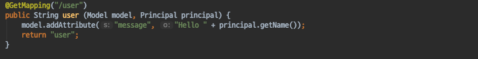

`user.html`
- /user 요청을 처리하는 핸들러에서 보내준 **message**를 키로 가지는 Model 데이터를 출력해주는  매우 심플한 페이지이다.

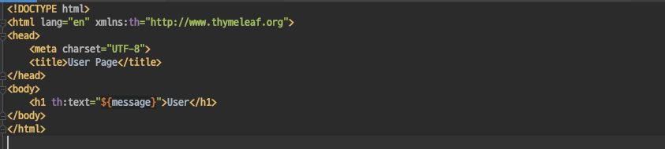

`SecurityConfig`
- 위에서 정의한 /user 리소스에 대한 접근 권한을 추가해주었다.
- /user 리소스는 USER 권한을 가진 사용자만이 접근이 가능하다.

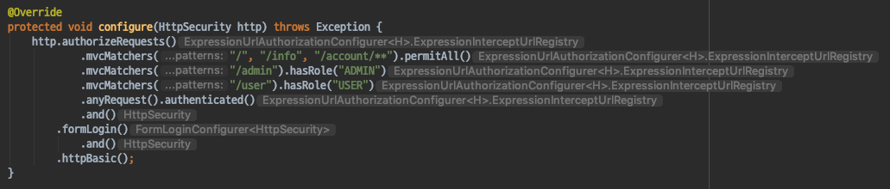

##### 테스트 진행
먼저 ADMIN 권한을 가지는 유저를 생성한다.

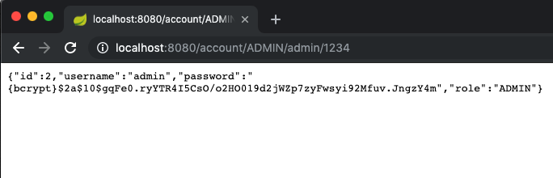

GET http://localhost:8080/user 리소스로 접근을 시도해보자.

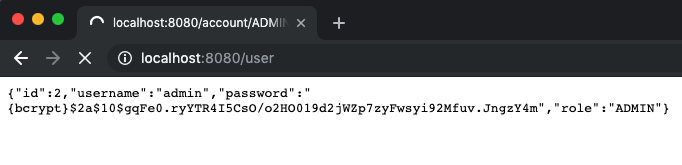

테스트 결과는 403 Forbidden 페이지가 나온다.
- 접근이 제한되었다.

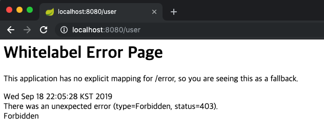

- 우리는 ADMIN 권한을 USER 권한의 상위 권한이라고 내부적으로 정의하였고, ADMIN 권한을 가진 사용자는 USER권한만 허용하는 RESOURCE에 접근을 허용하길 바란다.
- 하지만 대체 왜 접근이 불가능 한 것일까?

##### 실패 원인
- 이유는 간단하다. 우리가 정의한 권한들의 계층구조 (Hirerachy)는 내부적으로 정하기만 했을뿐 Spring Security는 그 사실을 모르고 있기 때문이다.

#### 해결방법
- 해결방법은 크게 3가지가 있다.
- 1. ADMIN 권한을 가진 유저는 Security Login 시 USER 권한도 함께주는 방법.
    - 하위 권한들이 추가된다면 ? 게속해서 권한을 추가해주는 코드가 필요하고, **하위권한이 100개라면 ADMIN권한외에 100개의 권한**을 더 가지게 된다.
- 2. USER권한만 허용하는 Resource 접근권한을 가진 리소스에 상위권한까지 허용 하는 방법
    - USER권한의 **상위 권한이 늘어날때마다 Resource 접근 권한 설정이 수정** 되어야한다.
- 3. **ADMIN권한이 USER권한의 상위 권한이라는 것을 SpringSecurity에게 알려주는 방법**
    - 우리는 이 방법을 사용할 것이다.

#### AccessDecisionManager 커스터마이징하기
- SpringSecurity는 인가를 하기위해 AccessDecisionManager를 사용한다.
- 권한계층구조 (Hirerachy)로 인가를 하기위해서는 AccessDecisionManager를 커스터마이징 해주어야한다.

`커스텀한 AccessDecisionManager 생성하기`
- AccessDecisionManager는 Voter를 사용하고, Voter는 ExpressionHandler를 사용한다.
- 최종적으로는 expressionHandler가 Hierarchy 구조를 알아야 한다는 것이다.
- 커스텀한 AccessDecisionManager는 다음과 같다.
    - ROLE_ADMIN이 ROLE_USER의 상위 권한이라는 것을 정의한다.
    - 정의한 RoleHierarchy를 가지는 ExpressionHandler를 생성한다.
    - 새로이 생성한 ExpressionHandler를 사용하는 ExpressionVoter를 생성한다.
    - 새로이 생성한 ExpressionVoter를 사용하는 AccessDecisionManager를 생성한다.

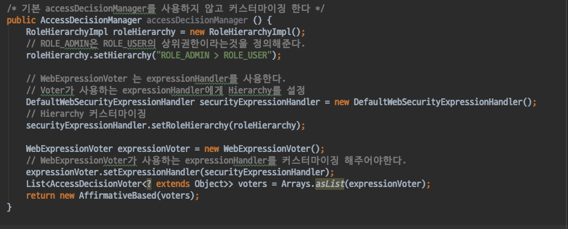   

`AccessDecisionManager 설정하기`
- 앞서 생성한 AccessDecisionManager를 사용하도록 Security설정을 다음과 같이 변경해준다음 테스트를 진행해보자.

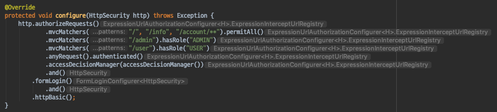

`변경된 AccessDecisionManager`
- 이전과 동일하게 ADMIN 권한을 가지는 사용자를 생성한뒤 /user 리소스에 접근을 시도하면 ..
- 다음과 같이 ADMIN 권한을 가진 사용자가 USER 권한을 가진 사용자에게 허용된 Resource에 접근이 가능해진다.

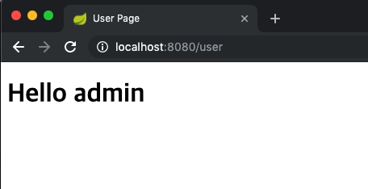

##### 설정 간략화 하기
- 앞선 설정을 다시 한번 살펴보면 결국 최종적으로는 ExpressionHandler만 커스터마이징 하면 되는것인데 너무 설정해야할 것들이 많다.
- 설정을 간략화 할순 없을까 ?

 

Spring Security에서는 accessDecisionManager뿐 아니라 기본 AccessDecisionManager가 사용하는 Voter가 사용하는 ExpressionHandler를 커스터마이징 할수 있도록 설정을 제공한다.

`커스텀한 ExpressionHandler`
- 이전과 동일하지만 이번에는 ExpressionHandler만 생성하도록 코드를 변경한다.

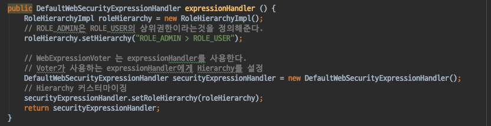

`SecurityConfig`
- 이번에는 AccessDecisionManager가 아닌 ExpressionHandler를 우리가 생성한 ExpressionHandler가 사용되도록 설정을 변경한다.

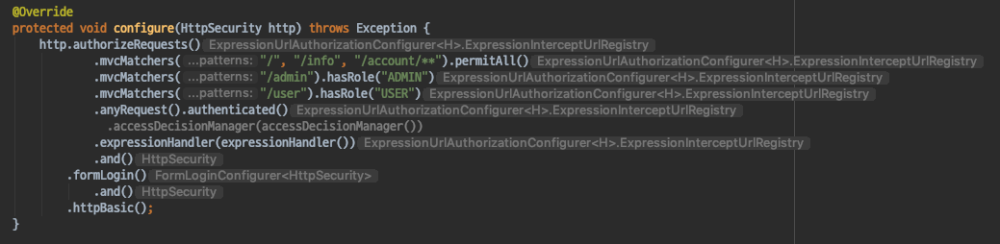

`변경된 ExpressionHandler`
- 이전과 동일하게 ADMIN 권한을 가지는 유저를 생성한뒤 /user 리소스로 요청을 보내면..
- 동일한 결과가 나타난다.

#### 정리
- 리소스 접근에 대해 권한 설정을 하다보면 계층구조 (Hirerachy)가 필요할 때가 있다.
- 계층구조 처리를 하기위해서는 추가적인 설정이 필요하다.
- SpringSecurity 에서는 AccessDecisionManager 혹은 AccessDecisionVoter가 사용하는 ExpressionHandler를 커스터마이징 할 수 있도록 제공한다.
