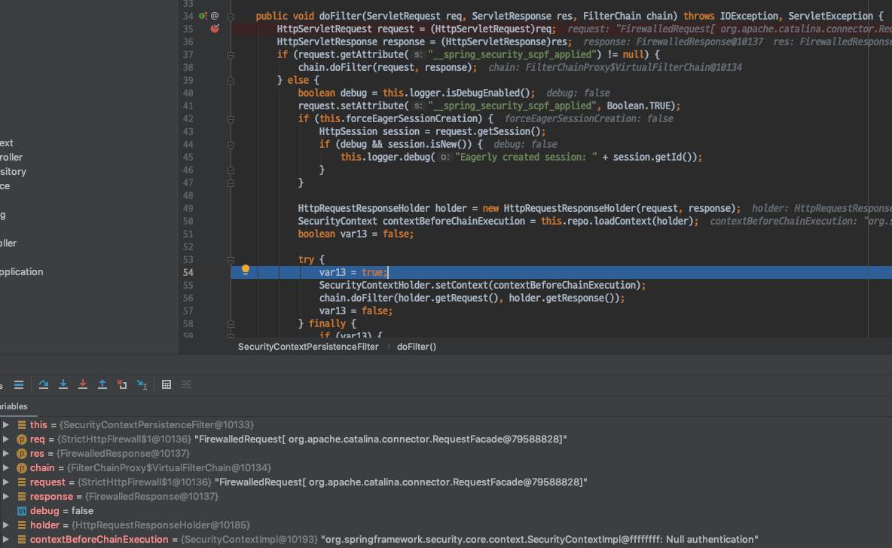
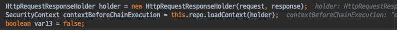
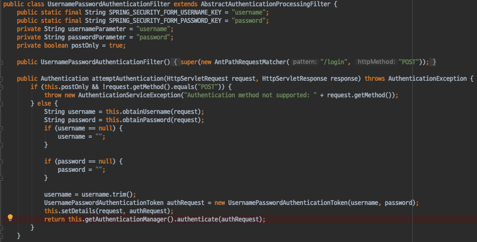
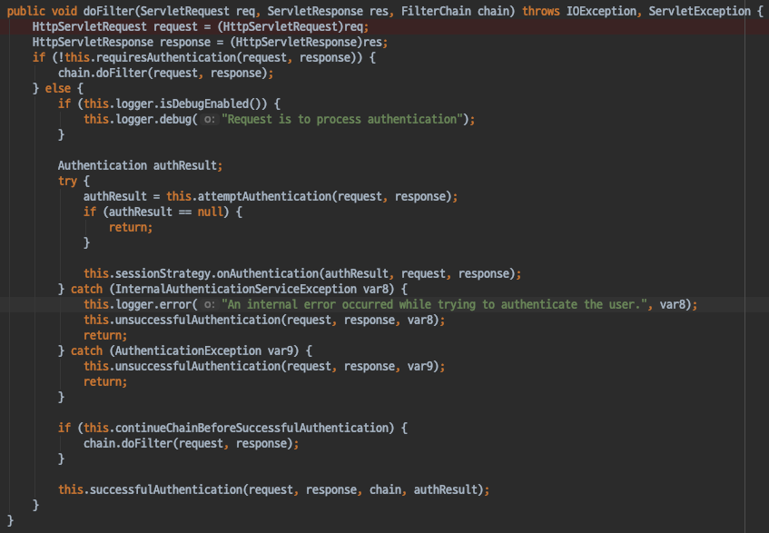
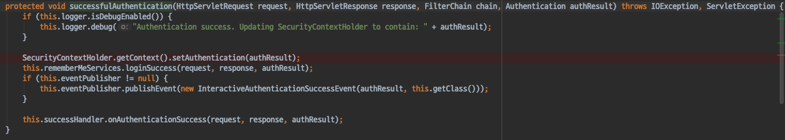

# Spring Security - ArcheTecher_Authenticaition SecurityContextHolder
- AuthenticationManager가 인증을 마친뒤 리턴받은 Authentication 객체가 언제 SecurityContextHolder로 저장되는지 살펴보자.
- 크게 두가지 필터가 사용된다.
    - UsernamePasswordAuthenticationFilter
    - SecurityContextPersistenceFilter
- SecurityContextHolder
    - 인증이 되어있다면 다시 인증을 진행하는것이 아니다.
    - SecurityContextHolder가 인증된 사용자 임을 알고있다.
    - 동일한 Authentication객체가 유지된다.

#### SecurityContextPersistenceFilter

- 매 요청마다 SecurityContextPersistenceFilter를 거친다.
- 이미 만들어 져 있던 SecurityContext (캐싱되어 있던 컨텍스트)를 현재 SecurityContextHolder에 복구하는 작업을 진행한다.
- 요청 처리가 끝나면 해당 Context를 비워준다.

인증이 되어있지 않은 요청이라면 NullAuthentication을 가져온다.
- 인증된 사용자가 없다

매번 요청마다 캐싱 되어있던 SecurityContext를 복구하는 작업을 진행한다.

SecurityContext 캐싱
- HttpSessionSecurityContextRepository
    - HttpSession 기반으로 SecurityContext를 저장해 둔다.
    - 캐싱전략
    - HttpSession이 날아간다면 인증정보가 사라진다.
    - HttpSession이 아닌 다른 방법으로 저장하는 것도 가능하다.
- HttpSessionSecurityContextRepository 에서 기존에 만들어진 SecurityContext가 존재하는지 여부를 확인한다.

#### UsernamePasswordAuthenticationFilter
- 폼 인증을 처리하는 시큐리티 필터
- 인증을 처리하고, 인증이 완료되었다면 Authentication 객체를 SecurityContextHolder에 넣어준다.

- UsernamePasswordAuthenticationFilter는 AuthenticationManager를 사용해 인증을 진행한다.
    - 기본 구현체인 ProviderManager를 사용한다.

- 인증이 완료 되었다면 Parent (AbstractAuthenticationProcessingFilter)로 이동한다.
- attemptAuthentication()
    - TemplateMethod Pattern이 적용되어있다.
    - 부모의 일부분을 자식이 구현하는 구조
- 인증이 완료된 뒤에는 기존에 요청을 했던 URL로 보낸다.

