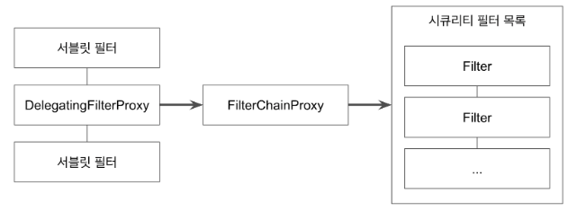
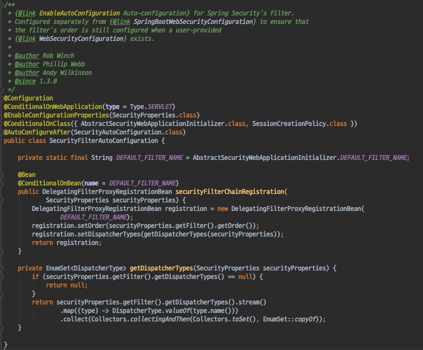
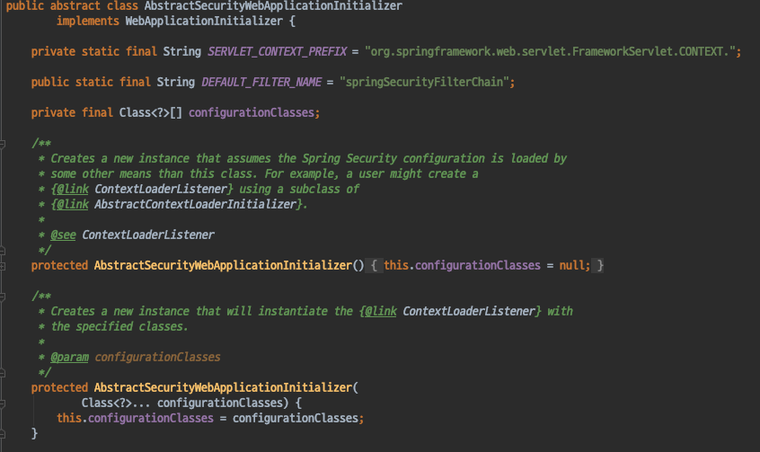

# Spring Security - ArcheTecher_DelegatingFilterProxy FilterChainProxy
- FilterChainProxy 는 어떻게 요청을 처리할수 있는가 ?

#### ServletFilter
- 요청을 보내면 요청을 서블릿 컨테이너가 받게 된다.
    - 서블릿기반 애플리케이션 이기 때문이다.
- 서블릿 컨테이너는 서블릿 스펙을 지원한다.
- 서블릿 스펙에는 Filter라는 개념이 존재한다.
    - 어떤 요청의 전후 처리를 할수 있는 Interceptor같은 개념이다.
    - https://tomcat.apache.org/tomcat-5.5-doc/servletapi/javax/servlet/Filter.html
- 이러한 Filter의 구현체중 하나인 DelegatingFilterProxy 가 존재한다.

#### DeletegatingFilterProxy

- 일반적인 서블릿 필터이다.
- 서블릿 필터 처리를 직접 하지않고 스프링에 들어있는 빈으로 위임하고 싶을때 사용하는 서블릿 필터이다.
- Spring IoC 컨테이너에 존재하는 특정 빈에게 위임하게 된다.
- 위임할 대상의 이름을 명시해 주어야한다.
- SpringBoot없이 SpringSecurity를 사용할때에는 web.xml에 명시하거나, AbstractSecurityWebApplicationInitializer를 사용해서 자동 등록한다.
- Spring Boot를 사용한다면, 자동으로 설정이 된다. (SecurityFilterAutoConfiguration)

`SecurityFilterAutoConfiguration`

`DEFAULT_FILTER_NAME`
- DeletegatingFilterProxy는 위임할 대상의 이름을 지정해 주어야한다고 했는데 우리는 FilterChainProxy의 이름을 지정해 주지않았는데도 어떻게 알 수 있는것일까
- AbstractSecurityWebApplicationInitializer클래스의 DEFAULT_FILTER_NAME 상수로 정의되어있는것을 기본값으로 사용한다.

#### 정리
- Security에서 제공하는 필터들도 모두 서블릿 필터이다.
- 하지만 등록되는 위치와 사용되는 방법이 다른것이다.
- DeletegatingFilterProxy는 서븝릿에 직접 등록되고, 다른 필터에게 요청을 위임하는 필터라면 
- 나머지 필터들은 서블릿 필터이지만 서블릿에게 직접 등록되는 필터가 아니고 스프링 내부적으로 사용되는 필터이다.

#### 현재까지의 아키텍쳐 정리
- SpringSecurityContextHolder가 Authentication객체를 가지고있다.
- AuthenticationManager가 Authentication 인증을 진행한다.
- 인증된 Authentication를 SpringSecurityContextHolder에 넣어주게 되는데 이러한 역할을 SecurityContextPersistenceFilter와 UsernamePasswordAuthenticationFilter가 하게 된다.
- SpringSecurity의 Filter들을 FilterChainProxy가 호출하는데 DeletegatingFilterProxy가 FilterChainProxy에게 요청을 위임한다.
