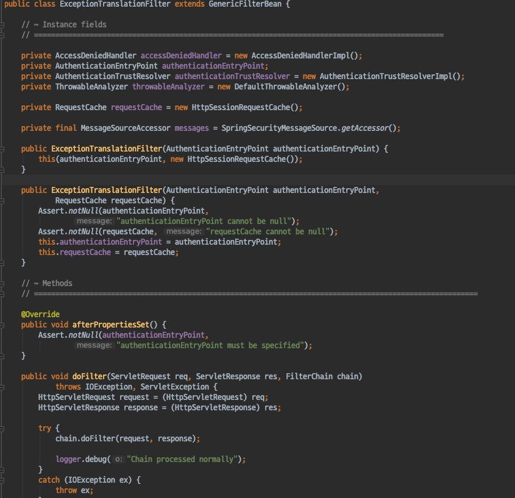
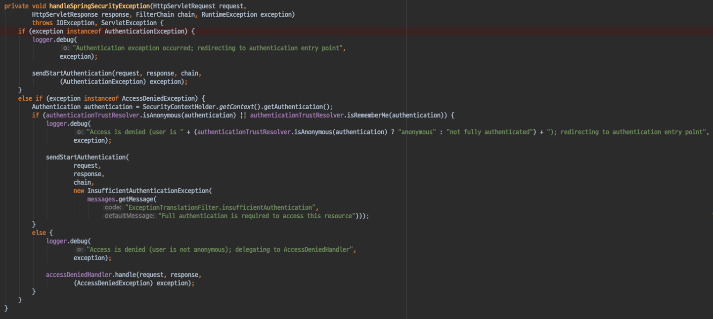
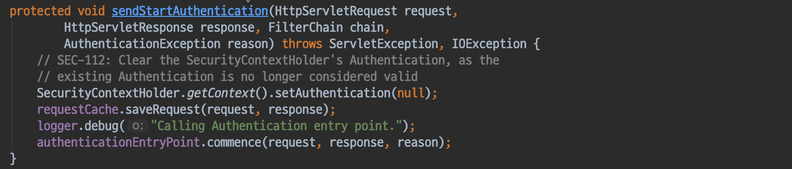
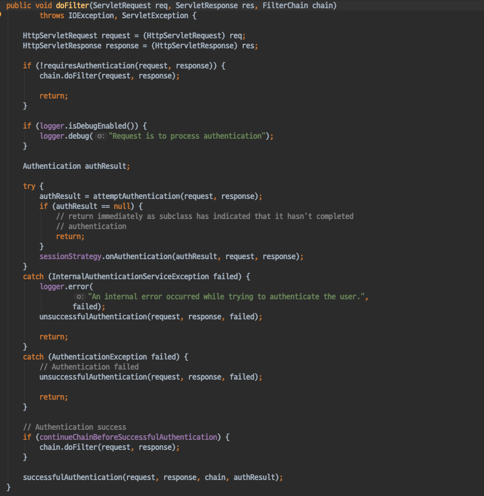
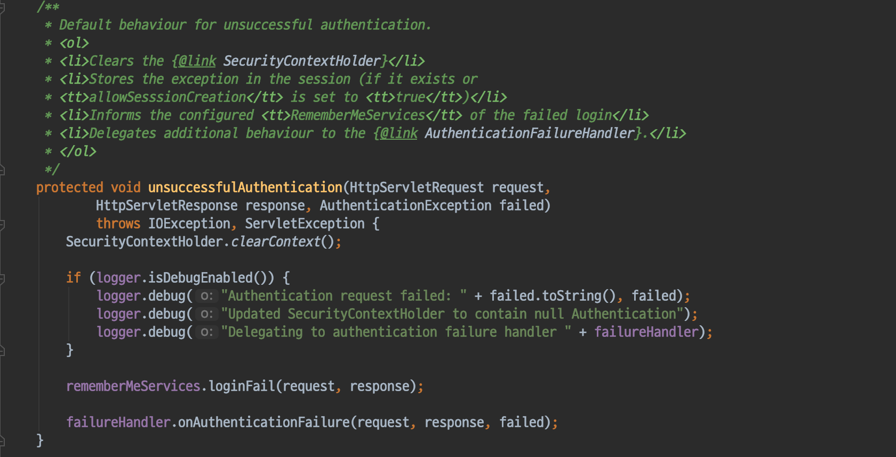

# Spring Security - ArcheTecher_ExceptionTranslationFilter
- Spring Security 에서 인증과, 인가 과정에서 예외가 발생할 경우 이를 어떻게 처리하는지 알아보자.
- 인증과 인가 과정에서 발생하는 예외
    - AuthenticationException (인증)
    - AccessDeniedException (인가)

#### ExceptionTransalcationFilter
- FilterChainProxy가 호출하는도중 발생하는 예외를 처리하는 예외 처리기
- AccessDeniedException과 AuthenticationException을 처리하는 필터이다.
- 핵심 메서드는 HandleSpringSecurityException()

`HandleSpringSecurityException`

- ExceptionTransalcationFilter의 핵심 메서드
- 인증 과정중 AuthenticationException 예외가 발생한다면, AuthenticationEntryPoint를 실행하여 인증을 유도한다.

- 인가 과정중 AccessDeniedException 예외가 발생하면 먼저 현재 Authentication이 익명사용자 (AnonymousUser) 인지 확인한다.
- 만약 익명사용자라면 AuthenticationEntryPoint를 실행하여 인증을 유도한다.
- 익명사용자가 아니라면, AccessDeninedHandler 에게 위임한다.

#### AbstractAuthenticationProcessingFilter
- ExceptionTranslationFilter가 모든 SecurityFilter의 AuthenticationException, AccessDeniedException예외 처리를 담당하는 것은 아니다.
- UsernamePasswordAuthenticationFilter에서 AuthenticationException이 발생하는 경우 UsernamePasswordAuthenticationFilter의 부모클래스인 AbstractAuthenticationProcessingFilter 에서 예외처리를 담당한다.

`AbstractAuthenticationProcessingFilter의 doFilter`
- 인증 과정에서 AuthenticationException 혹은 InternalAuthenticationServiceException 예외가 발생할 경우 unsuccessfulAuthentication 메서드를 호출하여 예외 처리를 진행한다.

`unsuccessfulAuthentication`
- unsuccessfulAuthentication 내부에서는 AuthenticationFailureHandler를 사용하여 에러 메시지를 포함한 로그인 페이지를 보여주는 등의 액션을 취하게 된다.

##### 정리
- Spring Security 에서 인증과, 인가 과정에서 예외가 발생할 경우 ExceptionTranslationFilter가 이를 담당한다.
    - AuthenticationException 예외가 발생한 경우라면, 다시금 인증을 하도록 이를 유도하게 되고
    - AccessDeniedException 예외가 발생했다면 익명 사용자인지 확인, 익명사용자라면 인증을 유도하며, 익명사용자가 아니라면 accessDeninedHandler에게 이를 위임한다.
- 모든 Security 필터에서 발생하는 AuthenticationException, AccessDeniedException 처리를 담당하는 것은 아니다.
- - UsernamePasswordAuthenticationFilter에서 발생한 예외의 경우에는 부모클래스인 AbstractAuthenticationProcessingFilter에서 이를 처리한다.
