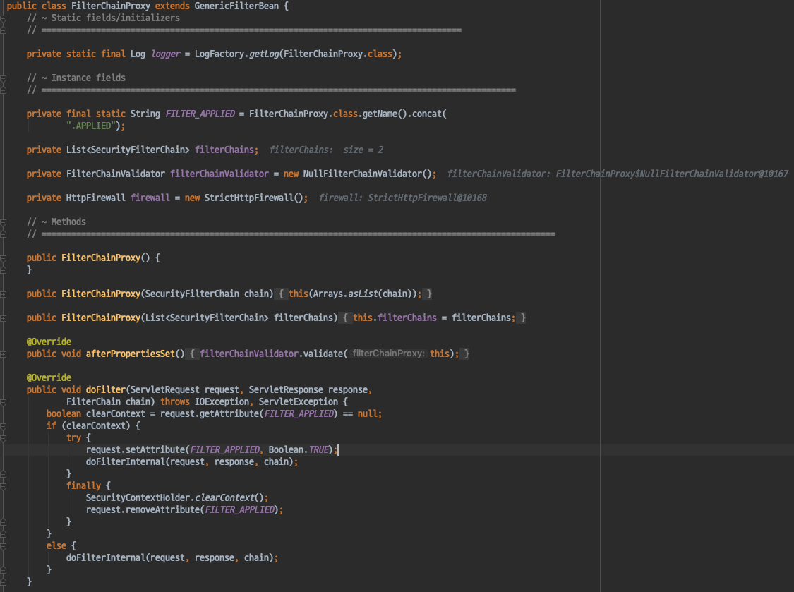
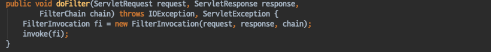
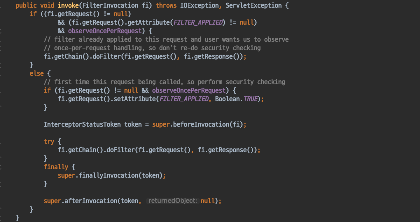
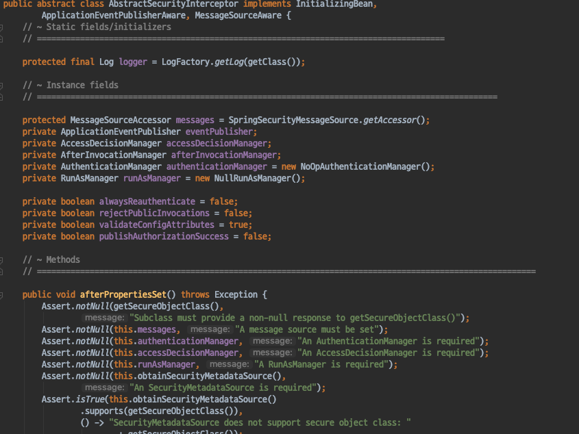
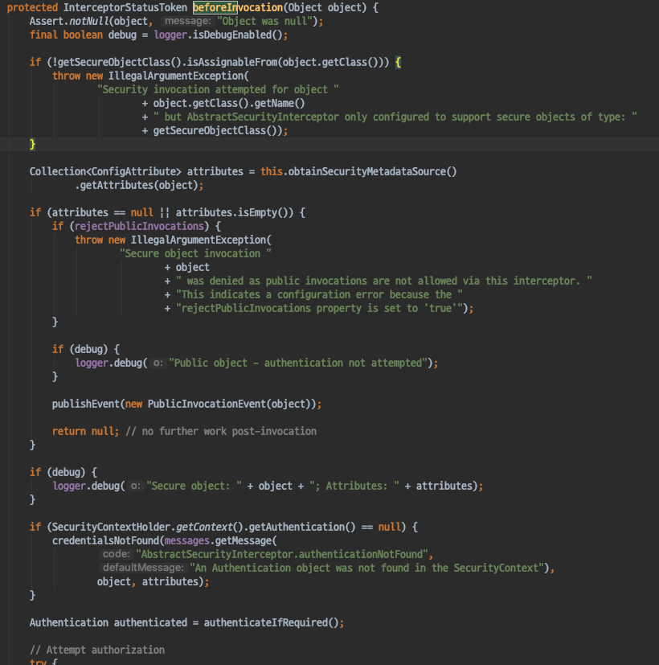
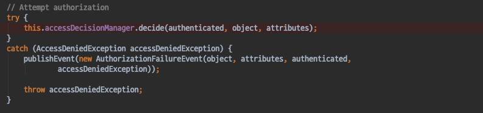

# Spring Security - ArcheTecher_FilterSecurityInterceptor
- Spring Security는 인가를 할때 AccessDecisionManager를 사용한다.
- 그렇다면 AccessDecision Manager는 어디서 사용되는지 살펴보자.

#### FilterSecurityInterceptor 

- FilterChainProxy가 호출하는 Filter중 하나이다.
- 대부분의 경우에 가장 마지막에 사용된다.
- 어떤 리소스에 접근하기 전 마지막에 AccessDecisionManager를 사용하여 인가처리를 하는 필터이다.

#### FilterSecurityInterceptor의 프로세스

`doFilter`
- FilterSecurityInterceptor도 Filter이기때문에 doFilter 메서드가 호출된다.
- doFilter 메서드에서는 FilterSecurityInterceptor의 invoke메서드를 호출하게된다.

`invoke`
- invoke 메서드에서는 부모클래스인 `AbstractSecurityInterceptor`의 method 호출을 통해 인가 처리를 진행한다.

#### AbstractSecurityInterceptor
- FilterSecurityInterceptor 의 부모클래스이고 accessDecisionManager를 호출하여 인가를 한다.
- 어떤 리소스에 접근하더도 이 Filter가 동작한다.
- 인가에 실패한다면 AccessDeniedException 이벤트를 발생시키고
- 해당 예외를 처리하는 ExceptionHandling Filter가 존재하고 해당 필터가 처리를 하게되고, 로그인페이지로 리다이렉트한다.

#### beforeInvocation
- 요청이 들어오면 FilterSecurityInterceptor의 invoke 메서드를 호출하게되고, invoke 메서드에서 AbstractSecurityInterceptor의 beforeInvocation 메서드를 호출하여 인가를 진행하게 된다.

beforeInvocation 메서드 내에서 인가처리를 하는 부분이다.
AccessDecisionManager를 사용하여 인가처리를 진행하고, 만약 인가처리를 하는 과정에서 예외가 발생하게 되면 해당 예외에 대한 이벤트를 발생시키고 SpringSecurity의 ExceptionHandling 처리를 담당하는 Filter에게 이를 위임한다.

#### 정리
- Spring Security에서 인가처리를 담당하는 Filter 는 FilterSecurityInterceptor이다.
- 이는 다른 필터들과 마찬가지로 FilterChainProxy에 의해 호출되며, 대부분의 경우에 가장 마지막에 호출된다.
- FilterSecurityInterceptor는 부모 클래스인 AbstractSecurityInterceptor의 메서드를 호출하여 인가처리를 하게되는데
- 해당 메서드 내부에서는 AccessDecisionManager를 사용하여 인가처리를 진행하고, 처리 과정중 발생한 예외는 SpringSecurity의 ExceptionHandling 처리를 담당하는 Filter에게 위임한다.

- Spring Security의 인가처리 구조
    - FilterChainProxy (호출)-> FilterSecurityInterceptor (AbstractSecurityInterceptor) (호출)-> AccessDecisionManager (호출)-> AccessDecisionVoter (호출)-> ExpressionHandler (처리)

#### Spring Security 인증과 인가 정리

##### 인증
- Spring Security에서의 인증은 AuthenticaitonManager가 담당한다.
- AuthenticaitonManager는 우리가 등록한 UserDetailsService를 사용해 인증을 진행한다.
- 인증이 완료되면 Authentication객체를 반환하게 되는데 Authentication 객체가 가지고 있는 주요 속성들은 다음과 같다.
    - Principal: UserDetailsService에서 반환한 객체
    - GrantedAuthorities: 사용자의 권한
- 인증을 하는 과정에서 비활성, 잘못된 패스워드, 잠긴 계정 등의 예외를 던질 수 있다.
- 이러한 Authentication 객체는 SecurityContext(ThreadLocal)에 보관되고, SecurityContext는 SecurityContextHolder를 통해 접근이 가능하다.
- UsernamePasswordAuthenticationFilter(인증을 담당), SecurityContextPersisenceFilter(Http Session Cache[기본전략]전략으로 Authenticaiton을 캐싱함)가 SecurityContextHolder에 Authentication 객체를 저장하게 된다.

##### 인가
- Spring Security의 인가는 AccessDecisionManager가 담당한다.
- AccessDecisionManager는 Voter들을 사용하며 인가에 사용되는 여러 전략들이 존재한다.
- AccessDecisionVoter는 ExpressionHandler를 사용하여 인가처리를 하게 된다.
- 이러한 AccessDecisionManager는 FilterSecurityInterceptor(AbstractSecurityInterceptor)가 호출하고, FilterSecurityInterceptor는 FilterChainProxy에 의해 호출된다.

- Security의 이러한 필터들은 FilterChainProxy가 호출을 담당하며, FilterChainProxy는 DelegatingFilterProxy에게 요청을 위임 받는 구조이다.
