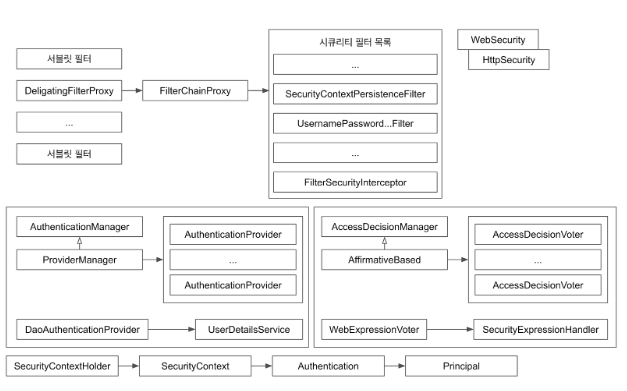

# Spring Security - ArcheTecher 정리

#### Spring Security Filter
- 서블릿 컨테이너로 요청이 들어오면 ServletFilter의 일부인 **DelegatingFilterProxy** 가 특정한 이름으로 등록된 빈에게 요청을 위임한다.

`DelegatingFilterProxy`
- 특정한 이름의 빈으로 요청을 위임하는 서블릿 필터이다.
- Spring Security 기본설정에 의하면 **springSecurityFilterChain** 이라는 이름을 가진 빈에게 요청을 위임한다.
- Spring Boot 사용시 자동 설정된다.
- Spring Boot를 사용하지 않는다면 **AbstractSecurityWebApplicationInitializer** 를 상속받아 등록한다.

`FilterChainProxy`
- DelegatingFilterProxy이 호출하는 빈이다.
    - springSecurityFilterChain 라는 이름으로 등록된다 (기본 전략)
- 여러 필터들을 **Chain** 형태로 가지고 있어야한다.
- WebSecurity와 HttpSecurity를 사용해서 FilterChainProxy를 만든다.
    - SecurityConfig를 만들때 상속받은 클래스명이 **WebSecurityConfigurerAdapter** 인 이유이다.
- 결과적으로 Security설정이 FilterChainProxy를 만드는것이다.
- Security에서는 15개의 Filter를 사용해서 인증과 인가를 진행하게 된다.

#### 인증과 인가
SpringSecurity에서 인증을 진행할때 **UsernamePasswordAuthenticationFilter** 를 사용해서 인증을 진행한다.

`UsernamePasswordAuthenticationFilter`
- SpringSecurity에서 인증을 진행할때 사용하는 Filter이다.
- **AuthenticationManager**를 사용하여 인증을 진행한다.
    - ProviderManager의 기본 구현체이다.

`AuthenticationManager`
- AuthenticationProvider들을 사용하여 인증을 처리한다.
- 여러 ProviderManager중 하나인 DaoAuthenticationProvider가 우리가 주로 사용하는 ProviderManager이다.

`DaoAuthenticationProvider`
- 여러 ProviderManager 구현체중 하나이다.
- UserDetailsService를 사용해 데이터베이스에서 읽어온 유저정보를 기반으로 인증을 시도한다.
- 인증일 완료 되었다면 **SpringSecurityContextHolder**를 사용해서 해당 정보를 저장해두고, 애플리케이션 전반에 걸쳐 사용한다.

`SpringSecurityContextHolder`
- SpringSecurityContext (Authentication) 을 담고 있는 객체이다.
- 여러 캐싱전략이 존재하며, 기본전략은 **HttpSession**을 사용한 방법을 사용한다.

SpringSecurity에서 인증을 진행할때 **FilterSecurityInterceptor** 를 사용해서 인증을 진행한다.

`FilterSecurityInterceptor`
- SpringSecurity에서 **인가** 를 할때 사용한다.
- 대부분의 경우에서 가장 마지막에 호출되는 필터이다.
- Authentication이 적절한 **ConfigAttribute**를 가지고 있는지 확인한다.
    - ROLE
- AccessDecisionManager를 사용하여 인가를 진행한다.
    - 기본 구현체인 **AffirmativeBased** 를 사용한다.

`AffirmativeeBased`
- AccessDecisionManager의 구현체 중 하나이다. (기본 전략)
- 여러 Voter들중 하나만 허용하더라도 인가에 성공한다.
- 여러 Voter구현체중 **WebExpressionVoter** 하나만을 사용한다.

`WebExpressionVoter`
- AccessDecisionVoter의 구현체중 하나이다.
- AffirmativeeBased가 사용하는 Voter
- **SecurityExpressionHandler** 를 사용한다.

`SecurityExpressionHandler`
- WebExpressionVoter가 인가 처리에 사용하게될 ExpressionHandler이다.
- 권한의 Hirearchy 처리가 필요하다면 이를 커스터마이징 해주어야한다.
