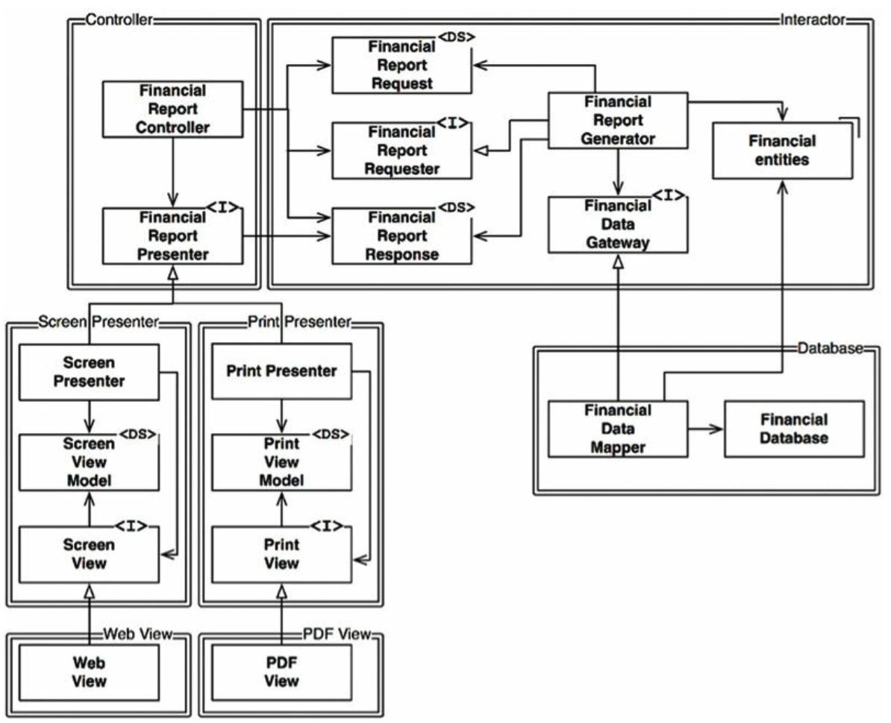
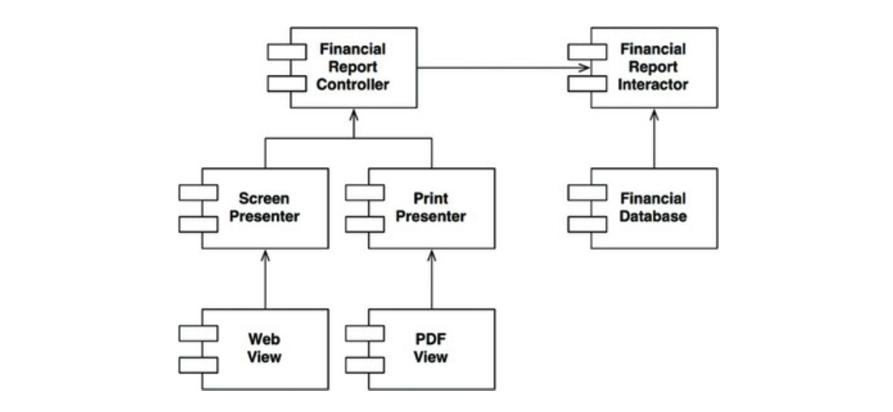

# 8장 OCP 개방-폐쇄 원칙

## 3색 볼펜 스터디
- 빨강 : 매우 중요하다 생각하는 부분
- 파랑 : 중요하다 생각하는 부분
- 초록 : 흥미로운 부분

## 개요
- (빨) 소프트웨어 개체는 확장에는 열려 있어야 하고, 변경에는 닫혀 있어야 한다.
- => 소프트웨어 개체의 행위는 확장 가능해야 하지만, 이때 개체를 변경해서는 안된다

## 사고 실험
- 재무제표를 보여주는 시스템이 있다고 가정
- 이해관계자가 동일한 정보를 보고서 형태로 변환해 흑백 프린트로 출력해 달라고 요청이 왔다
- 이는 당연히 새로운 코드를 작성해야 한다. 기존 코드는 얼마나 수정해야 할까 ?
  - 이상적인 변경량은 0 이다
- 서로 다른 목적으로 변경되는 요소를 적절하게 분리 (SRP) 하고, 이들 요소 사이의 의존성을 체계화 함으로써 (DIP) 변경량을 최소화 할 수 있다
- 가장 중요한 것은 보고서 생성이 **두 개의 책임으로 분리된다** 는 사실이다
  - 보고서용 데이터 계산
  - 데이터를 표현
- 책임을 분리 했다면, 두 책임중 하나에서 변경이 발생하더라도 다른 하나는 변경되지 않도록 소스코드 의존성도 조직화 해야 한다
- 이런 목적을 달성하려면, 처리 과정을 클래스 단위로 분할하고, 이들을 컴포넌트 단위로 구분해야 한다.

- Controller, Interactor, Database, Presenter, View 로 분리한다.
- 위 그림에서 주목할 점은 모든 의존성이 소스코드 의존성을 나타낸다

- 위 그림에서 보듯 모든 컴포넌트 관계는 단 방향으로만 이루어 진다.
- 이 화살표는 변경으로부터 보호하려는 컴포넌트를 향하도록 그려진다
- A 에서 발생한 변경으로부터 B 를 보호하려면 반드시 A 가 B 에 의존해야 한다
- Interactor 는 OCP 를 가장 잘 준수할 수 있는곳에 위치해야 한다
  - 이는 Interactor 가 업무 규칙을 포함하기 때문이다
  - 애플리케이션에서 가장 높은 수준의 정책을 포함하며, 이외 컴포넌트는 모두 주변적인 문제를 처리한다
  - 가장 중요한 컴포넌트 이다
- 이것이 바로 아키텍처 수준에서 OCP 가 동작하는 방식이다
- (파) 아키텍트는 기능이 어떻게, 왜, 언제 발생하는지에 따라서 기능을 분리하고, 분리한 기능을 컴포넌트의 계층구조로 조직화 한다
- 컴포넌트 계층구조를 이처럼 조직화하면, 저수준 컴포넌트에서 발생한 변경으로부터 고수준 컴포넌트를 보호할수 있다

## 방향성 제어
- FinancialDataGateway 인터페이스는 FinancialReportGenerator 와 FiancialDataMapper 사이에 위치하는데 이는 의존성 역전을 위함이다
- 이 인터페이스가 없었다면, 의존성이 Interactor -> Database 컴포넌트로 바로 향하게 된다.
- FinancialReportPresenter 인터페이스와 2개의 View 인터페이스도 같은 목적을 가진다

## 정보 은닉
- FinancialReportRequester 는 방향성 제어와 다른 목적을 가진다
- 이는 FinancialReportController 가 Interactor 내부에 대해 너무 많이 알지 못하도록 막기 위함이다
- 만약 이 인터페이스가 없었따면 Controller 가 엔티티에 대해 추이 종속성을 가진다
- 추이 종속성을 가지게 되면 소프트웨어 엔티티는, 자신이 직접 사용하지 않는 요소에는 절대 의존해서는 안된다는 소프트웨어 원칙을 위반하기 된다
- Controller 의 변경으로 부터 Interactor 를 보호하는 것이 가장 중요하지만, 반대로 Interactor 의 변경으로 부터 Controller 도 보호 한다
- 이를 위해 Interactor 내부를 은닉한다

## 결론
- (빨) OCP 의 목표는 시스템을 확장하기 쉬운동시에 변경으로 인해 시스템이 너무 많은 영향을 받지 않도록 하는데 있다
- 이를 달성하려면 시스템을 컴포넌트 단위로 분리하고, 저수준 컴포넌트에서 발생한 변경으로부터 고수준 컴포넌트를 보호할 수 있는 형태의 의존성 계층구조가 만들어지도록 해야 한다
