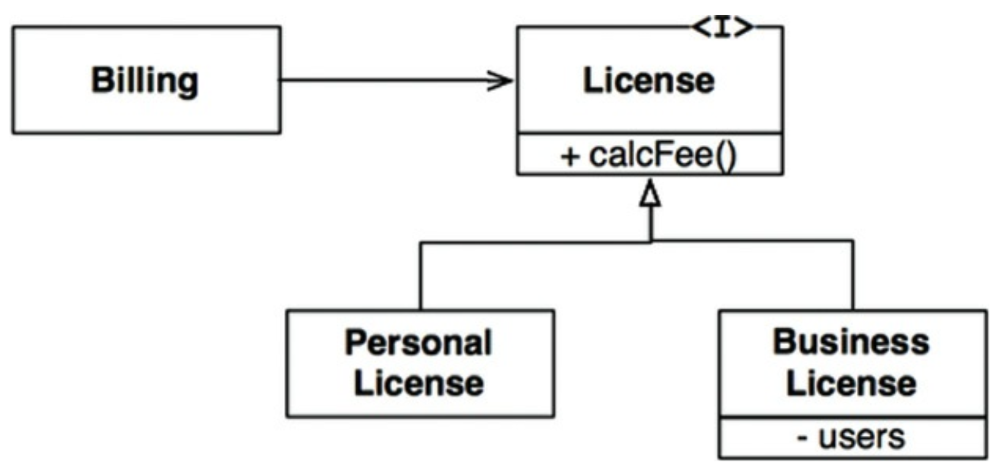
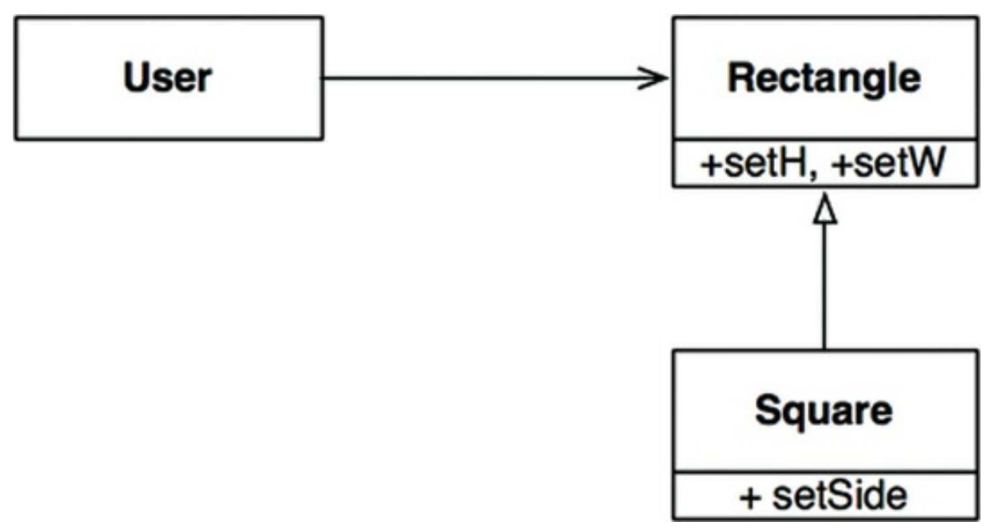

# 9장 LSP 리스코프 치환 원칙

## 3색 볼펜 스터디
- 빨강 : 매우 중요하다 생각하는 부분
- 파랑 : 중요하다 생각하는 부분
- 초록 : 흥미로운 부분

## 개요
- 리스코프는 하위 타입 (subtype) 을 다음과 같이 정의했다.
- (빨) S 타입의 객체 o1 각각에 대응하는 T 타입 객체 o2 가 있고, T 타입을 이용해서 정의한 모든 프로그램 P 에서 o2 자리에 o1 을 치환하더라도 P 의 행위가 변하지 않는다면 S 는 T 의 하위 타입이다

## 상속을 사용하도록 가이드 하기
- License 클래스가 있고, Billing 애플리케이션에서 이 클래스의 calcFee() 메소드를 호출한다
- License 는 PersonalLicense 와 BusinessLicense 라는 두가지 **하위 타입** 이 있다.

- 이 설계는 LSP 를 준수한다.
- **Billing 애플리케이션의 행위가 License 하위 타입중 무엇을 사용하는지에 전혀 의존하지 않는다 이들 하위 타입 모두 License 타입을 치환할 수 있다**

## 정사각형/직사각형 문제
- LSP 를 위반하는 전형적인 문제는 유명한 정사각형/직사각형 문제가 있다

- Square 는 Rectangle 의 하위 타입으로는 적합하지 않다.
- Rectangle 의 높이와 너비는 독립적으로 변경되는 발면, Square 의 높이와 너비는 반드시 함께 변경되기 때문이다.
- 이런 형태의 LSP 위반을 막기 위한 유일한 방법은 Rectangle 이 실제로 Square 인지 검사하는 매커니즘을 User 에 추가하는 것
- (파) 하지만 이는 User 의 행위가 사용하는 타입에 의존하게 되기 때문에 결국 타입을 서로 치환할 수 없게 된다

## LSP 와 아키텍쳐
- 객체지향 초기에는 LSP 는 상속을 사용하도록 가이드 하는 방법 정도로 간주되었으나 시간이 지나며 LSP 는 인터페이스/구현체에도 적용되는 더 광범위한 소프트웨어 설계 원칙으로 변모해왔다
- 여기서 말하는 인터페이스는 다양한 형태로 나타난다
- 자바라면 인터페이스 하나와 이를 구현하는 여러 구현체로 구성된다
- 루비라면, 동일한 메서드 시그니처를 공유하는 여러 클래스로 구성된다
- 또는 동일한 REST 인터페이스에 응답하는 서비스 집단일 수도 있다
- 위 상황은 물론 더 많은 경우에 LSP 를 적용할 수 있다
- (파) 잘 정의된 인터페이스와 그 인터페이스 구현체끼리의 상호 치환 가능성에 기대는 사용자들이 존재한다.
- 아키텍처 관점에서 LSP 를 이해하는 방법 
  - 이를 어겼을 때 시스템 아키텍처에서 어떤 일이 일어나는지 관찰하는 것

## 결론
- (빨) LSP 는 아키텍처 수준까지 확장할 수 있고 반드시 확장해야 한다.
- 치환 가능성을 조금이라도 위배하면 시스템 아키텍처가 오염되어 상당량의 별도 메커니즘을 추가해야 할 수 있기 때문이다.