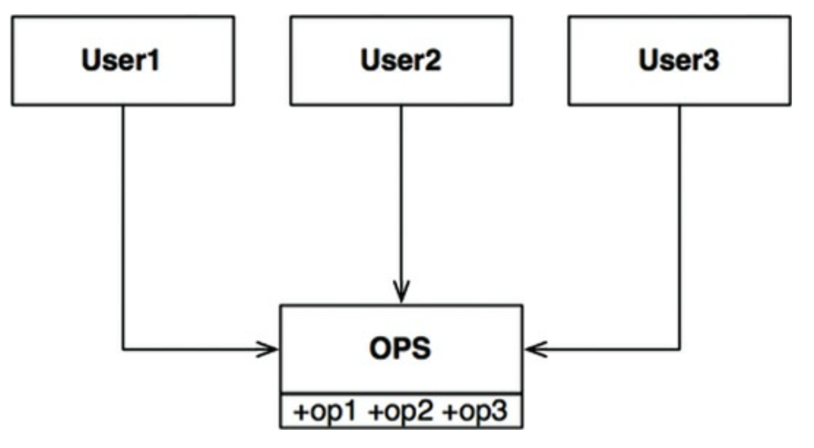
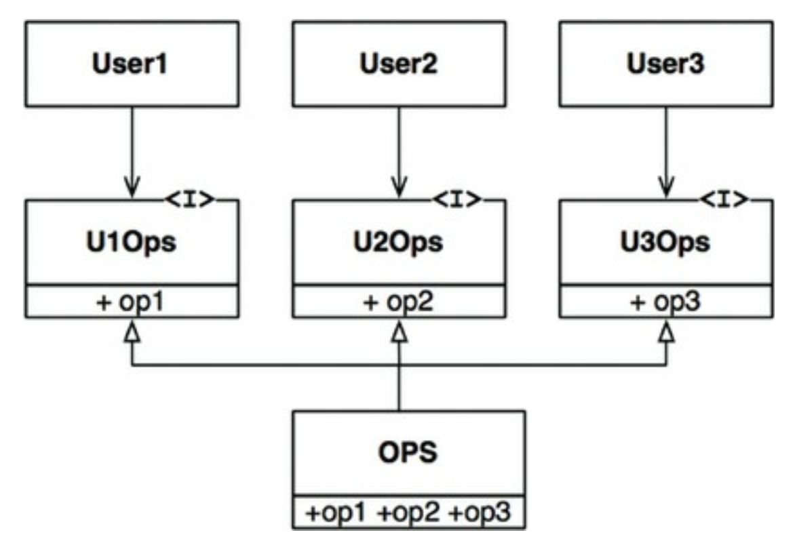

# 10장 ISP 인터페이스 분리 원칙

## 3색 볼펜 스터디
- 빨강 : 매우 중요하다 생각하는 부분
- 파랑 : 중요하다 생각하는 부분
- 초록 : 흥미로운 부분

## 개요
- 인터페이스 분리 원칙은 다음 다이어그램에서 그 이름이 유래했다

- 다수 사용자가 OPS 클래스의 오퍼레이션을 사용한다.
  - op1, op2, op3 을 각 사용자가 사용한다.
- OPS 가 정적 타입 언어로 작성되었다고 하면, User1 은 op2, op3 을 사용하지 않음에도 User1의 소스코드는 이 메소드들에 의존한다
- 이런 의존성으로 인해 OPS 클래스에서 op2의 소스 코드가 변경되면 User1 도 다시 컴파일한 후 새로 배포해야 한다
- 이런 문제는 다음과 같이 오퍼레이션을 인터페이스 단위로 분리하여 해결할 수 있다

## ISP 와 언어
- 정적 타입 언어는 사용자가 타입 선언문을 사용하도록 강제한다
- 이런 선언문으로 인해 소스코드 의존성이 발생하고, 재컴파일/재배포가 강제되는 상황이 무조건 초래한다
- 동적 타입 언어를 사용하면, 소스코드에 이런 선언문이 존재하지 않고 런타임 추론이 발생한다
- 때문에 정적 타입 언어 보다 유연하며 결합도가 낮은 시스템을 만들 수 있다
- (초) 이런 사실로 인해 ISP 는 아키텍쳐가 아닌 언어와 관련된 문제라고 결론을 내릴 여지가 있다

## ISP 와 아키텍쳐
- ISP 를 사용하는 근본적인 동기
- (파) 필요 이상의 많은 걸 포함하는 모듈에 의존하는 것은 해로운 일이다
- 소스코드 의존성 => 불필요한 컴파일/배포를 강제한다
- 이는 아키텍쳐 수준에서도 동일한 상황이 발생한다.
  - 모듈간의 의존성 문제..

## 결론
- 불필요한 짐을 실은 무언가에 의존하면 예상치 못한 문제에 빠질 수 있다는 사실을 기억해야 한다