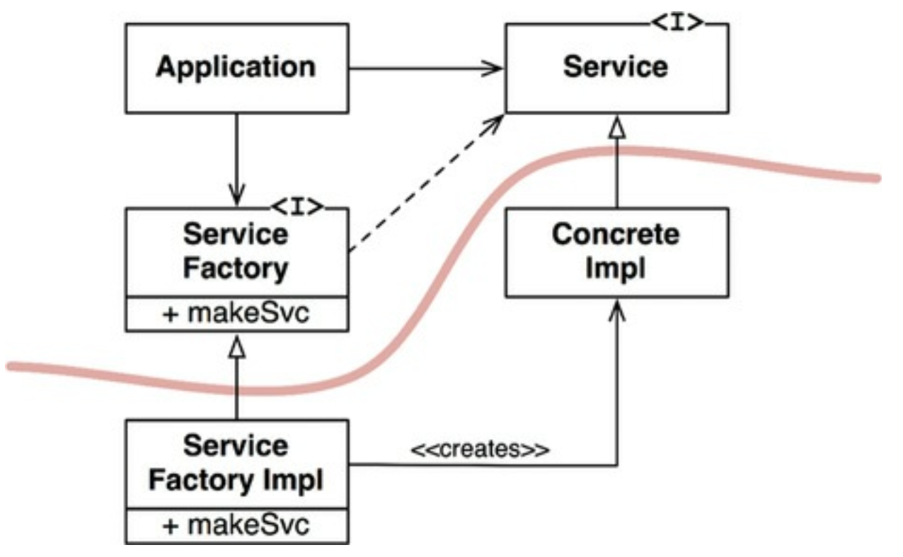

# 11장 DIP 의존성 역전 원칙

## 3색 볼펜 스터디
- 빨강 : 매우 중요하다 생각하는 부분
- 파랑 : 중요하다 생각하는 부분
- 초록 : 흥미로운 부분

## 개요
- (빨) 의존성 역전 원칙이 말하는 유연성이 극대화된 시스템 => 소스코드 의존성이 추상에 의존하며 구체에는 의존하지 않는 시스템
- DIP 를 논할때 운영체제/플랫폼 같이 안정성이 보장된 환경에 대해서는 무시하는 편
  - java.lang.String 이 그 예
  - 이는 변경되는 경우가 매우 적으며 엄격하게 통제되어 안정적이다

## 안정된 추상화
- 추상 인터페이스에 변경이 생기는 구현체들도 수정이 필요하다
- 반면, 구현체에 변경이 발생하더라도, 인터페이스는 변경될 필요가 없다
- => 인터페이스는 구현체 보다 변동성이 낮다.
- (빨) 인터페이스의 변동성을 낮추기 위해 애쓰며, 이를 변경하지 않고도 구현체에 기능을 추가할 수 있는 방법을 찾기위해 애를 써야한다. 이는 소프트웨어 설계의 기본
- (파) 안정된 소프트웨어 아키텍쳐란 => 변동성이 큰 구현체에 의존하지 않고, 안정된 추상 인터페이스를 선호하는 아키텍처
- 이 원칙에서 전달하려는 것은 매우 구체적인 코딩 실천법으로 요약이 가능하다
  - 변동성이 큰 구체 클래스를 참조하지 말라
    - 대신 추상 인터페이스를 참조하라.
    - 객체 생성 방식을 강하게 제약하며, 일반적으로 추상 팩토리 사용을 강제 한다
  - 변동성이 큰 구체 클래스로부터 파생하지 말라
    - 상속은 아주 신중하게 사용해야 한다. 동적 타입언어라면 문제거 덜되지만, 의존성을 가진다는 사실에는 변함이 없다. 
  - 구체 함수를 오버라이드 하지 말라
    - 대체로 구체 함수는 소스코드 의존성을 필요로 한다
    - 이런 의존성을 제거할 수 없으며 실제로 그 의존성을 상속하게 된다
    - 차라리 추상 함수를 선언하고 구현체들에서 각자 용도에 맞게 구현해야 한다
  - 구체적이며 변동성이 크다면 절대로 그 이름을 언급하지 말라
    - 이는 DIP 원칙을 다른 방식으로 풀어쓴 것

## 팩토리
- 이 규칙들을 준수하려면 변동성이 큰 구체적인 객체는 특별히 주의해 생성해야 한다.
- 모든 언어에서 객체를 생성하려면 해당 객체를 구체적으로 정의한 코드에 대해 소스코드 의존성이 발생한다.
- 자바 등 객체지향 언어에서 이런 의존성을 처리할 때 추상 팩토리를 사용한다

- 위 그림의 곡선은 아키텍처 경계를 의미한다
- 이 곡선은 구쳊거인 것들로 부터 추상적인 것들을 분리한다.
- 소스코드 의존성을 해당 곡선과 교차할 때 모두 한방향, 즉 추상적인 쪽으로 향한다.
- 곡선은 시스템을 두 가지 컴포넌트로 분리한다
  - 추상 컴포넌트와 구체 컴포넌트
- 추상 컴포넌트 => 애플리케이션의 모든 고수준 업무 규칙을 포함
- 구체 컴포넌트 => 업무 규칙을 다루기 위해 필요한 모든 세부 사항을 포함
- 소스 코드 의존성을 제어 흐름과 반대방향으로 역전된다.
- 이런 이유로 의존성 역전 이라고 부른다

## 결론
- DIP 는 아키텍쳐 다이어그램에서 가장 눈에 드러나는 원칙이 될 것이다