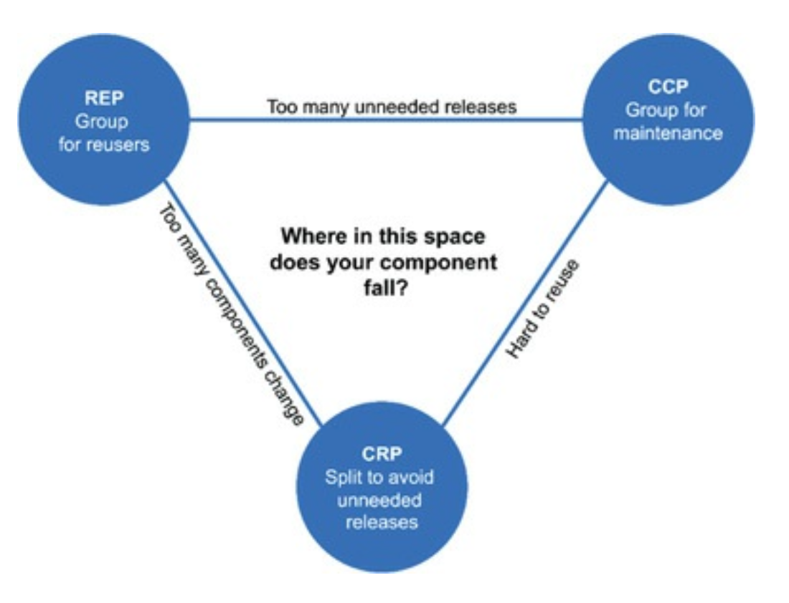

# 13장 컴포넌트 원칙

## 3색 볼펜 스터디
- 빨강 : 매우 중요하다 생각하는 부분
- 파랑 : 중요하다 생각하는 부분
- 초록 : 흥미로운 부분

## 개요
- 어떤 클랙스를 어느 컴포넌트에 시켜야 하는가 ?
  - 제대로된 소프트웨어 엔지니어링 원칙을 받아야 함
- 컴포넌트 응집도와 관련된 세 가지 원칙
  - REP : 재사용/릴리스 등가 원칙
  - CCP : 공통 폐쇄 원칙
  - CRP : 공통 재사용 원칙

## REP : 재사용/릴리스 등가 원칙
- (빨) 재사용 단위는 릴리스 단위와 같다
- 소프트웨어 컴포넌트가 릴리스 절차를 통해 추적/관리되지 않거나 릴리스 번호 부여가 되지 않는다면, 재사용할수 없고 하지도 않을 것이다
- 릴리스 번호가 없다면 컴포넌트들이 서로 호환되는지 보증할 방법이 없다
- 개발자는 새로운 버전이 릴리스 된다면 변경 사항을 살펴보고 기존 버전을 계속 사용할지 결정한다
  - 적절한 공지와 문서가 함께 작성되어야 한다
- 이 원칙을 소프트웨어 설계와 아키텍쳐 관점으로 본다면
- => (파) 단일 컴포넌트는, 응집성 높은 클래스와 모듈들로 구성되어야 한다
- 임의로 선택된 클래스와 모듈로 구성되어서는 안되며, 컴포넌트를 구성하는 모든 모듈은 서로 공유하는 중요한 테마나 목적이 있어야 한다
- (파) 하나의 컴포넌트로 묶인 클래스와 모듈은 버전 번호가 같아야 하며, 동일한 릴리스로 추적 관리되서 동일 릴리스 문서에 포함되어야 한다
- 이 원칙의 약점은  다음에 다룰 두원칙이 지닌 강점을 통해 충분히 보완할 수 있다
  - CCP 와 CRP 는 REP 를 엄격하게, 제약을 가하는 측면에서 정의한다

## CCP : 공통 폐쇄 원칙
- (빨) 동일한 이유로 동일한 시점에 변경되는 클래스를 같은 컴포넌트로 묶어라. 서로 다른 시점에 다른 이유로 변경되는 클래스는 다른 컴포넌트로 분리하라
- 이 원칙은 SRP 를 컴포넌트 관점에서 다시 쓴 것이다
- 단일 컴포넌트는 변경의 이유가 여러 개 있어서는 안된다
- 대다수 애플리케이션 에서 유지보수성은 재사용성 보다 훨씬 중요하다
- 코드가 반드시 변경되어야 한다면, 변경이 단일 컴포넌트에서 발생하는 것이 낫다
  - 변경을 단일 컴포넌트로 제한할 수 있다면, 해당 컴포넌트만 재배포 하면 된다
- CCP 는 같은 이유로 변경 가능성이 있는 클래스는 모두 한곳으로 묶을 것을 권장한다
  - 물리적, 개념적으로 강결합되어 항상 함께 변하는 클래스는 하나의 컴포넌트에 속해야 한다
  - 이를 통해 소프트웨어를 릴리스, 재검증, 배포하는 일과 관련된 작업량을 최소화 할 수 있다

## CRP : 공통 재사용 원칙
- (빨) 컴포넌트 사용자들을 필요하지 않는 것에 의존하게 강요하지 말라
- CRP 도 클래스와 모듈을 어느 컴포넌트에 위치시킬지 결정할때 도움되는 원칙이다
- CRP 에서는 함께 재사용되는 경향이 있는 클래스와 모듈들은 같은 컴포넌트에 포함해야 한다고 말한다
- 대체로 재사용 가능한 클래스는 재사용 모듈의 일부로써 해당 모듈의 다른 클래스와 상호작용하는 경우가 많다
- 의존하는 컴포넌트가 있다면, 해당 컴포넌트의 모든 클래스에 대해 의존함을 확실히 인지해야 한다
- CRP 는 어떤 클래스를 묶어야 하는지 보다는, 어떤 클래스를 묶어서는 안되는지에 대해 훨씬 많은 이야기를 한다
- 강결합되지 않는 클래스들을 동일 컴포넌트에 위치시켜서는 안된다

## 컴포넌트 응집도에 대한 균형 다이어그램
- 응집도에 관련해 세 원칙이 서로 상충된다
- REP, CCP 는 포함 원칙이다. => 두 원칙을 컴포넌트를 크게 만든다
- CRP 는 배제 원칙이며, 컴포넌트를 더 작게 만든다
- 뛰어난 아키텍트라면 세 원칙의 균형을 이루는 방법을 찾아야 한다

- REP, CRP 에 중점을 두면 사소한 변경이 발생했을때 많은 컴포넌트에 영향을 미친다.
- 반대로 CCP, REP 에 중점을 두면 불필요한 릴리스가 빈번해 진다
- 시간이 흐르면서 주의를 기울이는 부분이 변한다는 사실을 이해해야 한다
- 프로젝트 초기에는 CCP 가 REP 보다 훨씬더 중요하다
- 일반적으로 삼각형 오른쪽에서 시작하는 편이며, 오직 재사용성만 희생하면 된다
- 프로젝트 컴포넌트 구조는 시간과 성숙도에 다라 변한다
- 프로젝트가 실제 수행하는 일 자체보다는, 프로젝트가 발전되고 사용되는 방법과 더 관련이 깊다

## 결론
- 어느 클래스들을 묶어 컴포넌트를 만들지 결정할때, 재사용성과 개발 가능성이라는 상충하는 힘을 반드시 고려해야 한다
- 이들 사이에서 애플리케이션 요구에 따라 균형 잡을 일이 중요하다