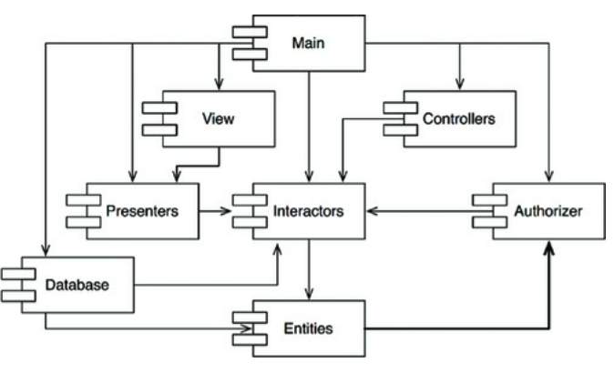

# 14장 컴포넌트 결합

## 3색 볼펜 스터디
- 빨강 : 매우 중요하다 생각하는 부분
- 파랑 : 중요하다 생각하는 부분
- 초록 : 흥미로운 부분

## ADP : 의존성 비순환 원칙
- (빨) 컴포넌트 의존성 그래프에 순환이 있어서는 안된다
- 숙취 증후군 : 많은 개발자가 동일한 소스코드를 수정하는 환경에서 발생한다
  - 어제 잘 돌아갔는데 다음날 출근해서 보니 동작을 안한다..
- 소수개발자로 구성된경우에 큰 문제는 되지 않지만 프로젝트와 팀 규모가 커질수록 문제가 될 수 있다
- 이 문제 해결책으로 두 가지 방법이 있다
  - 주 단위 빌드
  - 의존성 비순환 원칙

### 주단위 빌드
- 중간 규모 프로젝트에서는 흔히 사용 된다
- 주 1회 변경된 코드를 모두 통합해 시스템을 빌드한다
- 5일중 4일동안 개발자를 고립된 세계에서 살 수 있게 보장해준다
- 하지만 프로젝트가 커지면 하루만에 통합하는게 불가능 해 진다
- 개발보다 통합에 드는 시간이 늘어나며 팀 효율도 점점 나빠진다

### 순환 의존성 제거하기
- 개발 환경을 릴리스 가능한 컴포넌트 단위로 분리하는 것이다
- 컴포넌트 => 개발자 또는 단일 개발팀이 책임질 수 있는 작업 단위가 된다
- 개발자가 컴포넌트를 동작가능하게 만든 후 릴리스하여 다른 개발자가 쓸수 있게 만든다
- 새롭게 릴리스 된 버전을 보고 사용할 수 있을지 판단한다. => 이를 다른 개발자가 결정한다
- 어떤 팀도 다른 팀에 의해 좌우되지 않는다
- 특정 컴포넌트가 변경되더라도 다른 팀에 즉각 영향을 주지 않는다
- 각 팀은 특정 컴포넌트가 릴리스되면 해당 컴포넌트에 맞게 수정할 시기를 스스로 결정할 수 있다.
- 뿐만 아니라 통합은 작고 점진적으로 이뤄진다
- 하지만 이런 방법이 성공적으로 동작하려면 컴포넌트 사이의 의존성 구조를 관리해야 하며, 순환이 있어서는 안된다

### 순환이 의존성 그래프에 미치는 영향
- 새로운 요구사항이 발생해 Entities 에 포함된 클래스가 Authorizer 에 잇는 클래스를 사용할 수 밖에 없다고 가정
- 그런 경우 다음과 같이 순환 의존성이 발생한다

- 이는 즉각적인 문제가 발생한다
- Entities, Authorizer, Interactors 가 사실상 하나의 거대한 컴포넌트가 되어 버린다
- 개발잗르은 모두 이중 하나를 개발할 경우 숙취 증후군에 떠는 경험을 하게 될 것을 의미한다
- 의존성 그래프에 순환이 생기면 컴포넌트를 어떤 순서로 빌드해야 올바를지 파악하기가 상당히 힘들어 진다

### 순환 끊기
- 컴포넌트 사이의 순환을 끊고 의존성을 다시 DAG 로 원복하는 것은 언제든 가능하다
- 의존성 역전 원칙 DIP 를 적용

- Entities 와 Authorizer 가 의존하는 새로운 컴포넌트 생성

### 흐트러짐
- 두 번째 해결책에서 시사하는 바는 요구사항이 변경되면 컴포넌트 구조도 변경될 수 있다
- 애플리케이션이 성장하면서 컴포넌트 의존성 구조는 서서히 흐트러지며 또 성장한다
- 따라서 의존성 구조에 순환이 발생하는지 항상 관찰해야 한다

## 하향식 설계
- 컴포넌트 구조는 하향식으로 설계될 수 없다
- 시스템에서 가장 먼저 설계가능한 대상이 아니며, 시스템이 성장하고 변경될 때 함께 진화한다
- 컴포넌트 의존성 다이어그램은 애플리케이션의 빌드 가능성과 유지보수성을 보여주는 지도와 같다
- 때문에 컴포넌트 구조는 프로젝트 초기에 설계할 수 없다

## SDP : 안정된 의존성 원칙
- (빨) 안정성의 방향으로 의존하라 (더 안정된 쪽으로)
- 설계를 유지하다보면 변경은 불가피하다. 공통 폐쇄 원칙을 준수함으로써 다른 유형의 변경에는 영향받지 않으면서 특정 유형의 변경에만 민감하게 만들 수 있다
- 이처럼 컴포넌트 중 일부는 변동성을 지니도록 설계 된다
  - 변동성을 지니도록 설계한 컴포넌트는 언젠가 변경되리라고 예상한다
- 변경이 쉽지 않은 컴포넌트가 변동이 예상되는 컴포넌트에 의존하게 만들어서는 안된다
- 한번 의존하게 되면 변동성이 큰 컴포넌트도 결국 변경이 어려워진다
- 안정된 의존성 원칙을 준수하면 변경하기 어려운 모듈이 변경하기 쉽게 만들어진 모듈에 의존하지 않도록 만들 수 있다

### 안정성
- 소프트웨어 컴포넌트를 변경하기 어렵게 만드는데는 많은 요인이 존재한다
  - 컴포넌트의 크기, 복잡도, 간결함 등을 들 수 있다
- 이런 요인들은 모두 무시하고, 좀더 특이한 요인에 주목하라고 한다
- 소프트웨어 컴포넌트를 변경하기 어렵게 만드는 확실한 방법 하나는 수많은 다른 컴포넌트가 해당 컴포넌트에 의존하게 만드는 것이다
- 컴포넌트 안쪽으로 들어오는 의존성이 많아지면 상당히 안정적이라 볼 수 있는데, 사소한 변경이라도 의존하는 모든 컴포넌트를 만족시키면서 변경하려면 상당한 노력이 들기 때문이다

### 안정성 지표
- Fan-in : 안으로 들어오는 의존성, 이는 컴포넌트 내부의 클래스에 의존하는 컴포넌트 외부 클래스 개수를 나나낸다
- Fan-out : 바깥으로 나가는 의존성, 이는 컴포넌트 외부 클래스에 의존하는 컴포넌트 내부 클래스 개수를 나타낸다
- I (불안정성) : I = Fan-out/(Fan-in + Fan-out) 0 , 1 범위 값을 가진다
- I = 0 이면 최고 안정적 
- I = 1 이면 최고 불안정적

### 모든 컴포넌트가 안정적일 필요는 없다
- 모든 컴포넌트가 최고 안정적이라면 변경이 불가능하다
- 이는 바람직한 상황이 아니다
- 컴포넌트 설계시 기대하는 것은 불안정 컴포넌트와 안정 컴포넌트가 공존하는 상태이다

## SAP : 안정된 추상화 원칙
- (빨) 컴포넌트는 안정된 정도만큼만 추상화되어야 한다

### 고수준 정책을 어디에 위치시켜야 하는가 ?
- 시스템에는 자주 변경해서는 절대 안되는 소프트웨어도 있다
- 고수준 아키텍쳐나 정책 결정과 관련된 소프트웨어가 그 예이다
- 업무로직/아키텍처와 관련된 결정에는 변동성이 없기를 기대한다
- 시스템에서 고수준 정책을 캡슐화 하는 소프트웨어는 반드시 안정된 컴포넌트에 위치해야 한다
- 불안정한 컴포넌트는 반드시 변동성이 큰 소프트웨어, 즉 쉽고 빠르게 변경가능한 소프트웨어만을 포함해야 한다.
- 고수준 정책을 안정된 컴포넌트에 위치시키면 수정하기 어려워진다
- 안정적이면서도 유연성을 가질수는 없을까 ? => OCP 에서 찾을 수 있다
  - 추상 클래스.

### 안정된 추상화 원칙
- 안정된 추상화 원칙은 안정성과 추상화 정도 사이의 관계를 정의한다
- 이 원칙은 안정된 컴포넌트는 추상 컴포넌트여야 하며, 이를 통해 안정성이 컴포넌트를 확장하는 일을 방해해서는 안된다고 말한다
- 불안정 컴포넌트는 반드시 구체 컴포넌트여야 하며, 불안정하므로 컴포넌트 내부 코드를 쉽게 변경할 수 있어야 한다
- 안정적인 컴포넌트라면 반드시 인터페이스와 추상클래스로 구성되어 쉽게 확장이 가능해야 한다

