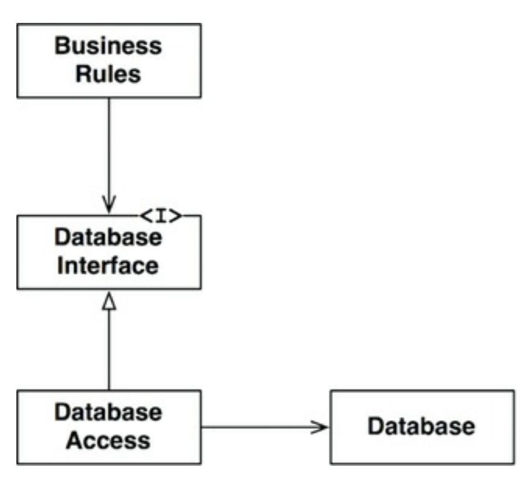
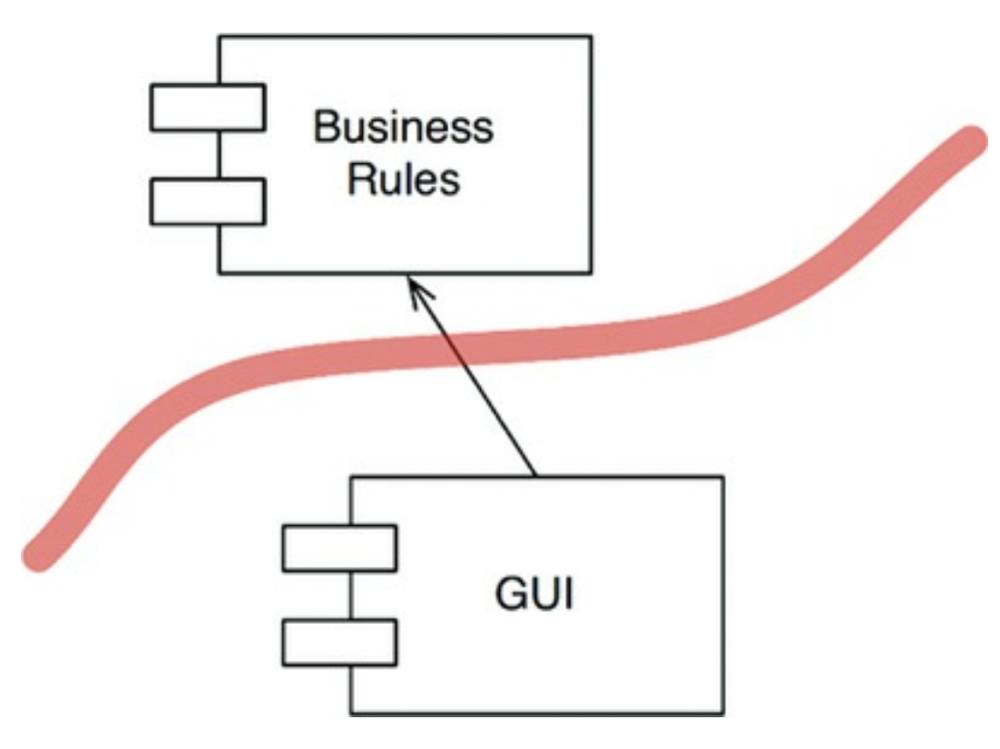
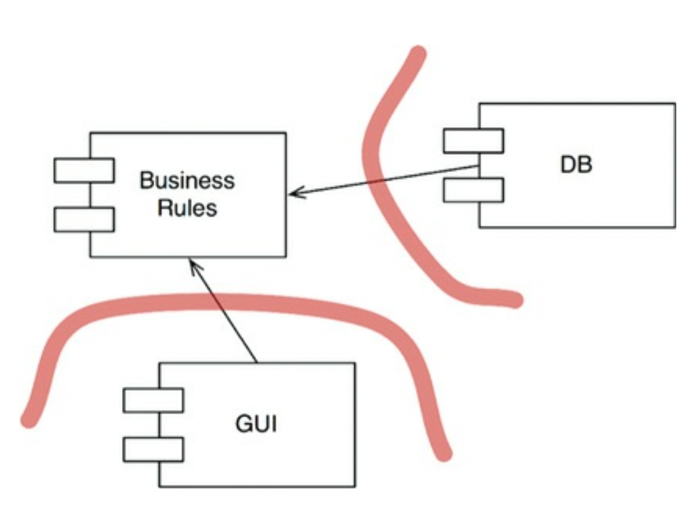

# 17장 경계 : 선 긋기

## 3색 볼펜 스터디
- 빨강 : 매우 중요하다 생각하는 부분
- 파랑 : 중요하다 생각하는 부분
- 초록 : 흥미로운 부분

## 개요
- (빨) 소프트웨어 아키텍처 => 선을 긋는 기술
- 이러한 선을 경계 라고 부른다.
- 경계 : 소프트웨어 요소를 서로 분리하고, 경계 한편에 있는 요소가 반대편에 있는 요소를 알지 못하도록 막는다
- (파) 초기에 그어지는 선들은 가능한 오랫동인 결정을 연기시키기위해 이들 결정이 핵심적인 업무 로직을 오염시키지 못하려는 목적으로 쓰인다
- (파) 아키텍트의 목표 => 필요한 시스템을 만들고 유지하는데 드는 인적 자원을 최소화 하는 것
- 인적자원의 효율을 떨어뜨리는 요인 => 결합
  - 특히 너무 일찍 내려진 결정에 따른 결합

## 어떻게 선을 그을까 ? 그리고 언제 그을까 ?
- 관련이 있는 것과 없는 것 사이에 선을 긋는다
- 데이터베이스는 업무 규칙이 간접적으로 사용할 수 있는 도구이다
- 업무 규칙은 스키마, 쿼리언어 또는 나머지 세부사항에 대해 어떤 것도 알아서는 안된다
- 업무 규칙이 알아야할 것 => 데이터를 가져오고 저장할 때 사용할 수 있는 함수 집합이 있다는 사실이 전부이다
- 이를 통해 데이터베이스를 인터페이스 뒤로 숨길 수 있다

- 경계선의 위치 => 상속 관계를 횡단하며 Database Interface 바로 아래에 그어진다
- 주목해야할 부분 : DatabaseAccess 의 화살표
  - DatabaseAccess 에서 바깥쪽으로 향하고 있다
- 즉 위 도표에서 DatabaseAccess 가 존재한다는 사실을 알고 있는 클래스는 없다
- 이러한 선의 방향이 중요하다

## 입력과 출력은 ?
- 입력과 출력은 중요하지 않다
- 이 원칙은 처음에는 이해하기 힘들다
- 시스템의 행위를 입출력이 지닌 행위적 측면에서 생각하는 경향이 있다
- 사용자 경험은 인터페이스에 의해 좌우되며, 인터페이스 뒤에는 인터페이스를 조작하는 모델이 있다 
- 더 중요한 사실은 모델은 인터페이스를 전혀 필요로 하지 않는다.
- 인터페이스는 모델에 있어 중요하지 않으며, 중요한 것은 업무 규칙이다

- GUI 도 마찬가지로 경계선에 의해 분할된다
- 경계와 화살표를 보았을때 GUI 는 얼마든지 다른 종류의 인터페이스로 교체될 수 있다

## 플러그인 아키텍처
- 데이터베이스, GUI 에 대해 내린 두 결정을 하나로 합쳐 보면 컴포넌트 추가와 관련된 일종의 패턴이 만들어진다
- 이는 시스템에서 서드파티 플러그인을 사용할 수 있겧나 바로 그 패턴과 동일하다

- 이 설계에서 사용자 인터페이스는 플러그인으로 고려되었기에 여러 종류의 인터페이스를 연결할 수 있고
- 데이터베이스에도 동일하게 적용이 가능하다

## 결론
- 소프트웨어 아키텍처에서 경계선을 그리려면 먼저 시스템을 컴포넌트 단위로 분할해야 한다
- 일부 컴포넌트는 핵심 업무 규칙에 해당함
- 나머지 컴포넌트는 플러그인으로, 핵심 업무와는 직접적인 관련이 없지만 필수 기능을 포함한다
- 그런 뒤 컴포넌트 사이의 화살표가 핵심업무를 향하도록 이를 배치하도록 한다
- 이는 의존성 역전 원칙과 안정된 추상화 원칙을 응용한 것이다
