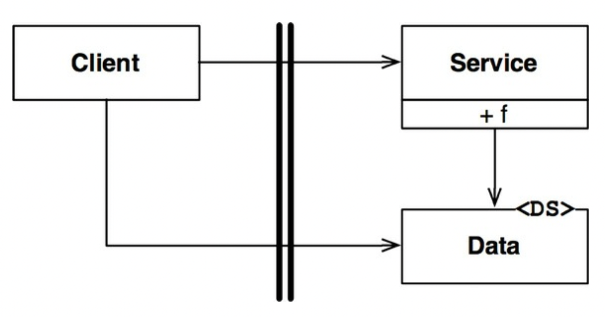
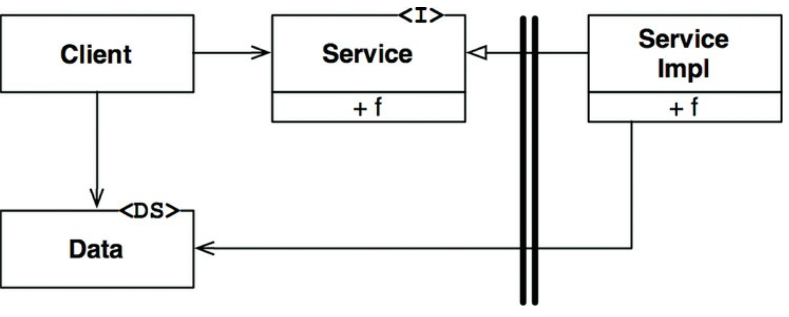

# 18장 경계 : 해부학

## 3색 볼펜 스터디
- 빨강 : 매우 중요하다 생각하는 부분
- 파랑 : 중요하다 생각하는 부분
- 초록 : 흥미로운 부분

## 경계 횡단하기
- 런타임에 경계를 횡단한다 => 경계 한쪽에 있는 기능에서 반대편 기능을 호출하여 데이터를 전달하는 일에 불과함
- 적절한 위치에서 경계를 횡단하게 하는 비결ㅇ느 소스코드 의존성 관리에 있다
  - 소스코드 모듈이 변경되면 의존하는 다른 모듈도 변경하거나 배포해야할 수 있다
- 경계는 이런 변경이 전파되는 것을 막는 방화벽

## 두려운 단일체
- 아키텍처 경계중 가장 단순하며 가장 흔한형태 => 물리적으로 엄격하게 구분되지 않는 형태
- 가장 단순한 형태의 경계 횡단 => 저수준 클라이언트 에서 고수준 서비스로 향하는 함수 호출
  - 런타임 의존성과 컴파일 타임 의존성은 모두 같은 방향, 저수준 => 고수준 으로 향하게 된다

- 제어흐름은 왼쪽 => 오른쪽으로 경계를 횡단한다
- 제어의 흐름은 경계를 횡단할때 저수준에서 고수준으로 향한다
- 고수준 클라이언트가 저수준 서비스를 호출해야 한다면 동적 다향성을 사용해 제어흐름과 반대방향으로 의존성을 역전시킬 수 있다
  - 이런 경우 런타임 의존성은 컴파일 의존성과 반대가 된다

- 제어흐름은 이전과 마찬가지로 왼쪽에서 오른쪽으로 경계를 횡단한다
- 하지만 주목할점은 경계를 횡단할 때 의존성이 모두 오른쪽에서 왼쪽으로. 고수준 컴포넌트를 향한다
- 데이터 구조의 정의가 호출하는 쪽에 위치한다는 점도 주목하자
- 정적 링크된 모노리틱 구조의 실행파일 이라도 규칙적인 방식으로 구조를 분리하면, 프로젝트 개발/테스트/배포에 큰 도움이 된다

## 배포형 컴포넌트
- 아키텍쳐 경계가 물리적으로 드러날수도 있는데 이중 가장 단순한 형태 => 동적 링크 라이브러리
  - .NET DLL, java Jar 등..
- 이 형태로 배포하면 따로 컴파일하지 않고 곧바로 사용 가능하다
- 대신 컴포넌트는 바이너리와 같이 배포가능한 형태로 전달된다
  - 이는 배포 수준 결합 분리모드에 해당한다
- 배포작업은 단순히 이들 배포 가능한 단위를 좀 더 편리한 형태로 묶는일에 지나지 않는다
- 배포 과정에서만 차이가 날 뿐 배포 수준 컴포넌트는 단일체와 동일하다

## 스레드
- 단일체와 배포형 컴포넌트 모두 스레드 활용이 가능하다
- 스레드는 아키텍쳐 경계도 아니며 배포 단위도 아니다
- 모든 스레드가 단 하나의 컴포넌트에 포함될수도, 많은 컴포넌트에 걸쳐 분산될 수도 있다

## 로컬 프로세스
- 강한 물리적 형태를 띄는 아키텍처 경계는 로컬 프로세스가 있다
- 이는 주로 명령행이나 그와 유사한 시스템 호출을 통해 생성된다
- 로컬 프로세슫르은 동일한 프로세서 또는 하나의 멀티코어 시스템에 속한 여러 프로서세들에서 실행되지만, 각각 독립된 주소 공간에서 실행된다
- 종종 공유 메모리 파티션을 사용하기도 하지만 일반적으로는 메모리 공유를 하지 않는다
- 일반적으로 소켓, 메일박스, 메세지 큐 등을 이용해 서로 통신한다
- 로컬 프로세스간 분리 전략은 단일체, 바이너리 컴포넌트의 경우와 동일하다
- 소스코드 의존성 방향이 단일체나 바이너리 컴포넌트와 동일한 방향으로 경계를 횡단한다
  - 항상 고수준 컴포넌트를 ㅎ야한다
- 로컬프로세스 경계를 지나는 통신은 제법 비싼 작업에 속하게 때문에 빈번한 통신이 이뤄지지 않도록 제한해야 한다

## 서비스
- 물리적인 형태를 띠는 강력한 경계는 서비스이다
- 프로세스로, 일반적으로 명령행 또는 그와 동등한 시스템 호출을 통해 구동된다
- 서비스는 물리적 위치에 구애받지 않으며, 서로 통신하는 두 서비스는 물리적으로 동일할수도, 아닐수도 있다
- 서비스들은 모든 통신이 네트워크를 통해 이뤄진다고 가정한다
- 때문에 서비스 경계를 지나는 통신은 함수호출에 비해 매우 느리다
- 가능하다면 빈번한 통신을 피해야 한다
- 이 수준의 통신에서는 지연에 따른 문제를 고수준에서 처리할 수 있어야 한다

## 결론
- 단일체를 제외한 대다수 시스템은 한 가지 이상의 경계 전략을 취한다
- 서비스 경계를 사용하는 시슽메이라면 로컬 프로세스 경계도 포함할 수 있다
- 실제로 서비스는 상호작용하는 일련의 로컬프로세스 퍼사드에 불과할 때가 많다
- 또한 개별 서비스 또는 로컬프로세스는 거의 언제나 소스코드 컴포넌트로 구성된 단일체이거나 동적으로 링크된 배포형 컴포넌트의 집합이다
- 대체로 한 시스템 안에서도 통신이 빈번한 로컬 경계와 지연을 중요하게 고려하는 경계가 혼합되어 있음을 의미한다

