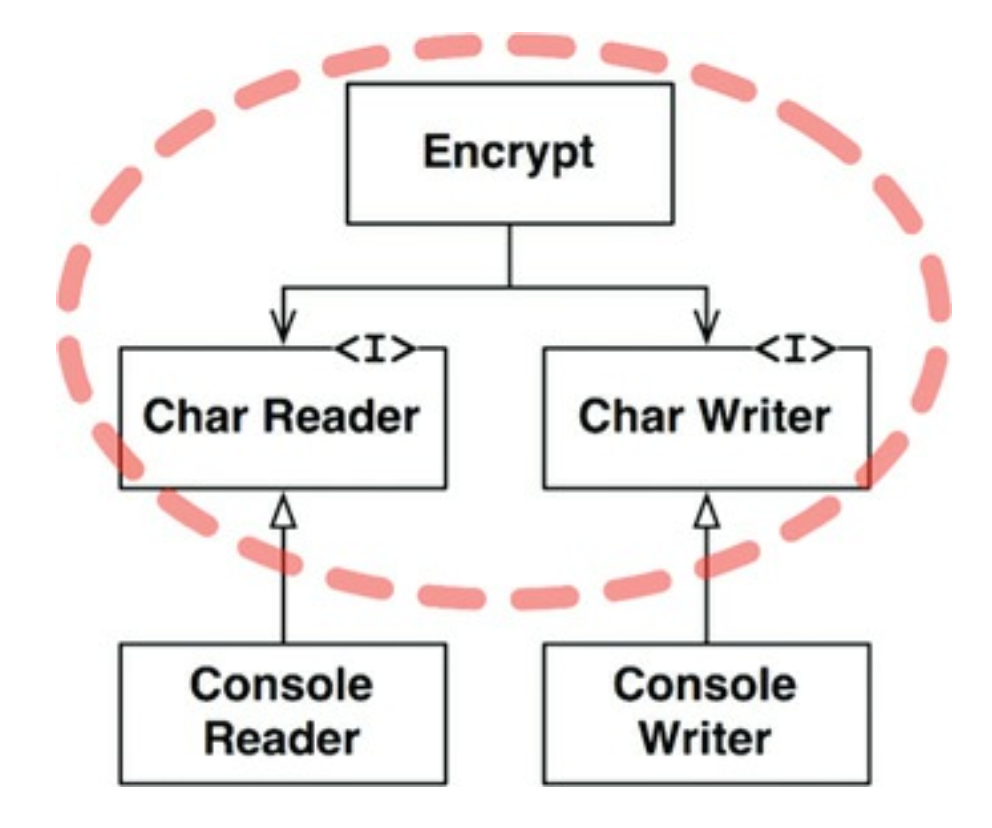

# 19장 정책과 수준

## 3색 볼펜 스터디
- 빨강 : 매우 중요하다 생각하는 부분
- 파랑 : 중요하다 생각하는 부분
- 초록 : 흥미로운 부분

## 개요
- 소프트웨어 시스템 => 정책을 기술한 것
- 컴퓨터프로그램 => 각 입력을 출력으로 변환한느 정책을 상세하게 기술한 설명서
- 소프트웨어 아키텍쳐를 개발하는 기술에는 이런 정책을 신중하게 분리하고, 정책이 변경되는 양상에 따라 정책을 재편성 하는 일도 포함
- 동일한 이유로 동일 시점에 변경되는 정책은 동일한 수준에 위치하며, 동일 컴포넌트에 속해야 한다
- 서로다른 이유로 다른 시점에 변경되는 정책은 다른 컴포넌트로 분리해야 한다
- 흔히 아키텍쳐 개발은 재편성된 컴포넌트 들을 비순환 방향 그래프로 구성하는 기술을 포함한다
- 좋은 아키텍쳐라면, 각 컴포넌트를 연결할 때 의존성의 방향이 컴포넌트의 수준을 기반으로 연결되도록 만들어야 한다
  - 저수준 => 고수준 의존하도록 설계

## 수준
- 수준 (level) 을 엄밀하게 정의하자면, 입력과 출력 까지의 거리 이다
- 시스템의 입력과 출력 모두로부터 멀리 위치할수록 정책의 수준은 높아진다
- 입/출력을 다루는 정책이라면 시스템에서 최하위 수준에 위치한다

- 이 클래스다이어그램에서 주목해야 할점은 Encrypt, CharWriter, CharReader 인터페이스를 둘러싼 점선으로 된 경계이다
- 이 경계를 횡단하는 의존성은 모두 경게 안쪽으로 항햔다
- 이 경계로 묶인 영역이 시스템에서 최고 수준의 구성요소이다
- 이 구조에서 고수준인 암호화 정책을, 저수준인 입/출력 정책으로 부터 분리시킨 방식에 주목해야 한다
- 이 덕에 암호화정책을 더 넓은 맥락에서 사용이 가능하다
- 단일책임 원칙, 공통 폐쇄 원칙에 따라 동일한 이유로 동일 시점에 변경되는 정책은 함께 묶인다

## 결론
- 이장의 정책에서는 단일책임 원칙, 개방 폐쇄 원칙, 공통 폐쇄 원칙, 의존성 역전 원칙, 안정된 의존성 원칙, 안정된 추상화 원칙 모두를 포함한다
