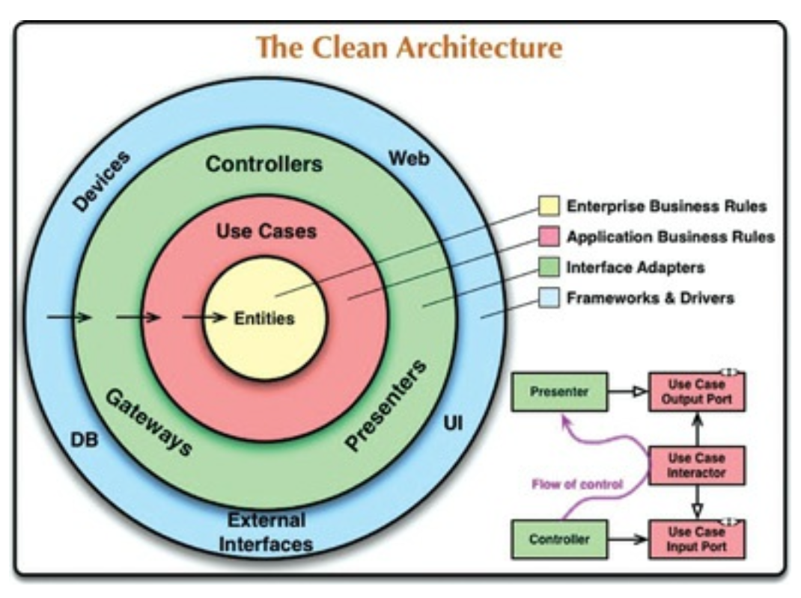
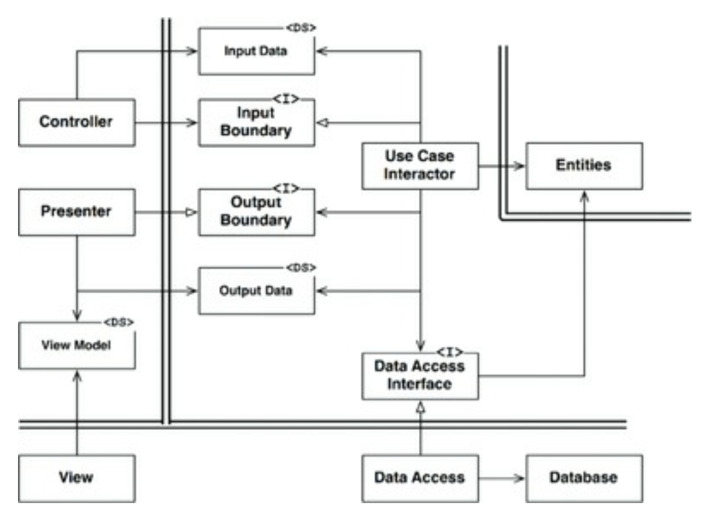

## 22장 클린 아키텍처

## 3색 볼펜 스터디
- 빨강 : 매우 중요하다 생각하는 부분
- 파랑 : 중요하다 생각하는 부분
- 초록 : 흥미로운 부분

## 개요
- 우리는 시스템 아키텍처와 관련된 여러 아이디어를 봐왔다
  - 육각형 아키텍처 : 포트와 어댑터로도 알려져 있다
  - DCI (Data, Context and Interaction) 
  - BCE (Boundary Control Entity)
- 이들은 세부적인 면에서는 차이가 있지만, 내용은 상당히 비슷한다
- 이들의 목표는 "관심사의 분리" 이다
- 소프트웨어를 계층으로 분리함으로써 관심사의 분리라는 목표를 달성할 수 있었다
- 각 아키텍처는 최소한 업무 규칙을 위한 계층 하나와, 사용자와 시스템 인터페이스를 위한 또 다른 계층 하나를 만드시 포함한다
- 이들 아키테겇는 모두 시스템이 다음 특징을 갖도록 한다
  - 프레임워크 독립성
  - 테스트 용이성
  - UI 독립성
  - 데이터베이스 독립성
  - 모든 외부 에이전시에 대한 독립성

## 의존성 규칙

- 위 그림에서 각 동심원은솦트웨어에서 다른 영역을 표현한다
- 안으로 들어갈수록 고수준의 소프트웨어가 된다
- 이런 아키텍처가 동작하도록 하는 가장 중요한 규칙 => 의존성 규칙

> 소스코드 의존성은 반드시 안쪽으로, 고수준의 정책을 향해야 한다

- 내부 원에 속한 요소는 외부의 원에 속한 어떤 것도 알지 못한다
- 내부 원에 속한 코드는 외부 원에 선언된 것 어떤 것에 대해서도 그 이름을 언급해서는 안된다
- 함수, 클래스, 변수, 소프트웨어 엔티티로 명명되는 모든 것이 포함된다
- 동일 이유로 외부 원에 선언된 데이터 형식도 내부의 원에서 절대 사용해서는 안된다

### 엔티티
- 엔티티 => 전사적인 핵심 업무 규칙을 캡슐화 한다
- 메소드를 가지는 객체이거나 일련의 데이터 구조와 함수의 집합일 수도 있다
- 기업의 다양한 애플리케이션에서 재사용 가능하다면 그 형태는중요하지 않다
- 운영 관점에서 특정 애플리케이션에 무언가 변경이필요하더라도 엔티티 계층에는 절대 영향을 주어서는 안된다

### 유스케이스
- 유스케이스 계층의 소프트웨어는 애플리케이션에 특화된 업무 규칙을 포함한다
- 또한 유스케이스 계층의 소프트웨어는 시스템의 모든 유스케이스를 캡슐화하고 구현한다
- 유스케이스는 엔티티로 들어오고 나가는 데이터 흐름을 조정하며, 엔티티가 자신의 핵심 업무 규칙을 사용해 유스케이스의 목적을 달성하도록 이끈다
- 이 계층에서 발생한 변경이 엔티티에 영향을 주어서는 안된다
- 데이터베이스, UI 또는 공통 프레임워크와 같은 외부 요소에서 발생한 변경이 이 계층에 영향을 주어서도 안된다
- 유스케이스 계층은 이런 관심사로부터 격리되어 있다
- 운영 관점에서 애플리케이션이 변경된다면 유스케이스가 영향을 받으며, 소프트웨어에도 영향을 줄 것이다

### 인터페이스 어댑터
- 인터페이스 어댑터 계층은 일련의 어댑터들로 구성된다
- 어댑터 -> 데이터를 유스케이스와 엔티티에게 가장 편리한 형식에서 데이터베이스나 웹 같은 외부 에이전시에게 가장 편리한 형식으로 변환한다
- 이는 GUI 의 MVC 아키텍처를 모두 포괄한다
  - presenter, view, controller 는 모두 인터페이스 어댑터 계층
- 여기 속한 어떤 코드도 데이터베이스에 대해 조금도 알아서는 안된다
- 또한 이 계층에는 데이터를 외부 서비스와 같은 외부적인 형식에서 유스케이스나 엔티티에서 사용되는 내부형식으로 변환하는 또 다른 어댑터가 필요하다

### 프레임워크와 드라이버
- 가장 바깥계층은 일반적으로 데이터베이스, 웹 프레임웤 ㅡ같은 도구들로 구성된다
- 이 계층에서는 안쪽 원과 통신하기 위한 접합 코드외에 특별히 더 작성할 코드가 없다
- 이는 모든 세부사항이 위치하는 곳이다
- 웹, 데이터베이스는 모두 세부사항이다

### 원은 네 개여야만 하나 ?
- 위 원들은 개념을 설명하기위한 예시일뿐 네 개보다 훨씬 더 많은 원이 필요할 수도 있닫
- 하지만 어떤 경우에도 의존성 규칙이 적용된다
- 소스코드 의존성은 항상 안쪽을 향한다
- 안쪽으로 이동할수록 추상화와 정책의 수준은 높아진다
- 가장 바깥쪽 원은 저수준의 구체적인 세부사항으로 구성된다
- 안으로 이동할수록 소프트웨어는 점점 추상화되고 더 높은 수준의 정책들을 캡슐화 한다
- 가장 안쪽 원은 범용적이며 높은 수준을 가진다

### 경계를 횡단하는 데이터는 어떤 모습인가 ?
- 경계를 가로지르는 데이터는 흔히 간단한 데이터 구조로 이루어져 있다
- 기본적인 구조체나 간단한 데이터 전송 객체 등 원하는 대로 고를 수 있다
- 함수 호출시 간단한 인자를 사용해 전달할 숟 ㅗ있다
- 중요한 점은 격리되어 있는 간단한 데이터 구조가 경계를 가로질러 전달된다는 사실이다
- 경계를 가로질러 데이터 전달시 데이터는 항상 내부의 원에서 사용하기 가장 편리한 형태를 가져야만 한다

## 전형적인 시나리오

## 결론
- 소프트웨어를 계층으로 분리하고 의존성 규칙을 준수한다면 본질적으로 테스트하기 쉬운 시스템을 만들게 될 것이며, 그에 따른 이점을 누릴 수 있다
- 데이터베이스나 웹 프레임워크와 같은 시스템의 외부 요소가 구식이 되더라도, 이들 요소는 야단스럽지 않게 교체할 수 있다