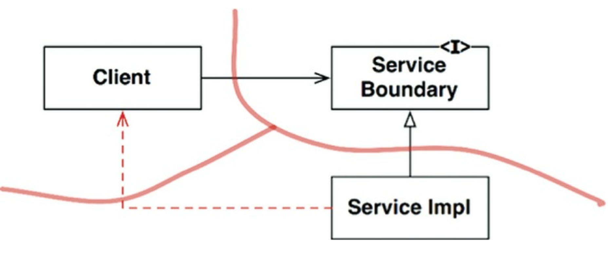
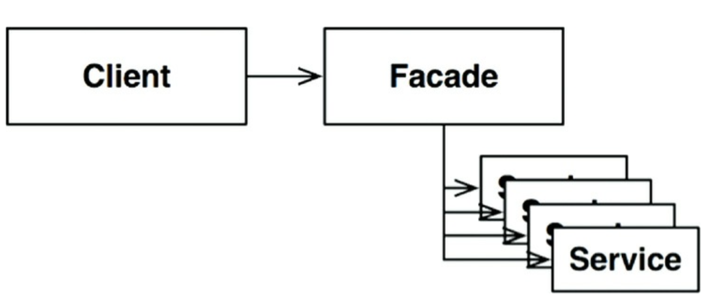

## 24장 부분적 경계

## 3색 볼펜 스터디
- 빨강 : 매우 중요하다 생각하는 부분
- 파랑 : 중요하다 생각하는 부분
- 초록 : 흥미로운 부분

## 마지막 단계를 건너뛰기
- 부분적 경계를 생성하는 방법 하나 => 독립적으로 컴파일하고 배포가능한 컴포넌트를 만들기 위한 작업을 모두 수행한 후 단일 컴포넌트에 그대로 모아두는것
- 이처럼 부분적 경계를 만들려면 완벽한 경계를 만들 때 만큼 코드와 사전 설계가 필요하다
  - 하지만 다수의 컴포넌트를 관리하지 않아도 된다
  - 추적을 위한 버전 번호도 없으며, 배포 관리 부담도 없다

## 일차원 경계
- 완벽한 형태의 아키텍쳐 경계는 양방향으로 격리된 상태를 유지해야하므로 쌍방향 Boundary 인터페이스를 사용한다
- 양방향으로 격리된 상태를 유지하려면 초기 설정할 때나 지속적으로 유지할 때도 비용이 많이 든다

- 이는 전통적인 전략 패턴을 사용한 전형적인 사례
- ServiceBoundary 인터페이스는 클라이언트가 사용하며 ServiceImpl 클래스가 구현한다
- 이 방식이 미래에 필요할 아키텍처 경계를 위한 무대를 마련한다는 점은 명백하다.
- Client 를 ServiceImpl 로 부터 격리시키는데 필요한 의존성 역전이 이미 적용되었기 때문이다

## 퍼사드
- 이보다 훨씬 더 단순한 경계는 **퍼사드** 패턴 
- 이 경우 심지어 의존성 역전까지도 희생한다
- 경계는 Facade 클래스로만 간단히 정의된다
- Facade 클래스에는 모든 서비스 클래스를 메서드 형태로 정의하고, 서비스 호출이 발생하면 해당 서비스 클래스로 호출을 전달한다
- 클라이언트는 이들 서비스 클래스에 직접 접근할 수 없다
- 하지만 Client 가 이 모든 서비스 클래스에 대해 추이 종속성을 가지게 된다
- 정적 언어 였다면 서비스 클래스중 하나에서 소스코드가 변경되면 클라이언트도 재컴파일 해야한다

## 결론
- 아키텍쳐 경계를 부분적으로 구현하는 간단한 방법 세 가지를 살펴봤다
- 이외에도 여러 방법이 있으며, 이런 접근법은 각각 나름의 비용과 장점을 가진다
- 각 접근법은 완벽한 형태의 경계를 담기 위한 공간으로써, 적절하게 사용할 수 있는 상황이 서로 다르다
