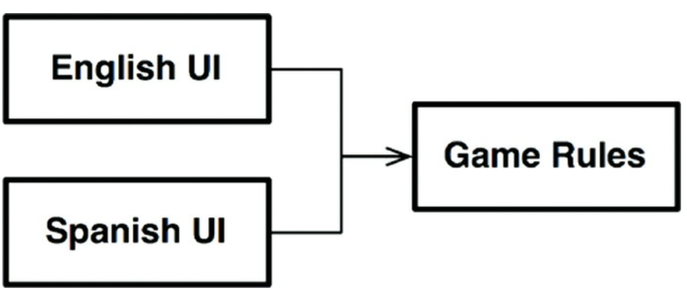
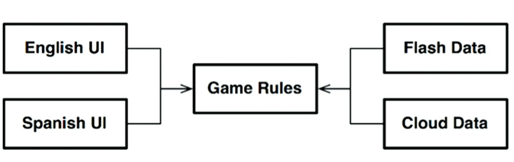
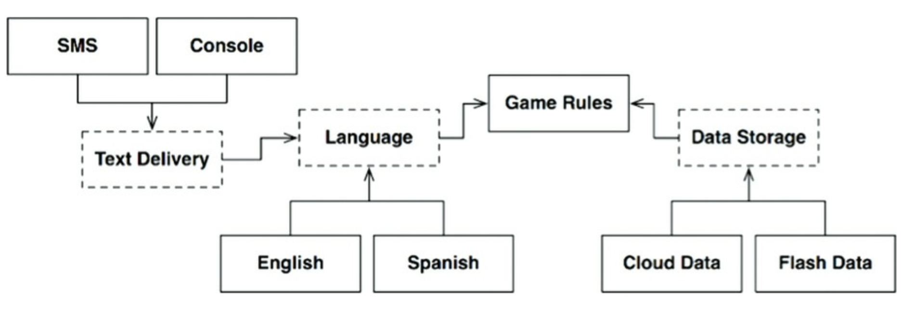
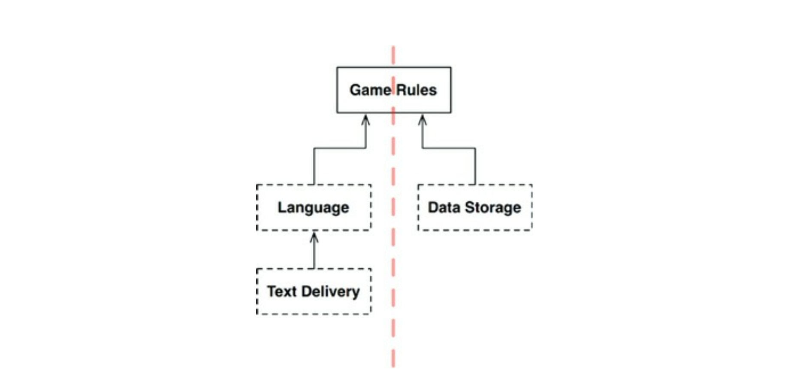
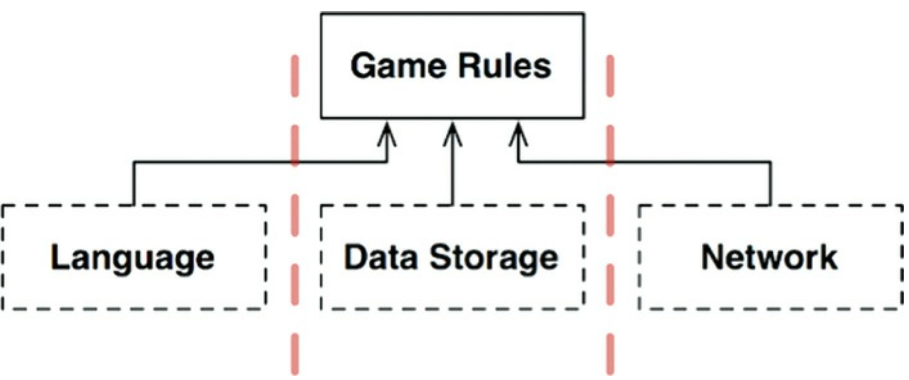
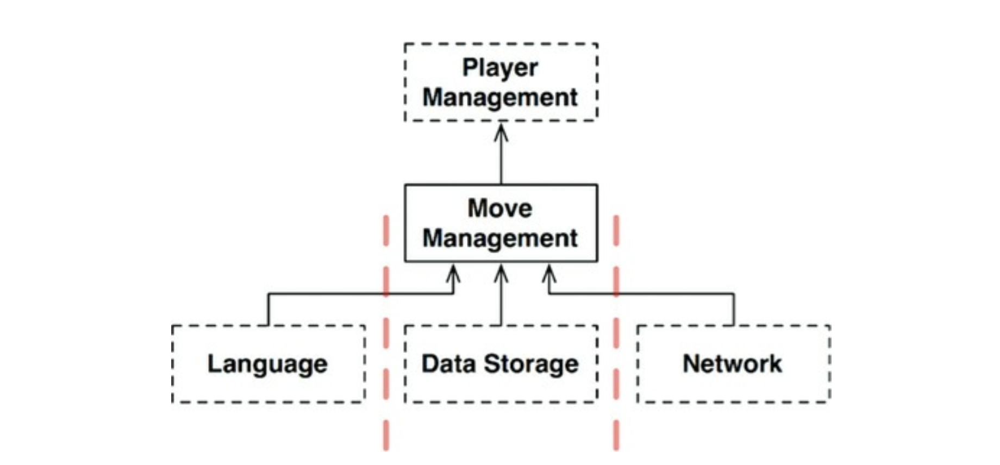

## 25장 계층과 경계

## 3색 볼펜 스터디
- 빨강 : 매우 중요하다 생각하는 부분
- 파랑 : 중요하다 생각하는 부분
- 초록 : 흥미로운 부분

## 개요
- 시스템이 세 가지 컴포넌트 (UI, 업무 규칙, 데이터베이스) 로만 구성된다고 생각하기 쉽다.
- 몇몇 단순한 시스템에서는 이정도로도 충분하지만 대다수의 시스템에서 컴포넌트 수는 이보다 훨씬 많다

## 움퍼스 사냥 게임
- 컴포터 게임 예제로 살펴보기
- **움퍼스 사냥** 이라는 텍스트 기반 모험 게임이 있다
- GO EAST, SHOOT WEST 와 같은 매우 단순한 명령을 사용하며, 컴퓨터는 플레이어가 보고, 냄새맡고, 듣고 경험할 것들로 응답한다
- 텍스트 기반 UI 는 그대로 유지하되, 게임 규칙과 UI 를 분리하여 여러 시장에서 다양한 언어로 발매할 수 있게 만든다고 가정하자
- 게임 규칙은 언어 독립적 API 를 이용해 UI 와 통신할 것이고 UI 는 사람이 이해가능한 언어로 변환할 것이다

- 위 처럼 소스 코드 의존성을 잘 분리하면 UI 가 어떤 언어를 사용하더라도 게임 규칙을 재사용할 수 있다
- 또한 게임 상태를 영속적인 저장소에 유지한다고 했을때 그것이 메모리 클라우드, RAM 일 수 있다
- 어떠한 경우라도 게임 규칙이 이런 세부사항을 알지 못해야 한다
- 우리는 게임 규칙이 다양한 종류의 데이터 저장소에 대해 알지 않기를 원한다.
- 다음 그림처럼 의존성 규칙을 준수할 수 있또록 의존성이 적절한 방향을 가리키게 만들어야 한다

## 클린 아키텍쳐 ?
- 이 예제대로라면 클린 아키텍쳐 접근법을 사용해 유스케이스, 경계, 엔티티, 그리고 관련 데이터 구조를 만드는것은 모두 쉬운일이다
- 하지만 정말 중요한 아키텍쳐 경계를 모두 발견할 것인가 ?
  - UI 에서 언의가 유일한 변경의 축이 아니다
  - 텍스트를 셸로, 또는 GUI 가 될 수도 있다
- 이 변경의 축에 의해 정의되는 아키텍쳐 경계가 잠재되어 잇을 수 있다
- 다음 다이어그램과 같이 개선해 볼 수 있다

- 위 다이어그램을 단순화 하면 다음과 같은 다이어그램이 완성된다

- 이는 모둔 화살표가 위를 향하도록 맞춰졌다는 점에 주목해야 한다
- GameRules 가 최상위에 놓이며, 이는 최상위 수준에 정책을 가지는 컴포넌트이므로 올바른 배치이다
- 이 구성은 데이터 흐름을 두개의 흐름으로 효과적으로 분리하게 된다
- 왼쪽은 사용자 통신에 관여하며, 오른쪽은 데이터 용속성에 관여하게 된다
- 두 흐름은 상단의 GameRules 에서 서로 만나며 GameRules 는 두 흐름이 모두 거치게 되는 데이터에 대한 최종적인 처리기가 되는 것이다

## 흐름 횡단하기
- 예제처럼 데이터흐름이 항상 두가지라고 생각해서는 안된다
- 움퍼스 사냥게임이 네트워크 상에서 여러 사람이 플레이 가능하게 되었다면 네트워크 컴포넌트를 추가해야 한다
- 또한 데이터흐름이 세 개의 흐름으로 분리될 것이다

## 흐름 분리하기
- 이쯤 되면 결국 모든 흐름이 최상단의 단일 컴포넌트에서 서로 만난다고 생각할 수 있지만, 현실은 이보다 복잡하다
- 게임 규칙 중 일부는 지도와 관련된 매커니즘을 처리한다. 이 규칙들은 동굴이 서로 어떻게 연결될지, 각 동굴에 어떤 물체가 위치할지 등을 알고 있다
- 플레이어가 이동하는 방법, 플레이어가 반드시 처리해야하는 방법도 알고 있다
- 이보다 더 높은 수준에는 또 다른 정책 집합이 존재한다
  - 플레이어의 생명력과 관련된 정책..
- 저수준 매커니즘과 관련된 정책에서 이런 고수준 정책에게 특정 사건이 발생했음을 알리고, 고수준 정책에서 플레이어의 상태를 관리하게 되며 게임 오버의 여부도 해당 정책에서 관리한다

## 결론
- 지금까지 살펴본것들이 의미하는 바는 무엇일까 ?
- 아키텍쳐 경계가 어디에나 존재한다는 사실을 인지해야 한다
- 아키텍트로서 우리는 아키텍쳐 경계가 언제 필요한지 신중하게 파악해내야 한다
- 이런 경계를 제대로 구현하기 위해서 비용이 많이 들 것이다
- (빨) 추상화가 필요하리라고 미리 예측해서는 안된다 
- 이것이 YAGNI 가 말하는 철학
- 오버 엔지니어링이 언더 엔지니어링보다 나쁠 때가 훨씬 많다