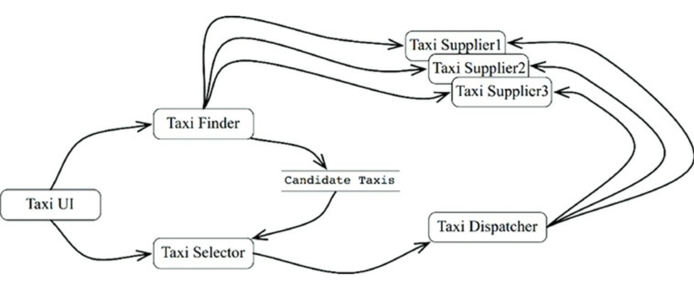
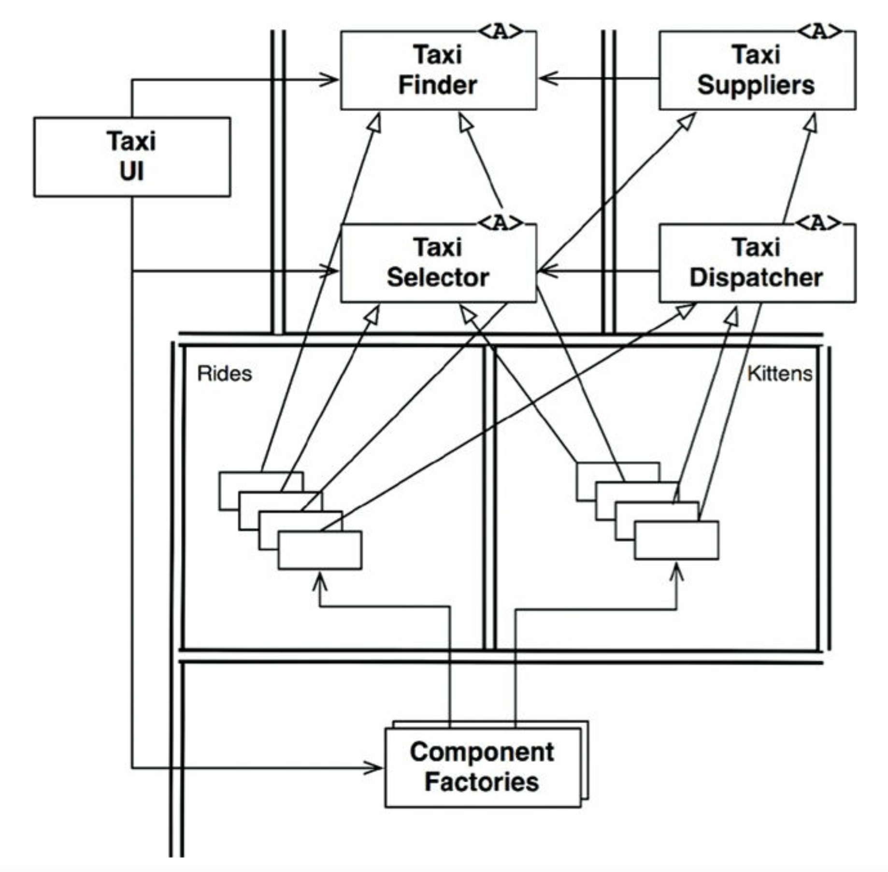
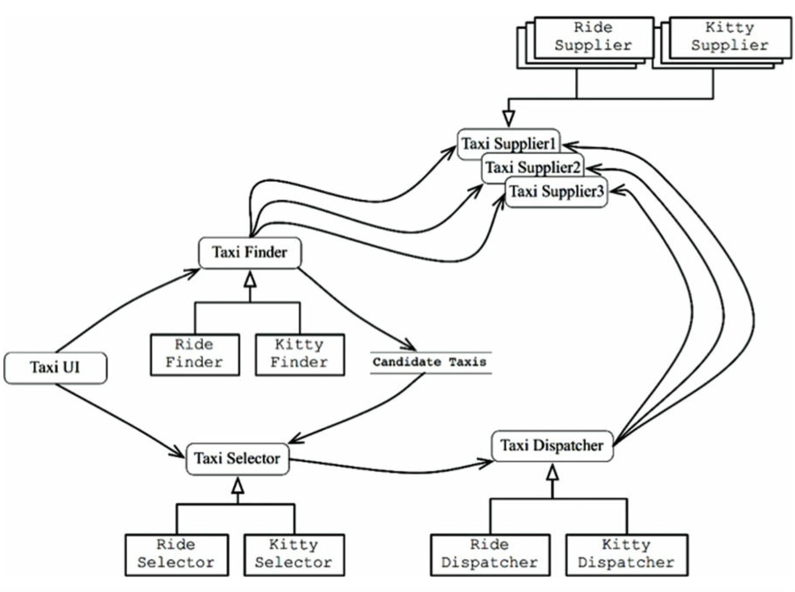

## 27장 크고 작은 모든 서비스들

## 3색 볼펜 스터디
- 빨강 : 매우 중요하다 생각하는 부분
- 파랑 : 중요하다 생각하는 부분
- 초록 : 흥미로운 부분

## 개요
- 서비스 지향 "아키텍쳐와" 마이크로서비스 "아키텍쳐" 가 인기를 끄는 이유는 다음과 같다
  - 서비스를 사용하면 상호 결합이 철저하게 분리하는것 처럼 보인다 (일부만 맞는 말)
  - 서비스를 사용하면 개발/배포 독립성을 지원하는 것처럼 보인다 (일부만 맞는 말)

## 서비스 아키텍쳐
- (빨) 시스템의 아키텍쳐는 의존성 규칙을 준수하며 고수준의 정책을 저수준의 세부사항으로 부터 분리하는 경계에 의해 정의된다
  - 단순히 애플리케이션의 행위를 분리한느 서비스라면 값비싼 함수 호출에 불과하다
  - 아키텍쳐 관점에서 중요하다고 볼 수는 없음
- 모든 서비스가 반드시 아키텍쳐 관점에서 중요해야만 하진 않지만 기능을 프로세스나 플랫폼 독립적으로 서비스를 생성하면 의존성 규칙 준수 여부와 관계없이 큰 도움이 될 때가 많다
  - 하지만 서비스 그 자체로 아키텍쳐를 정의하지 않음
  - 함수들의 구성 형태도 이와 비슷함
- (파) 결국 서비스는 프로세스나 플랫폼 경계를 가로지르는 함수 호출에 지나지 않는다

## 서비스의 이점

### 결합 분리의 오류
- (파) 시스템을 서비스들로 분리함으로써 얻는 이점 => 서비스 사이의 결합이 확실하게 분리 된다
  - 각 서비스는 서로 다른 프로세스에서 실행된다
  - 모든 서비스의 인터페이스는 반드시 잘 정의되어 있어야 한다
- 하지만 프로세서 내의 또는 네트워크 상의 공유 자원 때문에 결합될 가능성이 여전히 존재한다
- (초) 서로 공유하는 데이터에 의해 이들 서비스는 강력하게 결합되어 버린다
  - 서비스 사이를 오가는 데이터 레코드에 신규 필드가 추가된다면 이를 사용하는 모든 서비스가 반드시 변경되어야 한다

### 개발 및 배포 독립성의 오류
- 서비스를 사용함에 따른 이점 => 전담팀이 이를 소유하고 운영하게 된다
- 이러한 개발 및 배포 독립성은 확장 가능한 것으로 간주 된다
- 대규모 엔터프라이즈 시스템을 독립적으로 개발하고 배포 가능한 수십, 수백, 수천 개의 서비스들을 이용해 만들 수 있다고 믿는다 
- 시스템의 개발, 유지보수, 운영 또한 비슷한 수의 독립적인 팀 단위로 분할할 수 있다고 여긴다
- 어느정도 일리가 있지만 극히 일부이다
- 1. 대규모 엔터프라이즈 시스템은 서비스 기반 시슽메 외에도 모노리틱, 컴포넌트 기반 시스템으로고 구축이 가능하다
- 2. 결합 분리의 오류 에 따르면 서비스라 해서 항상 독립적인 개발 및 배포, 운영이 가능한 것은 아니다
  - 데이터나 행위에서 어느정도 결합되어 있다면 결합된 정도에 맞게 개발, 배포, 운영을 조정해야만 한다

## 야옹이 문제
- 택시 통합 시스템을 살펴보자
- 이 시스템은 해당 도시에서 운영되는 많은 택시 업체를 알고 있고, 고객은 승차 요청을 할 수 있다
  - 승차시간, 비용, 고급ㅌ ㅐㄱ시 여부 등 다양한 기준에 따라 택시 선택이 가능하다
- 확장 가능한 시스템을 구축하기 위해 수 많은 마이크로서비스 기반으로 구축하기로 결정했다
- 개발팀 직원을 많은 소규모 팀으로 세분화했고, 각 팀이 팀 규모에 맞게 적당한 수의 서비스를 개발하고 유지보수하며, 운영 책임을 지도록 했다
- 어느날 도시에 야옹이를 배달하는 서비스들 제공하게 되었다
- 사용자는 자신의 집/사무실로 야옹이 배달을 주문할 수 있다
- 도시 전역에 야옹이를 태울 다수의 승차 지점을 설정해야할 것이며, 배달 주문이 오면 근처 택시가 선택되고, 승차지점중 한 곳에서 야옹이를 태운 후 이를 배달해야 한다
- 이에 참여하는 택시업체도 있을 거이고, 거부하는 업체도 있을 것이다
- 운전자중 고양이 알러지가 있는 운전자는 제외되어야 한다, 일반 승객 역시 동일한 경우가 있을 수 있으며 야옹이 배달한지 3일이 지나지 않은 차량은 배차에서 제외되어야 한다
- 이 기능을 구현하려면, 모든 서비스가 변경되어야 한다
- 다시 말해 이 서비스들ㅇ느 모두 결합되어 있어 독립적으로 개발하고, 배포하거나 유지될 수 없다
- (파) 이것이 바로 횡단 관심사 가 가진 문제이다
- 모든 소프트웨어 시스템은 서비스 지향이든 아니는 이런 문제에 직면하기 마련이다

## 객체가 구출하다
- 컴포넌트 기반 아키텍쳐에서는 이 문제를 어찌 해결했을까 ? 
- SOLID 설계 원칙을 잘 삺보면 다형적으로 확장가능한 클래스 집합을 생성해 새로운 기능을 처리하도록 함을 알 수 있다

- 위 다이어 그램을 이 전략을 보여준다
- 기존 서비스의 로직중 대다수가 객체 모델 기반 클래스 내부로 녹아들었지만 배차에 특화된 로직은 Rides 컴포넌트로, 야옹이에 대한 기능은 Kittens 컴포넌트로 추출되었다
- 기존 컴포넌트들에 있는 추상 기반 클래스를 템플릿 메서드나 전략 패턴등을 이용해 오버라이드 한다
- 이 전략을 따르더라도 야옹이 기능을 구현하려면 TaxiUI 는 어쩔 수 없이 변경해야 하지만, 그외의 것들은 변경할 필요가 없다
- 따라서 야옹이 기능은 결합이 분리되며, 독립적으로 개발하여 배포할 수 있다

## 컴포넌트 기반 서비스
- 서비스에도 이렇게 할수 있을까 ? => 답은 "예"
- 서비스가 반드시 소규모 단일체여야 할 이유는 없다
- 서비스는 SOLID 원칙대로 설계할 수 있으며 컴포넌트 구조를 갖출 수도 있다
- 이를 통해 서비스 내의 기존 컴포넌트들을 변경하지 않고도 새로운 컴포넌트를 추가할 수 있다

## 횡단 관심사
- 지금까지 배운 점은 아키텍쳐 경게는 서비스 사이에 있지 않다는 사실이다
- 오히려 서비스를 관통하며, 서비스를 컴포넌트 단위로 분할한다
- 모든 주요 시스템이 직면하는 횡단 관심사를 처리하려면, 서비스 내부는 의존성 규축도 준수하는 컴포넌트 아키텍쳐로 설계해야 한다
- 이 서비스 들은 시스템 아키텍쳐 경계를 정의하지 않으며 이를 정의 하는 것은 서비스 내에 위치한 컴포넌트 이다

## 규칙
- 서비스는 시스템 확장성과 개발 가능성 측면에서 유용하지만, 그 자체로는 아키텍쳐적으로 그리 중요한 요소는 아니다
- 시스템의 아키텍쳐는 시슽메 내부에 그어진 경계와 경계를 넘나드는 의존성에 의해 정의된다
- 시스템의 구성 요소가 통신하고 실행되는 물리적인 매커니즘에 의해 아키텍쳐가 정의된느 것이 아니다
- 서비스는 단 하나의 아키텍쳐 경계로 둘러싸인 단일 컴포넌트로 만들 수 있다.
- 혹은 여러 아키텍쳐 경계로 분리된 다수의 컴포넌트로 구성할 수도 있으며 드물게 클라이언트 <-> 서비스간의 강 결합때문에 아키텍쳐적으로 아무런 의미가 없을 때도 있다
