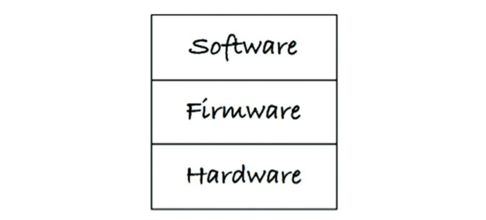
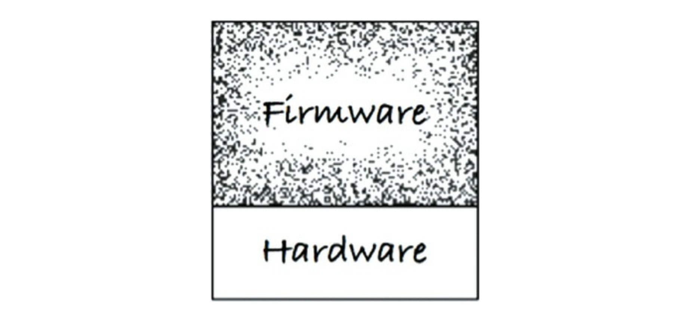
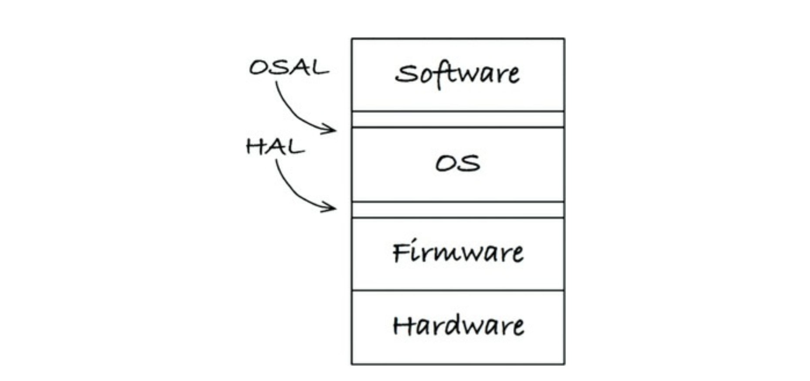

# 29장 클린 임베디드 아키텍쳐

## 3색 볼펜 스터디
- 빨강 : 매우 중요하다 생각하는 부분
- 파랑 : 중요하다 생각하는 부분
- 초록 : 흥미로운 부분

## 앱-티튜드 테스트
- 왜 잠재적인 임베디드 소프트웨어는 많이 펌웨어로 변하는가 ? 
  - 임베디드 코드가 동작하는데 대부분 노력을 집중하고, 오랫도안 유용하게 남도록 구조화하는데는 크게 신경쓰지 않기 때문이다
- 켄트백은 소프트웨어를 구축하는 세 가지 활동을 다음과 같이 기술했다
  - 먼저 동작하게 만들어라
  - 그리고 올바르게 만들어라
  - 그리고 빠르게 만들어라
- 이런 문제는 임베디드가 아닌 대다수의 앱들도 코드를 올바르게 작성하여 유효 수명을 길게 늘리는데는 거의 관심 없이, 그저 동작하도록 만들어진다
- 앱이 동작하도록 만드는 것 => 개발자용 앱-티튜드 테스트 라고 한다
- 개발자가 오직 앱을 동작하도록 만드는 일에만 신경쓴다면 몹쓸 짓을 하는 것이다

## 타깃-하드웨어 병목현상
- 임베디드 개발자들은 임베디드가 아니라면 다루지 않아도 될 특수한 관심사를 많이 가지고 있다
  - 제한된 메모리 공간
  - 실시간성 제약과 처리 완료시간
  - 제한된 입출력
  - 특이한 사용자인터페이스
  - 여러 센서와 실제 세상과의 상호작용 등
- 거의 모든 경우에 소프트웨어, 펌웨어가 동시에 만들어 진다
- 심지어 하드웨어 자체에 결함이 있을 가능성이 높고 개발이 평소보다 훨씬 느리게 진척 된다
- 임베디드 코드가 클린 아키텍쳐 원칙과 실천법을 따르지 않고 작성된다면 대개의 경우 코드를 테스트할 수 있는 환경이 특정 타깃으로 국한된다
- 그리고 타깃-하드웨어 병목현상이 발생하여 진척이 느려질 것이다

### 클린 임베디드 아키텍쳐는 테스트하기 쉽다
- 몇 가지 아키텍쳐 원칙을 적용하여 타깃-하드웨어 병목현상을 줄이는 방뻐을 살펴보자

### 계층
- 계층에는 여러 계층이 있다
- 맨 하단에는 하드웨어가 있으며, 어떤 이유에서든 불가피하게 하드웨어를 변경해야 하는 시점이 찾아온다

- 최소 하드웨어가 정의된 이후라면 하드웨어가 나머지 시스템 사이의 분리는 주어진다

- 이 상태에서 앱-티튜드 테스트를 진행하면 대체로 문제가 발생한다
- 하드웨어 관련 정보가 코드 전체를 오염시키지 못하게 막을 방법이 없다
- 모듈의 위치까지 신중하게 처리하지 않는다면 완성된 코드는 변경하기 매우 어렵게 된다
- 하드웨어 변경뿐 아닌 사용자 변경 요청 또는 버그 픽스 시에도 마찬가지 이다
- 소프트웨어와 펌웨어가 섞이는 것은 안티패턴 이다
  - 안티패턴을 보이는 코드는 변화에 저항한다
- 가벼운 변경에도 시스템 전체를 대상으로 회귀 테스트를 전부 실행해야 한다

#### 하드웨어는 세부 사항이다

- 소프트웨어와 펌웨어 사이 경계는 코드와 하드웨어 경계와 달리 잘 정의하기 ㅣㅁ들다
- 개발자가 할 일은 이 경계를 분명하게 만드는 것이다
- 소프트웨어와 펌웨어 사이의 경계는 하드웨어 추상화 계층 (HAL) 이라고 부른다
- HAL 은 자신보다 위에 있는 소프트웨어를 위해 존재하므로 HAL 의 API 는 소프트웨어의 필요에 맞게 만들어져야 한다

#### HAL 사용자에게 하드웨어 세부사항을 드러내자 말라
- 클린 임베디드 아키텍쳐로 설계된 소프트웨어는 타깃 하드웨어가 관계없이 테스트가 가능하다
- HAL 을 제대로 만들었다면 HAL 은 타깃에 상관없이 테스트할 수 있는 경계층 또는 일련의 대체 지점을 제공한다

#### 운영체제는 세부사항이다
- HAL 은 필수적이다. HAL 만으로 충분한가 ? 
- 베어메탈 임베디드 시스템이라면 코드가 운영환경에 종속되지 않도록 하는데 HAL 만으로도 충분하다
- 하지만 실시간 운영체제를 사용하거나, 리눅스/윈도루 라면 ?
- 작성한 코드의 수명을 늘리려면 무조건 운영체제를 세부사항으로 취급하고 운영체제에 의존하는 일을 막아야 한다

- 클린 임베디드 아키텍쳐는 운영체제 추상화 계층 (OSAL) 을 통해 소프트웨어를 운영체제로부터 격리시킨다
- OSAL 구현은 함수 이름을 바꿔주는 정도로 단순 할 수도 있다. 또는 여러 함수를 하나로 묶어야 할 수도 있다
- OSAL 은 테스트 지점을 만드는데 도움이 되며, 그덕에 OS 관계없이 테스트할 수 있게 된다
- 제대로 만든 OSAL 은 타깃과 별개로 테스트할 수 있또록 해주는 경계층 또는 일련의 대체 지점을 제공한다

#### 인터페이스를 통하고 대체 가능성을 높이는 방향으로 프로그래밍 하라
- HAL, OSAL 추가 뿐 아니라 모든 주요 계층 내부에는 이 책에서 설명한 원칙들을 적용할 수 있다
- 이들의 원칙은 관심사를 분리시키고, 인터페이스를 활용하며, 대체 가능성을 높이는 방향으로 프로그램이 하도록 유도 한다
- 계층형 아키텍쳐는 인터페이스를 통해 프로그래밍 하자는 발상을 기반으로 한다
- 모듈들이 서로 인터페이스를 통해 상호작용한다면 특정 서비스 제공자를 다른 제공자로 대체할 수 있다

## 결론
- 임베디드 개발자들은 임베디드 바깥의 경험에서 많은 것들을 배울 수 있다
- 클린 임베디드 아키텍쳐는 제품이 장기간 유지하는데 도움을 준다