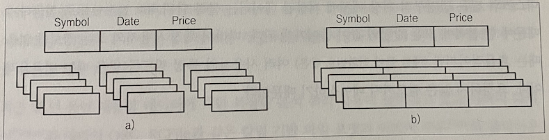
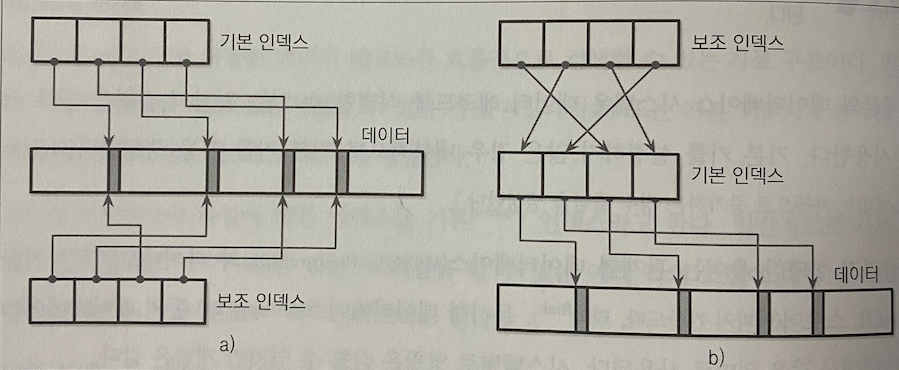

# 지옥 스터디 - 01 소개 및 개요
- 데이터베이스 관리 시스템의 용도는 다양함.
  - 핫 데이터를 저장
  - 장기 보관용 콜드 데이터 저장
  - 복잡한 쿼리 분석을 지원
  - 키 액세스 스토어
  - 시계열 데이터베이스

## DBMS 구조

표준화된 DBMS 구조란 존재하지 않는다. <br/> 
모든 DBMS 구조는 다르고 내부 컴포넌트의 경계를 명확히 나누고 정의하기 어렵다. <br/>
DBMS 는 클라이언트 / 서버 모델을 기반으로 한다. <br/>
데이터베이스 인스턴스 와 애플리케이션 인스턴스는 각각 서버와 클라이언트 역할을 한다.

`클라이언트 요청`


클라이언트의 요청은 **트랜스포트 (transport)** 서브시스템을 통해 전달된다. <br/>
요청은 쿼리 형태이며 주로 특정 쿼리 언어로 표현된다. <br/>
트랜스포트 서브시스템은 데이터베이스 클러스터 노드 사이의 통신에도 사용된다. <br/>
<br/>

`트랜스포터 시스템의 동작 과정`
1. 트랜스포트 서브 시스템은 쿼리를 쿼리 프로세서에 전달
2. 쿼리 프로세서는 쿼리를 해석, 분석 및 검증
3. 쿼리의 의미를 파악한 후에 액세스 제어를 진행 (가능)
4. 분석된 쿼리는 쿼리 옵티마이저에 전달
5. 쿼리에서 논리적으로 불가능한 부분/중복을 제거한 후 내부 데이터 통계와 데이터 위치를 기반으로 가장 효율적인 플랜을 생성

쿼리는 일반적으로 **실행 계획** 형태로 표현한다.
- 실행 계획은 쿼리가 요구하는 결과를 도출하는 데 수행해야 하는 일련의 작업이다.
- 동일한 쿼리여도 다른 실행계획이 존재할 수 있으며 이중 가장 효율적인 실행계획을 옵티마이저가 선택한다.

선택된 실행 계획은 로컬 및 원격 실행의 결과를 결합하는 **실행 (execution)** 엔진을 실행한다.
- 원격 실행은 클러스터 내 여러 노드 사이의 데이터 읽기, 쓰기 및 복제 를 포함한다.

로컬 쿼리는 스토리지 엔진이 실행한다. 스토리지 엔진은 다음과 같이 여러 컴포넌트로 구성된다.
- **트랜잭션 매니저 (transaction manager)** : 트랜잭션을 스케쥴링하고 데이터베이스 상태의 논리적 일관성을 보장한다.
- **잠금 매니저 (lock manager)** : 트랜잭션에서 접근하는 데이터베이스 객체에 대한 잠금을 제어한다. 동시 수행 작업이 물리적 데이터 무결성을 침해하지 않도록 제어한다.
- **액세스 메소드 (access method)** : 디스크에 저장된 데이터에 대한 접근 및 저장 방식을 정의한다. 힙 파일과 B - 트리 또는 LSM 트리 등의 자료구조를 사용한다.
- **버퍼 매니저 (buffer manager)** : 데이터 페이지를 메모리에 캐시한다.
- **복구 매니저 (recovery manager)** : 로그를 유지 관리하고 장애 발생 시 시스템을 복구한다.

> 트랜잭션 매니저와 잠금 매니저는 동시성을 제어하며 논리적 및 물리적 데이터 무결성을 보장하고 동시 수행 작업의 효율적인 수행을 담당한다.

## 인메모리 DBMS 대 디스크 기반 DBMS

DBMS 는 데이터를 **메모리** 와 **디스크** 에 저장한다. <br/>
- 인메모리 DBMS 는 메모리에 데이터를 저장하고 디스크는 복구/로그 저장용도로 사용한다.
- 디스크기반 DBMS 는 대부분의 데이터를 디스크에 저장하고 메모리는 캐시 또는 임시 저장 용도로 사용한다.
두 형식 모두 디스크를 사용하지만 인메모리는 대부분 데이터를 RAM 에 저장한다는 차이가 있다.

인메모리 DBMS 는 디스크 기반 DBMS 와 비교했을때 기본 저장 매체 뿐 아니라 내부 자료구조와 설계 및 최적화 방식도 모두 다르다. <br>
메모리를 주 저장매체로 사용하는 이뉴는 성능과 상대적으로 낮은 데이터 접근 비용 그리고 접근 단위의 세밀함 때문이다. <br/>
OS 의 메모리 관리 추상화를 통해 임의의 메모리 청크를 할당하고 해제하는 작업 정도로 메모리를 간단하게 제어할 수 있다. <br/>
인메모리 DBMS 의 가장 큰 단점은 RAM 의 휘발성과 높은 가격이다. 

## 인메모리 DBMS 의 지속성

인메모리 DBMS 는 데이터의 지속성을 보장하고 데이터 손실을 방지하기 위해 데이터를 디스크에 백업한다.
- 지속성을 보장하지 않고 모든 데이터를 메모리에 저장하는 DBMS 도 있다.
모든 작업은 로그 파일에 작업 내용을 순차적으로 기록해야 완료된다. <br/>
인메모리 시스템에서는 시스템 시작과 복구 시 모든 로그를 재수행하지 않기 위해 **백업본** 을 유지한다.
- 백업본은 디스크 기반 자료구조에 순서대로 저장하는데, 일반적으로 수정 내용은 비동기적으로 갱신하며 I/O 작업을 최소화하기 위해 배치 단위로 백업한다.
- 데이터 복구시 백업본과 로그를 기반으로 데이터를 재구성한다.

로그 레코드는 일반적으로 **배치 단위** 로 백업한다. <br/>
배치작업 완료시 백업본은 특정 시점의 데이터베이스의 스냅숏 이기 때문에 이 시점 이전의 로그는 삭제해도 되는데 이러한 작업을 가리켜 **체크 포인트 (checkpoint)** 를 남긴다고 표현한다.

> 인 메모리 DBMS 는 큰 페이지 캐시를 사용하는 디스크 기반 DBMS 와 같아 보일 수 있으나 디스크기반 DBMS 는 오버헤드가 있기에 인메모리 DBMS 성능을 능가할 수 없다.

디스크 기반 DBMS 는 디스크 접근에 특화된 특수한 자료구조를 사용한다. <br/>
디스크 기반 자료구조는 넓고 낮은 트리인 반면 인메모리 자료 구조는 다양한 형태가 존재한다. <br/>
디스크에서는 가변 크기 의 데이터 제어가 복잡하지만 메모리에서는 포인터를 사용해 쉽게 제어할 수 있다.

> 일반적으로 데이터 전체를 메모리에 저장가능하다고 가정해도 된다. 기업 고객정보, 온라인 쇼핑몰 재고 현황등의 데이터는 보통 수 KB 내외이며 레코드도 한정적이다.

## 칼럼형 DBMS 대 로우형 DBMS

대부분의 데이터베이스는 열과 행으로 구성된 테이블에 데이터 레코드를 저장한다. <br/>
필드는 행과 열의 교차점이며 특정 자료형의 단일 값이다. <br/>
사용자 정보 테이블의 모든 사용자 이름은 같은 형식으로 같은 칼럼에 저장하며, 논리적으로 같은 레코드에 속하는 값의 집합을 로우 라고 부른다.

데이터를 디스크에 저장하는 방식에 따라 데이터베이스를 분류할 수 있다. <br/>
- 칼럼 저장 방식 : 테이블을 **수직 분할**
- 로우 저장 방식 : 테이블을 **수평 분할**



> MySQL PostgresSQL 등 대부분의 전통적인 RDBMS 는 로우형 DBMS 이다.

### 로우형 데이터 레이아웃

로우형 DBMS 는 데이터 레코드를 로우 형식으로 저장한다. (표와 비슷한 형태)

| ID | Name | Birth Date | Phone Number |
| --- | --- | --- | --- |
| 10 | John | 01 Aug 1981 | +1 111 222 333 |
| 20 | Sam | 14 Sep 1988 | +1 555 888 999 |
| 30 | Keith | 07 Jan 1984 | +1 333 444 555 |

이 방식은 여러 필드의 값을 **고유 식별키** 로 구분할 수 있는 레코드 형식에 적합하다. <br/>
로우형 DBMS 는 한 개의 로우씩 접근하는 경우에 적합하다. <br/>
로우 단위로 저장하면 공간 지역성을 극대화할 수 있기 때문이다.

디스크와 같은 반영구적 저장 매체에 저장된 데이터는 **블록 단위 (최소 접근 단위)** 로 접근하기 때문에 한 블록에 모든 칼럼 값이 들어간다. <br/>
때문에 특정 사용자의 모든 정보를 읽는 경우에는 효율적이지만, 여러 사용자의 특정 필드를 읽는 경우에는 비효율 적이다.

### 칼럼형 데이터 레이아웃

칼럼형 DBMS 는 데이터를 로우 단위가 아니라 수직 분할 해 저정한다. <br/>
로우를 연속해 저장하는 방식과 달리 같은 칼럼끼리 디스크에 연속해 저장하는 방식이다. <br/>
주식 정보는 주식 시세만 따로 모아서 저장하는 것이 효율적이므로 좋은 예이다. <br/>
각 컬럼별로 다른 파일 또는 세그먼트에 저장하면 효율적인 데이터 컬럼 단위로 읽을 수 있다.

칼럼형 DBMS 는 데이터의 추세와 평균 등을 계산하는 **집계 분석 작업** 에 적합하다.
- 집계 작업에서는 여러 필드중 중요도가 높은 필드별로 읽는 경우가 많다.

칼럼형 DBMS 는 칼럼별로 모아 완전히 다른 방식으로 저장한다.

```text
Symbol: 1:DOW; 2:DOW; 3:S&P; 4:S&P
Date: 1:08 Aug 2018; 2:09 Aug 2018; 3:08 Aug 2018; 4:09 Aug 2018
Price: 1:24,314.65; 2:24,316.16; 3:2,414.45; 4:2,232.32
```

조인과 필터링, 다중 로우 집계등을 위해 튜플을 재 구성하려면 칼럼 사이의 관계를 정의하는 메타데이터가 필요하다. <br/>
- 때문에 각 값마다 중보 저장된 키로 인한 데이터가 증가한다.
- 일부 칼럼형 DBMS 는 가상 식별자를 정의하고 값의 위치 (오프셋) 를 기반으로 튜플을 재 구성한다.

### 차이점과 최적화 기법

로우형과 칼럼형의 차이점을 데이터를 저장하는 방식만으로 설명하기에는 부족한 부분이 많다. <br/>
데이터 레이아웃은 칼럼형 DBMS 에서 목표중인 여러 최적화 단계중 일부일 뿐이다. <br/>
같은 칼럼의 여러 값을 한 번에 읽으면 캐시 활용도와 처리 효율성이 높아 진다.
- CPU 벡터 연산을 통해 한 번의 CPU 명령으로 여러 데이터를 처리할 수 있다.

자료형 별로 저장하면 압축률도 증가한다. <br/>
다양한 압축 알고리즘 중 해당 자료형에 갖아 효과적인 기법을 선택할 수도 있다.

칼럼형과 로우형 중 어떤 것을 사용할지 선택하려면 먼저 액세스 패턴을 파악해야 한다. <br/>
레코드 단위 접근 및 일반쿼리/범위스캔 요청이 많다면 로우형을, 여러 로우를 스캔하거나 일부 컬럼에 대한 집계 작업이 많다면 칼럼형 이 더 적합하다.

### 와이드 칼럼 스토어

빅 테이블과 HBase 같은 와이드 칼럼 스토어는 일반적인 칼럼형 DBMS 와 구분해야 한다. <br/>
와이드 칼럼 스토어는 데이터를 다차원 맵으로 표현하고 여러 칼럼을 **칼럼 패밀리** 단위로 저장한다. <br/>
- 칼럼 패밀리의 데이터는 로우 형식으로 저장하며 이는 키 단위 액세스 패턴에 적합하다.
와이드 칼럼 스토어의 논리적 구조는 이해하기 쉽지만 실제 저장 방식은 복잡하다.


## 데이터 파일과 인덱스 파일

데이터베이스 시스템의 주 목적은 데이터를 저장하고 빠르게 데이터를 검색하는 것이다. <br/>
데이터베이스 시스템은 데이터를 파일에 저장한다. 하지만 디렉터리와 파일 구조 기반의 파일 시스템 대신 구현 방식에 맞는 특수한 포맷을 사용한다. <br/>
일반 파일을 사용하지 않는 이유는 다음과 같다.
- 저장 효율성
  - 데이터 레코드의 저장 오버헤드를 최소화하는 방식으로 파일을 구성할 수 있다.
- 접근 효율성
  - 최소한의 단계로 원하는 레코드를 찾을 수 있다.
- 갱신 효율성
  - 디스크 쓰기를 최소화 하는 방식으로 레코드를 갱신할 수 있다.

데이터베이스 시스템은 여러 필드로 구성된 레코드를 테이블 형식으로 저장하며, 일반적으로 각 테이블을 별도의 파일에 저장한다. <br/>
각 레코드의 위치를 알아내는데 인덱스를 사용한다. <br/>
인덱스는 요청마다 테이블 전체를 읽지 않고 데이터를 효율적으로 검색할 수 있는 자료구조 이다. <br/>
인덱스는 전체 필드 중 레코드를 식별할 수 있는 필드들의 부분집합을 사용해 구축된다.

일반적으로 데이터 파일과 인덱스 파일을 분리해서 관리한다. <br/>
인덱스 파일은 데이터 팡리보다 크기가 작으며 파일은 한 개이상의 디스크 블록으로 이루어진 페이지로 구성된다. <br/>
페이지는 일련의 레코드 또는 슬롯 페이지의 집합이다.

새로운 레코드와 업데이트된 레코드는 키-값 쌍의 형식으로 저장하며 대부분의 최신 데이터베이스 시스템은 데이터 를 즉시 페이지에서 삭제하지 않는다. <br/>
대신 키와 타임스탬프 등 삭제 관련 메타데이터를 저장한 삭제 마커를 사용한다.

### 데이터 파일

데이터 파일은 인덱스 구조형 테이블, 힙 구조형 테이블, 해시 구조형 테이블을 기반으로 한다.

`힙 파일`

레코드를 특정 순서를 따르지 않고 대체로 삽입 순서대로 저장한다. <br/>
새로운 페이지가 추가되어도 파일을 재구성 하지 않아도 된다. <br/>
데이터 검색 시 데이터의 실제 위치를 가리키는 인덱스가 필요하다.

`해시 파일`

레코드를 각 키의 해시 값에 해당하는 버킷에 저장한다. <br/>
버킷 내 레코드는 삽입 순서대로 저장하거나 키 순서로 정렬하면 조회 속도를 향상시킬 수 있다.

`인덱스 구조형`

인덱스에 실제 데이터 레코드를 저장한다. <br/>
데이터는 키 순서로 정렬되기 때문에 IOT 의 범위 스캔은 실제 값을 순서대로 읽으며 비교한다.


### 인덱스 파일

인덱스는 디스크에 저장된 레코드를 효율적으로 검색할 수 있는 자료구조읻아. <br/>
인덱스 파일은 데이터 레코드를 식별할 수 있는 키 또는 기본키 를 데이터 파일에서 해당 레코드의 위치에 매핑한다.

프라이머리 파일에 대한 인덱스를 기본 (primary) 인덱스 라고 한다. <br/>
일반적으로 기본 인덱스는 기본 키 또는 기본 키 역할을 할 수 있는 여러 키의 조합에 대한 인덱스이며 다른 인덱스는 모두 보조 인덱스 라고 한다.

보조 인덱스는 데이터 레코드를 직접 가리키거나 해당 레코드의 기본 키를 저장한다. <br/>
데이터 레코드 포인터는 힙 파일 또는 IOT 의 오프셋 이다. <br/>
여러 보조인덱스가 같은 레코드를 가리킬 수 있으며, 하나의 레코드는 여러 다른 필드로 식별될 수 있고 다양한 인덱스를 사용해 검색할 수 있다. <br/>
기본 인덱스 파일은 키 별로 하나의 레코드만 가리킬 수 있지만 보조 인덱스는 키 별로 여러 레코드를 가리킬 수 있다.

실제 데이터 레코드의 정렬 순서와 검색 키의 정렬순서가 같은 인덱스를 **클러스터 인덱스** 라고 한다. <br/>
클러스터 인덱스의 데이커 레코드는 보통 같은 인덱스 파일 또는 클러스터형 파일에 정렬해 저장한다. <br/>
데이터가 다른파일에 저장되어 있고 인덱스 키를 기준으로 정렬되지 않은 인덱스는 비 클러스터형 인덱스라고 한다.

대부분의 데이터베이스 시스템은 데이터 레코드를 식별할 수 있는 컬럼의 집합을 내부키로 사용한다. <br/>
기본 키를 생성하지 않는다면 내부적으로 자동 생성한다.

### 기본 인덱스를 통한 간접 참조

데이터 레코드를 직접 참조하느냐 기본 키 인덱스를 통해 간접 참조하느냐 의견이 갈린다. <br/>
데이터를 직접 참조할 경우 디스크 탐색 오버헤드가 줄어들지만 레코드 갱신 또는 위치 변경시마다 포인터를 수정해야 한다는 오버헤드가 있다. <br/>
기본 인덱스를 통해 간접 참조하면 포인터 갱신비용은 줄지만 레코드 위치를 찾는 과정이 추가된다.

읽기 작업이 많은 워크로드에서는 인덱스 개수가 여러 개여도 고내찮지만, 쓰기 작업이 많다면 인덱스 개수가 많을수록 포인트 갱신이 문제가 될 수 있다. 
- 때문에 일부 시스템은 오프셋 대신 기본 키를 사용해 데이터를 간접 참조한다.
- MySQL InnoDB 는 기본 인덱스를 사용해 룩업을 두 번 수행한다.
- 보조 인덱스에서 키를 찾고 기본 인덱스에서 해당 레코드를 참조하는 형태이다.

`두 가지 방식의 차이점 `


- a) 데이터 파일에서 데이터를 직접 참조
- b) 보조 인덱스는 기본 인덱스를 통해 간접적으로 데이터를 참조

위 두가지 방식을 혼용하는 방식도 있다. <br/>
인덱스에 데이터 파일 오프셋과 기본키를 모두 저장하고 참조 시 오프셋이 유효한지 확인한 다음 위치가 변경되었다면 기본 키 인덱스를 통해 데이터를 찾고 새로운 오프셋으로 인덱스를 갱신하는 것이다.

## 버퍼링과 불변성, 순서화

데이터베이스 자료구조에는 세 가지 공통점이 있다. <br/>
버퍼링 사용, 불편 파일, 저장시 값의 순서를 유지 한다는 점이다. <br/>
자료 구조간의 차이점과 최적화 기법을 다음 세 가지 속성으로 설명할 수 있다.

1. 버퍼링
   - 데이터를 디스크에 쓰기 전에 일부를 메모리에 저장할지 여부를 정의한다.
   - 여기서 설명하는 버퍼링은 대체할 수 있지만 일부 스토리지 엔진에서 의도적으로 사용하는 버퍼링을 말한다.
   - B-Tree 노드에 인메모리 버퍼를 추가해 I/O 비용을 낮추는 방법이 있다.
   - 이외에도 다양하게 활용이 가능하다.
2. 가변셩
   - 파일의 일부를 읽고 갱신한 뒤에 똑같은 자리에 다시 쓸지에 대한 여부를 나타내는 속성이다.
   - 불변구조에서는 한 번 쓴 파일 내용은 고칠 수 없다. 파일 끝에 내용을 추가하는 추가 전용 구조이다.
   - 불변성은 다양한 방법으로 구현할 수 있다.
   - 한 가지 방식은 Copy-On-Write 방식이다.
   - 갱신된 버전의 레코드를 갖고 있는 수정된 페이지를 원래 위치가 아닌 해당 파일 내 새로운 위치에 저장한다.
3. 순서화
   - 디스크 페이지에 데이터 레코드를 키 순서로 저장할지에 대한 여부를 정의한다.
   - 정렬 순서상 인접한 키는 디스크의 연속된 세그먼트에 저장된다.
   - 순서화는 특정 데이터 레코드 검색뿐만 아니라 효율적인 범위 스캔에 매우 중요한 속성이다.
   - 반면 데이터를 임의의 순서로 저장하면 쓰기 시간 최적화가 가능하다.