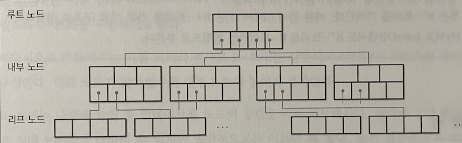
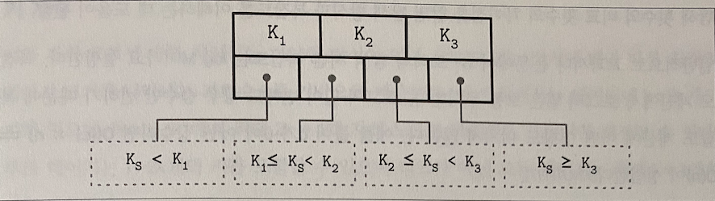

# 지옥 스터디 - 02 B-트리 개요

B-트리는 가장 많이 사용되는 자료 구조중 하나이다.  
대다수 오픈소스 데이터베이스에서 사용되고 있으며 수년 동안 다양한 사용 사례를 통해 검증된 자료구조이다.
B-트리 이전 이진 탐색트리/AVL 트리 등 일반적인 탐색 트리의 대안이 필요한 이유부터 살펴본다.

## 이진 탐색 트리

이진 탐색 트리는 정렬된 인메모리 자료구조 로, 키-값 쌍 검색에 사용된다.  
BST 는 키와 두 개의 자식 포인터가 저장된 여러 노드로 구성된다.  
탐색은 루트 노드에서 시작하며 단 한개의 루트 노드만이 존재할 수 있다.  
각 노드는 탐색 공간을 왼쪽/오른쪽 두 서브 트리로 분할한다.  
각 노드는 왼쪽 서브 트리의 모든 키 보다 크고, 오른쪽 모든 서브트리보다 작다. 

### 트리 밸런싱

노드 삽입 작업시 삽입하는 값에 따라 트리가 불균형해질 수 있다.

위 그림은 극단정인 경우이지만 트리의 균형이 왜 중요한지를 보여준다.  
균형 트리란, 노드의 개수가 N 일때 높이가 Log2N 이고 두 서브트리의 높이 차이가 최대 1인 트리이다.  
불균형 트리는 이진 탐색트리의 성능을 극대화할 수 없다.   
트리의 균형을 유지하는 방법은 노드를 추가하거나 삭제한 후 트리를 회전하는 것이다. (가운데 노드를 중심으로 회전한다.)

### 디스크 기반 스토리지용 트리

불균형 트리의 최악의 시간 복잡도는 O(N) 이다.  
반면 균형 트리의 평균 시간복잡도는 O(Log2N) 이다.  
트리의 팬아웃 (노드가 가질 수 있는 최대 자식 노드의 개수) 가 낮기 때문에 트리 밸런싱과 노드 재배치, 포인터 갱신이 자주 발생하기 때문에 디스크기반 자료구조로 적합하지 않다.

BST 를 디스크에서 제어하면 몇가지 문제에 직면한다.
1. 지역성 
   - 키 순서에 따라 삽입되지 않기에 자식 포인터가 여러 다른 디스크페이지를 가리킬 수 있다.
2. 트리의 높이
   - 특정 노드를 찾기 위해 O(Log2N) 번 탐색과 디스크 전송이 필요하다.
   - 노드 크기가 작기때문에 외부 스토리지 저장에는 비효율적이라는 한계가 있다.

디스크 기반 BST 의 구현은 지역성을 고려하지 않는다.  
때문에 최악의 경우 비교횟수 만큼 디스크 탐색이 필요하다.  
따라서 디스크 기반 트리 선택시 지역성이 결여된 자료구조를 피해야한다.

디스크 저장에 적합한 트리는 다음 두 가지 특성이 있다.
- 인접한 키의 지역성을 높이기 위한 높은 팬아웃
- 트리 순회중 디스크 탐색 횟수를 줄이기 위한 낮은 트리 높이

> 팬 아웃과 높이는 반비례한다. 팬아웃이 높을수록 높이가 낮다. 팬아웃이 높으면 각 노드의 자식 수가 증가하기 때문에 트리의 높이는 낮아진다.

## 디스크 기반 자료 구조

공간과 시작 복잡도를 모두 만족하는 자료 구조 라도 디스크에 적합하지 않을 수 있다.  
데이터베이스 자료 구조는 디스크와 같은 영속성 저장 매체의 한계를 반드시 고려해야 한다.

### 하드 디스크 드라이브

전통적인 알고리즘의 대다수는 디스크 드라이브가 영속적 저장 매체로 가장 널리 사용되던 시절 개발되었기에 알고리즘 설계시 영향을 크게 받았다.  
플래시 드라이브와 같은 새로운 저장 매체가 등장하며 새로운 알고리즘이 나오거나 기존 알고리즘을 수정하는 연구가 이뤄졌다.  
디스크 에서는 탐색 작업이 랜덤 읽기 비용의 많은 부분을 차지한다.  
디스크를 회전하고 읽기/쓰기용 헤드를 원하는 위치까지 물리적으로 옮겨야 하기 때문이다.
- 이 과정 이후 연속된 바이트 읽기/쓰기 작업은 상대적으로 비용이 적다.
디스크의 최소 전송 단위는 섹터 (sector) 이며, 모든 작업은 최소 한 개의 섹터를 읽거나 쓴다. 
- 섹터의크기는 보통 512 바이트 ~ 4KB 사이이다.
물리적 헤드 이동은 HDD 에서 가장 비용이 높은 작업이다.
- 때문에 연속된 메모리 섹터를 읽거나 순차 I/O 를 극대화 해야 한다.

### 솔리드 스테이트 드라이브

SSD 는 물리적으로 움직이는 부품이 없기 때문에 회전하는 디스크도 없고 이동시킬 헤드도 없다.  
일반적으로 메모리 셸로 구성된다.  
셸을 연결하면 스트링 (32 ~ 64 개의 셀) 이 되고 스트링의 배열이 페이지를 이루며 페이지가 모이면 블록이 된다.  
내부 구현에 따라 셀은 한개 또는 여러 개의 비트를 저장한다. 페이지 크기는 보통 2 ~ 16 KB 이다.  
블록은 일반적으로 64 ~ 512 개의 페이지로 구성되며 블록의 집합은 플레인, 플레인의 집합은 다이라고 부른다.  
SSD 는 한 개 이상의 다이로 구성되어 있다.

페이지:  읽고 쓸수 있는 가장 작은 단위, 비어 있는 메모리 셀에만 쓸 수 있다.  
- 삭제할 수 있는 가장 작은 단위는 페이지가 아닌 여러 페이스로 구성된 **블록**
- 때문에 삭제 블록 이라고 부르기도 하며, 블록 내 페이지는 순차적으로 쓴다.

FTL (Flash Translation Layer) 는 페이지 ID 의 실제 위치와 매핑하고 비어 있거나 쓰여진 또는 삭제된 페이지를 관리하는 플래시 메모리 컨트롤러 이다.  
- FTL 은 안전하게 지울수 있는 블록을 찾는 동안 가비지 컬렉션도 수행한다.

HDD 와 SSD 는 메모리 청크 단위로 데이터를 참고하기 때문에 대부분의 운영체제는 블록 디바이스 추상화 계층이 있다.  
- 이 계층은 하드 디스크이 내부 구조를 추사오하 하고 I/O 작업을 버퍼링 한다.
- 블록 디바이스에서 하나의 워드를 읽으면 해당 워드를 포함하는 블록 전체를 읽게 되며 이는 디스크 기반 자료구조에서 항상 염두해야 할 중요한 제약사항 이다.

SSD 는 랜덤/순차 I/O 의 레이턴시가 매우 적기 때문에 둘의 구분이 중요하지 않다.  
가비지 컬렉션은 백그라운드 작업이지만 쓰기 성능을 저하시킬 수 있는데 특히 랜덤 쓰기와 비 정렬 쓰기 작업의 경우에 해당한다.

### 디스크 기반 자료 구조

효율적인 디스크 기반 자료구조 설계가 어려운 이유는 디스크 접근 비용문제도 있지만 가장 작은 작업단위가 **블록** 이라는 제약사항 때문이다.  
블록의 특정 위치를 참조하려면 블록 전체를 읽어야 하기 때문에 이를 고려해 자료구조를 설계해야 한다.  
대부분의 경우 디스크 기반 자료구조에서는 포인터를 직접 관리해야 한다.

> 디스크 기반 자료구조는 저장 매체 구조를 고려해 설계해야 하며 디스크 접근을 최소화 해야 한다.  
> 내부 구조를 최적화하고 지역성을 높혀 페이지를 넘나드는 포인터를 최소화 해야 한다.

### 유비쿼터스 B-트리

B-트리는 키의 순서가 보장되는 자료구조 이다.  
노드 키를 기준으로 정렬해 저장하기 떄문에 이진 탐색과 같은 알고리즘을 이용해 특정 키를 찾을 수 있다.  
B-트리 탐색의 시간복잡도는 로그 시간이며 노드에 수십 수백 개의 키를 저장하기 때문에 레벨별로 디스크를 한번만 탐색하면 된다.

### B-트리 계층

B-트리는 여러 노드로 구성된다.  
각 노드는 최대 N 개의 키와 N + 1 개의 자식 노드 포인터를 저장하며 논리적으로 세 개의 계층으로 구분할 수 있다.
- 루트 노드
  - 트리의 최상위 노드
- 내부 노드
  - 루트와 리프를 연결하는 모든 노드. 트리는 일반적으로 한 레벨 이상의 내부 노드가 있다.
- 리프 노드
  - 자식 노드가 없는 트리의 최하위 계층 노드

B-트리는 페이지 기반 자료구조 이기 때문에 노드와 페이지가 같은 의미로 사용되기도 한다.  
점유율은 보유 가능한 노드 용량 (capacity) 와 실제 보유중인 키의 개수와 비율을 의미한다.

각 노드에 저장가능한 최대 키인 팬아웃은 매우 중요한 속성이다. 
- 팬 아웃이 높다면 트리 균형 유지시 필요한 트리구조 변경 비용을 낮출수 있으며 키와 포인터를 같은 블록 또는 연속된 블록에 저장해 불필요한 탐색을 줄일 수 있다.

### 구분 키

B-트리 노드에 저장된 키를 인덱스 엔트리, 구분 키 도는 디바이더 셀 이라고 한다.  
각 키는 트리르 해당 키 범위의 서브 트리로 분할한다. 
- 키는 정렬되어 있으므로 이진 검새에 사용할 수 있다.
노드의 첫 포인터는 해당 키보다 작은키가 저장된 서브트리를, 마지막 키는 같거나 큰 키가 저장된 서브트리를 가리키며 나머지 포인터들은 두 키 사이의 서브 트리들을 가리킨다.

일부 변형 B-트리에서는 효율적인 범위 스캔을 위해 리프 노드에 형제 노드를 가리키는 포인터를 저장하기도 한다.  
리프 노드를 연결하는 더블 링크드 리스트 형식의 포인터로 양방향 탐색 가능하도록 구현하기도 한다.  
이진트리와 달리 B-트리는 상향식으로 트리를 구성하며 리프노드가 많아질수록 내부 노드와 높이가 증가한다.

나중에 삽입 및 업데이트 될 노드의 공간을 미리 확보해 두며, 공간 활용률읖 최대 50% 까지 낮아질 수 있다.

### B-트리 탐색의 시간 복잡도

B-트리 탐색의 시간 복잡돈느 불록 전송 횟수와 비교 횟수라는 두 가지 관점에서 계산할 수 있다.  
- 전송 횟수 관점 : 로그 밑은 N (각 노드별 키 개수)
- 비교 횟수 관점 : 각 노드에서 이진 탐색을 사용해 키를 찾기 때문에 로그의 밑은 2 이다.

### B-트리 탐색 알고리즘

탐색의 목적 : 특정 키 또는 바로 앞 키를 찾는 것  
탐색 알고리즘은 루트 노드부터 이진 검색을 수행한다.

### B-트리 노드 분할

B-트리에 새로운 노드를 삽입하려면 우선 대상 리프를 찾고 삽입할 위치를 결정해야 한다.  
탐색 알고리즘을 이용해 리프 노드를 찾고 키-값 쌍을 추가한다. (업데이트도 동일)

리프 노드에 남은 공간이 없는 노드를 **오버플로우** 상태 라고 표현한다.  
오버 플로우 상태 노드에 새로운 키를 삽입하려면 노드를 분할해야 하며 조건은 다음과 같다.
- 리프 노드 : 노드에 최대 N 개의 키-값 쌍을 저장할 수 있고 새로운 키-값 쌍 삽입시 용량이 초과되는 경우
- 리프가 아닌 노드 : 노드에 최대 N + 1 개의 포인터를 저장할 수 있고 포인터 추가 시 용량이 초과되는 경우

노드의 분할은 새로운 노드를 할당해 키의 절반을 새로운 노드로 옮기고 첫번쨰 키와 포인터를 부모 노드에 추가하는 방식으로 이뤌진다. 이를 승급 했다고 표현한다.  
분할이 발생한 키를 분할 지점 (미드포인트) 라고 하며 이 키의 앞 키는 그대로 남겨두고 나머지가 새로 생성한 형제노드로 옮겨진다.
- 부모 노드가 꽉 찼다면 부모 노드도 분할해야 하기 때문에 루트 노드까지 재귀적으로 전파될 수 있다.

요약하면 노드 분할은 다음 네 단계로 이뤄진다.
1. 새로운 노드 할당
2. 분할 노드 키의 절반을 새로운 노드로 복사
3. 새로운 키를 알맞은 노드에 삽입
4. 분할 노드의 부모 노드에 분할 키와 새로운 노드를 가리키는 포인터 추가

### B-트리 노드 병합

키를 삭제다하보면 노드에 저장된 값이 너무 적은 경우가 있는데 이때는 형제 노드들을 병합해야 한다. 이런 경우를 **언더 플로우** 라고 한다.
- 형제 노드의 부모가 같고 한개로 합칠수 있다면 하나로 병합한다.
- 한개 노드로 합칠 수 없다면 키를 두 노드 사이에 재분배하고 균형을 맞춘다.
노드를 병합한느 조건은 다음과 같다
- 리프 노드 : 노드에 최대 N 개의 키-값 쌍을 저장할 수 있고 두 노드의 총 키-값 쌍의 수가 N 보다 작거나 같은 경우
- 리프가 아닌 노드 : 노드에 최대 N + 1 개의 포인터를 저장할 수 있고 두 노드의 포인터 수의 합이 N + 1 보다 작거나 같은 경우

노드 병합은 키가 삭제됬다고 가정할 때 다음 세단계로 이뤄진다.
1. 모든 키를 오른쪽 노드에서 왼쪽 노드로 복사한다.
2. 부모 노드에서 오른쪽 노드를 가리키는 포인터를 제거한다.
3. 오른쪽 노드를 제거한다.
