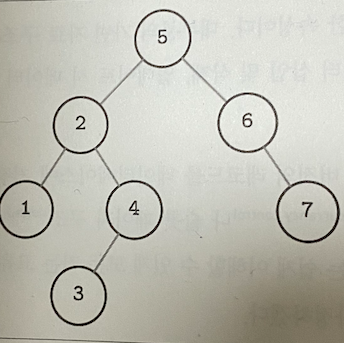
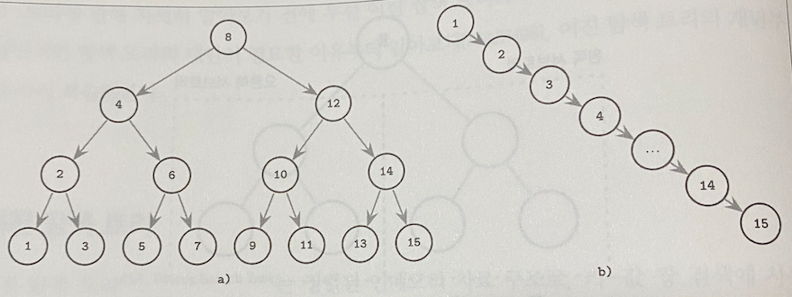
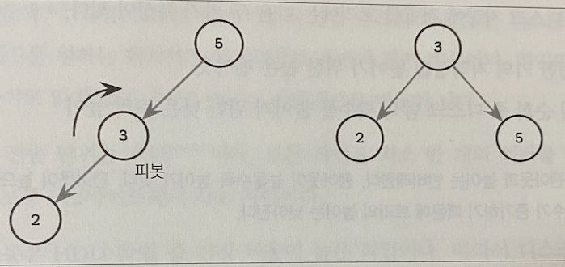
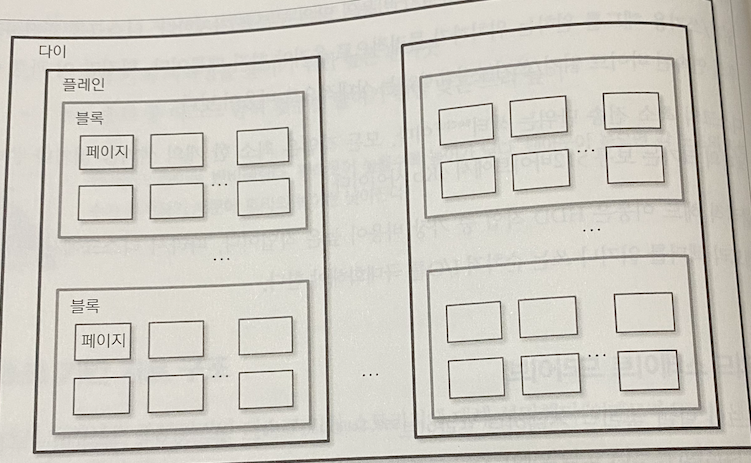

# 지옥 스터디 - 02 B-트리 개요

B-트리는 가장 많이 사용되는 자료 구조중 하나이다.  
대다수 오픈소스 데이터베이스에서 사용되고 있으며 수년 동안 다양한 사용 사례를 통해 검증된 자료구조이다.
B-트리 이전 이진 탐색트리/AVL 트리 등 일반적인 탐색 트리의 대안이 필요한 이유부터 살펴본다.

## 이진 탐색 트리

이진 탐색 트리는 정렬된 인메모리 자료구조 로, 키-값 쌍 검색에 사용된다.  
BST 는 키와 두 개의 자식 포인터가 저장된 여러 노드로 구성된다.  
탐색은 루트 노드에서 시작하며 단 한개의 루트 노드만이 존재할 수 있다.  
각 노드는 탐색 공간을 왼쪽/오른쪽 두 서브 트리로 분할한다.  
각 노드는 왼쪽 서브 트리의 모든 키 보다 크고, 오른쪽 모든 서브트리보다 작다. 

### 트리 밸런싱

노드 삽입 작업시 삽입하는 값에 따라 트리가 불균형해질 수 있다.

위 그림은 극단정인 경우이지만 트리의 균형이 왜 중요한지를 보여준다.  
균형 트리란, 노드의 개수가 N 일때 높이가 Log2N 이고 두 서브트리의 높이 차이가 최대 1인 트리이다.  
불균형 트리는 이진 탐색트리의 성능을 극대화할 수 없다.   
트리의 균형을 유지하는 방법은 노드를 추가하거나 삭제한 후 트리를 회전하는 것이다. (가운데 노드를 중심으로 회전한다.)

### 디스크 기반 스토리지용 트리

불균형 트리의 최악의 시간 복잡도는 O(N) 이다.  
반면 균형 트리의 평균 시간복잡도는 O(Log2N) 이다.  
트리의 팬아웃 (노드가 가질 수 있는 최대 자식 노드의 개수) 가 낮기 때문에 트리 밸런싱과 노드 재배치, 포인터 갱신이 자주 발생하기 때문에 디스크기반 자료구조로 적합하지 않다.

BST 를 디스크에서 제어하면 몇가지 문제에 직면한다.
1. 지역성 
   - 키 순서에 따라 삽입되지 않기에 자식 포인터가 여러 다른 디스크페이지를 가리킬 수 있다.
2. 트리의 높이
   - 특정 노드를 찾기 위해 O(Log2N) 번 탐색과 디스크 전송이 필요하다.
   - 노드 크기가 작기때문에 외부 스토리지 저장에는 비효율적이라는 한계가 있다.

디스크 기반 BST 의 구현은 지역성을 고려하지 않는다.  
때문에 최악의 경우 비교횟수 만큼 디스크 탐색이 필요하다.  
따라서 디스크 기반 트리 선택시 지역성이 결여된 자료구조를 피해야한다.

디스크 저장에 적합한 트리는 다음 두 가지 특성이 있다.
- 인접한 키의 지역성을 높이기 위한 높은 팬아웃
- 트리 순회중 디스크 탐색 횟수를 줄이기 위한 낮은 트리 높이

> 팬 아웃과 높이는 반비례한다. 팬아웃이 높을수록 높이가 낮다. 팬아웃이 높으면 각 노드의 자식 수가 증가하기 때문에 트리의 높이는 낮아진다.

## 디스크 기반 자료 구조

공간과 시작 복잡도를 모두 만족하는 자료 구조 라도 디스크에 적합하지 않을 수 있다.  
데이터베이스 자료 구조는 디스크와 같은 영속성 저장 매체의 한계를 반드시 고려해야 한다.

### 하드 디스크 드라이브

전통적인 알고리즘의 대다수는 디스크 드라이브가 영속적 저장 매체로 가장 널리 사용되던 시절 개발되었기에 알고리즘 설계시 영향을 크게 받았다.  
플래시 드라이브와 같은 새로운 저장 매체가 등장하며 새로운 알고리즘이 나오거나 기존 알고리즘을 수정하는 연구가 이뤄졌다.  
디스크 에서는 탐색 작업이 랜덤 읽기 비용의 많은 부분을 차지한다.  
디스크를 회전하고 읽기/쓰기용 헤드를 원하는 위치까지 물리적으로 옮겨야 하기 때문이다.
- 이 과정 이후 연속된 바이트 읽기/쓰기 작업은 상대적으로 비용이 적다.
디스크의 최소 전송 단위는 섹터 (sector) 이며, 모든 작업은 최소 한 개의 섹터를 읽거나 쓴다. 
- 섹터의크기는 보통 512 바이트 ~ 4KB 사이이다.
물리적 헤드 이동은 HDD 에서 가장 비용이 높은 작업이다.
- 때문에 연속된 메모리 섹터를 읽거나 순차 I/O 를 극대화 해야 한다.

### 솔리드 스테이트 드라이브

SSD 는 물리적으로 움직이는 부품이 없기 때문에 회전하는 디스크도 없고 이동시킬 헤드도 없다.  
일반적으로 메모리 셸로 구성된다.  
셸을 연결하면 스트링 (32 ~ 64 개의 셀) 이 되고 스트링의 배열이 페이지를 이루며 페이지가 모이면 블록이 된다.  
내부 구현에 따라 셀은 한개 또는 여러 개의 비트를 저장한다. 페이지 크기는 보통 2 ~ 16 KB 이다.  
블록은 일반적으로 64 ~ 512 개의 페이지로 구성되며 블록의 집합은 플레인, 플레인의 집합은 다이라고 부른다.  
SSD 는 한 개 이상의 다이로 구성되어 있다.

페이지:  읽고 쓸수 있는 가장 작은 단위, 비어 있는 메모리 셀에만 쓸 수 있다.  
- 삭제할 수 있는 가장 작은 단위는 페이지가 아닌 여러 페이스로 구성된 **블록**
- 때문에 삭제 블록 이라고 부르기도 하며, 블록 내 페이지는 순차적으로 쓴다.

FTL (Flash Translation Layer) 는 페이지 ID 의 실제 위치와 매핑하고 비어 있거나 쓰여진 또는 삭제된 페이지를 관리하는 플래시 메모리 컨트롤러 이다.  
- FTL 은 안전하게 지울수 있는 블록을 찾는 동안 가비지 컬렉션도 수행한다.

HDD 와 SSD 는 메모리 청크 단위로 데이터를 참고하기 때문에 대부분의 운영체제는 블록 디바이스 추상화 계층이 있다.  
- 이 계층은 하드 디스크이 내부 구조를 추사오하 하고 I/O 작업을 버퍼링 한다.
- 블록 디바이스에서 하나의 워드를 읽으면 해당 워드를 포함하는 블록 전체를 읽게 되며 이는 디스크 기반 자료구조에서 항상 염두해야 할 중요한 제약사항 이다.

SSD 는 랜덤/순차 I/O 의 레이턴시가 매우 적기 때문에 둘의 구분이 중요하지 않다.  
가비지 컬렉션은 백그라운드 작업이지만 쓰기 성능을 저하시킬 수 있는데 특히 랜덤 쓰기와 비 정렬 쓰기 작업의 경우에 해당한다.
