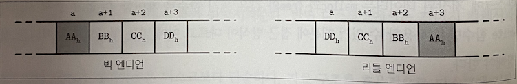
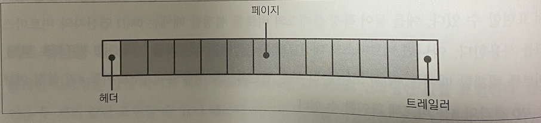
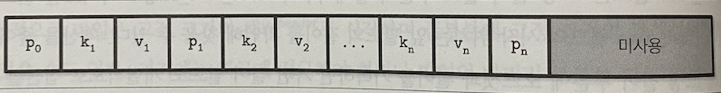
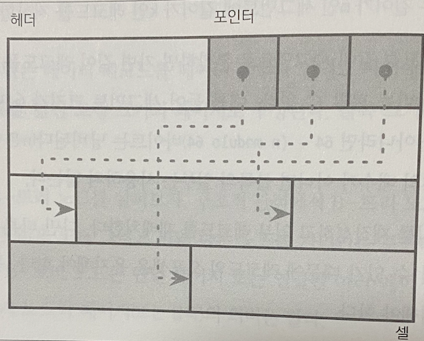
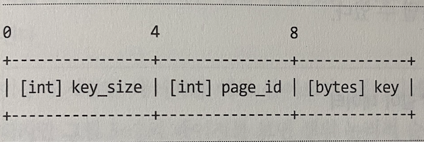
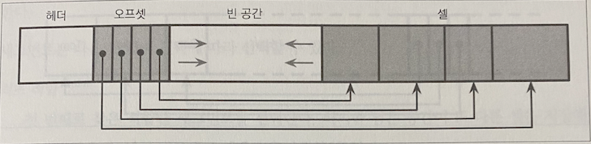
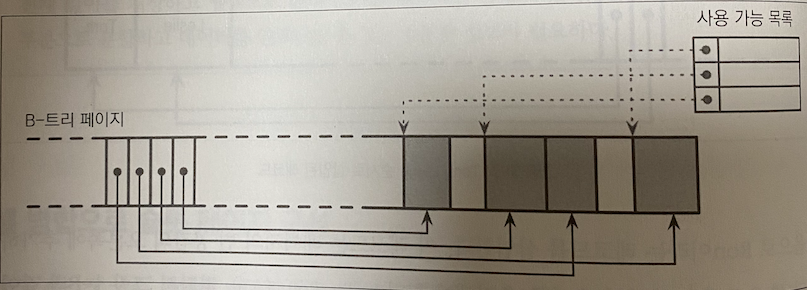

# 지옥 스터디 - 03 파일 포맷

디스크 접근 방식과 메인 메모리 접근 방식은 많은 차이가 있다. <br/>
애플리케이션 개발자 관점에서 봤을때 메모리 접근은 거의 투명하다. <br/>
가상 메모리를 사용하면 오프셋을 직접 관리하지 않아도 되고 디스크는 **시스템 콜** 을 통해 접근이 이뤄진다. (이때 파일 내 오프셋을 직접 지정해야한다.) 

효율적인 디스크 기반 자료 구조를 설계하려면 이런 차이점을 감안해야 한다. <br/>
그러기 위해 생성/수정/해석이 쉬운 파일 포맷이 뭔지 알아야 한다.

이번 장에서는 B-트리와 여러형태의 디스크 기반 자료 구조 설계에 관한 일반적인 원칙 과 구현 방법을 살펴본다.

## 파일 포맷의 중요성

파일 포맷 설계는 메모리 모델이 **비관리형** 인 프로그래밍 언어로 자료 구조 설계하는것과 유사하다. <br/>
메모리 모델이 비관리형인 언어에서는 연속된 메모리 세그먼트의 존재 여부, 메모리 단편화 여부, 메모리 해제 이후 상황등을 신경쓰지 않고 언제든 메모리를 추가 할당 해 주지만 디스크 상에서는 가비지 컬렉션과 단편화를 모두 직접 관리해야 한다.

메모리의 데이터 레이아웃은 디스크보다 단순하다. <br/>
자료 구조를 효율적으로 디스크에 저장하기 위해 영속성 저장 장치의 특성을 이해하고 빠르게 접근할 수 있는 형태로 저장해야한다.

## 바이너리 인코딩

바이너리 포맷에 관해 논할 때 **레이아웃이** 라는 단어가 자주 등장한다. <br/>
효율적인 페이지 레이아웃 설계시 중요한 몇 가지 원칙을 살펴볼 예정이다.
- 파일, 직렬화 포맷, 통신 프로토콜 등 모든바이너리 포맷에 동일하게 적용되는 원칙들이다.
먼저 키와 레코드를 바이너리 형식으로 저장하는 방법, 여러 값을 단일 구조로 표현하는 방법, 가변 길이 자료형과 배열을 구현하는 방법을 살펴보자.

### 기본 형

키와 값은 integer, date, string 등 **지정된 자료형** 과 **바이너리 형식** 이 있다. <br/>
대부분 숫자형은 고정 길이 자료형이고 멀티바이트 숫자형 사용시 인코딩/디코딩은 모두 같은 바이트 순서를 사용해야 한다. <br/>
여기서 **엔디언 (endianess)** 이라는 용어가 나오는데, 엔디언은 바이트 배열 순서를 정의한다.
- 빅 엔디언
  - 최상위 바이트 부터 시작해 내림차순으로 저장한다.
  - MSB 를 가장 낮은 주소에 저장한다.
- 리틀 엔디언
  - 최하위 바이트 부터 높은 자리 바이트까지 오름차순으로 저장한다.
- 미들 엔디언
  - 위 두경우에 속하지 않거나 모두 지원하는 경우이다.



`엔디언 방식이 중요한 이유`

네트워크 데이터 전송시 매우 중요하다. 엔디안 방식 차이 때문에 잘못된 값을 주고 받을 수 있다. <br/>
바이트 순서를 따르도록 데이터의 바이트 순서를 변경해야 한다. (TCP/IP, XNS, SNA 는 16비트와 32비트 정수에서 빅 엔디안을 사용)


### 문자열과 가변 길이 데이터

모든 기본형 데이터의 크기는 고정되어 있다. <br/>
여러 기본형 값을 참조해 하나의 자료구조로 만들고 고정 길이 배열 또는 포인터를 사용해 다른 메모리 영역을 참조한다.

문자열과 가변 길이 자료형은 배열의 크기 또는 문자열의 길이를 나타내는 숫자와 size 바이트 크기의 실제 데이터로 구성되는데 이런 형식을 UCSD 문자열 또는 파스칼 문자열이라고 부른다.

```text
String
{
  size uint_16
  data byte[size]
}
```

파스칼 문자열의 대안은 널 종단 문자열 이다. 바이트 단위로 문자열 끝 기호에 도달할 떄까지 읽는다. <br/>
파스칼 문자열은 내용을 확인하지 않고 길이를 상수 시간안에 알 수 있다.

### 비트 묶음형 데이터 : 불리언 열거형 플래그 

`불리언`

불리언 자료형은 단일 바이트 또는 true/false 를 1과 0로 인코딩한 값을 표현한다. <br/>
불리언은 두 개의 값만 표현할 수 있기 때문에 바이트 전체를 사용하는것은 낭비다. 때문에 8개 불리언 값이 각 1비트를 사용하도록 묶어 사용하기도 한다. <br/>
비트의 값이 1이라면 설정 0이라면 미설정 또는 빈 상태라고 한다.

`Enum`

Enum 은 열거형의 줄임말이며 숫자를 표현한다. 바이너리 포맷과 통신 프로토콜에서 주로 사용된다.
```c
enum NodeType {
    ROOT,
    INTERNAL,
    LEAF
} 
```

`플래그`

플래그는 묶음형 불리언과 열거형의 조합이다. 상호배타적이지 않은 불리언 값들을 표현할 수 있다. <br/>
예를 들면 페이지의 값 보유 여부, 특정 값 크기의 가변 여부 등을 나타낼때 사용한다. 모든 비트가 플래그이기 때문에 2의 거듭제곱만 지정할 수 있다.
```c
int IS_LEAF_MASK = 0x01h;
int VARIABLE_SIZE_VALUES = 0x02h;
int HAS_OVERFLOW_PAGES = 0x04h;
```

비트 마스크와 비트 연산자를 사용해 값을 묶어 표현할 수 있다.

```c
// 비트 설정
flags |= HAS_OVERFLOW_PAGES;
flag |= (1 << 2);

// 비트 해제

flags &= ~HAS_OVERFLOW_PAGES;
flags &= ~(1 << 2);

// 비트 설정여부 확인
is_set = (flags & HAS_OVERFLOW_PAGES) != 0;
is_set = (flags & (1 << 2 ) != 0;
```

## 파일 포맷 설계 원칙

일반적으로 파일 포맷을 설계할 때 **주소 지정 방식 (addressing)** 부터 결정해야 한다.
- 파일을 단일 블록 또는 연속된 여러 블록으로 구성된 같은 사이즈의 페이지로 나눌것인지...
대부분의 인플레이스 업데이트 방식을 지원하는 자료구조는 고정된 페이지 크기를 사용한다.
- 읽기와 쓰기가 비교적 쉽기 때문
- 추가 전용 자료구조도 페이지 단위로 쓰는 경우가 많음

> 레코드를 순차적으로 추가하고 페이지가 가득차면 디스크로 플러시 한다.

일반적으로 파일은 고정 크기의 **헤더** 로 시작하며 마지막에 고정 크기의 **트레일러** 가 존재할 수 있다.
- 빠르게 접근해야 하거나 파일 나머지 부분을 디코딩하는데 필요한 보조 정보가 있음
파일의 나머지 부분은 페이지로 나누어 저장한다.



대부분의 데이터 스토어는 테이블의 필드 수와 순서, 형식이 고정된 스키마가 있다. <br/>
고정 된 스키마를 사용하면 필드명을 반복적으로 저장하지 않고 각 위치를 이용해 디스크에 저장되는 데이터를 줄일 수 있다.

```text
고정된 길이 필드:

| (4) employee_id |
| (4) tax_number |
| (3) date |
| (1) gender |
| (2) first_name_length |
| (2) last_name_length |

가변길이 필드:

| (first_name_length 바이트) first_name |
| (last_name_length 바이트) last_name |
```

더 복잡한 파일구조에서는 더 많은 계층이 필요하다. <br/>
필드는 기본형, 셸은 필드, 페이지는 셸, 리전은 섹션으로 구성된다. <br/>
파일 포맷 설계시 반드시 따라야 하는 규칙은 없고, 어떤 형식의 데이터 포맷을 설계하느냐가 중요하다.

데이터베이스 파일은 일반적으로 여러 부분으로 구성된다.
- 탐색에 유용한 룩업 테이블
- 각 레코드의 시작을 가리키는 오프셋은 헤더와 트레일러 또는 개별 파일

## 페이지 구조

데이터베이스 시스템은 데이터 레코드를 데이터 파일과 인덱스 파일에 저장한다.
- 파일은 여러 파일 시스템 블록을 합칭 고정 크기의 **페이지** 로 구성됨
- 블록 은 4KB ~ 16KB

구조적 관점에서 B-트리 노드는 키와 데이터 레코드 쌍을 저장하는 리프노드, 키와 다른 노드를 가리키는 포인터를 저장하는 비 리프노드로 나뉜다. <br/>
B-트리 노드는 단일페이지 또는 연결된 여러 페이지로 구성되며 B-트리 맥락에서 노드와 페이지의 의미는 같다.

고정길이 데이터 페이지 구조는 다음과 같다.



이런 구조는 단순하지만 다음과 같은 단점이 있다.
- 오른쪽 빈 공간이 아닌 곳에 키 추가시 여러 원소를 재배치 해야 한다.
- 고정 길이 레코드 저장에 적합하지만 가변 길이 레코드를 효율적으로 관리 및 저장할 수 없다.

## 슬롯 페이지

가변길이 레코드 저장시 가장 큰 문제는 삭제된 레코드의 공간을 회수하는 공간 관리이다. <br/>
페이지를 여러 개의 고정 길이 세그먼트로 분할하면 가변 길이 레코드를 저장할 수 있지만 여전히 공간낭비는 피할 수 없다
- 세그먼트 크기가 64바이트일 때 레코드 길이가 64 배수가 아니라면 64 - (n modulo 64) 바이트는 낭비된다.
- 레코드 길이가 64 배수가 아니면 블록의 일부는 사용하지 않는다.

공간 회수시 페이지를 재 작성하고 일부 레코드를 재배치한다. 다른 페이지에서 재배치된 데이터를 참조할 수 있기 때문에 레코드 오프셋은 유지해야 한다. <br/>
정리하면 페이지 포맷은 다음 조건을 충족해야 한다.
- 최소한의 오버헤드로 가변 길이 레코드 저장
- 삭제된 레코드의 메모리 회수
- 페이지의 레코드를 정확한 위치와 상관없이 참조

PostgreSQL 은 슬롯페이지 또는 슬롯 디렉터리를 사용해 문자열/BLOB 같은 가변길이 자료형을 효율적으로 관리한다. <br/>
페이지는 슬롯/셀의 집합이며 페이지내 독립적인 영역에 포인터와 셀을 분리해 저장한다.
- 레코드 논리적 순서를 셀을 가리키는 포인터 순서로 제어
- 레코드 삭제시 포인터 삭제 또는 Null 

슬롯 페이지에는 페이지와 셀에 대한 중요한 정보를 저장하는 고정길이 헤더가 있다. <br/>
셀은 키와 포인터, 레코드 등 임의의 데이터를 저장할 수 있다. <br/>
슬롯 페이지는 관리 영역 (헤더) 과, 셀, 셀을 가리키는 포인터가 있다.



슬롯 페이지는 앞서 설명한 조건을 모두 충족한다.
- 오버 헤드 최소화 : 실제 레코드 위치를 가리키는 포인터 배열이 유일한 오버헤드
- 공간 회수 : 단편화 제거 및 페이지 재구성을 통해 공간 회수
- 동적 레이아웃 : 슬롯은 ID를 통해 페이지 외부에서 접근하기 때문에 정확한 위치는 페이지 내부에서만 필요

## 셀 구조

플래그와 열거형, 기본형을 사용해 셀 레이아웃을 설계할 수 있다. <br/>
셀을 병합하면 페이지가 되고 페이지를 병합하면 트리가 된다. <br/>
셀은 키 셀, 키-값 셀로 구분할 수 있다.
- 키 셀: 구분 키와 인접한 두 키 사이의 페이지를 가리키는 포인터
- 키-값 셀: 키와 해당 데이터 레코드

키셀의 구성요소는 다음과 가탇.
- 셀의 종류
- 키 길이
- 셀이 가리키는 페이지의 ID
- 키 바이트 수

`가변 길이 키 셀`

가변 길이 키 셀은 다음과 같은 구조로 저장할 수 있다.
- 고정 길이 셀이라면 길이 필드는 필요없다.



고정 길이 필드는 앞쪽에 저장하고 key_size 바이트 크기의 필드는 따로 모아 저장할 수도 있다. <br/>
반드시 따라야 하는 구조는 아니지만 오프셋 계산이 쉽다.

`키-값 셀`

키-값 셀은 자식 페이지 ID 대신 실제 데이터를 저장한다. <br/>
다른 구성 요소는 키 셀과 유사하다.
- 셀의 종류
- 키 길이
- 값 길이
- 키 바이트
- 데이터 레코드 바이트

오프셋과 페이지 ID 는 정확히 구분해야 한다. 고정 크기의 페이지는 페이지 캐시가 관리하기 때문에 페이지 ID 를 통해 룩업 테이블에서 오프셋을 참조할 수 있다.
- 셀 오프셋은 페이지 내부에서 시작 오프셋으로 부터 상대위치를 나타낸다.

## 셀 병합으로 슬롯 페이지 구성

슬롯 페이지 방식 (셀을 병합) 을 사용해 페이지를 구성할 수 있다.
- 페이지의 셀은 오른쪽에, 오프셋/포인터는 왼쪽에 추가한다.



키를 삽입 순서대로 추가하고, 셀 오프셋 포인터는 키 순서대로 저장하게 되면 논리적 순서를 유지할 수 있다.
- 셀을 삽입/업데이트/삭제 시 다른 셀을 재배치 하지 않아도 된다.

## 가변 길이 데이터 관리

페이지 레코드 삭제 시 실제 셀을 지우고 할당 해제된 공간으로 다른 셀을 옮길 필요는 없으며, 대신 삭제된 셀이라고 마킹을 하기만 하면 된다. 
- 메모리에 저장된 사용 가능 목록 (available list) 에 회수된 메모리와 포인터를 업데이트 해도 됨
- 사용 가능 목록에는 세그먼트 크기와 위치가 저장되며, 새로운 셀 삽입 전 이 목록에서 적절한 세그먼트가 있는지 확인한다.



SQLite 에서는 사용중이지 않은 세그먼트를 **프리블록 (freeblock)** 이라 하며, 첫 프리블록을 가리키는 포인터를 페이지 헤더에 저장한다. <br/>
추가적으로 페이지에 남아있는 바이트 수를 저장하는데, 이는 단편화 제거 후 새롱누 레코드를 한 페이지에 저장가능할지 빠른 판단을 위함이다.

세그먼트는 다음 두 가지 전략에 의해 선택할 수 있다.
- **최초 적합 (First fit)**
  - 첫 번째로 찾은 적합한 세그먼트를 선택한다.
  - 남은 공간이 또 다른 셀을 저장해 크기가 작을 수 있기에 오버헤드가 발생할 수 있다.
- **최적 적합 (Best fit)**
  - 남은 공간이 가장 작은 세그먼트를 선택한다.

새로운 셀을 저장할 수 없는 공간이 없는 경우, 모든 셀을 읽어 재배치해 페이지 단변화를 제거하면 저장 가능할 수도 있다.
- 단편화 제거시에도 공간이 부족하다면, 오버플로우 페이지를 생성해야 한다.

## 버전 관리

데이터베이스 업데이트가 일어나면서 바이너리 파일의 구조가 변경될 수 있다. <br/>
일반적으로 스토리지 엔진은 한 개 이상의 직렬화 포맷을 지원한다. (파일 버전은 매우 중요한 정보) <br/>
다양한 파일 버전 규칙이 존재한다. 
- 카산드라는 파일 명의 접두사에 버전을 기록한다.
- 인덱스 파일 헤더에 버전을 명시하기도 한다. (헤더 버전정보는 모든 정보에서 읽을 수 있는 형식이여야 함)

## 체크섬

손상된 데이터가 다른 서브시스템에 전파되는 것을 위해 **체크 섬 (checksum)** 과 **CRC (Cyclic Redundancy check)** 를 사용한다. <br/>
이들의 공통점은 큰 데이터 덩어리를 작은 크기로 줄인다는 공통점이 있지만 사용 사례와 목적, 보장성은 모두 다르다.

체크섬은 보장성이 매우 낮으며 다중 비트 오류는 감지할 수 없다. XOR 과 패리티 검사 또는 합을 사용한다.

CRC 는 버스트 오류 (다수의 연속된 비트가 손상된 상황) 을 감지할 수 있다. 일반적으로 룩업 테이블/다항식의 나눗셈을 사용한다. <br/>
대부분 네트워크/스토리지 장치에서 발생하는 장애의 형태는 멀티비트 오류이기 때문에 빠른 감지가 매우 중요하다.

데이터를 디스크에 쓰기 전 체크섬을 미리 계산하고 데이터와 함께 저장하며, 데이터 요청시 체크섬을 다시 계산해 저장된 체크섬과 비교하는 방식을 사용한다. <br/>
파일 전체에 대해 체크섬을 계산하는 것은 매우 비효율적이다. 일반적으로 페이지 단위로 체크섬을 계산하고 페이지 헤더에 저장한다.
- 이로 인해 체크섬이 더 견고해지고 특정 페이지가 손상되더라도 전체 페이지를 버리지 않아도 된다.

## 정리

슬롯 페이지 포맷은 페이지 외부에서 셀 ID 를 통해 개별 셀에 접근할 수 있다. <br/>
삽입 순서대로 레코드를 저장하지만 셀 오프셋을 정렬해 키 순서를 보장할 수 있는 구조이다. <br/>
이런 원리를 이용해 디스크 기반 자료구조와 네트워크 프로토콜 바이너리 포맷을 설계할 수 있다.


