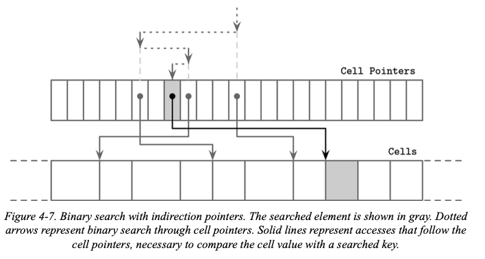
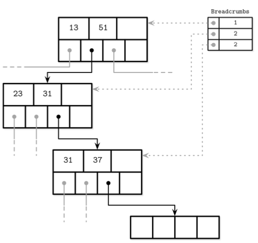

# 지옥 스터디 - 04 B-트리 구현

## 페이지 헤더
- 탐색, 유지보수, 최적화에 필요한 페이지에 대한 정보를 저장함
- 일반적으로 페이지 내용을 나타내는 메타데이터를 저장함
  - 플래그
  - 레이아웃
  - 셀 개수
  - 빈 공간을 가리키는 하한 및 상한 오프셋

> PostgreSQL 은 페이지 크기와 레이아웃 버전을 헤더에 저장하고ㅡ MySQL InnoDB 는 힙 레코드 개수와 레벨, 기타 구조 관련 값을 헤더에 저장한다.

## 매직 넘버
- 파일 헤더 또는 페이지 헤더에 주로 저장하는 또 다른 값
- 일반적으로 상수 값을 포함하는 멀티바이트 블록이다.
- 페이지 종류, 버전과 같은 정보를 포함
- 검증, 상태 체크 에도 사용됨

> 임의의 오프셋의 바이트 열이 매직 넘버와 일치할 확률은 매우 낮다.  
> 일치한다면 높은 확률로 해당 오프셋은 유효한 값이다.

## 형제 링크
- 좌우 형제 페이지를 가리키도록 **순방향 링크**, **역방향 링크** 를 저장하는 트리 구현법도 있다.
  - 부모 노드로 올라가지 않고, 이웃 노드를 바로 참조할 수 있음
  - 분할/병합시 이웃 오프셋까지 갱신해야 하므로 약간 더 복잡함
- 형제 링크가 없는 트리에서 형제 노드를 찾으려면 반드시 부모 노드를 거쳐야한다.
  - 형제 노드를 찾기 위해 루트노드 까지 찾아가는 일이 발생할 수도 있음
- 헤더에 형제 링크를 저장한다면 같은 레벨의 이전/다음 노드에 빠른 접근이 가능해진다

- 형제 링크 저장 방식의 단점은 노드 분할/병합 시 링크를 업데이트 해야한다.
- 대상 노드 뿐 아닌 형제링크 까지 해야하므로 추가적인 잠금이 필요할 수 있다.

## 가장 오른쪽 포인터
- B 트리의 구분키의 주 역할
  - 트리를 서브트리로 분할하고 탐색할 수 있도록 하는 것
  - 자식 페이지가 가리키는 포인터가 키 보다 반드시 하나 더 있다.

- 대부분의 구분 키 구조는 위 그림과 같다.
- 각 구분키에는 자식 포인터가 있고, 마지막 포인터는 어떤 키와도 연관되어 있지 않으므로 따로 저장한다.
  - SQLite 는 마지막 포인터를 헤더에 저장한다.

- 가장 오른쪽 자식 노드가 분할된 이후 부모에 새로운 셀이추가되면 부모의 마지막 포인터도 다시 설정해야한다.
- 위 그림을 보면 노드 분할 이후 부모노드에 추가된 새로운 셀이 승급된 키를 가지면서 분할된 노드를 가리킨다.
- 부모의 마지막 포인터는 새로운 노드를 가리키도록 업데이트하는데, SQLite 가 이와 유사한 방식으로 구현되어 있다.

## 하이 키
- 하이키
  - 현재 노드의 서브트리에 저장된 가장 큰 키
- 각 트리 노드의 가장 오른쪽 포인터와 노드의 하이 키를 함께 저장하는 방법도 있다.
- 이런 방식의 트리를 B link - 트리 라고 하며 PostgreSQL 에서 사용한다.
- B link - 트리는 각 노드에 K n+ 1 키를 하나 씩 더 추가 저장한다.
  - 이 키는 포인터 Pn 이 가리키는 서브트리에서 가장 큰 키이다.
  - 이 값이 해당 서브트리에 저장할 수 있는 최대 값이다.

- 위 구조에서는 키와 포인터의 개수가 짝이 맞다.
- 모든 셀은 대응 되는 포인트를 갖는다.
- 따라서 에지 케이스가 줄어들고 가장 오른쪽 포인터의 처리가 단순해진다.

## 오버플로우 페이지
- B 트리 알고리즘에서 모든 노드는 일정 개수의 키를 유지해야 한다.
  - 각 노드에 저장된 값의 크기가 다를수 있기에 노드 저장시 사용하는 페이지가 고정 크기라면 남은 공간이 없을 수 있음
  - 페이지 크기 변경은 기존 데이터를 복사해야 하므로 비효율 적이다.
- 여러 페이지를 연결하면 이를 복사하지 않고 가변 크기 노드를 구현할 수 있다.
- 기본 크기가 4K 인 페이지에 삽입된 값이 4K 이상이라면 추가할당이 아닌 4K 단위로 노드를 확장하고 할당된 새로운 페이지를 원본 페이지에 연결한다.
- 여기서 새로 할당된 페이지를 **오버 플로우 페이지 (Overflow Page)** 라고 한다.
- 대부분의 B-트리는 고정 크기 바이트만 노드에 저장하고 나머지는 ㄴ오버 플로우페이지에 저장한다.
  - 고정 크기 : 노드 크기를 팬 아웃으로 나눈 값
  - 페이지에 최소 max_payload_byte 만큼 공간이 항상 남아 있으므로 페이지에 공간이 부족한 상황은 발생하지 않는다.
- 삽입된 데이터가 max_payload_size 보다 크다면 해당 노드에 오버 플로우 페이지 가 있는지 확인해야 한다.
  - 없다면 새로운 오버플로우 페이지를 할당한다.

- 오버 플로우 페이지는 특별 관리가 필요하다.
  - 기본 페이지와 동일하게 단편화 발생 가능
  - 새로운 데이터를 쓰기위해 공간 회수 또는 불필요한 페이지 삭제필요
  - 첫 오버 플로우 페이지 할당시 해당 페이지 ID 를 기본 페이지 헤더에 저장
  - 오버 플로우 페이지가 여러개 라면 각 헤더에 다음 페이지 ID 를 저장 및 연결
  - 특정 데이터를 찾기 위해 여러 오버플로우 페이지를 학인해야 할 수도 있음
- 키의 카디널리티는 일반적으로 높고 대부분 기본 페이지에 저장된 키가 비교대상이기에 키를 나눠 저장해도 된다.

## 이진 검색
- 트리의 노드에서 특정 키는 **이진 검색** 알고리즘을 통해 찾을 수 있다.
  - 데이터가 정렬된 경우에만 유효함
  - 정렬되지 않은 키로는 검색이 불가능
- 이진 검색 알고리즘은 정렬된 배열과 키를 인자로 받아 숫자를 반환한다.
  - 숫자가 양수라면 해당 키가 존재하며, 배열에서의 위치를 의미
  - 음수라면 해당 키는 존재하지 않으며, 삽입 위치를 의미
- 삽입 위치는 검색 키 보다 첫 번쨰로 큰 값의 위치이다.
  - 삽입시 삽입 위치 이후의 모든 원소를 한자리씩 이동시켜 공간을 만든 후 삽입한다.

> 상위 레벨에서 일치하는 키를 찾는경우는 드물며, 검색 키보다 큰 첫 번째 값을 찾고 해당 서브트리를 가리키는 포인터를 따라가는 탐색 경로가 중요하다.

## 간접 포인터를 사용한 이진 검색
- B-트리 페이지의 셀은 삽입 순서대로 저장되며 셀 오프셋만 논리적 순서를 유지한다.
- 페이지 셀의 이진 검색은 먼저 중간 셀 오프셋을 선택하고 해당 위치의 키와 검색 키를 비교해 왼쪽 오른쪽 중 진행방향을 결정한다.
- 아래 그림과 같이 이 과정을 대상키 or 삽입 위치를 찾을때 까지 재귀적으로 반복한다.

## 분할과 병합
- 노드의 분할과 병합은 상위레벨 까지 전파될 수 있다.
  - 분할하는 리프 노드나 병합하는 두 리프 노드부터 루트노드까지 순회할 수 있어야 한다.
- 일부 B-트리에서는 노드에 부모 노드를 가리키는 포인터를 저장한다.
  - 하위 레벨 페이지는 항상 위 레벨을 통해 참조되기에 부모 노드에 대한 정보는 저장하지 않아도 된다.
- 형제 포인터와 동일하게 부모 포인터도 부모가 변경되면 갱신을 해주어야 한다.
  - 부모 노드의 분할/병합/재배치 과정에서 페이지 ID 를 포함하는 구분 키가 한 노드에서 다른 노드로 이동했을 때 반드시 갱신해야 한다.
- 일부 트리 구현에서는 형제 포인터 사용으로 인해 발생할 수 있는 데드락을 제거하기 위해서 리프 노드 탐색에 부모 포인터를 사용하기도 한다.
- 부모노드에서 재귀적으로 포인터를 따라 내려가면 형제 노드를 찾을 수 있다.

## 탐색 경로
- 부모 포인터 저장 대신 리프 노드까지의 경로를 저장해 두고 노드 삽입/삭제로 인한 분할 병합이 발생되었을 때 저장 경로를 역순으로 순회하는 방법도 있다.
- B-트리 구조 변경을 위해서는 루트에서 리프노드/삽입 지점까지 트리를 순회해야 한다.
  - 리프 노드 도달전 까지는 분할/병합 발생여부를 미리 알 수 없다.
  - 때문에 탐색 경로를 저장해야 한다.
- 탐색 경로는 루트부터 방문한 모든 노드에 대한 정보를 포함한다.
  - 분할/병합이 상위 레벨도 전파될 때 노드를 거슬러 올라가는 용도로 쓴다.
  - PostgreSQL 은 내부적으로 BTStack 이라는 스택에 탐색경로를 젖아한다.
- 분할/병합되는 경우 저장된 탐색 경로를 이용해 부모 노드로 승급된 키의 삽입 지점을 찾고 필요시 더 상위 레벨 노드까지 차례로 방문하며 구조를 변경한다.
  - 경로 저장시 사용한 스택은 메모리에 유지

## 리밸런싱
- 일부 B-트리는 분할/병합 비용을 줄이기 위해 레벨의 원소를 리밸런싱 또는 분할/병합 수행이전 빈 공간이 많은 노드로 요소를 옮긴다.
  - 리밸런싱 비용이 높을 수 있으나 노드 점유율을 높이고 트리 높이를 낮추는 방법
- 노드 삽입/삭제시 로드 밸런싱을 수행하는 방식
  - 노드 분할 대신 형제 노드로 일부 원소를 옮겨 삽입할 공간을 확보한다.
- 