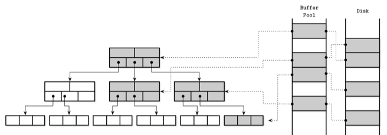

# 지옥 스터디 - 05 트랜잭션 처리와 복구

DBMS 에서 트랜잭션이란 ?
- 하나의 논리적인 작업단위를 의미
- 여러 작업을 한 단계로 표현하는 방법
- 여기서 작업은 읽기/쓰기를 모두 포함한다.

모든 데이터베이스 트랜잭션은 **ACID** 를 보장한다.
1. 원자성 (Atomicity)
   - 트랜잭션을 더 작은 단계로 나눌 수 없다
   - 모두 실행 되거나 모두 실패해야 한다
   - 트랜잭션은 부분적으로 실행될 수 없다
   - 트랜잭션은 커밋 되던지 실패 하던지 둘중 하나여야 하며, 커밋은 트랜잭션은 마지막 단계이다
   - 실패한 트랜잭션은 재 시도할 수 있다
2. 일관성 (Consistency)
   - 애플리케이션이 제어하는 속성
   - 트랜잭션은 제약 조건을 위반하지 않고 데이터베이스를 하나의 유효한 상태에서 또 다른 유효한 상태로 변경한다
   - 데이터베이스가 아닌 사용자가 제어가능한 유일한 속성
3. 격리성 (Isolation)
   - 동시에 수행되는 여러 트랜잭션은 서로 간섭없이 수행되어야 한다
   - 격리성은, 수정 내용이 반영되는 시점과 동시 수행중인 트랜잭션이 접근가능한 데이터를 정의한다
   - 동시성 제어 방식에 따라 변경 내용중 일부가 다른 트랜잭션에 노출될 수도 있고 노출되지 않을 수도 있다
4. 지속성 (Durability)
   - 트랜잭션 커밋 후 디스크에 저장된 데이터베이스 상태는 시스템 중단/장애 발생시에도 그대로 유지 되어야 한다

트랜잭션 수행을 위해서는 데이터를 디스크에 저장/유지 하는 자료구조 외에 **여러 컴포넌트** 가 필요하다.
1. 트랜잭션 매니저
   - 트랜잭션의 세부 단계 제어, 관리 및 스케줄링
2. 잠금 매니저
   - 리소스에 대한 동시 접근을 제어하고 데이터 무결성 보장
3. 페이지 캐시
   - 영구 저장소와 스토리지 엔진 사이에서 중개자 역할
   - 메인 메모리 변경 사항을 젖아하고 영구 저장소와 동기화되지 않은 페이지를 캐시
   - 모든 변경사항은 우선 페이지 캐시에 저장된다
4. 로그매니저
   - 영구 저장소와 동기화되지 않은 페이지 캐시의 내용이 손실되지 않도록 작업 히스토리를 저장한다
   - 로그를 기반으로 부팅시 작업을 재수행하고 마지막 캐시 상태를 재구성한다
   - 중단된 트랜잭션이 변경한 내용을 되돌릴 때에도 로그를 사용한다

## 버퍼 관리

**[가상 디스크]**
- 대부분의 데이터베이스는 영구저장소와 메인 메모리로 구성된 메모리 계층구조로 되어 있다
- 영구 저장소 접근 횟수를 줄이기 위해 페이지를 메모리에 캐시한다
- 만약 다른 프로세스가 디스크에 저장된 같은 페이지를 변경하지 않았다면 메모리에 캐시된 페이지를 재사용할 수 있는데 이와 같은 방식을 가상 디스크 라고 한다

**[페이지 캐시]**
- 가상 디스크 읽기 작업은 요청된 페이지에 메모리에 없는 경우에만 물리 저장소에 접근한다
- 이 개념의 정확한 명칭은 **페이지 캐시** 또는 **버퍼 풀** 이다
- 페이지 캐시는 디스크에서 읽은 페이지를 메모리에 캐시하며 시스템 장애 발생시 캐시된 데이터는 사라진다
- 운영체제 시스템 콜의 성능을 높이기 위해 메모리 세그먼트에 캐시 하기도 한다

**[페이징]**
- 캐시되지 않은 페이지를 디스크에서 메모리로 복사하는 작업

**[더티 페이지]**
- 디스크로 플러시 되지 않은 변경된 페이지

**[캐시된 B-트리 페이지와 디스크에 저장된 페이지의 관계]**

- 페이지 캐시는 순서를 고려하지 않고 페이지를 빈 슬롯에 복사한다
- 디스크와 메모리에서 페이지가 정렬되는 방식 사이에는 연관성이 없다

**[페이지 캐시의 주요 기능]**
- 페이지 내용을 메모리에 캐시
- 디스크에 저장된 페이지에 대한 변경 사항을 함께 버퍼링하고 캐시된 페이지에 반영
- 캐시되지 않은 데이터 요청시 메모리 공간이 충분하다면 페이징하고 캐시된 버전을 반환
- 캐시된 페이지가 요청된 경우 메모리에서 반환
- 메모리에 새로운 페이지를 추가할 공간이 없을 경우 일부 페이지를 만료시키고 페이지로 플러시

