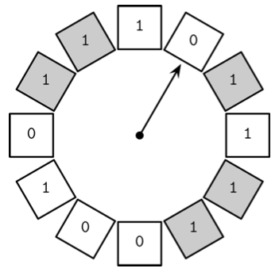
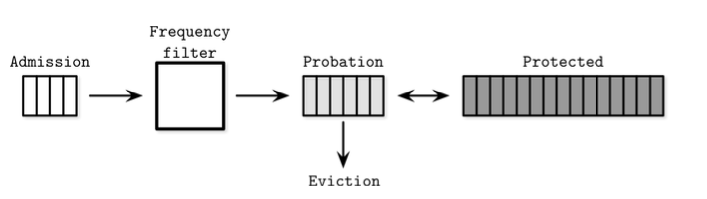
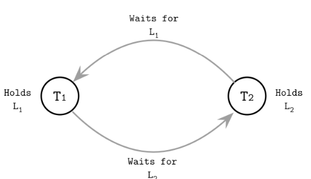
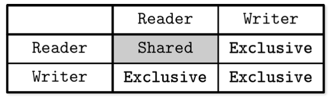
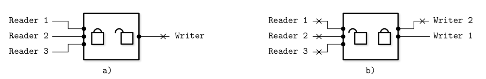
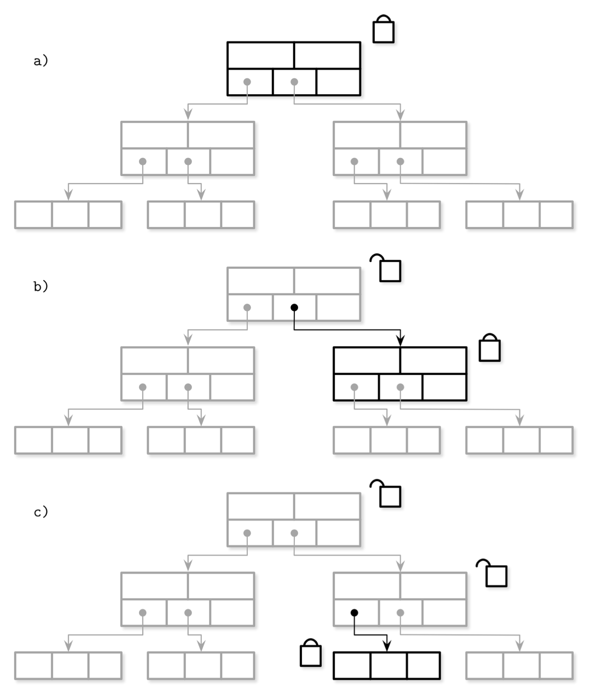

# 지옥 스터디 - 05 트랜잭션 처리와 복구

DBMS 에서 트랜잭션이란 ?
- 하나의 논리적인 작업단위를 의미
- 여러 작업을 한 단계로 표현하는 방법
- 여기서 작업은 읽기/쓰기를 모두 포함한다.

모든 데이터베이스 트랜잭션은 **ACID** 를 보장한다.
1. 원자성 (Atomicity)
   - 트랜잭션을 더 작은 단계로 나눌 수 없다
   - 모두 실행 되거나 모두 실패해야 한다
   - 트랜잭션은 부분적으로 실행될 수 없다
   - 트랜잭션은 커밋 되던지 실패 하던지 둘중 하나여야 하며, 커밋은 트랜잭션은 마지막 단계이다
   - 실패한 트랜잭션은 재 시도할 수 있다
2. 일관성 (Consistency)
   - 애플리케이션이 제어하는 속성
   - 트랜잭션은 제약 조건을 위반하지 않고 데이터베이스를 하나의 유효한 상태에서 또 다른 유효한 상태로 변경한다
   - 데이터베이스가 아닌 사용자가 제어가능한 유일한 속성
3. 격리성 (Isolation)
   - 동시에 수행되는 여러 트랜잭션은 서로 간섭없이 수행되어야 한다
   - 격리성은, 수정 내용이 반영되는 시점과 동시 수행중인 트랜잭션이 접근가능한 데이터를 정의한다
   - 동시성 제어 방식에 따라 변경 내용중 일부가 다른 트랜잭션에 노출될 수도 있고 노출되지 않을 수도 있다
4. 지속성 (Durability)
   - 트랜잭션 커밋 후 디스크에 저장된 데이터베이스 상태는 시스템 중단/장애 발생시에도 그대로 유지 되어야 한다

트랜잭션 수행을 위해서는 데이터를 디스크에 저장/유지 하는 자료구조 외에 **여러 컴포넌트** 가 필요하다.
1. 트랜잭션 매니저
   - 트랜잭션의 세부 단계 제어, 관리 및 스케줄링
2. 잠금 매니저
   - 리소스에 대한 동시 접근을 제어하고 데이터 무결성 보장
3. 페이지 캐시
   - 영구 저장소와 스토리지 엔진 사이에서 중개자 역할
   - 메인 메모리 변경 사항을 젖아하고 영구 저장소와 동기화되지 않은 페이지를 캐시
   - 모든 변경사항은 우선 페이지 캐시에 저장된다
4. 로그매니저
   - 영구 저장소와 동기화되지 않은 페이지 캐시의 내용이 손실되지 않도록 작업 히스토리를 저장한다
   - 로그를 기반으로 부팅시 작업을 재수행하고 마지막 캐시 상태를 재구성한다
   - 중단된 트랜잭션이 변경한 내용을 되돌릴 때에도 로그를 사용한다

## 버퍼 관리

**[가상 디스크]**
- 대부분의 데이터베이스는 영구저장소와 메인 메모리로 구성된 메모리 계층구조로 되어 있다
- 영구 저장소 접근 횟수를 줄이기 위해 페이지를 메모리에 캐시한다
- 만약 다른 프로세스가 디스크에 저장된 같은 페이지를 변경하지 않았다면 메모리에 캐시된 페이지를 재사용할 수 있는데 이와 같은 방식을 가상 디스크 라고 한다

**[페이지 캐시]**
- 가상 디스크 읽기 작업은 요청된 페이지에 메모리에 없는 경우에만 물리 저장소에 접근한다
- 이 개념의 정확한 명칭은 **페이지 캐시** 또는 **버퍼 풀** 이다
- 페이지 캐시는 디스크에서 읽은 페이지를 메모리에 캐시하며 시스템 장애 발생시 캐시된 데이터는 사라진다
- 운영체제 시스템 콜의 성능을 높이기 위해 메모리 세그먼트에 캐시 하기도 한다

**[페이징]**
- 캐시되지 않은 페이지를 디스크에서 메모리로 복사하는 작업

**[더티 페이지]**
- 디스크로 플러시 되지 않은 변경된 페이지

**[캐시된 B-트리 페이지와 디스크에 저장된 페이지의 관계]**

- 페이지 캐시는 순서를 고려하지 않고 페이지를 빈 슬롯에 복사한다
- 디스크와 메모리에서 페이지가 정렬되는 방식 사이에는 연관성이 없다

**[페이지 캐시의 주요 기능]**
- 페이지 내용을 메모리에 캐시
- 디스크에 저장된 페이지에 대한 변경 사항을 함께 버퍼링하고 캐시된 페이지에 반영
- 캐시되지 않은 데이터 요청시 메모리 공간이 충분하다면 페이징하고 캐시된 버전을 반환
- 캐시된 페이지가 요청된 경우 메모리에서 반환
- 메모리에 새로운 페이지를 추가할 공간이 없을 경우 일부 페이지를 만료시키고 페이지로 플러시

## 캐싱

**[동기화]**
- 버퍼에 대한 변경 사항은 디스크에 쓰기전 까지 메모리에 남겨둔다
- 어떤 프로세스도 원본 파일을 수정할 수 없기 때문에 **동기화** 는 메모리에서 디스크로 플러시하는 단방향 작업이다

**[데이터베이스와 페이지 캐시]**
- 데이터베이스는 페이지 캐시를 사용해 메모리를 관리하고 디스크 접근을 제어한다
- 페이지 캐시를 애플리케이션에 특화된 커널 페이지 캐시라고 볼 수도 있다
- 블록 디바이스에 바로 접근하고 기능 및 목적이 커널 페이지와 유사하다
- 디스크 접근을 추상화하고 논리적 쓰기와 물리적 쓰기를 분리한다

**[참조 상태]**
- 스토리지 엔진이 특정 페이지를 요청하면 우선 캐시된 버전이 있는지 확인하고 있다면 그대로 반환한다
- 만약 없다면 논리적 페이지 주소 또는 페이지 번호를 물리적 주소로 변환해 해당 페이지를 메모리로 복사하고 반환한다
- 이때 해당 페이지가 저장된 버퍼는 **참조 상태** 라고 표현한다
- 작업 완료 이후 스토리지 엔진은 해당 페이지를 페이지 캐시에 반환 또는 참조 해제 해야 한다
- 페이지를 고정시키면 페이지 캐시에서 제거되지 않는다

**[더티 플래그]**
- 페이지가 변경된 경우에는 페이지 더티 플래그를 설정한다
- 더티 플래그는 해당 페이지가 디스크와 동기화 되지 않았고 지속성을 위해 디스크로 플러시 되어야 한다는 것을 의미한다

## 캐시 만료
- 캐시의 크기는 한정적이기 때문에 새로운 페이지를 저장하기 위해 오래된 페이지를 제거해야 한다
- 페이지가 동기화됬고 고정또는 참조 상태가 아니라면 바로 제거될 수 있다
- 더티페이지는 제거되기 전 먼저 플래시 해야한다
- 참조 상태의 페이지는 사용이 끝나기 전까지는 제거될 수 없다

**[백그라운드 플러시 라이터]**
- 페이지 제거시마다 디스크로 플러시한다면 성능을 저하시킬 수 있다
- 때문에 일부 데이터베이스는 별도 백그라운드 프로세스가 더티 페이지를 주기적으로 디스크로 플러시한다
- PostgreSQL 의 **백그라운드 플러시 라이터** 가 이 역할을 수행한다

**[지속성]**
- 지속성은 데이터베이스에서 매우 중요한 속성이다
- 데이터베이스 장애 발생시 플러시되지 않은 데이터는 손실된다
- 데이터 손실을 방지하기 위해 **체크포인트** 프로세스가 플러시 시점을 제어한다
- 선행 기록 로그 (WAL) 와 페이지 캐시의 싱크가 맞도록 조정한다
- 플러시와 완료된 캐시된 페이지와 관련 로그만 WAL 에서 삭제될수 있다
- 이 과정 완료전까지 더티페이지는 제거될 수 없다

**[트레이드 오프]**
1. 디스크 접근 횟수를 줄이기 위해 플러시 시점을 늦춘다
2. 페이지를 우선적으로 플러시해 빠르게 캐시에서 제거한다
3. 제거할 페이지를 선택하고 최적의 순서로 플러시한다
4. 캐시 크기를 메모리 범위 내로 유지한다
5. 기본 저장소에 저장되지 않은 데이터는 손실되지 않아야 한다

## 페이지 고정
- 가까운 시간 내에 요청될 확률이 높은 페이지는 고정시킬 수 있다
- 페이지를 캐시에 가둬 두는 것을 **고정 (pinning)** 한다고 표현한다
- 고정된 페이지는 메모리에 더 오랫동안 유지되기에 성능에 도움이 된다

## 페이지 교체 알고리즘
- 새로운 페이지를 추가하기 위해 일부 페이지를 만료시켜야할 수 있다
- 빈번하게 요청될 수 있는 페이지를 만료시키면 같은 페이지를 여러 차례 페이징하는 상황이 발생할 수 있다
- 이런 문제를 해결하기 위해 캐시된 페이지가 요청될 확률을 계산할 수 있어야 한다

**[만료 정책]**
- 캐시된 페이지는 **만료 정책 (eviction policy)** 에 따라 캐시에서 제거된다
- 캐시 만료 정책은 다시 요청될 확률이 낮은 페이지를 만료시키고 해당 위치에 새로운 페이지를 캐싱한다

**[페이지 교체 알고리즘과 성능]**
- 페이지 교체 알고리즘은 캐시의 성능을 결정하는 중요한 요인이다
- 이상적인 알고리즘을 설계하기 위해 페이지 요청 순서를 예측하고 재요청되지 않을 페이지를 찾아낼 마법의 수정 구슬이 필요하다
- 요청 순서는 일반적으로 특정 패턴이나 분포를 따르지 않기에 정확한 예측이 불가능 하다
- 하지만 적절한 페이지 교체 알고리즘을 사용하면 불필요한 페이징을 방지할 수 있다

**[벨레이디의 모순]**
- 캐시 용량을 늘리기만 하면 제거되는 페이지가 줄어들 것 같지만 현실은 그렇지 않다
- 벨레이디의 모순 현상은 적합하지 않은 페이지 교체 알고리즘을 사용했을 때 페이지 수가 증가하면 제거되는 페이지 수도 같이 증가하는 현상을 의미한다
- 만료된 페이지가 다시 페이징되면 공간 선점을 위해 다른페이지와 경정해야 한다
- 이를 방지하기 위해 페이지 교체 알고리즘을 신중하게 선택해야 한다

**[FIFO First in First Out]**
- FIFO 는 가장 단순한 페이지 교체 알고리즘 이다
- 페이지 ID 를 삽입 순서대로 큐의 끝에 추가하고, 공간이 부족한 경우 큐의 헤드에 저장된 가장 오래된 페이지 ID 가 가리키는 페이지를 만료시킨다
- 이는 페이지 접근 순서를 고려하지 않기에 실용적이지 않다

**[LRU Least Recently Used]**
- LRU 는 FIFO 를 확장한 방식이다
- FIFO 와 마찬가지로 삽입 순서대로 큐에 추가하지만 페이지 재요청시 처음 페이징된 것 처럼 큐의 끝에 다시 추가한다
- 페이지 요청시마다 페이지 참조와 노드를 갱신해야하기 때문에 동시 접근 환경에서는 비효율적일 수 있다

**[2Q LRU]**
- 2Q (Two Queue) LRU 는 2개의 큐를 사용해 최초 페이징시 첫 번째 큐에 삽입하고, 재 요청시 두번째 핫 큐로 옮긴다
- 최근 요청된 페이지와 자주 요청된 페이지를 구분할 수 있다

**[LRU-K]**
- 마지막으로 참조된 k 개의 페이지를 기반으로 자주 요청되는 페이지를 구분하고 페이지별 요청 횟수를 예측한다

**[CLOCK]**
- CLOCK 은 LRU의 대안으로 사용된다
- 더 단순하고 캐시 친화적이며 동시성을 지원한다
- 리눅스는 변형된 CLOCK 알고리즘을 사용한다

**[CLOCK-Sweep]**
- CLOCK-스윕 알고리즘은 페이지에 대한 참조와 접근 여부를 나타내는 비트를 **원형 버퍼** 에 저장한다
- 일부 구현에서는 비트 대신 요청횟수를 나타내는 카운터를 사용하기도 한다
- 페이지 요청시마다 해당 페이지의 접근 비트를 1로 설정한다
- CLOCK-스윕 알고리즘은 원형 버퍼를 순회하며 접근 비트를 확인한다.

- 접근 비트가 1이지만 페이지가 참조중이 아니라면, 접근 비트를 0으로 설정하고 다음 페이지를 확인한다
- 접근 비트가 0이라면 해당 페이지를 제거 대상으로 선정하고 만료 작업을 스케줄링 한다
- 현재 참조중인 페이지의 접근 비트는 그대로 유지한다
- 참조 중인 페이지의 접근 비트는 0이 될 수 없기 때문에 제거될 수 없고 제거될 확률로 낮다

**[원형 버퍼의 장점]**
- 원형 버퍼의 장점은 클럭 포인터와 페이지를 비교후 스왑 (Compare And Swap) 방식으로 쉽게 수정가능하며 추가적인 락 매커니즘이 필요하지 않다
- CLOCK 스윕 알고리즘은 이해 및 구현이 쉬워 교과서 뿐 아니라 상용 시스템 에서도 사용 한다

**[LFU]**
- 페이징 횟수 대신 페이지가 참조된 횟수를 기반으로 제거할 페이지를 선택하는 방법도 있다
- LFU 알고리즘은 요청 빈도가 가장 낮은 페이지를 제거하는 알고리즘 이다

**[Tiny LFU]**
- Tiny LFU 는 페이징 시점이 아닌 요청 빈도를 고려해 만료 여부를 요청하는 빈도 기반 페이지 교체 알고리즘이다
- 유명 자바 라이브러리인 카페인이 사용하는 방식이다
- 캐시 접근 이력을 빈도수 히스토 그램에 저장한다.
- TinyLFU 는 페이지를 다음 3가지 중 하나의 큐에 저장한다
  - 등록 큐 (admission) : LRU 알고리즘 기반으로 새로 추가된 페이지를 저장
  - 관찰 큐 (probation) : 제거될 확률이 높은 페이지를 저장
  - 보호 큐 (protected) : 큐에 오랫동안 남아 있을 페이지를 저장
- TinyLFU 는 제거할 페이지 대신 큐에 유지할 페이지를 선택한다
- 요청 빈도가 높은 페이지는 관찰 큐로 옮기고 다시 요청되면 보호 큐로 옮긴다
- 보호 큐가 가득 차면 일부 페이지를 다시 관찰 큐로 옮긴다
- 요청 빈도가 높은 페이지 일 수록 큐에 오랫동안 유지된다

## 복구

**[선행 기록 로그]**
- 선행 기록 로그 (WAL 또는 커밋 로그)는 장애 및 트랜잭션 복구를 위해 디스크에 저장하는 추가 전용 보조 자료 구조이다
- 페이지 캐시는 페이지에 대한 변경 사항을 메모리에 버퍼링 한다
- 캐시된 내용이 디스크로 플러시 될 떄까지 관련 작업 이력의 유일한 디스크 복사본은 WAL 이다
- PostgreSQL, MySQL 등 많은 데이터베이스가 추가 전용 WAL 을 사용한다

**[WAL 의 주요 기능]**
- 디스크에 저장된 페이지 에 대한 변경 사항을 페이지 캐시에 버퍼링하는 동시에 데이터베이스 시스템 맥락에서의 지속성을 봊아한다
- 캐시된 페이지가 디스크와 동기화될 떄까지 작업 이력을 디스크에 젖아한다
- 데이터베이스의 상태를 변경하는 모든 작업을 실제 페이지에 적용하기 전 디스크에 로깅한다
- 장애 발생 시 로그를 기반으로 마지막 메모리 상태를 재구성 한다

> 이 외에도 WAL 은 트랜잭션 처리시 중요한 역할을 한다  
> 데이터가 영구 저장소에 저장되도록 보장하고 로그를 재수행해서 커밋되지 않은 트랜잭션을 완료하거나 장애가 발생하기 전 상태로 돌릴 수 있다

## 로그의 시맨틱
- WAL은 추가 전용 자료이며 작성된 데이터는 불변하기 때문에 모든 쓰기작업은 순차적으로 발생한다
- 쓰기 작업이 로그에 새로운 데이터를 추가하는 동안 다른 읽기 작업은 특정 최신값 까지 안전하게 읽을 수 있다

**[LSN]**
- WAL 은 여러 로그 레코드로 구성된다
- 모든 레코드에는 단조 증가하는 고유 로그 시퀀스 번호 (Log Sequence Number) 가 있다
- 일반적으로 LSN 은 내부 카운터 또는 타임 스탬프 값이다

**[포스 작업]**
- 로그 레코드의 크기는 디스크 블록 크기보다 작을 수 있기 때문에 로그 버퍼에 임시 저장 후 포스 작업시 디스크로 플러시한다
- 포스 작업은 로그 버퍼가 가득차면 수행되거나 트랜잭션 매니저 또는 페이지 캐시가 직접 요청할 수 있다
- 모든 로그 레코드는 LSN 과 동일한 순서로 플러시 되어야 한다

**[트랜잭션과 장애 복구]**
- WAL 은 작업 로그 레코드 외에 트랜잭션 완료 여부를 나타내는 레코드를 저장한다
- 트랜잭션의 커밋 레코드의 LSN 까지 플러시되기 전까지는 해당 트랜잭션은 커밋된 것으로 간주할 수 없다
- 일부 시스템은 트랜잭션 롤백/복구중 장애가 발생해도 정상 동작하도록 **보상 로그 레코드 (CLR, Compresation Log Record)** 를 로그에 저장하고 언두 작업시 사용한다

**[싱크 체크포인트]**
- 체크포인트는 해당 시점 이전의 모든 로그 레코드가 플러시 됬고 더 이상 필요하지 않다는 것을 로그에 명시하는 수단이다
- 이를 통해 데이터베이스 가동시 수행해야하는 작업을 대폭 줄일 수 있다
- 모든 더티 페이지를 강제로 디스크로 플러시해 기본 저장소와 완전히 동기화하는 작업을 싱크 체크포인트 라고 한다

**[퍼지 체크포인트]**
- 모든 데이터를 한 번에 디스크로 플러시하면 체크포인트 작업 완료될 때까지 다른 작업을 모두 중지해야 하기에 비효율적이다
- 이를 해결하기 위해 대부분의 데이터베이스는 퍼지 체크포인트를 사용한다
- 마지막으로 성공한 체크포인트 작업에 대한 정보는 로그 헤더에 저장된 `last_chekcpoint` 포인터에 저장한다
- 퍼지 체크포인트는 `begin_checkpoint` 라는 특별한 로그 레코드로 시작해 더티 페이지에 대한 정보와 트랜잭션 테이블의 내용을 저장한 `end_checkpoint` 라는 로그 레코드로 끝난다
- 로그 레코드에 명시된 모든 페이지가 플러시될 때 까지 해당 체크포인트는 미완료 상태이다
- 페이지는 비동기적으로 플러시되며 작업 완료 후 `last_chekcpoint` 레코드를 `begin_checkpoint` 의 LSN 으로 업데이트 하낟

## 작업 로그 대 데이터 로그

**[섀도 페이징]**
- 시스템 R 등의 데이터베이스 시스템은 데이터의 지속성과 트랜잭션 원자성을 보장하는 쓰기시 Copy-On-Write 방식의 섀도 페이징 기법을 사용한다
- 새로운 데이터를 내부 섀도 페이지에 쓴 뒤 이전 버전의 페이지를 가리키는 포인터를 섀도 페이지를 가리키도록 변경해 업데이트 된 내용을 반영한다

**[물리적 로그와 논리적 로그]**
- 물리적 로그 (전체 페이지 상태) 또는 논리적 로그 (수행해야 할 작업) 를 사용해 레코드와 페이지의 상태를 다른 상태로 되돌리거나 재구성할 수 있다
- 물리적 로그에는 수행 전후 상태를 모두 저장한다
- 때문에 로깅 대상 작업에 의해 영향을 받은 모든 페이지를 참조해야 한다
- 논리적 로그에는 같은 페이지에 수행해야하는 작업과 해당 작업의 언두 작업을 저장한다
- 대부분의 데이터베이스는 물리적 로그와 논리적 로그를 모두 사용한다
- 언두 작업에는 논리적 로그를 (동시성과 성능), 리두 작업에는 몰리적 로그를 (복구 시간 단축) 사용한다

## 스틸과 포스 정책
- DBMS 는 스틸/노스틸 정책과 포스/노포스 정책을 기반으로 메모리에 캐시된 변경 사항을 디스크로 플러시하는 시점을 결정한다
- 이는 복구 알고리즘 선택에 더 큰 영향을 미친다

**[스틸 정책]**
- **스틸 정책** 은 트랜잭션이 수정한 페이지를 커밋하기 전 플러시 하는 것을 허용한다
- **노스틸 정책** 은 커밋되지 않은 트랜잭션이 디스크로 플러시 되는 것을 허용하지 않는다
- 더티 페이지를 스틸한다는 것은 메모리에 캐시된 데이터를 디스크로 플러시하고 디스크에서 다른 페이지를 페이징 하는 것을 의미한다
- 노스틸 정책 사용시 디스크에는 이전 상태 페이지가 저장되어 있고 로그에는 최신 변경사항이 저장되어 있으므로 리두 로그만 사용해 상태복구가 가능하다

**[포스 정책]**
- **포스 정책** 은 트랜잭션이 수정한 모든 페이지를 커밋 전에 플러시 한다
- **노포스 정책** 은 일부 페이지가 디스크로 플러시 되지 않아도 트랜잭션 커밋을 허용한다
- 더티 페이지를 포스한다는 것은 커밋 전 디스크로 플러시하는 것을 의미한다
- 노포스 정책 사용시 플러시 시점을 늦춘다면 더 많은 변경사항을 버퍼링할 수 있다
- 포스 정책 사용시 트랜잭션에서 수정한 페이지는 커밋전 플러시 된다
- 때문에 장애 복구시 트랜잭션 커밋 결과를 재구성하지 않아도 된다
- 하지만 많은 I/O 로 인해 트랜잭션 커밋 시간이 증가한다

## ARIES
- ARIES 는 스틸/노포스 정책 기반의 복구 알고리즘이다
- 빠른 복구를 위해 물리적 리두 로그를 사용하고 일반 작업의 동시성을 높이기 위해 논리적 언두를 사용한다
- 복구 시 커밋되지 않은 트랜잭션을 언두하기 전 데이터베이스 상태를 재구성하기 위해 WAL 레코드를 기반으로 작업을 재수행하고 언두 중 보상 로그 레코드를 기록한다

**[장애 발생 이후 복구 단계]**
1. 분석 단계
   - 페이지 캐시에 저장된 더티 페이지와 장애 발생 당시 수행중이던 트랜잭션을 파악한다
   - 더티 페이지 정보를 기반으로 리두단계 의 시작 지점을 결정한다
   - 트랜잭션 목록은 언두 단계에서 미완료된 트랜잭션 롤백시 사용한다
2. 리두 단계
   - 장애 발생 전까지 작업을 재수행하고 데이터베이스를 이전 상태로 복원한다
   - 불완전한 트랜잭션과 커밋됬지만 디스크로 플러시 되지않은 트랜잭션 롤백을 위한 준비 단계 
3. 언두 단계
   - 불완전한 트랜잭션을 롤백하고 데이터베이스를 마지막 일관된 상태로 복원한다
   - 모든 작업은 실제 수행 순서의 역순으로 롤백된다
   - 복구 중에도 장애가 발생할 수 있기 때문에 언두 작업도 로그에 기록해야 한다

## 동시성 제어

**[낙관적 동시성 제어]**
- 여러 트랜잭션이 동시에 쓰는 것을 허용하고 결합된 여러 작업이 직렬화가 가능한지 여부를 결정한다
- 트랜잭션이 서로 간섭하지 않고 각자의 작업 내역을 유지할 수 있게 하고 커밋 전 충돌 발생 여부를 확인한다
- 충돌이 발생할 경우 트랜잭션 중 하나를 중단한다

**[다중 버전 동시성 제어]**
- 여러 버전의 레코드를 저장해 과거의 특정 타임스탬프의 데이터베이스의 일관성을 보장한다
- MVCC는 하나의 트랜잭션만을 채택하는 검증 기법을 사용해 궇녀하거나 타임스탬프 순서화 기법과 같은 무잠금 방식 또는 2단계 잠금 과 같은 잠금 기반 방식으로도 구현할 수 있다

**[비관적 동시성 제어]**
- PCC 는 잠금 기반 방식과 무잠금 방식이 있으며 두 방식은 공유 자원에 대한 관리 및 접근 방식이 다르다
- 잠금 기반 방식에서 각 트랜잭션은 다른 트랜잭션이 같은 레코드를 동시에 수정 및 접근 할 수 없도록 레코드에 대한 잠금을 획득한다
- 무잠금 방식은 읽기와 쓰기 작업에 대한 목록을 유지하고 완료되지 않은 트랜잭션의 스케줄에 따라 다른 트랜잭션의 수행을 제한한다
- 여러 트랜잭션이 서로 잠금을 해제하기를 기다리는 교착 상태가 발생할 수 있다

## 직렬화 가능성

**[스케줄]**
- 데이터베이스의 관점에서 스케줄이란 트랜잭션을 수행하는 데 필요한 작업의 목록이다
- 목록에 포함되지 않는 다른 작업은 부작용이 없다고 가정한다

**[완전한 스케줄]**
- 완전한 스케줄은 관련 트랜잭션의 모든 작업을 포함한다

**[올바른 스케줄]**
- 올바른 스케줄은 논리적으로 전체 작업 목록과 동일하지만 ACID 속성과 트랜잭션 결과의 정확성이 보장될 경우 일부작업이 병렬 수행되거나 성능을 위해 수행 순서가 바뀔 수 있다

**[직렬 스케줄]**
- 포함된 모든 트랜잭션이 교차하지 않고 완전히 독립적으로 수행될 수 있는 스케줄을 직렬 스케줄 이라고 한다
- 직렬 스케줄의 모든 트랜잭션은 다음 트랜잭션 시작하기 전 수행이 완료된다
- 여러 단계로 구성된 트랜잭션에 비해 직렬 수행은 매우 직관적이다
- 하지만 항상 하나씩 트랜잭션을 실행하면 시스템 처리량이 크게 제한되고 성능이 저하된다

**[직렬화 가능한 스케줄]**
- 동일한 트랜잭션 집합에 대한 완전한 직렬 스케줄 중에서 동일한 스케줄이 있을 경우 해당 스케줄은 직렬화 가능 하다고 한다
- 직렬화 가능한 스케줄의 결과는 트랜잭션을 임의의 순서로 순차 수행한 결가와 같다

## 트랜잭션 격리
- 데이터베이스 시스템은 여러 격리 수준을 지원한다
- 격리 수준은 트랜잭션이 변경한 내용중 어떤 부분이 언제 다른 트랜잭션에서 접근할 수 있는지를 정의한다
- 트랜잭션을 격리하면 불완전하거나 일시적인 데이터가 트랜잭션 경계를 넘어 전파되는 것을 방지해야 하므로 이를 위한 추가적인 비용이 발생한다

## 읽기와 쓰기 이상 현상

SQL 표준에서 여러 트랜잭션이 동시 수행될때 발생할 수 있는 읽기 이상현상을 세 가지로 분류 한다

**[더티 읽기 Dirty Read]**
- 더티 읽기는 아직 커밋되지 않은 다른 트랜잭션의 결과를 읽는 현상을 나타낸다

**[반복 불가능 읽기 non-repeatable read]**
- 반복 불가능 읽기는 트랜잭션이 동일한 로우를 두 번 쿼리했을 때 둘의 결과가 다른 현상을 나타낸다

**[팬텀 읽기 phantom read]**
- 트랜잭션에서 범위를 수행하면 결과에 팬텀 레코드가 포함될 수 있다
- 랜텀 읽기는 여러 로우를 두 번 쿼리했을 때 결과가 다른 현상을 나타낸다
- 반복 불가능 읽기와 유사하지만 대상이 범위 쿼리이다

쓰기 이상 현상도 세 가지로 분류하고 있다

**[갱신 분실]**
- 갱신 분실은 트랜잭션 1 과 2가 같은 값 v 를 수정할때 발생한다
- 틀내잭션은 서롱릐 존재를 모르기 때문에 1의 결과를 2가 덮어쓰고 1이 갱신한 값은 사라진다

**[더티 쓰기]**
- 더티 쓰기는 트랜잭션이 커밋되지 않은 값을 읽고 수정 및 커밋현상을 나타낸다
- 커밋되지 않은 값에 따라 트랜잭션 결과가 바뀔 수 있다

**[쓰기 치우침]**
- 개별 트랜잭션은 불변 조건을 충족하지만 동시 수행시 조건이 위반되는 현상이다
- 트랜잭션 1과 2는 a1 b1 계쫘를 업데이트 한다
- 두 계좌 잔액의 합이 음수가 아닌한 잔액은 음수가 될 수 있다
- 계좌 잔액의 합을 양수로 유지해야 하는 요건을 위반할 수 있다

## 격리 수준

**[커밋 이전 읽기 read uncommitted]**
- 가장 낮은 격리 수준
- 트랜잭션은 동시 수행중인 다른 트랜잭션이 커밋하지 않은 데이터를 읽을 수 있다
- 더티 읽기가 허용된다

**[커밋 읽기 read committed]**
- 더티 읽기는 발생하지 않지만 팬텀 읽기와 반복 불가능 읽기는 발생할 수 있따
- 이와 같은 격리 수준을 커밋 읽기 라고 한다
- 반복 불가능 읽기까지 불허하면 반복 가능 읽기 수준이 된다

**[직렬화 가능 수준]**
- 트랜잭션이 순차적응로 수행된것 처럼 어떤 순서에 따라 결과를 반환한다
- 동시성을 지원하지 않는 데이터베이스는 성능이 매우 떨어지기 때문에
- 불변 조건을 위반하지 않고 트랜잭션을 동시에 수행할 수 있다면 트랜잭션의 수행 순서는 바뀔 수 있다

## 낙관적 동시성 제어
- 낙관적 동시성 제어는 트랜잭션 충돌이 거의 발생하지 않는다고 가정한다
- 잠금과 블로킹 트랜잭션을 사용하지 않고 결과를 커밋하기 전 트랜잭션을 검증해 동시 수행 읽기/쓰기 충돌을 방지한다
- 일반적으로 다음 세 단계로 구성된다

**[읽기 단계]**
- 트랜잭션은 자신이 변경한 내용을 다른 트랜잭션에서 볼 수 없도록 개별 컨텍스트에서 트랜잭션 단계를 수행한다
- 이 후 모든 트랜잭션 존속성과 트랜잭션의 효과를 알 수 있다

**[검증 단계]**
- 동시 수행 트랜잭션의 읽기와 쓰기 대상에서 직렬화 가능성을 보장하지 않는 충돌이 발생할 수 있는지 확인한다
- 트랜잭션이 쿼리한 데이터가 최신이 아니거나 읽기 단계 중에 수정 및 커밋한 값을 다른 트랜잭션이 덮어쓴 경우 컨텍스트를 초기화하고 읽기 단계부터 다시 수행한다 
- 트랜잭션을 커밋해도 ACID 가 유지되는지 검증하는 단계이다

**[쓰기 단계]**
- 검증 단계에서 충돌이 발견되지 않았다면 결과를 개별 컨텍스트에서 데이터베이스 상태로 커밋한다

> 낙관적 동시성 제어는 검증이 성공적이고 트랜잭션을 재시도할 필요가 없는 경우 효율적이다.  
> 한 번에 한 개의 트랜잭션 만이 접근할 수 있는 크리티컬 섹션이 존재한다.

## 다중 버전 동시성 제어
- MVCC 는 여러 버전의 레코드를 저장하고 단조 증가하는 트랜잭션 ID 또는 타임 스탬프로 식별해 데이터베이스 트랜잭션의 일관성을 보장하는 동시성 제어 방식이다
- 새로운 버전이 커밋될 때까지 이전 버전을 읽을 수 있기 때문에 비교적 간단한 조정 단계를 통해 동시 읽기 및 쓰기 작업을 수행할 수 있다

## 비관적 동시성 제어
- 비관적 동시성 제어는 낙관적 동시성 제어보다 더 보수적이다
- 트랜잭션 수행 중 충돌 발생 가능성을 확인하고 계속 수행하거나 중단 또는 취소한다

**[타임스탬프 순서화 알고리즘]**
- 가장 단순한 (무잠금 방식) 의 비관적 동시성 제어 방식은 각 트랜잭션에 타임스탬프를 설정하는 타임스탬프 순서화 알고리즘이다
- 트랜잭션 수행 여부는 더 낮은 타임스탬프가 설정된 트랜잭션이 커밋됬는지 여부에 따라 결정된다
- 트랜잭션 매니저는 값별로 읽기쓰기를 동시에 수행항 트랜잭션 정보를 `max_read_timestamp`, `max_write_timestamp` 에 저장한다

**[토마스 기록 규칙]**
- max_write_timestamp 보다 낮은 타임스탬프가 설정된 트랜잭션이 값 요청시 이미 새로운 버전의 값이 존재하므로 이를 허용하면 트랜잭션 순서를 위반한다
- max_read_timestamp 보다 낮은 쓰기 작업은 뒤에 실행된 읽기 작업과 충돌한다
- 타임스탬프가 max_write_timestamp 보다 낮은 쓰기 작업이 쓴 값은 무시해도 되기 때문에 허용된다
- 이와 같은 규칙을 토마스 기록 규칙 이라고 한다
- 읽기 또는 쓰기 작업이 수행되는 즉시 해당 값의 최대 타임스탬프 값은 업데이트 된다
- 실패 트랜잭션은 동일한 타임스탬프를 사용하면 또 다시 실패하기 때문에 새로운 타임스탬프로 다시 수행한다

## 잠금 기반 동시성 제어
- 잠금 기반 동시성 제어는 데이터베이스 객체에 명시적으로 잠금을 설정한느 비관적 동시성 제어의 한 종류이다
- 경합현상 및 확장성 문제가 발생할 수 있다는 단점이 있다
- 가장 보편적인 잠금은 2PL (Two-Phase Locking) 이며 2PL 두 단계로 구성된다
  - 확장 단계 : 필요한 잠금을 획득하고 유지
  - 축소 단계 : 획득한 잠금을 해제
- 2PL 은 어떤 단계에서도 트랜잭션 수행을 제한하지 않는다

### 교착 상태
- 여러 트랜잭션이 잠금을 획득하는 과정에서 서로 사용중인 잠금을 해제하기를 기다리는 상태를 교착상태 라고 한다

- 교착상태를 해결하는 가장 간단한 방법은 타임 아웃 설정이다
- 이런 방식은 시스템 동시성을 크게 저하시키기 때문에 대부분 데이터베이스는 트랜잭션 매니저를 통해 교착상태를 감지 및 방지한다
- 교착 상태는 일반적으로 동시수행중인 트랜잭션 간의 대기 상태를 그래프로 표현하는 대기 그래프를 사용해 감지한다
- 대기 그래프의 사이클은 교착 상태를 의미하고, 교착 상태 감지는 주기적 또는 지속적으로 수행된다
  - 일반적으로 더 늦게 잠금을 요청한 트랜잭션이 중단된다

**[트랜잭션 타임 스탬프]**
- 잠금으로 인한 교착 상태를 방지하기 위해 트랜잭션 매니저는 트랜잭션의 타임스탬프를 기반으로 우선순위를 지정한다
- 타임스탬프가 낮을수록 우선순위가 높다

**[교착상태 방지]**
- 우선순위가 더 높은 트랜잭션이 소유한 잠금을 요청할 경우 다음 두가지 방법으로 교착상태를 방지할 수 있따
  - 대기 또는 중지 wait-die
    - 잠금 해제 되길 기다리거나 중단 후 재시도한다
    - 자신보다 타임스탬프가 더 높은 트랜잭션만이 트랜잭션을 블록할 수 있다
  - 선점 또는 대기 wound-wait
    - t2 는 중단후 재시도 한다
    - 타임스탬프가 더 낮은 트랜잭션 만이 트랜잭션을 블록할 수 있다
- 트랜잭션 사이의 교착 상태를 방지하기 위해 스케줄러가 필요하다
- 래치의 경우 교착상태 알고리즘을 사용하지 않고 개발자가 직접 구현해야 한다

### 잠금과 래치
- 같은 데이터를 수정하는 두 트랜잭션을 동시에 수행할 때 논리적 일관성을 보장하기 위해 서로 중간 결과를 볼 수 없어야 한다
- 논리적 무결성과 물리적 무결성을 유지하는 매너키즘은 서로 같지 않다
- 각각 잠금과 래치를 사용한다

**[잠금]**
- 잠금은 동시 수행 트랜잭션을 격리 및 스케줄링 하고 데이터베이스 상태 관리시 사용된다
- 스토리지 내부 구조와 마관하며 특정키에 대해 요청할 수 있다
- 특정 키 또는 특정 범위의 키를 보호한다
- 일반적으로 트리 외부에 따로 저징 및 관리되며 데이터베이스 잠금 매니저가 관리하는 상위 레벨 개념이다
- 래치보다 무겁고 트랜잭션 수행동안 유지된다

**[래치]**
- 래치는 물리적 구조를 보호한다
- 래치는 물리적 트리 구조를 보호하며 페이지에 대해 요청할 수 있다
- 특정 페이지에 동시 접근 하기위해 반드시 래치를 획득해야 한다
- 무잠금 동시성 제어 방식도 래치를 사용한다

### 리더-라이터 잠금
- 가장 간단한 래치 구현 방식은 요청하는 스레드에 배타적 읽기/쓰기를 허용하는 것이다
- 여러 라이터가 동시에 겹치지 않고 리더와 라이터가 겹치지 않도록 한다
- RW 잠금은 여러 리더가 동시에 같은 객체를 읽는것을 허용한다
- 라이터는 객체를 독점해야 한다
- 오직 리더만 공유 잠금을 소유할 수 있고 모든 다른 리더와 라이터 조합은 배타적 잠금을 요청해야 한다

### 바쁜 대기와 큐잉 기법

**[바쁜 대기 buy wait]**
- 블로킹 알고리즘 또는 바쁜 대기 buy-wait 알고리즘을 사용해 페이지에 대한 동시 접근 제어가 가능하다
- 바쁜 대기 알고리즘은 스케줄러에 제어 권한을 다시 넘시는 대신 스레드가 일정 시간 대기하는 것을 허용한다

**[큐잉 queuing]**
- 큐잉 기법은 일반적으로 잠금 획득과 큐 업데이트의 원자성을 보장하기 위해 비교 후 스왑 CAS 알고리즘을 사용해 구현한다
- 큐가 비어있는 경우 스레드는 바로 접근이 허용된다
- 비어있지 않은 경우 대기 큐에 자신을 등록하고 바로 앞 스레드만 업데이트 가능한 변수를 계속 확인한다
- 이는 락관련 CPU 사용량을 줄일 수 있다

### 래치 크래빙
- 가장 단순한 래치 획득 방식은 루트부터 대싱 리프 노드사이의 모든 래치를 획득하는 것이다
- 이는 동시성 병목 현상이 발생할 수 있다
- 래치 소유 시간은 최소해야 하며 래치 크래빙 기법을 사용해 이를 해결할 수 있다

**[원리]**
- 래치 크래빙의 원리는 매우 간단하다
- 래치를 최대한 짧게 소유하고 작업을 수행하는 데 래치가 더 이상 필요 없는 경우 바로 해제한다
- 자식 노드를 찾으면 즉시 래치를 획득하고 부모 래치는 해제한다
- 노드 삽입으로 인해 부모를 포함한 트리 구조가 변경되지 않음이 확실하면 부모 래치는 바로 해제한다
- 자식 노드가 가득찬 상태가 아니라면 부모 래치는 해제한다
- 삭제도 마찬가지로 자식에 충분한 요소가 있고 형제 노드와 병합이 발생하지 않는다면 부모 래치는 해제한다

### B link - 트리
- B link - 트리는 B* - 트리에 하이키와 형제 링크 포인터를 추가한 자료구조 이다
- 루트 노드를 제외한 모든 노드에 포인터가 두 개씩 있다
- 부모가 자식을 가리키는 자식포인터와 같은 레벨의 형제를 가리키는 형제 포인터가 있다

**[중간 분할 상태]**
- B link - 트리는 중간 분할 상태가 있다
- 노드를 가리키는 형제 포인터는 있지만 아직 부모 노드에서 참조하는 자식 포인터가 없는 상태이다
- 중간 분할 상태는 노드의 하이 키를 통해 확인할 수 있다
- 검색 키가 하이 키 보다 큰 경우 룩업 알고리즘은 트리 구조가 현재 변경중으로 간주하고 형제 링크를 따라 계속 탐색한다
