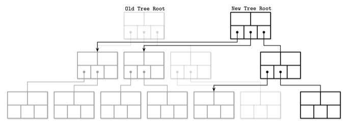
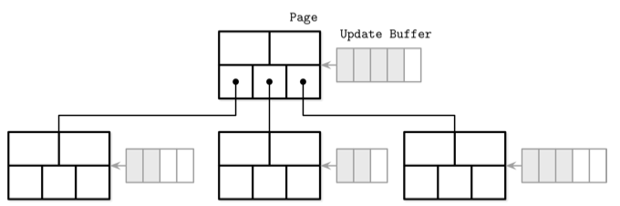
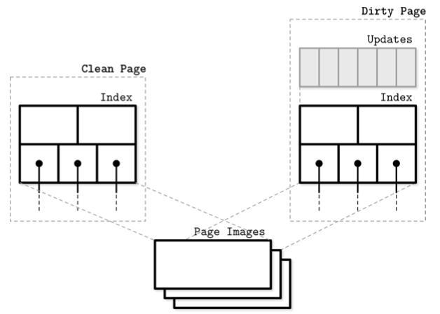
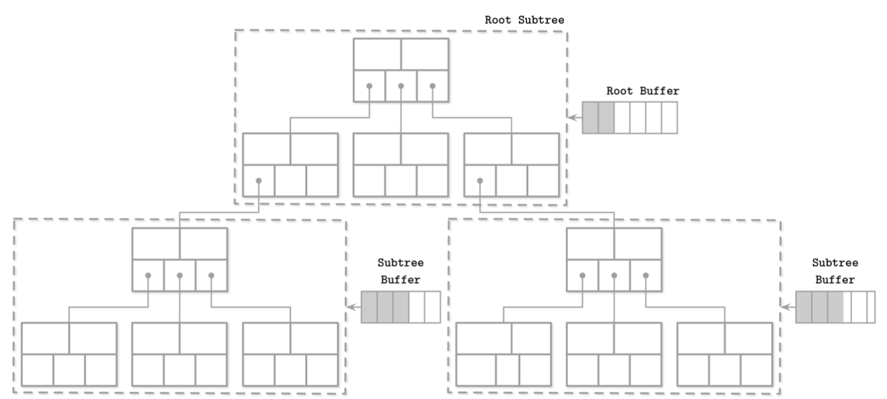
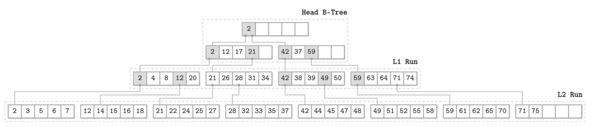
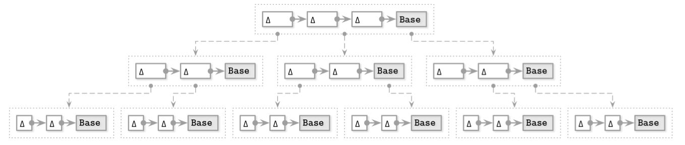

# 지옥 스터디 - 06 B-트리의 변형
- 6장에서는 B-트리를 효율적으로 구현하는 방법과 이를 기반으로 구현된 몇 가지 트리를 살펴본다
  - **쓰기시 복제형 (copy-on-write)**
    - B-트리와 유사한 구조지만 노드를 수정할 수 없고 인플레이스 업데이트를 지원하지 않는다
    - 대신 페이지를 복사하고 업데이트 한 뒤 새로운 위치에 저장한다
  - **지연형 (lazy)**
    - 동일한 노드에 대한 연속된 쓰기 작업의 I/O 를 줄이기 위해 수정 내용을 버퍼에 젖아한다
    - LSM 이중 컴포넌트 트리 는 이와 유섷나 버퍼 매커니즘을 사용하는 불변 B-트리 이다
  - FD
    - LSM 트리와 유사한 버퍼 매커니즘을 사용한다
    - 작은 크기의 B-트리를 버퍼로 사용하고 버퍼가 가득차면 그 내용을 불변 형태로 기록한다
    - 수정사항은 상위에서 하위레벨로 전파된다
  - Bw
    - B-트리 노드를 추가 전용 방식으로 기록되는 여러 작은 그룹으로 나눈다
    - 여러 노드에 대한 쓰기 작업을 배치 단위로 처리해 비용을 낮춘다
  - 캐시 비인지형 (cache oblivious)
    - 디스크 기반 자료 구조를 인메모리 자료 구조처럼 사용한다

## 쓰기 시 복사
- 일부 디비는 동시 수행 작업의 데이터 무결성을 보장하기 위해 래치 매커니즘 대신 쓰기 시 복사 방식을 사용한다
- 페이지 수정 전 내용을 복사해 원본 대신 복사본을 수정한다
- 이로 인해 평행 트리 계층 구조가 생성된다

**[쓰기시 복사형 B-트리]**
- 라이터와 동시 수행중인 리더는 과거 버전 트리를 읽을 수 있지만 라이터가 작업중인 페이지에 접근해야 한다면 라이터의 쓰기작업이 완료될떄 까지 대기해야 한다
- 새로운 페이지 계층이 생성되면 최상단 페이지를 가리키는 포인터를 업데이트 한다
- 이 방식의 단점은 더 많은 메모리를 필요로 한다
- 하지만 B-트리는 일반적으로 높이가 낮으므로 쓰기 복사방식의 장점은 단점을 능가한다
  - 한번 쓴 페이지는 수정할 수 없고 래치가 필요없기 때문에 동기화가 필요 없다

## 쓰기시 복사 방식 구현 : LMDB
- LMDB 는 OpenLDAP 프로젝트에서 사용하는 키-값 데이터베이스 이다
- 쓰기시 복사 방식을 사용하며 구조와 설계상 페이지 캐시와 선행 기록 로그, 체크포인트, 컴팩션을 사용하지 않는다

**[단일 레벨 구조]**
- LMDB 는 단일 레벨 구조의 데이터베이스 이다
- 애플리케이션 레벨의 캐싱은 하지 않고 읽기/쓰기 작업이 메모리에 바로 접근한다
- 데이터를 중간 버퍼로 복사하지 않고 메모리에서 바로 읽을 수 있다
- 업데이트시 루트에서 리프 노드까지의 경로의 모든 노드를 복사한다
- 업데이트가 전파되는 노드는 수정하고 나머지는 유지한다

**[멀티 루트 노드]**
- LMDB 두 개의 버전 루트 노드가 있다
- 이는 최신 버전, 변경 사항이 커밋될 버전이다
- 새로운 루트 노드가 생성되면 이전 루트 노드는 읽기/쓰기에 사용될 수 없다
- 이전 트리를 참조하는 읽기 작업이 끝나는 즉시 페이지를 회수하고 재사용할 수 있다

## 노드 업데이트 추상화
- 메모리에 저장된 노드에 접근하는 방법은 여러 가지가 있다
  - 캐시된 버전에 바로 접근하는 방법
  - 인메모리 객체 생성하는 방법
  - 래퍼 객체를 사용하는 방법

**[메모리 모델이 없는 언어]**
- 메모리 모델이 없는 언어의 경우 B-트리 노드에 저장된 원시 이진 데이터를 해석하고 네이티브 포인터를 사용해 제어한다
- 대부분 페이지 캐시가 관리하는 메모리 영역을 가리키거나 메모리 매핑을 사용한다

**[고유 자료구조로 구체화]**
- B-트리 노드를 언어 고유의 자료구조로 구체화 하는 방법도 있다
- 이 자료구조는 삽입/업데이트/삭제 시 사용한다
- 플러시 작업은 변경 사항을 메모리에 반영한 후 디스크로 플러시 한다
- 원시 페이지 수정은 중간 객체에 대한 접근과 별개로 수행되므로 동시 접근이 쉽다
- 메모리에 두개 버전의 페이지를 저장하므로 오버헤드가 발생한다

**[래퍼 객체]**
- 변경 사항을 즉시 B-트리 구체화하는 래퍼 객체를 통해 노드가 복사된 버퍼에서 읽는다
- 메모리 모델을 지원하는 언어에서 주로 사용한다
- 래퍼 객체는 버퍼에 변경된 사항을 반영한다

## 지연형 B-트리
- 일부 B-트리 알고리즘은 더 가볍고 동시성 지원 및 업데이트가 쉬운 인메모리 자료 구조를 사용해 변경 사항을 버퍼하고 동기화를 지연해 업데이트 비용을 낮춘다

### 와이어드 타이거
- B-트리 노드는 페이징 즉시 메모리에 구체화되고 플러시되기 전까지 업데이트 내용을 메모리에 유지한다
- MongoDB 의 기본 스토리지 엔진 **와이어드 타이거 (Wired Tiger)** 가 유사한 방식을 사용한다
- 로우 스토어 (Row Store) B-트리를 인메모리와 디스크의 페이지에 각각 다른 형식으로 저장하며 인메모리 페이지는 영구 저장되기 전에 조정 과정을 거친다

- 클린 페이지는 디스크 페이지 이미지에서 생성된 인덱스만으로 구성된다
- 변경 사항은 먼저 업데이트 버퍼에 저장하고 읽기 작업시 접근된다
- 버퍼된 내용과 원본 디스크 페이지를 합쳐 가장 최신의 데이터를 반환한다
- 페이지 플러시 발생시 업데이트 버퍼 내용과 페이지 내용을 합쳐 디스크에 저장된 기존 페이지를 덮어쓰게 된다
- 합친 페이지가 최대 크기보다 크담녀 여러 페이지로 분할한다

- 더티 페이지에는 업데이터 버퍼를 추가로 젖아한다
- 와이어드 타이거의 가장 큰 장점은 페이지 업데이트와 구조 변경은 백그라운드 스레드가 처리하므로 읽기/쓰기 작업은 다른 스레드 완료시까지 기다릴 필요가 없다

## 지연 적응형 트리

**[LA 트리]**
- 각 노드마다 업데이트 버퍼를 유지하지 않고 노드를 서브트리 단위로 그룹화해 각 서브트리 별 배치작업을 저장하는 업데이트 버퍼를 사용하는 방법도 있다
- 업데이트 버퍼에는 해당 서브트리의 최상단 노드와 자식 노드에 대해 수행된 모든 작업 내용을 저장한다
- 이를 지연 적응형 트리 (LA) 라고 한다

**[레코드 삽입]**
- 레코드 삽입시 루트 노드의 업데이트 버퍼에 이를 저장한다
- 버퍼가 가득 차면 변경 사항을 하위 버퍼로 복사 및 이동해 공간을 확보한다
- 하위 레벨 버퍼에 공간이 부족하다면 리프 노드까지 이 과정을 재귀적으로 반복한다

**[장점]**
- 모든 변경 사항은 상위 버퍼에서 하위 버퍼로 전파된다
- 업데이트가 리프레벨에 도달하면 변경 작업을 배치단위로 수행하며, 모든 내용 수정/구조 변경을 한 번에 반영한다
- 특정 페이지에 대한 연속적인 작업을 개별이 아닌 한 번에 처리한다
- 디스크 요청 횟수가 줄고 상위로 전파되는 분할/병합 작업도 배치단위로 처리하기 때문에 구조 변경 횟수도 줄어든다

## FD-트리
- B-트리 유지 관리에서는 랜덤쓰기가 많이 발생한다
- 랜덤쓰기와 노드 업데이트 횟수를 낮추는 방법이 필요하다
- 추가 전용 스토리지와 병합 프로세스를 사용해 여러 노드에 대한 업데이트 작업을 그룹화하는 방법도 있다
  - LSM 에서 사용중인 방식
- 쓰기 작업시 대상 리프노드를 찾지 않고 작업 내용을 추가하기만 한다
- FD (Flash Disk Tree) 에서는 이 방식으로 데이터를 인덱싱 한다

**[구조]**
- FD 트리는 작은 가변 헤드 트리와 여러 개의 정렬된 불변 배열로 구성된다
- 랜덤 쓰기를 하는 위치가 변경 사항을 버퍼하는 작은 B-트리로 줄어든다
- 헤드 트리가 가득 차면 저장된 내용을 불변 배열로 옮긴다
- 새로운 배열의 크기가 일정량 보다 크면 다음 레벨의 배열과 합친다
- 때문에 데이터 레코드는 상위에서 하위로 복사된다

### 부분적 캐스케이딩
- FD 트리는 부분적 캐스케이딩을 사용해 레벨간 포인터를 유지한다
- 정렬된 배열에서 특정 아이템을 찾는 비용을 줄일 수 있다
- 첫 배열에서는 logn 번이 필요하지만 이후에서는 이전에서 찾은 근사값을 기반으로 시작하기때문에 검색 범위가 줄어든다

**[브릿지]**
- 갭을 최소화하기 위해 인근 레벨의 배열을 **브릿지** 를 통해 연결하고 레벨 사이에 지름길을 만든다
- 브릿지는 상위 레벨에 존재하지 않는 요소를 하위 레벨에서 끌어올리고 하위레벨에서의 위치를 가리키는 포인터 이다

### 로그 배열
- FD 트리는 부분적 캐스케이딩과 크기가 로그 단위로 증가하는 배열을 결합해 사용한다
- 이전 레벨의 배열과 현재 배열을 합친 정렬된 불변 배열이며 크기가 k 배수로 증가한다

**[처리 과정]**
- 헤드 트리가 가득하면 리프에 저장된 값을 첫 번째 최상위 레벨 배열에 저장한다
- 또 다시 차면 값을 첫 번째 배열과 합치고 이전 배열을 덮어 쓴다
- 상위 레벨 배열 크기가 일정 값에 도달하면 다음 레벨 배열을 생성한다
  - 이미 존재한다면 이전 레벨과 합친 배열로 덮어 쓴다
- 이는 불변 테이블을 합쳐 더 큰 테이블을 만드는 LSM 트리의 컴팩션과 유사하다

- FD 트리는 페이지를 인플레이스 업데이트하지 않기 때문에 같은 키가 여러 레벨에 존재할 수 있다
- 삭제된 키에는 삭제됬음을 의미하는 툼스톤 을 삽입한다
- 하위 레벨에 존재하는 같은 키 레코드도 모두 삭제되어야 한다
- 툼스톤이 최하위 까지 전파되면 더 이상 남은 값이 없기 때문에 모두 삭제해도 된다

## Bw-트리
- B트리 인플레시 업데이트 구현시 세 가지 문제가 있다

**[쓰기 증폭 Write Amplification]**
- 쓰기 증폭은 B-트리의 인플레스 업데이트 구현시 가장 중요한 문제이다
- 연속된 B-트리 페이지 수정으로 인해 디스크에 저장된 페이지 원본을 모둔 요청마다 업데이트 하는 상황이 발생할 수 있기 때문이다

**[메모리 증폭 Space Amplification]**
- 업데이트를 위한 공간을 미리 확보 할 때 발생하는 메모리 증폭 문제도 있다
- 요청된 데이터를 담고 있는 유용한 바이트를 전송하려면 매번 빈 바이트와 해당 페이지의 나머지 부분을 같이 전송해야 한다는 의미이기도 하다 

> 마지막 문제는 해결하기 어려운 동시성과 래치 사용의 복잡성이다

**[Buzzword-트리]**
- 추가 전용 스토리지를 사용해 여러 노드에 대한 업데이트를 일괄 적용하고 노드를 서로 연결해 체인을 형성하는 방법이 있따
- 한 번의 CAS 연산으로 노드 사이를 연결하는 포인터를 생성할 수 있는 인메모리 자료구조를 사용한다
- 이런 방식의 트리를 Buzzword-트리 라고 한다 (BW)

### 체인 업데이트
- Bw-트리는 변경 사항과 원본 노드를 따로 저장한다
- 델타 노드는 변경 사항을 가진 노드이며 체인을 형성한다
  - 가장 최신 수정본 부터 순서대로 정렬하고 원본을 가장 마지막에 저장한 링크드 리스트
  - 각 업데이트 내용을 따로 저장하면 디스크에 저장된 원본 내용을 수정하지 않아도 됨
- 델타 노드는 삽입과 업데이트, 삭제 작업을 모두 포함한다

**[장단점]**
- 공간을 미리 할당하거나 노드 크기를 고정하고 연속된 메모리 세그먼트에 저장하지 않아도 된다
- 하지만 읽기 작업시 모든 델타 노드를 순회해 원본 노드를 최산 상태로 동기화해야 한다는 단점이 있다
- 이는 메인 자료구조와 별도로 변경사항을 저장하고 읽기시 반영하는 LA-트리와 유사하다

### CAS 연산으로 동시성 문제 해결
- Bw 트리는 원본과 델타 노드외에 논리적 식별자와 디스크에서 위치를 매핑하는 인메모리 매핑 테이블을 저장한다
- 매핑 테이블을 사용하면 쓰기 작업 시 배타적 잠금을 획득하는 대신 매핑 테이블의 물리적 오프셋을 CAS 연산으로 처리할 수 있기 때문에 래치가 필요 없다

**[Bw 트리의 노드 업데이트 알고리즘]**
1. 루트 노드에서 리프 노드까지 순회하며 대상 논리적 리프 노드를 찾는다.
   - 매핑 테이블에는 원본 노드 또는 업데이트 체인에서 가장 최신 델타 노드를 가리키는 가상 링크를 저장한다
2. 1단계에서 찾은 원본 노드를 가리키는 새로운 델타 노드를 생성한다
3. 2단계에서 생성한 델타 노드를 가리키는 포인터를 매핑 테이블에 업데이트 한다
- 3번째 단계에서 CAS 를 사용한다
- CAS 는 원자적 연산이기 때문에 포인터 업데이트와 동시에 요청된 모든 읽기 작업은 리더와 라이터를 블록하지 않고 업데이트 작업 전 또는 후에 실행한다

### 구조 변경 작업
- Bw 트리는 논리적으로 B 트리와 구조가 같다
- 노드는 너무 크거나 거의 비어 있는 상태일 수 없으며 분할 병합 등 구조 변경 작업이 필요하다
- 분할 병합 방식은 B 트리와 유사하지만 구현은 다를 수 있따

**[분할 SMO]**
1. 분할 
   - 리더가 분할 진행중임을 알 수 있도록 특수한 분할 델타 노드를 분할 노드 끝에 추가한다.
   - 분할 델타 노드는 분할 노드의 레코드를 무효화 하기 위한 중간 지점의 구분 키와 새로운 형제 노드를 가리키는 링크로 구성된다
2. 부모 노드 업데이트
   - 이 시점의 상태는 B link 트리의 중간 분할 상태와 유사하다
   - 새로운 노드는 분할 델타 노드 포인터를 통해 접근할 수 있지만 아직 참조하는 부모 노드가 없다
   - 리더는 분할 노드의 형제 포인터를 통해 접근할 수 밖에 없다
   - 리더가 분할 노드를 통하지 않고 바로 새로운 노드에 접근할 수 있도록 노드를 가리키는 포인터를 부모 노드에 추가하면 분할 작업이 완료된다

**[병합 SMO]**
1. 형제 노드 제거
   - 병합 SMO 의 시작과 삭제 대상 노드를 의미하는 특수 삭제 델타 노드를 오른쪽 형제 노드에 추가한다
2. 병합
   - 왼쪽 형제 노드에 오른쪽 형제 노드를 왼쪽 형제 노드의 논리적 노드로 만든다
3. 부모 노드 업데이트
   - 왼쪽 형제 노드에서 오른쪽 형제 노드의 요소에 접근할 수 있다
   - 부모 노드에서 오른쪽 자식 노드를 가리키는 포인터를 삭제하면 병합 작업이 완료된다

**[중지 델타 노드 Abort Delta]**
- SMO 가 동시에 같은 노드를 분할/병합 하는 것을 방지하려면 부모 노드에 중지 델타 노드를 추가해야 한다 
- 중지 델타 노드는 쓰기 잠금과 비슷하다
- 동시에 한 개의 스레드만이 노드에 대한 쓰기 권한을 가질 수 있고 해당 델타 노드에 새로운 노드를 추가하면 모든 다른 스레드는 중단된다
- SMO 완료시 부모에서 중지 델타 노드를 제거한다

### 노드 통합과 가비지 컬렉션
- 노드가 통합되면 기존 내용은 더 이상 매핑 테이블을 통해 접근할 수 없다
- 다른 진행중인 작업에서 참조하고 있을 수 있기에 바로 메모리를 해제하지 않는다
- 리더는 래치를 사용하지 않으므로 페이지 유효 여부를 확인할 방법이 필요하다

**[에포크 기반 교정 기법]**
- 특정 노드에 대한 접근이 허용되는 스레드와 그렇지 않은 스레드를 구분하기 위해 Bw 트리는 에포크 기반의 교정 기법을 사용한다
- 특정 시점에 일부 노드와 델타가 통합으로 인해 매핑 테이블에서 삭제되어도 기존 노드는 해당 시점 또는 이전에 시작된 리더가 작업 완료시까지 유지해야 한다
- 이후 시작한 리더는 해당 노드에 절대 접근 할 수 없기때문에 작업 완료시 안전하게 가비지 컬렉션을 통해 정리한다

## 캐시 비인지형 B-트리
- 캐시 비인지형 자료구조는 메모리 계층 구조와 파라미터 조정 여부와 상관없이 점근적으로 최적의 성능을 보장한다
- 설정이 다른 여러 서버에서 추가 설정 없이 잘 동작하도록 설계되었다

**[캐시 인지형 방식]**
- 디스크는 여러 블록으로 나뉘고 데이터는 디스크와 캐시 사이에 블록 단위로 전송한다
- 알고리즘이 블록 안의 한 개의 레코드만을 요청해도 블록 전체를 읽어야 한다
- 이런 방식은 캐시 인지형 방식이다

**[캐시 비인지형 방식]**
- 캐시 비인지형 알고리즘은 멀티 레벨 계층 구조의 이점을 제공하면서 자료 구조를 2-ㄹ벨 메모리 계층 구조 관점에서 바라볼 수 있다
- 플랫폼 종속적인 파라미터가 필요 없고 렙레 사이의 전성 횟수를 상수 범위 내로 보장한다
- 자료 구조가 어느 두 레벨의 메모리 계층에서 최적의 성능을 내도록 최적화 됬다면 인접하는 다른 두 레벨에서도 최적으로 작동한다
- 가능한 높은 캐시 레벨을 많이 상요할수록 최적화 된다

### 반 엠데 보아스 레이아웃
- 캐시 비인지형 B-트리는 정적 B-트리와 패킹된 배열로 구성된다
- 정적 B-트리는 반 엠데 보아스 레이아웃 기반으로 생성한다
- 트리의 엣지를 잘라 분할하고 재귀적으로 각 서비트리를 분할하면 sqr(N) 크기의 여러 서브트리가 생긴다
- 이 레이아웃의 핵심은 모든 재귀적 트리는 연속된 메모리 블록에 저장된다는 점이다

