# 지옥 스터디 - 07 로그 구조 스토리지
- 가변 자료구조의 대표적인 예
  - B-트리
- 불변 자료구조의 대표적인 예
  - 로그 구조 병합 트리 (Log-Structured Merge Tree)
- 7장에서는 LSM 트리의 구현 방법과 특성 B-트리 와 의 차이점을 살펴본다

## 7.1 LSM 트리
- B-트리의 메모리 공간 문제와 쓰기 증폭 문제를 해결하는 방법은 **버퍼링**
- 일반적으로 스토리지 자료구조에 버퍼링을 적용하는 방법은 두 가지
  - 변경 사항을 디스크 페이지에 적용하는 시점을 늦추는 방법
  - 쓰기 작업을 순차적으로 수행하는 방법

**[LSM 트리 소개]**
- LSM 트리는 가장 많이 사용되는 디스크 기반 불변 자료구조
- 버퍼링과 추가 전용 구조를 사용해 **순차 쓰기 방식** 을 지원
- B-트리와 유사한 디스크 기반 자료구조의 변형
- 순차 접근에 최적화된 자료구조
- 로그 구조 병합 트리 라는 이름은 디스크의 모든 수정사항을 로그 구조의 파일에 저장하는 로그 구조 파일시스템 에서 따왔다

**[LSM 트리의 특징]**
- 데이터 파일 쓰기를 지연 시키고 변경 사항을 **메모리 기반 테이블** 에 저장
- 이후 내용을 불변 디스크 파일에 저장해 변경 사항을 **반영**
- 모든 데이터 레코드는 파일이 완전히 저장될 때까지 메모리를 통해 참조 가능한 상태로 유지

**[불변 파일]**
- 불변 파일은 순차 읽기에 적한한 구조
- 데이터를 디스크에 싱글 패스로 저장할 수 있고, 파일은 추가 전용 구조
- 가변 자료 구조는 싱글 패스로 블록을 미리 할당할 수 있지만 이후 접근에서 여전히 **랜덤 엑세스** 가 필요
- 불변 파일은 데이터를 **연속된 공간**에 저장해 단편화를 방지한다
- 추후 추가될 레코드를 위해 공간을 미리 할당하지 않아도 되기에 밀도가 더 높음
- 파일이 수정될일이 없기 때문에 레코드를 찾는 과정이 사라지며 쓰기 성능과 처리량이 크게 향상됨

### LSM 트리 구조
- LSM 트리는 작은 메모리 기반 컴포넌트와 큰 디스크 기반 컴포넌트로 구성
- 디스크에 쓰기 전 메모리 버퍼에 저장하고 정렬을 해야한다

**[멤 테이블]**
- 메모리 기반 컴포넌트인 멤 테이블은 불변 자료 구조
- 데이터 레코드를 버퍼에 저장하고 읽기/쓰기 작업을 적용한다
- 멤테이블에 저장된 내용의 크기가 기준 값에 도달하면 디스크로 복사한다

**[디스크 기반 컴포넌트]**
- 디스크 기반 컴포넌트는 읽기 작업에만 사용된다
- 파일에 영구 저장된 데이터는 다시 수정할 수 없다
- 기본 작업을 다음과 같이 나눌 수 있다
  - 인메모리 테이블에 쓰는 작업
  - 디스크와 메모리 기반 테이블에서 읽는 작업
  - 병합 작업
  - 파일을 삭제하는 작업

**[이중 컴포넌트 LSM 트리]**
- 이중 컴포넌트 LSM 트리와 다중 컴포넌트 LSM 트리는 개념이 다름
- 이중 컴포넌트 LSM 트리는 불변 세그먼트로 구성된 단일 디스크 기반 컴포넌트가 있다
  - 디스크 기반 컴포넌트는 100% 로 채워진 노드와 읽기 전용 페이지로 구성된 B-트리

`플러시 직전의 이중 컴포넌트 LSM 트리`

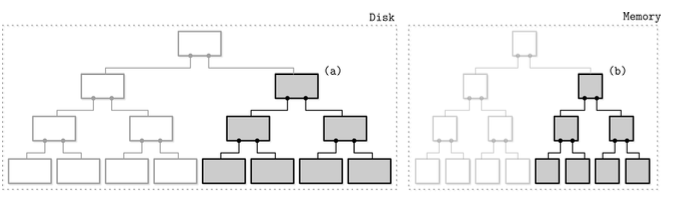

- 메모리 기반 트리에 저장된 데이터는 여러 파트로 나눠 디스크로 플러시 된다
- 플러시 과정에서 플러시된 인메모리 서브트리별로 디스크에서 해당 서브트리를 찾아 두 세그먼트를 병합해 디스크의 새로운 세그먼트로 저장한다

`플러시가 완료된 이중 컴포넌트 LSM 트리`

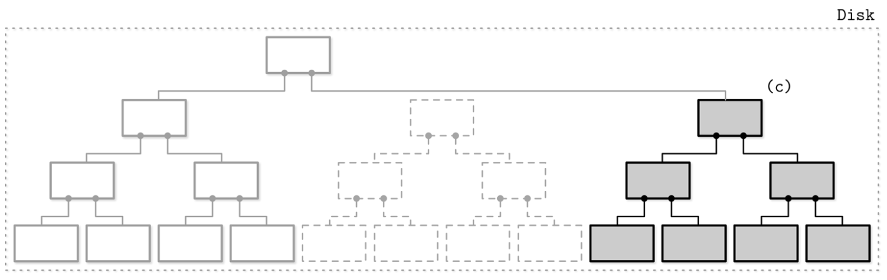

- 서브트리가 플러시되면 인메모리와 디스크 기반 서브트리는 삭제되고 새로운 병합된 서브트리로 대체된다
- 병합 작업은 디스크 기반 리프 노드와 인메모리 트리 노드를 반복자를 통해 순회해며 순서대로 비교한다
- 모두 정렬되어있으므로 병합 결과도 순서가 보장된다
- 순회 과정에서 두 노드중 더 최신 값을 선택하게 된다

**[서브트리 병합/플러시 구현시 주의사항]**
1. 플러시 과정이 시작되는 짃, 그 이후의 모든 새로운 쓰기 요청은 새로운 멤 테이블에 저장해야 한다
2. 서브트리 플러시 과정을 진행하는 중에도 읽기 작업은 디스크와 인메모리 서브트리에 접근할 수 있어야 한다
3. 플러시가 완료되면 병합된 트리를 접근 가능한 상태로 만드는 작업과 병합되지 않은 디스크 및 인메모리 데이터 삭제 작업을 원자적으로 수행해야 한다

> 이중 컴포넌트 LSM 트리는 인덱스 파일에 적합한 자료구조 이지만 사용사례는 없다.  
> 멤테이블 플로시로 인한 잦은 병합이 쓰기 증폭을 유발하기 때문

**[다중 컴포넌트 LSM 트리]**
- 다중 컴포넌트 LSM 트리는 두 개 이상의 드스크 기반 테이블이 존재한다
- 이 구조는 멤테이블 전체를 한 번에 플러시 한다
  - 이유 ?
    - 플러시가 여러번 발생하게 되면 디스크에 테이블이 여러개 생성된다
    - 수는 시간이 지날수록 증가하게 됨
    - 어떤 테이블에 어떤 레코드가 있는지 항상 정확히 알 수 없다

`컴팩션`
- 여러 위치에서 데이터를 읽는 것은 많은 비용이 듦
- 이를 해결하고 테이블 수를 최소로 유지하기 위해 **컴팩션** 이라는 병합 작업을 주기적으로 수행한다
- 컴팩션은 여러 테이블의 내용을 읽고 병합한 후 새로운 파일에 결과를 저장하는 작업
- 새로운 병합 테이블이 생기면 기존 테이블은 삭제한다

`다중 컴포넌트 LSM 트리의 생명 주기`

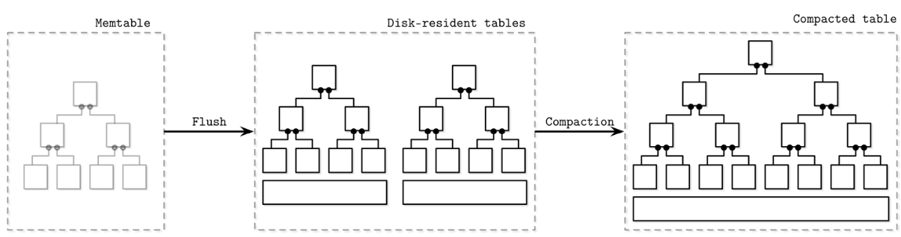
1. 먼저 메모리 기반 컴포넌트에 버퍼링
2. 버퍼 크기가 너무 커진다면 디스크 컴포넌트로 플러시
3. 여러 개의 테이블을 병합해 더 큰 테이블을 생성

**[인메모리 테이블]**
- 멤테이블의 플러시는 주기적 또는 기준 플러시 크기 값을 사용해 발동시킬 수 있음
  - 멤테이블을 전환해야 함
  - 새로운 멤테이블 할당해 그 이후 쓰기 작업을 담당하도록 설정, 기존 테이블은 플러시 상태로 전환 (이 단계는 원자적으로 수행되어야 함)
  - 플러시 대상 테이블은 완전히 플러시 될 떄까지 접근 가능 상태로 유지되어야 함
  - 플러시 완료시 기존 테이블을 삭제되고 새롭게 쓴 디스크 기반 테이블에서 읽을 수 있음

`LSM 트리의 컴포넌트 사이의 관계와 전환 과정`
- 최신 멤 테이블
  - 읽기/쓰기 요청 처리
- 플러시 대상 멤 테이블
  - 읽기 가능
- 온디스크 플러시 대상
  - 불완전항 상태이므로 읽을 수 없음
- 플러시된 테이블
  - 플러시 완료된 멤테이블 제거 이후 읽을 수 있음
- 컴팩션 대상 테이블
  - 병합 중인 디스크 기반 테이블
- 컴팩션된 테이블
  - 플러시된 테이블 또는 다른 컴팩션된 테이블로 생성된 테이블

`LSM 컴포넌트 구조`

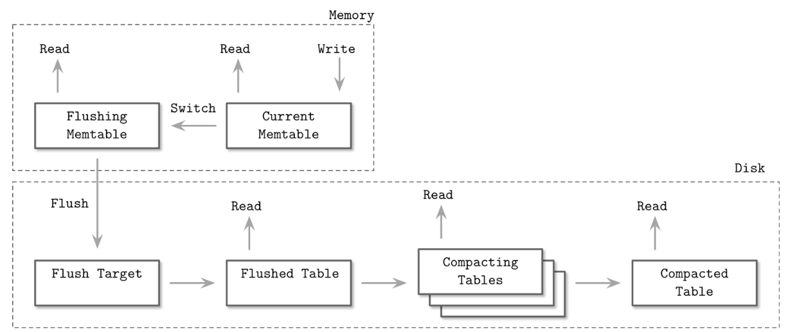
- 데이터는 이미 메모리에 정렬되어 있음
- 순차적으로 디스크에 쓰면 디스크 기반 테이블이 생성된다
- 플러시 진행동안 플러시 대상 멤테이블과 최신 멤테이블 모두 읽을 수 있다
- 멤테이블이 완전히 플러시 되기전 해당 내용이 유일하게 디스크에 저장된 곳은 **선행 기록 (write-ahead)** 로그
- 멤테이블이 디스크로 완전 플러시되면 로그에서 멤테이블 관련 작업이 기록된 부분은 삭제됨

### 수정과 삭제
- LSM 트리는 삽입, 수정, 삭제시 디스크에서 데이터를 찾을 필요가 없음
- 읽기 중 중복데이터가 조정된다
- 삭제 작업은 단순히 멤테이블에서 레코드를 삭제하는것 만으로 충분하지 않음
  - 다른 디스크 또는 인메모리 테이블에 동일 키 에 대한 데이터가 존재할수 있다
  - 멤테이블에서만 삭제한다면 아무런 영항이 없거나 이전 값을 부활 시킬 뿐이다
- 때문에 삭제 내역을 **명시적으로 기록** 해야 한다
- 해당 키의 삭제를 의미하는 특수한 삭제 항목 (delete entry, dormant certificate) 을 삽입한다

**[조건 제시 삭제 방식]**
- 특정 키가 아닌 연속된 키 범위를 삭제하는 방법이 효율적일 수 있음
- 삭제 항목에 **조건** 을 붙여 레코드 정렬 규칙을 유지하며 삭제 항목을 추가하는 방식
- 조정 단계에서 지정한 지정한 조건에 해당하는 레코드는 건너뛰고 클라이언트에게 반환하지 않는다

### LSM 트리 룩업
- LSM 트리는 여러 컴포넌트로 구성되며 룩업시 일반적으로 여러 컴포넌트에 접근한다
- 따라서 클라이언트에게 결과를 반환하기 전 내용을 병합하고 조정하는 작업이 필요하다

### 병합-반복

**[다방향 병합 정렬]**
- 디스크 테이블은 정렬되어 있기 때문에 **다방향 병합 정렬** 을 사용할 수 있다
- 다방향 병합 정렬은 N 개의 원소를 저장 및 정렬하고 다음으로 가장 작은 원소를 반환하는 최소 힙 등의 **우선순위 큐** 를 사용한다

**[병합 과정]**
- 각 반복자의 헤드를 큐에 저장하면 큐의 헤드 원소는 모든 반복자의 최솟값
- 큐에서 가장 작은 원소가 제거되면 해당 원소의 반복자가 가리키는 다음 값을 큐에 저장하고 **순서 유지** 를 위해 큐를 다시 정렬한다
- 모든 반복자 원소는 **항상 정렬** 되어 있으므로 마지막으로 가장 작은 값을 반환한 반복자의 다음 원소를 큐에 삽입해도 큐에는 모든 반복자의 갖아 작은 값이 있다는 것이 보장됨
- 반복자에 값이 더이상 없을 경우 다음 반복자의 헤드를 삽입하지 않고 계속 진행한다

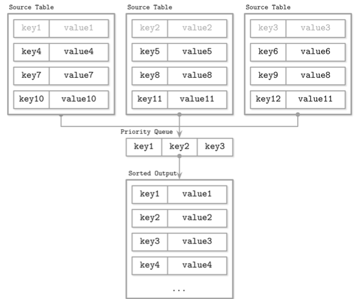

### 조정
- 병합-반복은 여러 소스 데이터를 병합하기 위해 수행하는 하나의 단계
- 다른 중요한 부분은 같은 키에 대한 여러 값 사이의 충돌 해결 및 조정 단계이다
- 여러 다른 테이블에 동일 키에 대한 업데이트/삭제 내역이 존재할 수 있기때문에 반드시 조정되어야 한다
- 타임스탬프를 비교해 여러 소스에서 오는 레코드 사이에 순서를 정하고 어떤 것이 더 최근의 것인지 판단한다

### LSM 트리 유지보수
- LSM 트리도 불변 B-트리와 마찬가지로 유지보수가 필요함
- 유지보수 작업은 알고리즘의 불변 요소의 영향을 많이 받는다
- B-트리의 경우 참조되지 않은 셀을 찾아 페이지에 대한 조각 모음을 수행해 삭제/섀도 처리된 레코드가 차지하는 공간을 **회수** 한다
- LSM 트리는 주기적인 **컴팩션** 을 통해 꾸준히 증가하는 디스크 테이블의 수를 줄인다

**[레벨형 컴팩션]**
- 가장 많이 사용되는 컴팩션 기법
- RocksDB 가 사용하는 방식
- 디스크 테이블을 여러 레벨로 나누고 각 레벨의 테이블 크기는 제한되며 각 레벨을 나타내는 식별자가 있다

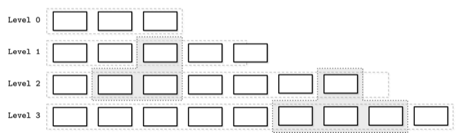
- 멤테이블이 플러시되면 0번 레벨 테이블이 생성됨
- 0번 레벨 테이블 수가 일정 수에 도달하면 데이터를 병합해 1번 레벨 테이블을 생성함
  - 0번 레벨 테이블 키의 범위는 겹칠 수 있다
  - 1번 레벨의 키 범위와 인덱스가 높은 레벨의 키 범위는 겹치지 않음
  - 컴팩션시 0번 레벨 테이블을 여러 범위로 파티션하고 같은 범위 테이블끼리 병합함
- 높은 인덱스 레벨에 대한 컴팩션은 이전 2개의 레벨에서 범위가 겹치는테이블을 합쳐 다음 레벨에 새로운 테이블을 생성한다
- 테이블이 파티션된 방식에 따라 같은 레벨에서 여러 테이블이 컴팩션될 수 있다

**[크기 단계별 컴팩션]**
- 크기 단계별 컴팩션은 테이블의 크기를 기준으로 디스크 테이블을 그룹화 하는 방식
- 작은 테이블, 큰 테이블을 나눠 비슷한 크기 끼리 그루핑한다
- 컴팩션을 통해 병합된 테이블은 같은 크기의 테이블이 저장된 레벨에 저장된다
- 이 과정을 레벨마다 재귀적으로 반복하면 크기가 큰 테이블은 높은 레벨로, 작은 테이블은 낮은 레벨로 이동한다
- 워크로드에 맞게 최적화 가능한 여러 알고리즘이 있음
- 카산드라는 타임 윈도우 알고리즘을 사용한다
- 유효기간이 있는 데이터를 처리하는 시계열 워크로드에 특화된 알고리즘
- 타임 윈도우는 데이터를 컴팩션 하거나 다시 쓰지 않고도 데이터가 쓰여진 시간을 참고해 이미 만료된 시간 범위에 속하는 파일을 한 번에 삭제할 수 있다

`테이블 기아 현상`
- 크기 단계별 컴팩션의 문제 중 하나
- 컴팩션된 테이블의 크기가 여전히 작은 경우 높은 인덱스 레벨의 테이블은 컴팩션 기회를 얻지 못해 이들의 툼스톤이 정리되지 않는다
- 따라서 읽기 비용이 증가하게 된다 이런 경우 레벨에 테이블수가 많지 않아도 컴팩션을 강제로 수행해야 한다

## 읽기, 쓰기, 메모리 공간 증폭
- 데이터를 디스크에 불변 방식으로 저장할 때 다음 3 가지 문제가 발생할 수 있다
1. 읽기 증폭
   - 데이터를 읽기 위해 여러 테이블을 참조하며 발생
2. 쓰기 증폭
   - 컴팩션 과정에서 발생하는 연속된 재작성으로 인해 발생
3. 공간 증폭
   - 같은 키에 대해 여러 레코드가 존재할 때 발생

### RUM 예측
- RUM 예측은 읽기, 업데이트, 메모리 오버 헤드를 기준으로 비용을 계산하는 보편적인 스토리지 자료구조의 비용 모델
- 세 가지 오버헤드 중 두 개를 줄이면 나머지 오버헤드가 불가피하게 증가하게 된다
- 따라서 최적화는 세 가지중 한 가지를 희생해야할 수 밖에 없다
- 가장 이상적인 솔루션은 낮은 메모리와 쓰기 오버헤드를 유지하며 읽기 비용을 최소화 하는 것
- 하지만 이는 현실적으로 불가능하며 트레이드-오프가 존재한다
- RUM 비용모델은 완벽하지 않다
- 레이턴시와 접근 패턴, 구현 복잡도, 유지보수 오버헤드, 하드웨어 등은 관려하지 않기 때문이다
- 데이터 일관성 유지와 이중화 오버헤드등 분산 데이터베이스 에서 중요한 개념도 고려하지 않는다
- 하지만 이 모델은 스토리지 엔진의 기본적인 기능을 이해하는데 도움이 되기에 일차적인 비용 계산 규칙으로 사용할 수 있다

## 세부 구현 설명

### SSTable
- 디스크기반 테이블은 일반적으로 SSTable (Sorted String Table) 을 사용해 구현한다
- 이름 그대로 레코드를 키 순서대로 정렬해 저장
- 인덱스 파일, 데이터 파일로 구성됨
- 인덱스 컴포넌트는 키와 데이터 (데이터 파일의 오프셋) 로 구성됨
- 데이터 컴포넌트는 연결된 키-값 쌍으로 구성
- 컴팩션시 인덱스 컴포넌트에 접근하지 않아 파일을 순차적으로 읽으면 됨
  - 레코드가 정렬되어 있으므로..

**[인덱스 파일]**
- B-트리 등의 로그 시간 룩업이 가능한 자료구조 또는 해시 테이블 등 상수 시간 룩업이 가능한 자료구조를 사용해 구현함
- 데이터 파일의 레코드를 가리키는 포인터가 저장된다
- 인덱스 생성 시점에 오프셋이 모두 파악되어야 한다

**[데이터 파일]**
- 레코드를 키 순서로 저장하기에 해시 테이블을 사용해 인덱싱 해도 범위 스캔을 쉽게 구현 가능
- 해시 테이블에서 해당 범위의 첫 번째 키를 찾고 데이터 파일에서 해당 키 부터 범위를 벗어날때 까지 순차적으로 읽음

### 블룸 필터
- 테이블 룩업을 방지하기 위해 메타데이터에 키 범위를 저장하고 검색 키가 범위에 속하는지 미리 확인이 가능하다
- 하지만 이 정보는 부정확하다. 때문에 아파치 카산드라, RocksDB 는 블룸 필터를 사용한다
- 버튼 하워드 블룸이 1970년 고안한 자료구조
- 어떤 원소가 집합에 속하는지 여부를 확인할 수 있는 공간 효율적인 확률적 자료구조
- 양성 오류는 발생가능하나 음성 오류는 발생하지 않는다
- 디스크 기반 테이블과 블룸 필터를 같이 사용하면 읽기 작업의 테이블 접근 횟수를 크게 줄일 수 있다

**[특징]**
- 큰 비트 배열과 여러 해시 함수를 사용
- 다른 키를 대입한 해시 함수의 결과가 같은 위치를 가리키는 해시 충돌이 발생할 수 있다
- 양성 오류의 발생 확률을 비트 배열의 크기와 해시 함수의 수로 제어한다
  - 배열 크기가 클수록 해시 충돌 확률이 줄고, 해시 함수가 많을 수록 정확도가 증가함

### 스킵리스트
- 데이터를 여러 메모리에 정렬해 저장하는 여러 자료구조가 있다
- 스킵리스트는 단순함 때문에 최근에 더욱 많이 쓰이는 자료구조
- 싱글 링크드 리스트보다 구현이 복잡하지 않으며 확률적 복잡도도 탐색 트리와 비슷한 수준이 보장됨
- 삽입과 업데이트시 구조를 회전 또는 재배치 하지 않고 확률적으로 균형 유지함
- 인메모리 B-트리보다 캐시 친화적이지 않음
- 이 문제는 전개형 링크드 리스트를 사용해 해결 가능

**[특징]**
- 높이가 다른 여러 노드로 구성
- 이들을 연결한 계층 구졸르 통해 일부 요소를 건너뛸 수 있음
- 각 노드에 키가 존재하고 링크드 리스트와 달리 일부 노드에 두 개 이상의 후속 노드가 있을 수 있음
- 높이가 h 인 노드는 한 개 이상의 높이가 최대 h 인 이전 노드와 연결됨
- 가장 낮은 레벨의 노드는 모든 높이의 노드와 연결될 수 있음
- 노드의 높이는 삽입시 임의의 함수를 통해 결정됨

**[탐색 과정]**
- 최상위 레벨 포인터에서 시작
- 검색 키 보다 더 큰 키가 저장된 노드를 찾으면 이전 노드가 가리키는 다음 노드로 이동
  - 현재 노드 보다 검색 키가 큰 경우 계속 이동하고 작다면 다음 레벨 이전 노드로 이동
- 검색 키 또는 바로 앞 키를 찾을때 까지 이 과정을 재귀적으로 반복

`스킵리스트에서 7번 키를 찾는 과정`

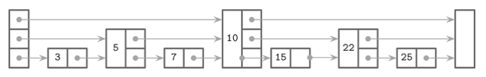
1. 최상위 레벨 포인터를 따라 10번 키가 저장된 노드를 이동한다
2. 10은 검색 키 보다 크기 때문에 헤드 노드의 다음 레벨 포인터가 가리키는 5가 저장된 노드로 이동한다
3. 이 노드의 최상위 레벨의 포인터를 따라가면 다시 10이 저장된 노드로 이동한다
4. 7은 10보다 작기 때문에 5가 저장된 노드의 다음 레벨의 포인터를 따라가면 7이 저장된 노드를 찾을 수 있다

**[삽입 과정]**
- 삽입도 마찬가지로 위와 돤일한 단계로 삽입 지점을 찾아 해당 지점에 새로운 노드를 삽입한다
- 트리와 유사한 계층 구조를 형성하고 균형 을 유지하기 위해 노드의 높이는 확률 분포를 기반으로 생성된 임의의 수로 설정한다
- 새로운 노드의 키보다 작은 키가 있는 앞 노드의 포인터가 새로운 노드를 가리키도록 수정한다
- 더 높은 레벨의 포인터는 그대로 유지하고 새로운 노드의 포인터는 각 레벨의 다음 노드를 가리킨다

### 디스크 접근
- 스토리지 기기는 보통 데이터를 블록 단위로 제공
- 많은 LSM 트리 구현이 페이지 캐시를 사용한다
- 인메모리 데이터는 수정할 수 없기 떄문에 동시 접근에 잠금/래치 를 사용할 필요가 없음
- 참조 카운팅 기법을 사용해 현재 참조된 페이지가 메모리에서 제거되는 것을 방지하고 컴팩션으로 인해 파일 삭제되기 전 진행중인 작업을 완료할 수 있다

`페이지와 얼라인 되지 않은 데이터 레코드`

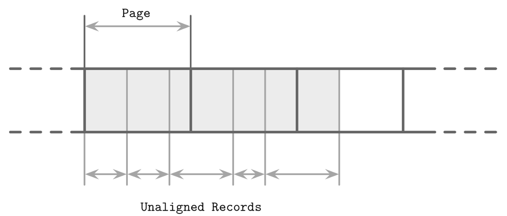
- LSM 트리의 데이터 레코드는 페이지와 얼라인 되지 않을 수 있다
- 포인터는 페이지 ID 가 아닌 절대 오프셋을 사용해 구현이 가능하다

### 압축
- LSM 테이블은 불변 자료구조 이고 일반적으로 싱글 패스로 저장한다
- 데이터를 페이지 단위로 압축하면 압축된 페이지는 압축되지 않은 페이지보다 크기가 작기 때문에 페이지와 얼라인 되지 않는다

`압축된 블록과 압축되지 않은 블록 사이의 매핑`

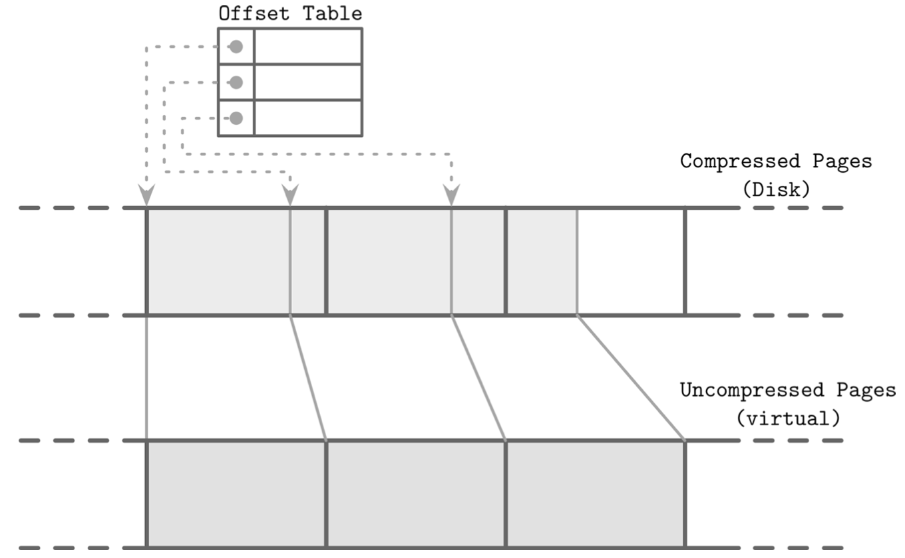
- 압축된 페이지에 접근하려면 저장시 데이터 주소 범위를 기록해야 한다
- 압축된 페이지의 오프셋과 크기를 젖아하는 간접 레이어를 통해 압축된 페이지에 접근할 수 있다
- 압축된 페이지는 항상 원본보다 크기가 작으며 그렇지 않으면 압축할 필요가 없다
- 컴팩션 및 플러시 시 압축된 페이지를 순차적으로 추가하고 관련 압축 정보는 별도의 파일 세그먼트에 저장한다
- 페이지가 요청되면 압축된 페이지의 오프셋과 크기를 참조해 압축을 해제하고 메모리에 실체화 한다

## 비정렬 LSM 스토리지
- 데이터를 임의의 순서로 저장하는 자료구조에 대해 살펴보자
- 순서를 보장하지 않는 스토어는 일반적으로 별도의 로그가 필요 없고 레코드를 삽입 순서대로 저장하기 때문에 쓰기 비용이 줄어든다

### 비트 캐스크
- 리악 (Riak) 에서 사용되는 스토리지 엔진 중 하나인 비트캐스크는 정렬되지 않은 로그 구조 기반의 스토리지 엔진이다
- 멤 테이블을 버퍼로 사용하지 않고 데이터 레코드를 로그 파일에 바로 저장한다

**[keydir]**
- 레코드를 검색할 수 있도록 각 키의 최신 데이터 레코드에 대한 참조를 keydir 이라는 자료 구조에 저장한다
- keydir 에서 참조하지 않는 이전 데이터 레코드들이 여전히 디스크에 남아있을 수 있다
- 이런 이진 데이터 레코드는 컴팩션 시 가비지 컬렉터가 정리한다
- keydir 은 해시맵 형태이며 시스템 가동 시 로그 파일을 사용해 재구성 한다

**[쓰기 처리]**
- 쓰기 요청시 새로운 데이터 레코드는 로그 파일에 순차적으로 추가하고 새로운 레코드의 위치를 가리키는 포인터를 keydir 에 추가한다

**[읽기 처리]**
- 읽기 요청시 keydir 에서 해당 키를  찾고 로그파일을 가리키는 포인터를 따라가면 레코드를 찾을 수 있다
- keydir 에는 키별 한 개의 값만 존재하기 때문에 포인트 쿼리는 여러 소스의 데이터를 병합하지 않아도 된다

`비트캐스크의 키와 데이터 파일에 저장된 레코드를 매핑하는 방식`

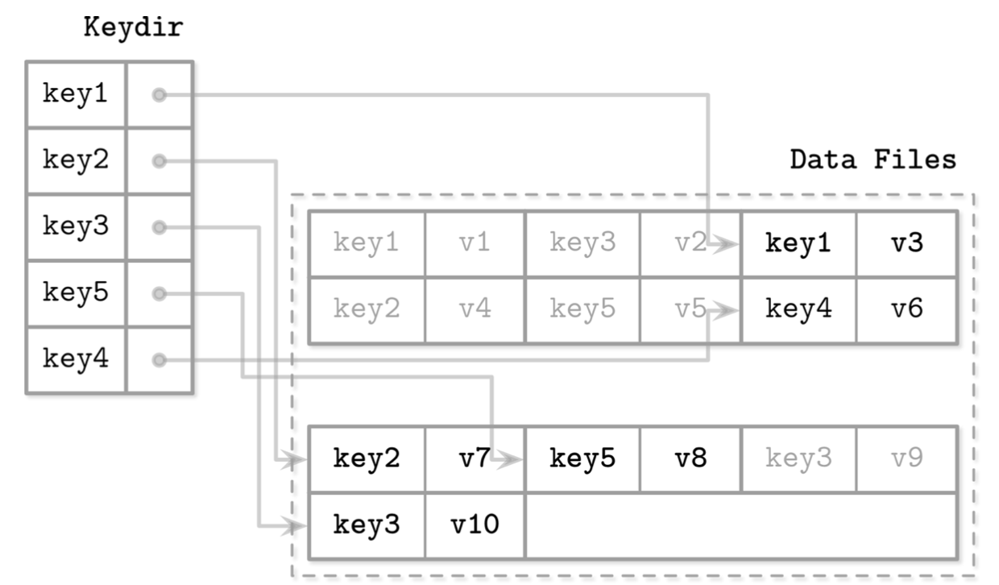
- 로그 파일에는 데이터 레코드를 저장하고 keydir 에는 각 키의 최신 실제 레코드를 가리키는 포인터를 저장한다
- 데이터 파일에서 회색으로 표시된 레코드는 삭제처리 된 레코드이다
- 데이터 레코드는 로그 파일에 바로 쓰기 때문에 선행 기록 로그가 필요 없다
  - 공간 오버헤드와 쓰기 증폭이 줄어듦
- 단점은 레코드가 정렬되어 있지 않기에 범위 스캔이 불가능하고 오직 포인터 쿼리만 수행할 수 있다
- 장점은 단순함과 높은 포인트 쿼리 성능이다.

### 위스키
- 위스키는 LSM 트리에 키를 정렬된 상태로 유지하고 vLog (value log) 라는 정렬되지 않은 추가 전용 파일에 데이터 레코드를 저장해 가비지 컬렉션과 정렬 작업을 분리한다
- 모든 키를 메모리에 저장하고 시스템 가동 시 해시 테이블을 재구성 해야하는 비트캐스크의 문제를 해결할 수 있다

`위스키의 주요 구성 요소 및 키와 로그 파일 사이의 매핑`

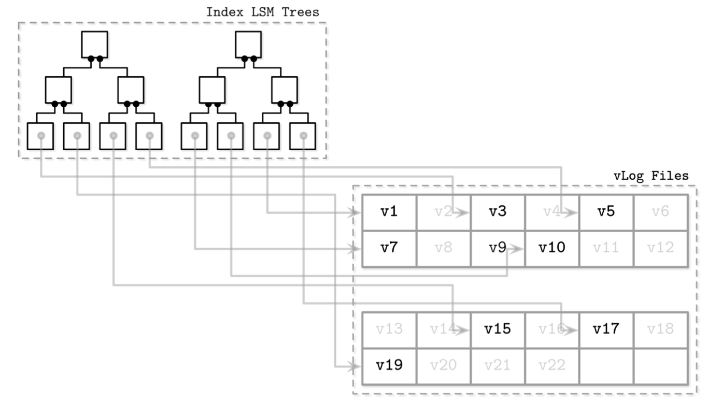
- vLog 파일에는 데이터 레코드를 임의의 순서로 저장하고 정렬된 LSM 트리에는 로그 파일에 저장된 최신 레코드를 가리키는 키를 저장한다
- 위스키는 업데이트/삭제 빈도가 낮아 가비지 컬렉션이 회수해야 하는 디스크 공간이 크지 않는 환경에 적합하다

**[컴팩션]**
- 컴팩션시 vLog 파일을 순차로 읽고 병합한 뒤 새로운 위치에 쓴다
- 포인터는 새로운 위치를 가리키도록 업데이트한다
- 위스키는 vLog 파일 전체를 스캔하는 것을 방지하지 위해 활성 상태의 키가 저장된 vLog 의 세그먼트에 대한 정보가 저장된 head/tail 포인터를 사용한다

## LSM 트리 동시성 제어
- LSM 트리의 가장 큰 동시성 문제는 테이블 뷰 전환과 로그 동기화 관련이다

**[플러시 작업 규칙]**
- 새로운 멤 테이블은 읽기 및 쓰기가 가능해야 한다
- 기존 멤테이블은 읽을 수 있어야 한다
- 플러시 대상 멤테이블은 디스크에 젖아된다
- 플러시된 멤테이블 삭제와 디스크 기반 테이블 생성은 원자적으로 수행되야 한다
- 플러시된 멤테이블에 수행된 작업의 로그가 저장된 선행 기록 로그 세그먼트는 삭제되야 한다

> 아파치 카산드라는 작업 수행 순서를 강요해 위 규칙을 따른다  
> 모든 쓰기 관련 작업은 멤테이블을 플러시하기 전 수행되기 때문에 플러시 프로세스는 어떤 프로세스가 자신에게 의존하는지 알 수 있다

**[동기화 단계]**
- 멤테이블 전환
  - 전환 후 새로운 멤테이블이 모든 쓰기 요청을 처리하는 기본 멤테이블이 된다
  - 기존 멤테이블은 계속해서 읽을 수 있다
- 플러시 완료
  - 기본 멤테이블을 테이블 뷰의 플러시된 디스크 기반 테이블로 대체한다
- 선행 기록 로그 삭제
  - 플러시된 멤테이블과 관련된 로그가 기록된 로그 세그먼트를 삭제한다

> 로그 삭제를 플러시와 동기화하지 않으면 데이터 유실이 발생할 수 있다.  
> 플러시가 끝나기 전 로그 세그먼트가 삭제되고 동시에 노드 장애 발생시 로그 리플레이 및 데이터 복원은 불가능하다

## 로그 스태킹
- 로그 구조 스토리지 시스템은 SSD 의 가격이 저렴해지면서 인기를 끌기 시작
- LSM 트리와 SSD 는 잘 어울리는 조합이다
- SSD 성능을 저하시키는 인플레이스 업데이트로 인한 쓰기 증폭은 순차 처리와 추가 전용 쓰기 방식으로 줄일 수  있음
- 여러 로그 구조 시스템을 쌓은 스택 구조에서는 쓰기 증폭과 단편화, 성능 저하 같은 LSS 로 해결하려 했던 여러 문제가 다시 발생할 수 있다
- 애플리케이션 개발시 SSD 플래시 변환 계층과 파일 시스템을 염두해야 한다

### 플래시 변환 계층
- SSD 에서 로그 구조 매핑 레이어가 필요한 이유 ?
  - 소규모의 랜덤 쓰기를 물리적 페이지에 일괄 적용
  - SSD 는 프로그램/삭제 사이클을 기반으로 동작

`여러 블록으로 그룹화된 SSD 페이지`

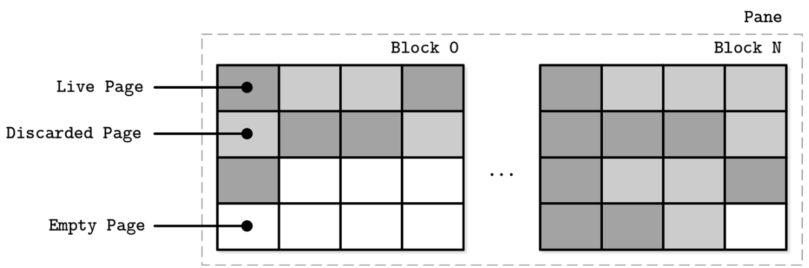

- 페이지는 개별 삭제가 불가능하고 여러페이지로 구성된 블록 단위로만 삭제할 수 있다

**[플래시 변환 계층 FTL]**
- FTL 은 논리적 페이지 주소를 물리적 위치로 변환해 페이지의 상태를 고나리한다
- 사용 가능한 페이지가 부족한 경우 FTL 은 가비지 컬렉션을 수행하고 삭제된 페이지를 정리한다

`사용중인 페이지를 기존 블록에서 새 위치로 재배치하는 과정`

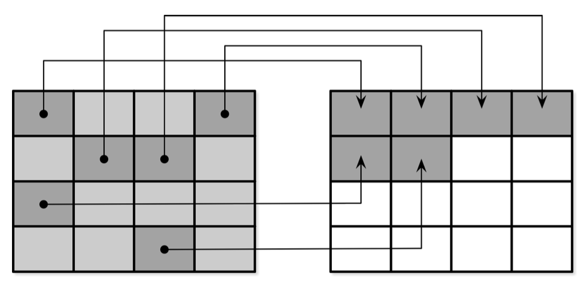
- 블록 내 모든 삭제된 페이지는 항상 제거되는 것은 아니다
- 블록 삭제 전 FTL 은 사용중인 페이지를 빈 페이지가 있는 다른 블록으로 옮긴다

