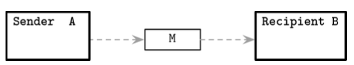
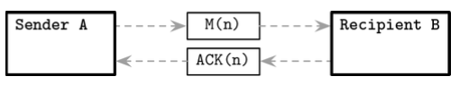
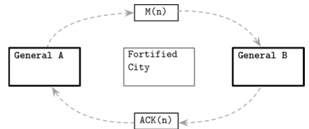

# 지옥 스터디 - 08 분산 시스템 개요

## 동시 수행
- 두 개의 스레드가 같은 변수를 동시에 요청 했을 때 결과를 예측할 수 없다.
  - 스레드 간 수행 순서를 맞추지 않은 경우
- 스레드는 공유된 자원에 접근하고 개별적으로 연산을 수행한 후 결과를 다시 공유 자원에 쓴다.
- 수행 단계를 정확하게 정의하고 가능한 결과수를 줄이기 위해 **일관성 모델** 이 필요하다.

**[일관성 모델]**
- 일관성 모델은 동시에 수행되는 작업이 순서를 정의하고 다른 참가자가 순서를 알 수 있도록 하는 것이다
- 이를 사용해 시스템 상태 종류를 제한하거나 완화할 수 있다.

**[동시성과 병렬성]**
- 동시 수행은 한 대의 커피머신에 두줄을 세우는 것과 같고, 병렬 수행은 두 대의 커피머신에 두줄을 세우는 것과 같다.
- 대부분의 경우 시스템이 여러 개의 스레드를 병렬로 실행하는 것을 동시성이라고 표현한다.
- 벙렬성이라는 용어는 거의 사용하지 않는다.

## 분산 시스템의 자원 공유
- 분산 시스템에서도 DB 처럼 정보를 한 곳에 두는 용도의 공유 메모리 개념을 사용할 수 있다.
- 하지만 동시 요청 문제를 해결한다 해도 모든 프로세스의 동기화를 보장할 수 없다.

## 분산 컴퓨팅의 오류

### 프로세싱
- 원격 프로세스는 전달받은 메시지에 대한 응답을 위해 로컬에서 수행할 작업이 있다.
- 따라서 프로세싱은 즉각적이라 가정할 수 없다.
- 메세지가 전달되는 즉시 프로세싱이 시작된다는 보장도 없다.
- 작업을 원격 서버 대기열에 등록하고 대기해야만 한다.
- 큐의 용량은 제한적이고 요청을 계속 쌓기만 하는 것은 도움이 되지 않는다.
- 백프레셔 알고리즘은 프로듀서가 컨슈머가 처리가능한 속도보다 더 빠른 속도로 발행하는 경우 이를 늦추는 알고리즘이다.
- 보통 시스템 설계의 일부분이 아닌 임시 방편으로 사용된다
- 큐의 용량을 늘리면 효율적인 스케줄링이 가능할것이라 믿지만 그렇지 않다.
- 프로세싱 속도에는 아무런 영향을 미치지 않기 때문에 레이턴시가 증가할 수 있다

**[로컬 큐를 사용하는 이유]**
- 분리 (decoupling)
  - 메세지 수신과 처리를 시간적으로 분리하고 독립적으로 수행한다
- 파이프라이닝 (pipelining)
  - 서로 다른 단계에 있는 요청은 각 독립된 서브 시스템이 처리한다
  - 메세지를 수신하는 서브시스템은 이전 메세지가 완전히 처리될 때까지 블록하지 않아도 된다
- 일시적 급증 부하처리
  - 시스템 부하는 일정하지 않고 요청을 처리하는 컴포넌트는 새로운 요청이 도착하는 시간을 알 수 없다
  - 전체 시스템 레이턴시는 요청이 큐에서 대기하는 시간으로 인해늘어난다

## 클럭과 시간
- 두 서버의 클럭이 동기화됐다는 가정은 위험하다
- 특히 시계열 데이터와 실시간 데이터 처리시 레이턴시가 없다/프로세싱은 즉각적이다 라는 가정과 맞물려 또 다른 문제를 유발한다
- 모든 공기 시스템의 타임아웃은 로컬 클럭에 의존한다
- 분산 시스템에서 클럭 동기화는 쉽지 않으며, 현재 시간은 항상 바뀐다는 점을 인지해야 한다
- POSIX 타임스탬프를 요청하고 몇 가지 작업 이후 다시 요청하면 앞서 요청시간과 일치하지 않는다
  - 시간 제공자와 타임스탬프가 의미하는 정확한 순간을 이해하는 것이 중요
- 클럭이 단조 클럭인지 여부와 예정된 시간 관련 작업 사이에 시간 차이가 얼마나 있을지 아는 것은 많은 도움이 될 수 있다

### 상태 일관성
- 분산 알고리즘은 상태에 대한 일관성을 완벽히 보장하지 않는다
- 일부는 제약조건이 엄격하지 않고 복제 노드간의 상태차이를 허용하며 **충돌 해결 (conflict resolution)** 과 **읽기중 데이터 복구 방식 (read-time data repair)** 을 이용해 상태차이를 해결한다
- 최종적 일관성 (eventual consistency) 을 보장하는 분산 시스템에는 읽기 중 노드 쿼럼 (정족수) 을 쿼리해 복제 노드 사이의 상태 불일치를 해결하는 로직이 있을 수 있다.
  - 데이터베이스 스키마/클러스터 뷰가 완전히 일치한다고 가정
- 이 둘의 일관성을 강제하지 않는 다면 심각한 문제가 발생할 수 있음
- 아파치 카산드라의 경우 스키마 변경 사항이 각 서버로 다른 시점에 전파되는 문제로 인한 버그가 발견 됬었다
  - 변경사항 전파 전 서로 다른 형식의 스키마를 인코딩/디코딩 하며 데이터베이스가 손상되는 버그

### 로컬 실행과 원격 실행
- API 뒤에 복잡한 로직을 숨기는 것은 위험할 수 있음
- 로컬 실행과 원격 실행을 동일한 인터페이스 뒤에 감추면 편리하지만 직관적이지 않을 수 있다
- 로컬 실행과 원격 실행은 완전 다른다는 사실을 인지해야 한다
- 원격 호출은 로컬실행 보다 비용이 몇배이상 크기 때문에 레이턴시가 존재한다.

### 장애 처리
- 모든 노드가 정상 동작한다고 시스템 설계를 시작하는 것은 위험하다
- 점검을 위해 중단되기도 하고, 소프트웨어 문제, 메모리 부족, 런타임 에러, 하드웨어 문제 등으로 장애가 발생한다
- 이는 다양한 원인이 존재할 수 있다
- 일부 분산 알고리즘은 하트비트 프로토콜과 장애 검출기를 사용해 어떤 노드가 살아있고 접근 가능한지 추측한다.

### 네트워크 파티션과 부분 장애
- 네트워크 파티션 : 2개 이상의 서버가 서로 통신할 수 없는 상황
- 격리된 그룹들이 각자 작업을 수행해 결과가 충돌할 수 있다
- 비대칭 네트워크 링크가 발생할 수 있음
  - 메세지가 한 프로세스에서 다른 쪽으로 전달 되지만 반대방향은 실패하는 경우
- 머피의 법칙에 따르면 시스템 장애는 언젠가 발생한다
- 분산 시스템 엔지니어의 역할 : 장애가 발생할 수 있는 상황 최소화/피해를 감당가능한 수준으로 사전에 준비하는 것

### 계단식 장애
- 장애는 분리가 불가능할 수 있음
- 특정 프로세스 사용량이 급증하면 클러스터 전체에 영향을 미친다
- 계단식 장애 : 시스템의 한 부분에서 다른 부분으로 전파되 오류 범위를 확장
- 이는 우호적인 의도에서 비롯되기도 함
- 잠시 오프라인 상태가된 노드가 최신 상태를 전달받지 못했다가, 온라인 상태가 된 이후 최신 상태를 공유받기 위해 스트리밍한다
- 이 경우 리소스 과다 사용으로 인한 장애가 발생할 수 있다
- 과부하에 걸려 응답이 없는 서버와 통신하기위해 클라이언트는 지속적인 재 연결 시도를 한다
- 이를 방지하기 위해 잠시 대기하는 백 오프 전략을 사용한다
- 재시도를 스케쥴링 하고 요청 사이의 시간을 늘려 증폭 문제를 해결한다

## 분산 시스템 추상화
- 공통 용어를 사용하면 개념 설멍시마다 새로운 단어를 만들지 않아도 된다
- 일반적으로 프로그래밍 언어에 대해 설명할 때 공통 용어를 사용하고 정의한다
- 강연, 책, 논문에서 자주 쓰이는 분산 시스템 관련 용어를 살펴보자

### 링크
- 네트워크는 신뢰성이 낮다
- 메세지는 분실 또는 전송이 지연될 수 있고 순서가 바뀔 수 있다

`손실될 수 있는 링크`
- 링크로 연결된 두 개의 프로세스가 있다
- 다음 그림과 같이 메세지를 서로 교환할 수 있다
- 하지만 모든 통신 매체는 불완전하기 때문에 메세지는 분실되거나 전송이 지연될 수 있다

- 이 방식에서 송신자는 메세지의 전달 여부를 확인할 수 없다
- 이 경우를 **손실 허용 링크** 라고 한다

**[손실 허용 링크의 속성]**
- 손실 허용성
  - 송신자와 수신자가 정확하다면 송신자가 무한정 재전송한 메세지는 결과적으로 전달됨
- 유한 중복성
  - 메세지는 무한히 중복 전달되지 않음
- 생성 불가성
  - 링크는 메세지를 생성하지 않음

> 손실 허용 링크는 유용한 추상화이며, 보장성이 높은 통신 프로토콜의 중요한 구성 요소이다

`메세지 확인 응답`
- 메세지 확인 응답 : 메세지의 상태를 정확히 판단하기 위해 수신자가 메세지를 수신했음 알리는 수단
- 양방향 통신 채널과 메세지를 구별가능한 수단이 필요
  - 시퀀스 번호와 같은 단조적으로 증가하는 메세지 식별자가 필요함

`메세지 재전송`
- 확인 응답 추가만으로 프로토콜을 신뢰할 수는 없다
- 전송중 누락되거나 확인 응답 보내기전 장애가 발생할 수 있다
- 재전송 : 송신자가 잠재적으로 실패한 작업을 재시도 하는 행위
- 분산시스템 용어로 이 추상화를 **스터번** 링크 라고 한다
- 송신자는 메세지가 성공적으로 전달될 때 까지 계속해서 재시도 한다

`재전송 문제`
- 연산을 재수행하고 메세지를 재전송할 수 있지만 불필요한 중복이 발생할 수 있다
- 멱등 연산인 경우에만 중복 메세지를 안전하게 처리할 수 있다
- 멱등 연산 : 여러 차례 수행해도 부작용이 없과가 동일한 연산
- 멱등성은 부분적 장애와 네트워크 파티션이 발생가능한 환경에서 더 중요하다
- 모든 작업이 멱등적이라는 가정은 비현실적
- 멱등에 준하는 결과를 보장하는 방법이 필요하다
- 이를 위해 중복 제거 기능을 사용하면 메세지 중복 처리를 방지할 수 있다

`메세지 순서`
- 신뢰성이 낮은 네트워크는 메세지 전송 순서대로 도착하지 않을 수 있고 재전송으로 인한 같은 메세지가 여러번 전송될 수 있음
- 시퀀스 번호를 사용해 선입 선출 방식의 순서 유지가 가능하다
- 분산 시슽메에서 이를 **퍼펙트** 링크 라고 한다

**[퍼펙트 링크의 속성]**
- 전송 신뢰성
  - 정상 적은 프로세스 A - B 사이에 한번 전송된 메세지는 결국 전달됨
- 전송 비중복성
  - 메세지는 한 번만 전송된다
- 생성 불가성
  - 오직 실제 전송된 메세지만 전달될 수 있다

`정확히 한 번 전달`
- 분산시스템의 난제 : 정확히 한 번 전달
- 링크 장애로 인해 처음부터 메세지가 전달되지 않을 수 잇기 때문에 대부분의 시스템은 확인 응답을 받지 못한다면 실패로 간주하는
- **최소 한 번 전달 방식 (at-least-once delivery)** 을 사용한다
- **최대 한 번 전달 (at-most-once delivery)** 방식은 메세지 전송 이후 전달 여부는 신경쓰지 않는다
- 정확히 한번 속성을 보장하기 위해서는 모든 노드가 공통 정보를 공유해야 한다
- 모든 노드는 레코드의 상태에 대해 동의해야 한다
- 이는 이론적으로 불가능하기에 일부 조정 조건을 완화해 이 조건을 보장한다
- 모든 메세제를 한 번만 전송하는 신뢰할 수 있는 링크는 존재하지 않음
- 모든 메세지를 한 번 처리하고 중복된 메세지는 무시하면 한 번 전달된것 과 같은 효과이다

> 분산 시스템의 프로세스 사이의 일관성/일치성 보장 방법을 살펴보자

### 두 장군 문제
- 분산 시스템의 맥락에서 **합의** 의 의므를 가장 잘 설명한 사고 실험
- 이는 비동기 통신 중 링크 장애 발생시 참가자 간의 합의 달성이 불가능 하다는 것을 증명한다
- 두 장군이 이끄는 군대가 요새를 공격할 준비를 하고 있다고 가정
- 군대는 도시의 양쪽에서 동시에 공격해야면 포위할 수 있다
- 두 장군은 전령을 통해 의사소통을 하고 사전에 합의된 공격 계획이 있다
- 두 장군은 합의를 이뤄야 한다
- 전령을 통해 동의를 보냈지만 이동중 포획되어 전달하지 못할 수도 있다
- 전달 받은 장군은 메세지를 다시 보내야 한다
- 확인 응답또한 전달중 포획될 수 있다
- 두 장군 사이의 통신은 완전히 비동기 적이다

### FLP 불가능성 이론
- 이 이론은 초깃값을 가진 여러 프로세스가 새로운 값에 대해 합의하는 과정을 설명한다
- 알고리즘 완료 이후 모든 정상 프로세스의 최신 값은 동일해야 한다
- 합의 프로토콜은 프로세스의 상태를 초기 상태에서 합의된 상태로 전환한다

**[정상적인 합의 프로토콜의 속성]**
- 일치성
  - 프로토콜의 결관느 모두가 동의해야 한다
  - 특정 값을 선택하고 모든 프로세스의 값은 일치해야 한다
  - 그렇지 않다면 합의는 실패
- 유효성
  - 결정된 값은 특정 프로세스가 제안한 값
  - 시스템이 임의의 값을 만들어 낼 수 없다
- 유한성
  - 합의는 오직 모든 프로세스가 확정된 상태가 됬을때 유효함

### 시스템 동기성
- 타이밍 관련 과정은 분산 시스템에서 매우 중요
- 일반적으로 프로세스간의 처리 속도 차이는 크지 않음
- 링크를 통해 메세지 전달시 시간이 무한정 오래 걸리지 않는다
- 시간에 의존하면 문제 파악이 간단해지고 보장할 타이밍을 제한할 수 있다
- 동기 모델 기반 시스템 에서는 타임아웃을 사용할 수 있다
- 리더 선출과 합의, 장애 감지와같은 더 복잡한 추상화를 구현할 수 있다
- 최선의 상황은 더욱 견고해지지만 타임이 조건이 충족되지 않으면 장애가 발생한다
- 래프트 합의 알고리즘은 여러 프로세스가 서로 리더라 생각하는 상황이 발생할 수 있다
- 동기 모델과 비동기 모델의 속성을 합친 모델을 부분 동기 모델이라고 한다
- 부분 동기 시스템은 동기 시스템의 일부 속성을 내재하지만 메세지 전달시간과 클럭차이, 상대적 처리 속도의 범위는 다를 수 있다
- 동기성은 분산 시스템에서 매우 중요한 속성

## 장애 모델
- 장애 모델 : 분산 시스템의 프로세스에 발생할 수 있는 장애를 정의한 모델
- 분산 시스템은 여러 프로세스가 협조해 알고리즘을 수행한다
- 장애 발생시 시스템 전체에 걸쳐 알고리즘이 잘못 수행될 수 있다
- 충돌과 누락 임의의 장애 등의 분산 시스템의 장애 모델을 살펴본다

### 충돌
- 가장 단순한 프로세스 충돌 : 프로세스가 알고리즘 수행을 중단하고 다른 프로세스에 더 이상 메세지를 보내지 않는 경우
- 일반적으로 모든 프로세슨느 충돌-정지 프로세스 라고 가정
- 충돌한 프로세스는 계속해서 이 상태를 유지한다는 속성을 가진다
- 알고리즘은 복구를 통해 정호가성과 라이브니스를 보장하지 않음을 의미함
- 충돌-복구 모델은 또 다른 프로세스 추상화 이다
- 알고리즘 수행중 중단된 프로세스는 복구시 남은 단계를 이어서 수행한다
- 프로세스를 복구하려면 상태 개념과 복구 프로토콜이 필요함
- 충돌-복구 모델 기반 알고리즘은 모든 가능한 복구 상태를 고려해야 한다
- 복구에 의존하는 알고리즘은 프로세스의 존재와 상태를 반드시 고려해야 한다
- 프로세스 관점에서 연결이 끊어진 프로세스와 장애 이후 복구된 프로세스를 구분할 수 없기 때문에 **누락 장애** 모델로 볼 수 있다

### 누락
- 이 모델은 프로세스가 알고리즘의 단계 중 일부를 건너뛰거나 수행할 수 없는 상태이거나 다른 참가자가 실행 여부를 알 수 없거나 참가자가 서로 메세지를 교환할 수 없는 상태 라고 가정
- 네트워크 링크 및 스위치 고장, 네트워크 정체 등으로 인한 네트워크 파티션이 누락의 원인
- 네트워크 파티션 : 개별 프로세스 또는 프로세스 그룹 간의 메세지 누락으로 표현 가능
- 충돌은 프로세스 사이에 교환되는 모든 세메지를 완전히 무시해 재현할 수 있다
- 누락은 알고리즘의 일부를 건너 뛰거나 수행 결과 확인이 불가능할 때 발생한다
- 간헐적 연결 끊김, 네트워크 과부하, 큐 공간 부족 등으로 인해 발생할 수도 있음

### 임의의 장애
- 임의의 장애 또는 비잔티움 장애는 가장 해결하기 어려움
- 이런 장애는 소프트웨어 버그 혹은 알고리즘 버전 차이로 인해 발생할 수 있다
- 상대적으로 파악하기 쉬우나 모든 프로세스를 직접 제어할 수 없거나 특정 프로세스가 다른 프로세스를 악용하는 경우 매우 어려워질 수 있음

### 장애 처리
- 프로세스를 여러 그룹으로 나눠 다중화하면 장애 발생 사실을 숨길 수 있음
- 특정 노드에 장애가 발생해도 사용자는 이 사실을 인지하지 못한다
- 장애는 성능 저하의 요인이 될 수 있다
- 대부분의 장애는 코드리뷰와 테스트, 타임아웃과 재시도 그리고 알고리즘 단계의 수행 순서를 보장해 방지할 수 있다

## 요약
- 링크 : 메세지를 전달하지 못할 수 있고 프로세스는 충돌할 수 있으며 네트워크 파티션이 발생할 수 있음
- 이는 컴포넌트의 낮은 신뢰성이 문제를 일으키고 시스템을 더 복잡하게 만든다