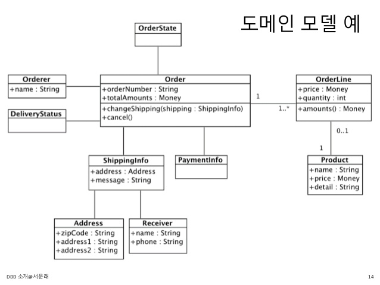
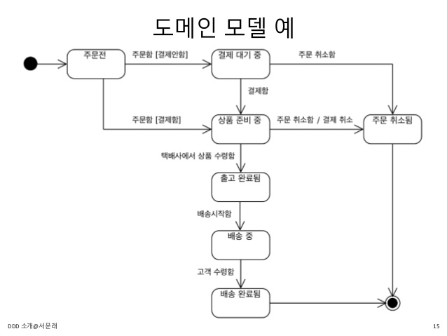

# 1장 도메인 모델 시작
- 도메인 모델
- 엔티티와 밸류
- 도메인 용어

## 도메인
- 도메인 (domain) : 소프트웨어로 해결하고자 하는 문제영역
- 도메인은 다시 여러 하위 도메인으로 구성된다
- 특정 도메인을 위한 소프트웨어라고 해서 도메인이 제공해야할 모든 기능을 구현하는 것은 아님
- 외부 시스템을 이용해 처리하기도 함
- 도메인마다 고정된 하위 도메인이 존재하는 것은 아님
- 하위 도메인을 어떻게 구성할지는 상황마다 달라진다

## 도메인 모델
- 도메인 모델은 기본적으로 특정 도메인을 **개념적** 으로 표현한 것
- 도메인을 이해하려면 도메인이 제공하는 기능과 도메인의 주요 데이터 구성을 파악해야 한다



- 이런 면에서 기능과 데이터를 함께 보여주는 **객체 모델**은 도메인을 모델링하기에 적합
- 도메인 모델을 **상태 다이어 그램** 을 이용해 모델링 할 수도 있다



- 도메인 모델 표현시 UML 표기법 만을 사용하는 것은 아니며, 관계가 중요한 도메인이라면 그래프를.. 계산 규칙이 중요하다면 수학 공식등을 활용할 수 있다
- 도메인을 이해하는데 도움이 된다면 **표현 방식은 중요하지 않음**

## 도메인 모델 패턴
- 일반적인 애플리케이션의 아키텍쳐는 네 개의 계층으로 구성된다
  - 표현
  - 응용
  - 도메인
  - 인프라

| 계층 | 설명 |
| --- | --- |
| 표현 | 사용자 요청을 처리하고 정보를 보여준다. 소프트웨어 사용자뿐 아닌 외부 시스템도 사용자가 될 수 있음 |
| 응용 | 사용자 요청 기능을 실행한다. 도메인 계층을 조합해 기능을 실행함 |
| 도메인 | 시스템이 제공할 도메인의 규칙을 구현 |
| 인프라 | 데이터베이스, 메세징 시스템 등 외부 시스템과의 연동을 처리 |

## 도메인 모델 도출
- 도메인을 모델링할 때 기본이 되는 작업 : 모델을 구성하는 핵심 구성요소, 규칙, 기능을 찾는 것
- 이는 요구사항에서 부터 출발한다
- 요구사항 정련을 위해 도메인 전문가나 다른 개발자와 논의하는 과정에서 이를 공유하기도 한다
- 모델 공유시 위키와 같은 도구를 사용해 누구나 접근 가능하도록 한느 것이 좋다

## 엔티티와 벨류
- 도출된 모델은 크게 **엔티티** 와 **벨류** 로 구분할 수 있다

### 엔티티
- 엔티티의 가장 큰 특징 : 식별자를 갖는다
- 엔티티의 식별자는 바뀌지 않으며 고유하기 때문에 두 엔티티 객체의 식별자가 동일하다면 두 엔티티는 같다고 판단할 수 있다

### 엔티티의 식별자 생성
- 엔티티는 흔히 다음중 한 가지 방식으로 생성한다
  - 특정 규칙에 따라 생성
  - UUID
  - 값을 직접 입력
  - 일련번호 사용 (시퀀스, AutoInc)

## 벨류 타입
- 벨류 타입은 개념적으로 완전한 하나를 표현할 때 사용한다
- 받는 사람을 위한 밸류 타입인 Receiver 를 다음과 같이 작성할 수 있다

```java
public class Receiver {
    private String name;
    private String phoneNumber;
}
```
- 주소 관련 데이터도 Address 벨류 타입을 이용해 명확하게 표현이 가능하다

```java
public class Address {
    private String address1;
    private String address2;
    private String zipcode;
}
```
- 벨류타입의 장점은 그를 위한 기능을 추가할 수 있다는 점
- Money 타입은 돈 계산을 위한 기능을 추가할 수 있다
- 벨류 타입의 데이터를 변경할 때는 기존 데이터 변경 보다는 변경한 데이터를 갖는 새로운 객체를 생성하는 방식을 선호한다
- 이를 **불변** 이라고 표현한다.
- 불변으로 구현하는 이뉴는 불변타입 사용시 보다 안전한 코드를 작성할 수 있기 때문이다

### 엔티티 식별자와벨류 타입
- 식별자는 단순한 문자열이 아니라 도메인에서 특별한 의미를 지니는 경우가 많다
- 때문에 식별자를 위한 벨류 타입을 사용하면 보다 의미가 잘 드러나게 할 수 있다
- 주문번호라면 OrderNo 라는 벨류 타입을 사용할 수 있다

## 도메인 모델에 set 메서드 넣지 않기
- 도메인 모델에 get/set 을 무족너 추가하는 것은 좋지 않다
- set 메소드는 도메인의 핵심 개념이나 의도를 코드에서 사라지게 한다
- 배송지를 변경 하는것이 아닌 단순히 설정하는 것 처럼 보일 수 있다

## 도메인 용어
- 코드 작성시 도메인에서 사용하는 용어는 매우 중요하다
- 도메인에서 사용하는 용어를 코드 작성시 반영하지 않으면 개발자에게 코드의 의미를 해석해야 하는 부담을 준다

```java
public enum OrderState {
    STEP1, STEP2, STEP3, STEP4    
}
```
- 위 상태만으로는 주문 상태가 어떤지 알 수 가 없다

```java
public enum OrderState {
    PAYMENT_WAITING, PREPARING, SHIPPED
}
```
- 이처럼 도메인 용어를 사용해 상태를 구현하면 불필요한 해석 과정이 필요 없다.