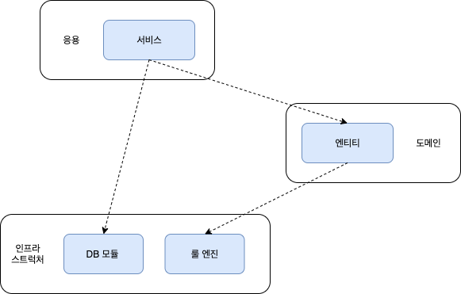
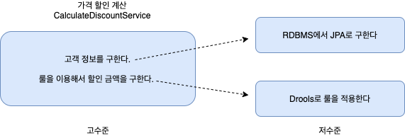
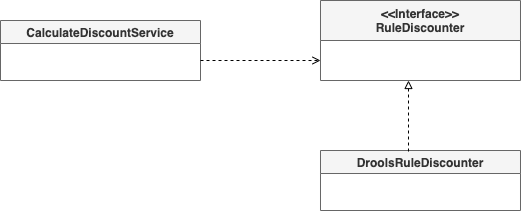
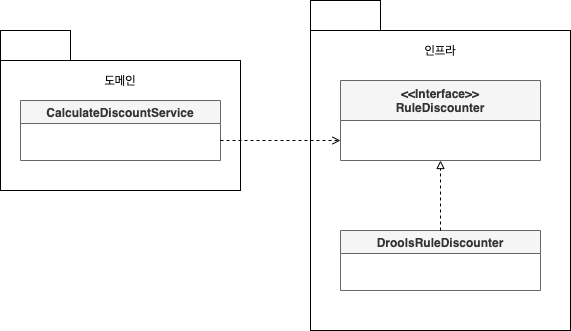
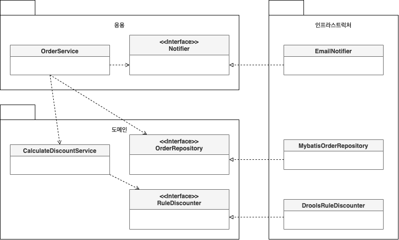
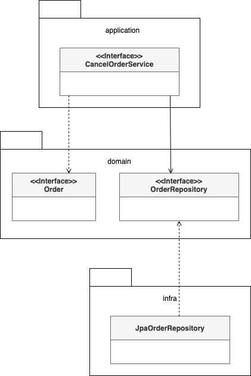
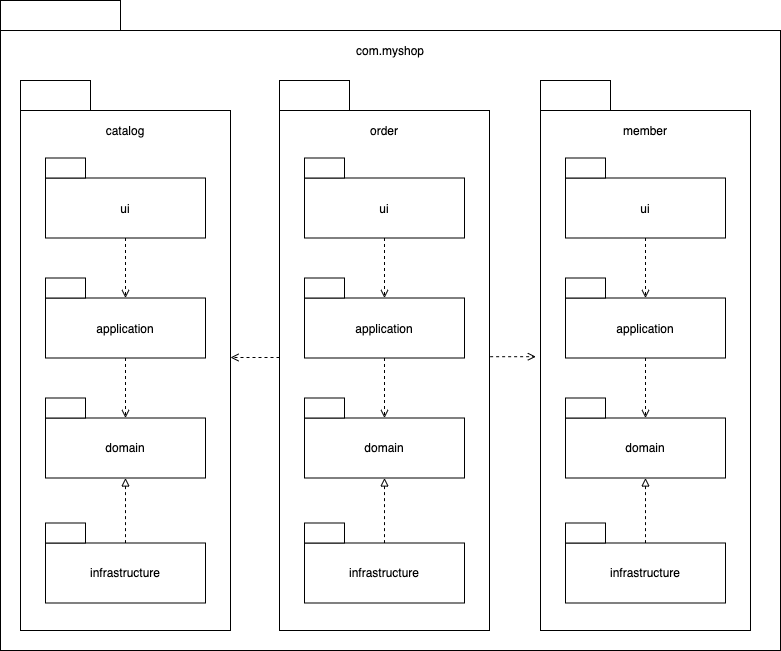
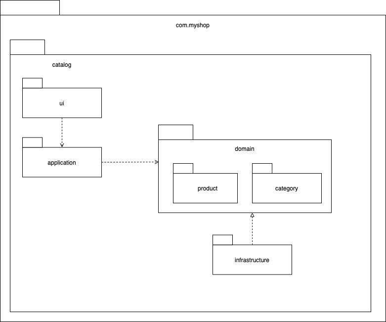

# 2장 아키텍쳐 개요
- 아키텍쳐
- DIP
- 도메인 영역의 주요 고성요소
- 인프라스트럭처
- 모듈

## 네 개의 영역
- 아키텍쳐 설계시 출현하는 전형적인 네 영역 : 표현, 응용, 도메인, 인프라
- 표현 영역 : 사용자의 요청을 전달 받는다
- 응용 영역 : 시스템이 사용자에게 제공해야 할 기능을 구현한다
- 도메인 영역 : 도메인의 핵심 로직을 구현한다
- 인프라 : 구현 기술에 대한 것들을 다룬다

## 계층 구조 아키텍처
- 계층 구조는 특성상 상위에서 하위계층으로만 의존하며 하위 계층은 상위 계층에 의존하지 않는다
- 계층 구조를 엄격하지 적용하기 보단 구현의 편리함을 위해 계층 구조를 유연하게 적용한다


- 응용 영역과 도메인 영역은 DB 나 외부 시스템 연동을 위하 인프라의 기능을 사용해야 하므로 이런 계층 구조는 직관적으로 이해하기 쉽다
- 하지만 표현,응용,도메인 계층은 구현기술을 다르는 인프라 계층에 종속된다는 점을 알아야 한다
- 예를 들어 Drools 라는 룰 엔진을 사용한다면 이 룰 엔진에 대한 세팅까지 모두 이뤄지고 나서야 정상적으로 동작하는지 테스트가 가능하다
- 또한 인프라 기술이 변경되는 관련된 코드를 모두 변경해야만 한다

## DIP



- 고 수준 모듈의 기능을 구현하려면 여러 하위 기능이 필요하다
- 위 그림을 보면 가격 할인 계산 기능을 구현하기 위해 고객 정보 / 룰 실행 2 가지 기능이 필요하다
- 저수준 모듈은 하위 기능을 실제로 구현한 것이다
- 고수준 모듈이 정상적으로 동작하기 위해서는 저수준 모듈을 사용해야 한다
- 앞서 언급한 궇녀 변경과 테스트에 대한 문제가 있다
- DIP 는 이를 해결하기 위해 저수준 모듈이 고 수준 모듈에 의존하도록 변경한다

```java
public interface RuleDiscounter {
    Money applyRules(Customer customer, List<OrderLine> orderLines);
}

public class CalculateDiscountService {
    private RuleDiscounter ruleDiscounter;
    
    public calculateDiscount(List<OrderLine> orderLines, String customerId) {
        // ...
        return ruleDiscounter.applyRules(customer, orderLines);
    }
}
```
- CalculateDiscountService 입장에서 룰에 대한 구현이 뭘로 되었는지는 중요하지 않다.
- 고객 정보와 구매 정보에 룰을 적용해 할인 금액을 구한다는 것이 중요하다


- DIP 를 적용한 이후 구조를 살펴보면 더 이상 구현기술인 Drools 에 의존하지 않는다
- 추상화한 인터페이스에 의존할 뿐이다
- DIP 를 적용하면 다른 영역에 인프라에 의존할때 발생했던 문제를 해소할 수 있다

### DIP 주의사항
- DIP 를 잘못생각하면 인터페이스와 구현을 분리하는 수준으로 받아드릴 수 있다
- DIP 의 핵심은 고수준 모듈이 저수준 모듈에 의존하지 않도록 하는 것이다


- 이는 잘못된 구조이다
- 도메인 영역은 구현 기술을 다르는 인프라 영역에 의존하고 있따
- RuleEngine 이라는 인터페이스는 고수준 모듈이 아닌 저수준 모듈 관점에서 도출해낸 것이다

### DIP 와 아키텍처
- 인프라 영역은 구현 기술을 다루는 저수준 모듈이고 응용 영역과 도메인 영역은 고수준 모듈이다
- 인프라 계층의 가장 하단에 위치하는 계층형 구조와 달리 아키텍처에 DIP 를 적용하면 인프라스트럭처 영역이 응용 영역과 도메인 영역에 의존하는 구조가 된다


- DIP를 적용하면 응용 영역과 도메인 영역에 영향을 최소화하면서 구현체를 변경하거나 추가할 수 있다.

## 도메인 영역의 주요 구성요소
- 엔티티 : 고유 식별자를 가지며, 자신의 라이프사이클을 갖는다. 도메인의 고유한 개념을 표현하며 해당 데이터와 관련된 기능을 함께 제공한다.
- 밸류 : 고유의 식별자를 갖지 않는 객체로 주로 개념적으로 하나인 도메인 객체의 속성을 표현할 때 사용된다.
- 애그리거트 : 애그리거트는 관련된 엔티티와 밸류 객체를 개념적으로 하나로 묶은 것이다. 예를 들어 주문과 관련된 Order 엔티티, OrderLine 밸류, Orderer 밸류 객체를 '주문' 애그리거트로 묶을 수 있다.
- 리포지터리 : 도메인 모델의 영속성을 처리한다.
- 도메인 서비스 : 특정 엔티티에 속하지 않은 도메인 로직을 제공한다. '할인 금액 계산'은 상품, 쿠폰, 회원 등급, 구매 금액 등 다양한 조건을 이용해서 구현하게 되는데, 이렇게 도메인 로직이 여러 엔티티와 밸류를 필요로 할 경우 도메인 서비스에서 로직을 구현한다.

### 엔티티와 밸류
- 도메인 모델의 엔티티는 단순히 데이터를 담고 있는 데이터 구조라기 보다 데이터와 함께 기능을 제공하는 객체이다
- 도메인 관점에서 기능을 구현하고 기능 구현을 캡슐화해 데이터가 임의로 변경되는 것을 막는다
- 또 다른 차이점은 도메인 모델의 엔티티는 두 개 이상의 데이터가 개념적으로 하나인 경우 밸류 타입을 이용해 표현할 수 있다는 것이다
- 밸류는 불변으로 구현하는 것을 권장하는데, 이는 엔티티의 벨류 타입 데이터를 변경할 때 객체 자체를 완전히 교체 한다는 것을 의미 한다

### 애그리거트
- 도메인이 커질수록 개발한 도메인 모델도 커지면서 많은 엔티티와 밸류들이 출현한다
- 엔티티와 밸류 개수가 많아지면 많아질수록 모델은 점ㅈ머 더 복잡해 진다
- 애그리거트는 관련 객체를 하나로 묶은 군집이다
- 개별 객체가 아닌 관련 객체를 묶어 군집 단위로 모델을 바라볼 수 있다
- 애그리거트 간의 관계로 도메인 모델을 이해하고 구현할 수 있게 되며, 이를 통해 큰 틀에서 도메인 모델을 관리할 수 있다
- 애그리거트는 군집에 속한 객체를 관리하는 **루트 엔티티** 를 갖는다
- 루트 엔티티는 애그리거트에 속해 있는 엔티티와 밸류 객체를 이용해 구현해야할 기능을 제공한다
- 애그리거트를 사용하는 코드는 애그리거트 루트가 제공하는 기능을 실행하고 애그리거트 루트를 통해서 간접적으로 애그리거트 내의 다른 엔티티나 밸류 객체에 접근하게 된다. 
- 이는 애그리거트의 내부 구현을 숨겨서 애그리거트 단위로 구현을 캡슐화할 수 있도록 돕는다.

```java
public class Order {
	...
	public void changeShippingInfo(ShippingInfo shippinginfo) {
		checkShippingInfoChangeable(); // 배송지 변경 가능 여부 확인
	}

	private Boolean checkShippingInfoChangeable() {
		...
	}
}
```
- 주문 애그리거트는 Order를 통하지 않고 ShippingInfo를 변경할 수 있는 방법을 제공하지 않는다.
- 애그리거트를 구현할 때는 고려할 것이 많다. 
- 애그리거트를 어떻게 구성했느냐에 따라 구현이 복잡해지기도 하고 트랜잭션 범위가 달라지기도 한다. 
- 또한 선택한 구현 기술에 따라 애그리거트 구현에 제약이 생기기도 한다.

### 리포지터리
- 도메인 객체를 지속적으로 사용하기 위해서는 RDBMS, NoSQL 과 같은 물리적인 저장소에 이를 보관해야 한다
- 이를 위한 도메인 모델이 리포지터리 이다
- 엔티티나 밸류가 요구사항에서 도출되는 도메인 모델이라면 리포지터리는 구현을 위한 도메인 모델
- 리포지터리는 애그러기트 단위로 저장, 조회 기능을 정의한다

```java
public interface OrderRepository {
    void save(Order order);
    void delete(Order order);
    Order findByNumber(OrderNumber orderNumber);
}
```
- 도메인 모델 관점에서 리포지터리는 도메인 객체를 영속화하는 데 필요한 기능을 추상화한 것으로 고수준 모듈로 인프라스트럭처 영역에 속한다.



- 리포지터리 인터페이스는 도메인 모델 영역에 속하며, 실제 구현 클래스는 인프라스트럭처 영역에 속한다.
- 응용 서비스와 리포지터리는 밀접한 연관이 있다.
  - 응용 서비스는 필요한 도메인 객체를 구하거나 저장할 때 리포지터리를 사용한다.
  - 응용 서비스는 트랜잭션을 관리하는데, 트랜잭션 처리는 리포지터리 구현 기술에 영향을 받는다.

## 인프라스트럭처
- 인프라스트럭처는 표현 영역, 응용 영역, 도메인 영역을 지원한다. 
- DIP에서 언급한 것처럼 도메인 영역과 응용 영역에서 인프라스트럭처의 기능을 직접 사용하는 것보다 이 두영역에 정의한 인터페이스를 인프라스트럭처 영역에서 구현하는 것이 시스템을 더 유연하고 테스트하기 쉽게 만들어준다.
- 그러나 응용 영역과 도메인 영역이 이프라스트럭처에 대한 의존을 완전히 갖지 않도록 시도하는 것은 자칫 구현을 복잡하고 어렵게 만들 수 있다. 
- 좋은 예가 스프링의 @Transactional 애노테이션이다. @Transactional을 사용하면 한줄로 트래잭션을 처리할 수 있는데 코드에서 스프링에 대한 의존을 없애려면 복잡한 스프링 설정을 사용해야 한다. 
- 이처럼 의존은 없앴지만 특별히 테스트를 더 쉽게 할 수 있다거나 유연함을 증가시켜주지 못한다.

## 모듈 구성
- 패키지 구성 규칙에 한 개의 정답만 존재하는 것은 아니지만 영역별로 모듈이 위치할 패키지를 구성할 수 있을 것이다. 
- 여기서 com.myshop은 예시로 든 패키지이다. 
- domain 모듈은 도메인에 속한 애그리거트를 기준으로 다시 패키지를 구성한다.
- 예를 들어, 카탈로그 하위 도메인을 위한 도메인은 상품 애그리거트와 카테고리 애그리거트로 구성된다고 할 경우 아래와 같이 domain을 두 개의 하위 패키지로 구성할 수 있다.


- 도메인이 크다면 하위 도메인 별로 모듈을 나눈다.
- 도메인이 복잡하다면 도메인 모델과 도메인 서비스를 다음과 같이 별도 패키지에 위치할 수도 있다
  - com.myshop.order.domain.order : 애그리거트 위치
  - com.myshop.order.domain.service : 도메인 서비스 위치


- 하위 도메인을 하위 패키지로 구성한 모듈 구조
- 응용 서비스도 다음과 같이 도메인 별로 패키지를 구분할 수 있다.
  - com.myshop.catalog.application.product
  - com.myshop.catalog.application.category