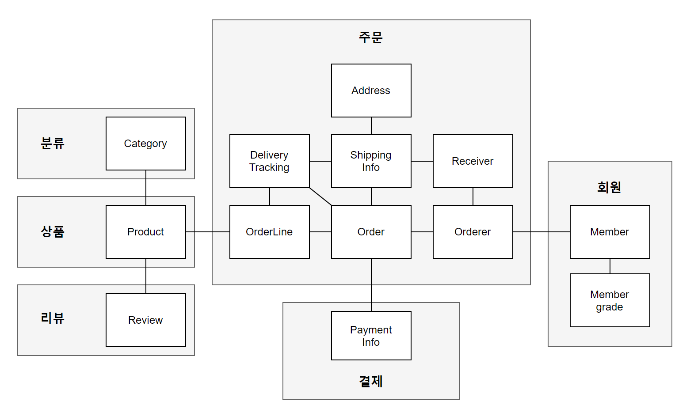
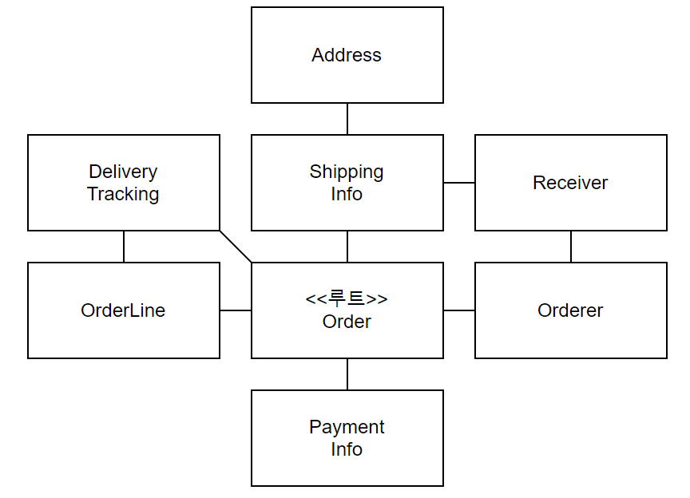

# 3장 애그리거트
- 애그리거트
- 애그리거트 루트와 역할
- 애그리거트와 리포지터리
- ID 를 이용한 애그리거트 참조

## 애그리거트
- 복잡한 도메인을 이해하고 관리하기 쉬운 단위로 만들려면, 상위 수준에서 모델을 조망할 방법이 필요 => 애그리거트
- 수많은 객체를 애그리거트로 묶어서 바라보면 좀 더 상위 수준에서 도메인 모델 간의 관계를 파악할 수 있다



- 애그리거트는 경계를 가지고 있음
- 한 애그리거트에 속한 객체는 다른 애그리거트에 속하지 않음
- 애그리거트는 자기 자신을 관리할 뿐 다른 애그리거트는 관리하지 않는다
- 경계 설정시 기본 => 도메인 규칙과 요구사항

> 다수의 애그리거트가 한 개의 엔티티 객체만 가지고 있는 경우가 많으며, 두 개 이상의 엔티티로 구성된 경우는 드물다.

## 애그리거트 루트
- 애그리거트에 속한 모든 객체가 일관된 상태를 유지해야 한다.
- 애그리거트 전체를 관리할 주체가 필요한데, 이 책임 지는 것이 **애그리거트 루트 엔티티**


- 주문 애그리거트의 경우 루트의 역할을 Order 엔티티가 수행한다
- 애그리거트 루트의 핵심역할 => 애그리거트의 일관성이 깨지지 않도록 보장하는 것
- 이를 위해 애그리거트가 제공해야할 도메인을 기능을 구현한다

```java
public class Order {
    
    public void changeShippingInfo(ShippingInfo shippingInfo) {
        verifyNotYetShipped();
        setShippingInfo(newShippingInfo);
    }
}
```
- 도메인 로직을 구현을 위한 규칙
  - set 메서드를 public 범위로 만들지 않는다
  - 의미가 드러나는 메서드를 사용해서 구현
  - 밸류 타입은 불변으로 한다
  - 밸류 객체의 값을 변경하는 방법은 새로운 밸류 객체를 할당하는 것

### 애그러기트 루트의 긴으 구현
- 애그리거트 루트는 내부의 다른 객체를 조합해 기능을 완성한다

`총 주문금액 구하기`

```java
public class Order {
    private Money totalAmounts;
    private List<OrderLine> orderLines;
    
    private void calculateTotalAmounts() {
        int sum = orderLines.stream()
                .mapToInt(ol -> ol.getPrice() * ol.quantity())
                .sum();
        this.totalAmounts = new Money(sum);
    }
}
```
- 애그리거트 루트는 기능 실행을 위임하기도 한다

```java
public class Order {
    private OrderLines orderLines;
    
    public void changeOrderLines(List<OrderLine> newLines) {
        orderLines.changeOrderLines(newLines);
        this.totalAmounts = orderLines.getToalAmounts();
    }
}
```

### 트랜잭션 범위
- 트랜잭션 범위는 작을수록 좋다
  - 애그리거트는 최대한 독립적이어야 한다
    - 결합도를 낮춰야 한다
- 한 트랜잭션에서 두 개 이상의 애그리거트를 수정해야 한다면
  - 애그리거트(Order Entity)에서 직접 수정하지 말고
  - 응용서비스(ChangeOrderService)에서 두 애그리거트를 수정한다
- 도메인 이벤트(10장)를 사용하면 다른 애그리거트의 상태를 변경 가능
- 다음의 경우 한 트랜잭션에서 두 개 이상의 애그리거트를 변경하는 것을 고려
- 조직의 표준
  - 조직의 표준에 따라 사용자 유스케이스와 관련된 응용 서비스의 기능을 한 트랜잭션으로 실행해야 하는 경우
- 기술 제약
  - 기술적으로 이벤트 방식을 도입할 수 없는 경우
- UI 구현의 편리
  - 주문 목록에서 여러 주문의 상태를 한 번에 변경하고 싶을 때 여러 주문 애그리거트의 상태를 한 트랜잭션에서 변경

### 리포지터리와 애그리거트
- 애그리거트는 개념상 완전한 한 개의 도메인 모델을 표현
- 리포지토리는 애그리거트 단위로 존재한다
- OrderLine이 물리적으로 별도의 테이블에 저장된다고 해서 OrderLine을 위한 리포지토리를 별도로 만들지 않는다
- 리포지토리는 애그리거트 전체를 저장소에 영속화해야 한다
- Order 애그리거트를 저장할때 애그리거트 루트에 맵핑되는 테이블뿐만 아니라 애그리거트에 속하는 모든 구성요스를 위한 테이블에 데이터를 저장해야 한다
- 애그리거트를 구하는 리포지터리 메서드는 완전한 애그리거트를 제공해야 한다
- Order를 조회하면 Order 애그리거트는 OrderLine, Orderer 등 모든 구성요소를 포함하고 있어야 한다

## 애그리거트 간 참조

### 필드 참조

```java
public class Orderer {
    private Member member;
    private String name;
}
order.getOrderer().getMember().getId();
```
- 구현의 편리함
- JPA의 경우 @ManyToOne, @OneToOne을 통해 쉽게 참조 가능
- 성능에 대한 고민
  - JPA의 경우 어떤 로딩 방식을 사용할 것인가?
  - Eager 로딩
    - 단순히 연관된 객체의 데이터를 함께 화면에 보여주어야 하면 유리
  - Lazy 로딩
    - 애그리거트의 상태를 변경할 경우 불필요한 객체를 함께 로딩할 필요가 없으므로 지연로딩이 유리
  - 확장 어려움
    - 도메인마다 다른 데이터 저장소를 사용할 경우 JPA같은 단일 기술을 사용할 수 없음

### ID 를 이용한 참조

```java
public class Orderer {
    private MemberId memberId;
}

Customer customer = customerRepository.findById(order.getOrderer().getcustomerId());
```
- ID를 이용한 참조와 조회 성능
  - 주문 목록을 보여주려면 상품 애그리거트와 회원 애그리거트를 함께 읽어야 해서 N+1 조회 문제가 발생한다
- 조회 성능을 높히기 위해 전용 조회 쿼리를 사용해야 한다.

## 애그리거트를 팩토리로 사용하기
- 애그리거트가 갖고 있는 데이터를 이용해서 다른 애그리거트를 생성해야 한다면 애그리거트에 팩토리 메서드를 구현하는것을 고려한다
- 예)온라인 쇼핑몰에서 고객이 신고를 해서 특정 상점이 더 이상 물건을 등록하지 못하도록 차단한 상태를 구현

```java
public class RegisterProductService {

    public ProductId registerNewProduct(NewProductRequest req) {
        Store account = accountRepository.findStoreById(req.getStoreId());
        checkNull(account);
        if (account.isBlocked()) {
            throw new StoreBlockedException();
        }
        ProductId id = productRepository.nextId();
        Product product = new Product(id, account.getId(), ...);
        productRepository.save(product);
        return id;
    }
}
```
- 위 코드는 Product를 생성 가능한지 판단하는 코드와 Product를 생성하는 코드가 분리되어 있어서 나빠 보이지 않지만 중요한 도메인 로직 처리가 응용서비스에 노출되었다
- 이 도메인 기능을 Store 애그리거트에서 팩토리 메서드로 구현해야 한다

```java
public class Store extends Member {

    public Product createProduct(ProductId newProductId, ...) {
        if (isBlocked()) throw new StoreBlockedException();
        return new Product(newProdcutId, getId, ...)
    }
}
public class RegisterProductService {

    public ProductId registerNewProduct(NewProductRequest req) {
        Store account = accountRepository.findStoreById(req.getStoreId());
        checkNull(account);
        ProductId id = productRepository.nextId();
        Product product = account.createProduct(id, ...);
        productRepository.save(product);
        return id;
    }
}
```
- 앞선 구현과 차이라면 **응용 서비스에서 Store 의 상태를 확인하지 않는다.**
- Store 가 Product 를 구현할 수 있는지에 대한 확인 로직을 Store 에서 구현하고 있다.
