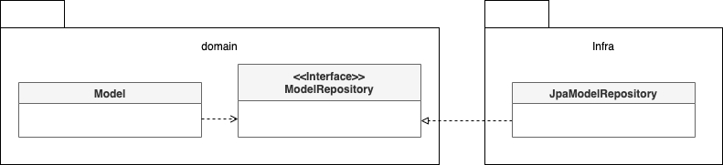
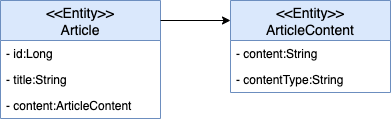

# 4장 리포지터리와 모델 구현
- JPA 를 이용한 리포지터리 기능 구현
- 엔티티와 밸류 매핑
- 밸류 컬렉션 매핑
- 애그리거트 로딩 전략과 영속성 전파
- 식별자 생성 기능

## JPA 를 이용한 리포지터리 구현

### 모듈 위치
- 리포지터리 인터페이스 => 애그리거트와 같이 도메인 영역에 속함
- 리포지터리 구현 클래스 => 인프라 영역에 속함



> DIP 에 따라 리포지터리 구현 클래스는 인프라 레이어에 위치시켜, 인프라에 대한 의존성을 낮춰야 함

### 기본 기능 구현
- 리포지터리의 기본 기능
  - 아이디로 애그리거트 조회하기
  - 애그리거트 저장하기

```java
public interface OrderRepository {
    public Order findById(OrderNo no);
    public void save(Order order);
}
```
- 인터페이스 작성시 **애그리거트 루트** 기준으로 작성해야 한다

### 엔티티와 밸류 기본 매핑 구현
- 애그리거트와 JPA 매핑을 위한 기본 규칙
  - 애그리거트 루트는 엔티티이므로 @Entity로 매핑 설정한다.
  - 한 테이블에 엔티티와 밸류 데이터가 같이 있는 경우
    - 밸류는 @Embeddable로 매핑 설정한다.
    - 밸류 타입 프로퍼티는 @Embedded로 매핑 설정한다.

```java
@Entity
@Table(name = "purchase_order")
public class Order {
    ....
    @Embedded
    Orderer orderer;
}

@Embeddable
public class Orderer {
    // MemberId에 정의된 칼럼 이름을 변경하기 위해
    // @AttributeOverride 애노테이션 사용
    @Embedded
    @AttributeOverrides(
            @AttributeOverride(name = "id", column = @Column(name = "orderer_id"))
    )
    private MemberId memberId;

    @Column(name = "orderer_name")
    private String name;

	...
}
```

### 기본 생성자
- 밸류 타입은 불변이어야 한다.
- **생성 시점에 필요한 값을 모두 전달** 받기 때문에 set 메소드는 제공하지 않는다.
- JPA 의 @Entity, @Enmbeddable 클래스를 매핑하려면 기본 생성자를 제공해야 한다
- 하이버네이트와 같은 JPA 프로바이더는 DB에서 데이터를 읽어와 매핑된 객체를 생성할 때 기본 생성자를 사용해서 객체를 생성한다.
- 이런 이유로 다른 코드에서 기본 생성자를 사용하지 못하도록 protected로 선언한다.

```java
@Embeddable
public class Receiver {
	@Column(name = "receiver_name")
	private String name;

	...

	protected Receiver() {} // JPA를 적용하기 위해 기본 생성자 추가

	public Receiver(String name, String phone) {
		this.name = name;
		this.phone = phone;
	}
}
```

> protected 로 선언한 이유 => 하이버네이트는 클래스를 상속한 프록시 객체를 이용해서 지연 로딩을 구현하기 때문

### 필드 접근 방식 사용
- 엔티티에 프로퍼티를 공개하는 get/set 메소드를 추가하면 도메인 의조도가 사라지고, 데이터 기반 구현을 할 가능성이 높다.
- set 메서드는 내부 데이터를 외부에서 변경할 수 있는 수단이 되기 때문에 캡슐화를 깨는 원인이 될 수 있다. 
- 엔티티가 객체로서 제 역할을 하려면 외부에 set 메서드 대신 의도가 잘 드러나는 기능을 제공해야 한다.
- 엔티티를 객체가 제공할 기능 중심으로 구현하도록 유도하려면 JPA 매핑 처리를 프로퍼티 방식이 아닌 필드 방식으로 선택해서 불필요한 get/set 메서드를 구현하지 말아야 한다.

```java
@Entity
@Access(AccessType.FIELD)
public class Order {
	...
}
```

> JPA 구현체인 하이버네이트는 @Access를 이용해서 명시적으로 접근 방식을 지정하지 않으면 @Id나 @EmbeddedId가 어디에 위치했느냐 (필드 or getter) 에 따라 접근 방식을 결정한다.

### AttributeConverter 를 이용한 밸류 매핑 처리
- 구현방식에 따라 밸류 타입의 프로퍼티를 한 개 칼럼에 매핑해야 할 때도 있다
- 예를 들어 Length가 길이 값과 단위의 두 프로퍼티를 갖고 있는데 DB 테이블에는 한 개 칼럼에 '1000mm'와 같은 형식으로 저장할 수 있다
- JPA 2.0 버전에서는 이를 처리하기 위해 다음과 같이 칼럼과 매핑하기 위한 프로퍼티를 따로 추가하고 get/set 메서드에서 실제 밸류 타입과 변환 처리를 해야 했다

```java
public class Product {
	@Column(name = "WIDTH")
	private String width;

	public Length getWidth() {
		return new Width(width); // DB 컬럼 값을 실제 프로퍼티 타입으로 변환
	}

	void setWidth(Length width) {
		this.width = width.toString(); // 실제 프로퍼티 타입을 DB 칼럼값으로 변환
	}
}
```
- JPA 2.1 버전 부터는 밸류 타입과 칼럼 데이터 간의 변환 처리를 위한 기능을 정의하고 있다.

```java
public interface AttributeConverter<X,Y> {
    Y convertToDatacaseColumn(X attribute);
	X convertToEntityAttribute(Y dbData);
}

@Converter(autoApply = true)
public class MoneyConverter implements AttributeConverter<Money, Integer> {

    @Override
    public Integer convertToDatabaseColumn(Money money) {
        if(money == null) return null;
        else return money.getValue();
    }

    @Override
    public Money convertToEntityAttribute(Integer value) {
        if(value == null) return null;
        else return new Money(value);
    }
}
```
- @Converter 애노테이션의 autoApply 속성값을 true로 지정했는데 이 경우 모델에 출현하는 모든 Money 타입의 프로퍼티에 대해 MoneyConverter를 자동으로 적용한다.
- @Converter의 autoApply 속성이 false인 경우 프로퍼티값을 변환할 때 사용할 컨버터를 직접 지정할 수 있다

```java
public class Order {

	@Column(name = "total_amounts")
	@Convert(converter = MoneyConverter.class)
	private Money totalAmounts;
	...
}
```

### 밸류 컬렉션 : 별도 테이블 매핑
- 밸류 컬렉션을 별도 테이블로 매핑할 때는 @ElementCollection과 @CollectionTable을 함께 사용한다

```java
@Entity
@Table(name = "purchase_order")
public class Order {
	...
	@ElementCollection
	@CollectionTable(name = "order_line", joinColumns = @JoinColumn(name = "order_number"))
	@orderColumn(name = "line_idx")
	private list<OrderLine> orderLines;
}

@Embeddable
public class OrderLine {
    
	@Embedded
	private ProductId productId;
	...
}
```
- @CollectionTable은 밸류를 저장할 테이블을 지정할 때 사용한다
- name 속성으로 테이블 이름을 지정하고 joinColumns 속성은 외부키로 사용하는 컬럼을 지정한다

### 밸류 컬랙션 : 한 개 컬럼 매핑
- 밸류 컬렉션을 별도 테이블이 아닌 한 개 칼럼에 저장해야 할 때가 있다
  - 도메인 모델에는 이메일 주소 목록을 Set으로 보관하고 DB에는 한 개 컬럼에 콤마로 구분해서 저장해야 하는 경우
- AttributeConverter를 사용하면 밸류 컬렉션을 한 개 칼럼에 쉽게 매핑할 수 있다
  - AttributeConverter를 사용하려면 밸류 컬렉션을 표현하는 새로운 밸류 타입을 추가해야 함

```java
public class EmailSet {
	private Set<Email> emails = new HashSet<>();

	private EmailSet() {}
	private EmailSet(Set<Email> emails) {
		this.emails.addAll(emails);
	}

	public Set<Email> getEmails() {
		return Collections.unmodifiableSet(emails);
	}
}

@Converter
public class EmailSetConveter implements AttributeConveter<EmailSet, String> {
    @Override
    public String convertToDatabaseColumn(EmailSet attribute) {
        if(attribute == null) return null;
        return attribute.getEmails().stream()
                        .map(Email::toString)
                        .collect(Collectors.joining(","));
    }
    @Override
    public EmailSet convertToEntityAttribute(String dbData) {
        if(dbData == null) return null;
        String[] emails = dbData.split(",");
        Set<Email> emailSet = Arrays.stream(emails)
                                    .map(value ->  new Email(value))
                                    .collect(toSet());
        return new EmailSet(emailSet);
    }
}

@Column(name = "emails")
@Convert(converter = EmailSetConverter.class)
private EmailSet emailSet;
```

### 밸류를 이용한 아이디 매핑
- 식별자는 보통 문자열이나 숫자와 같은 기본 타입을 사용한다. 
- 식별자라는 의미를 부각시키기 위해 식별자 자체를 별도 밸류 타입으로 만들 수도 있다.
- @Id 대신 @EmbeddedId 애노테이션을 사용한다. 
- 밸류 타입으로 식별자를 구현할 때 얻을 수 있는 장점은 식별자에 기능을 추가할 수 있다는 점이다. 
  - 1세대 시스템의 주문번호와 2세대 시스템의 주문번호를 구분할 때 주문번호의 첫 글자를 이용 하는 경우

```java
@Embeddable
public class OrderNo implements Serializable {
	@Column(name = "order_number")
	private String number;

	public boolean is2ndGeneration() {
		return number.startsWith("N");
	}
	...
}
```

### 별도 테이블에 저장하는 밸류 매핑
- 애그리거트에서 루트 엔티티를 뺀 나머지 구성요소는 대부분 밸류이다. 
- 만약 밸류가 아니라 엔티티가 확실하다면 다른 애그리거트는 아닌지 확인해야 한다.
- 특히 자신만의 독자적인 라이프사이클을 갖는다면 다른 애그리거트일 가능성이 높다.


- ArticleContent는 밸류이므로 @Embeddable로 매핑한다. 
- ArticleContent와 매핑되는 테이블은 Artible과 매핑되는 테이블과 다름. 
- 밸류를 매핑한 테이블을 지정하기 위해 @SecondaryTable과 @AttributeOverride를 사용한다.

```java
@Entity
@Table(name = "article")
@SecondaryTable(
	name = "article_content",
	pkJoinColumns = @PrimaryKeyJoinColumn(name = "id")
)
public class Article {
	@Id
	private Long id;
	...
	@AttributeOverrides({
		@AttributeOverride(name = "content",
			column = @Column(table = "article_content")),
		@AttributeOverride(name = "contentType",
			column = @Column(table = "artible_content"))
	})
	private ArticleContent content;
	...
}
```
- @SecondaryTable을 이용하면 아래 코드를 실행할 때 두 테이블을 조인해서 데이터를 조회한다.

```java
// @SecondaryTable로 매핑된 artible_content 테이블을 조인
Article article = entityManager.find(Article.class, 1L);
```
- @SecondaryTable을 사용하면 목록 화면에 보여줄 Article을 조회할 때 artivle_content 테이블까지 조인해서 데이터를 읽어오는데 이는 원하는 결과가 아니다. 
  - 조회 전용 쿼리를 이용해 해결할 수 있음

### 밸류 컬렉션을 @Entity 로 매핑하기
- 개념적으로 밸류인데 구현 기술의 한계나 팀 표준 때문에 @Entity를 사용해야 할 때도 있다. 
- JPA는 @Embeddable 타입의 클래스 상속 매핑을 지원하지 않는다.
- 대신 @Entity를 이용한 **상속 매핑** 으로 처리해야 한다. 
- 엔티티로 관리되므로 식별자 필드가 필요하고 타입 식별 칼럼을 추가해야 한다.
- @Entity 에 대한 컬렉션 객체에 clear() 메소드를 수행하면 엔티티들을 로드하고, 각 개별 단위로 delete 를 수행한다.
  - 하이버네이트는 **@Embeddable 타입 컬렉션의 clear() 메소드 호출시 컬렉션에 속한 객체를 로딩하지 않고, 한번의 delete 로 삭제처리를 수행**한다
- 애그리거트의 특성을 유지하며 문제를 해소하려면 상속을 포기하고 @Embeddable 로 매핑된 단일 클래스로 구현해야 한다

> 코드 유지보수와 성능 두 가지 측면을 고려해 구현 방식을 택해야 한다.

### ID 참조와 조인 테이블을 이용한 단방향 M:N 매핑
- 애그리거트 간 집합 연관은 성능상의 이유로 피해야 한다고 했다. 
- 그럼에도 불구하고 요구사항을 구현하는 데 집합 연관을 사용하는 것이 유리하다면 ID 참조를 이용한 단방향 집합 연관을 적용해 볼 수 있다.

```java
@Entity
@Table(name = "product")
public class Product {
	@EmbeddedId
	private ProductId id;

	@ElementCollection
	@CollectionTable(name ="product_category",
		joinColumns = @JoinColumn(name = "product_id"))
	private Set<CategoryId> categoryIds;
	...
}
```
- ID 참조를 이용한 애그리거트 간 단방향 M:N 연관은 밸류 컬렉션 매핑과 동일한 방식으로 설정한 것을 알 수 있다. 
- 차이점이 있다면, 집합의 값에 밸류 대신 연관을 맺는 식별자가 온다

> @ElementCollection을 이용하기 때문에 Product를 삭제할 때 매핑에 사용한 조인 테이블의 데이터도 함께 삭제된다.

## 애그리거트 로딩 전략
- 애그리거트는 개념적으로 하나여야 한다. 
- 하지만, 루트 엔티티를 로딩하는 시점에 애그리거트에 속한 객체를 모두 로딩해야 하는 것은 아니다. 
  - 그 이유 ?
    - 상태를 변경하는 기능을 실행할 때 애그리거트 상태가 완전해야 한다 
    - 표현 영역에서 애그리거트의 상태 정보를 보여줄 때 필요하다
- JPA는 트랜잭션 범위 내에서 지연 로딩을 허용하기 때문에 실제로 상태를 변경하는 시점에 필요한 구성요소만 로딩해도 문제가 되지 않는다.

```java
@Transactional
public void revmoeoptions(ProductId id, int optIdxToBeDeleted) {
		//Product를 로딩/ 컬렉션은 지연 로딩으로 설정했다면 Option은 로딩되지 않음
		Product product = productRepository.findByid(id);
		
		// 트랜잭션 범위이므로 지연 로딩으로 설정한 연관 로딩 가능
		product.removeOption(optIdxToBeDeleted);
}

@Entity
public class Product {
    @ElementCollection(fetch = FetchType.LAZY)
    @CollectionTable(name = "product_option",
            joinColumns = @JoinColumn(name = "product_id"))
    @OrderColumn(name = "list_idx")
    private List<Option> options = new ArrayList<>();

    public void removeOption(int optIdx) {
        //실제 컬렉션에 접근할 때 로딩
        this.options.remove(optIdx);
    }
}
```
- 일반적으로 상태 변경보다 조회의 빈도수가 높다
- 때문에 애그리거트의 모든 연관을 EAGER 로 설정할 필요는 없다
- 무조건 즉시 로딩이나 지연 로딩으로만 설정하기보다는 애그리거트에 맞게 즉시 로딩과 지연 로딩을 선택해야 한다.

## 애그리거트의 영속성 전파
- 애그리거트는 완전한 상태여야 한다는 것은 조회할 때뿐만 아니라 저장하고 삭제할 때도 필요하다
  - 저장 메서드는 애그리거트 루트만 저장하면 안 되고 애그리거트에 속한 모든 객체를 저장해야 한다
  - 삭제 메서드는 애그리거트 루트뿐만 아니라 애그리거트에 속한 모든 객체를 삭제 해야 한다
- @Embeddable 매핑 타입의 경우 함께 저장되고 삭제되므로 cascade 속성을 추가로 설정하지 않아도 된다. 
- 반면에 애그리거트에 속한 @Entity 타입에 대한 매핑은 cascade 속성을 사용해서 저장과 삭제 시에 함께 처리되도록 설정해야 한다.

> @OneToOne, @OneToMany는 cascade 속성의 기본값이 없으므로 cascade 속성값으로 CascadeType.PERSIST, CascadeType.REMOVE를 설정한다.

## 식별자 생성 기능
- 식별자는 3가지 방식중 하나로 생성된다
  - 직접 생성
  - 도메인 로직
  - DB 를 활용한 일련번호
- 식별자 생성 규칙이 있는 경우 엔티티가 그 기능을 제공하는 것 보다는, 별도 서비스로 분리해 제공하는 것이 좋다.
- 식별자 생성 규칙 또한 도메인 규칙이기 때문에 도메인 레이어에 위치해야 한다

```java
public class ProductIdService {
    public ProductId nextId() {
        // ...
    }
}
```