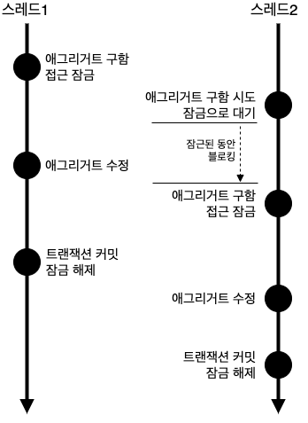
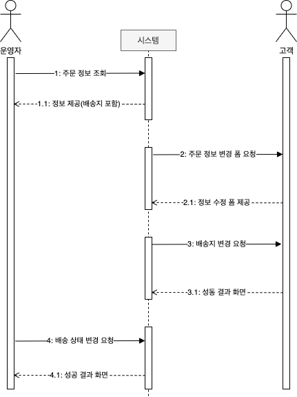

# 8장 애그리거트 트랜잭션 관리
- 애그리거트의 트랜잭션
- 애그리거트 잠금 기법

## 애그리거트와 트랜잭션
- 한 애그리거트를 두 사용자가 거의 동시에 변경할 때 트랜잭션이 필요하다
- DBMS 가 지원하는 트랜잭션과 함께 애그리거트를 위한 추가적인 트랜잭션 기법이 필요하다
- 애그리거트에 대해 사용가능한 대표적인 처리 방식은 **선점 (Pessimistic)** 잠금과 **비선점 (Optimistic)** 잠금 두 가지 방식이 있다.

## 선점 잠금
- 선점 잠금 (Pessimistic) 은 먼저 애그리거트를 구한 스레드가 사용이 끝날때 까지 다른 스레드가 해당 애그리거트를 수정하지 못하도록 막는 기법이다


- 한 스레드가 애그리거트를 수정하는 동안 다른 스레드가 이를 수정할 수 없으므로 동시 수정시 발생하는 데이터 충돌 문제를 해소할 수 있다
- 선점 잠금은 보통 DBMS 가 제공하는 로우 단위 잠금을 이용해 구현한다.
- 대다수 dbms 에서 for update 와 같은 쿼리로 제공한다.
- JPA의 EntityManager는 LockModeType을 인자로 받는 find() 메서드를 제공하는데, LockModeType.PESSIMISTIC_WRITE를 값으로 전달하면 해당 엔티티와 매핑된 테이블을 이용해서 선점 잠금 방식을 적용할 수 있다. 
- 하이버네이트의 경우 잠금 모드로 사용하면 'for update' 쿼리를 사용해서 선점 잠금을 구현한다.

### 선점 잠금과 교착 상태
- 선점 잠금 기능 사용시에는 잠금 순서에 따른 **교착상태 (deadlock)** 가 발생하지 않도록 주의해야 한다.
1.  스레드1: A 애그리거트에 대한 선점 잠금 구함
2.  스레드2: B 애그리거트에 대한 선점 잠금 구함
3.  스레드1: B 애그리거트에 대한 선점 잠금 시도
4.  스레드2: A 애그리거트에 대한 선점 잠금 시도
- 위 순서에 따르면 스레드1은 영원히 B 애그리거트에 대한 잠금을 구할 수 없다.
  - 스레드가 2가 이미 잠금을 선점하고 있기 때문임
- 두 스레드는 상대방 스레드가 먼저 선점한 잠금을 구할 수 없어 더 이상 다음 단계를 진행하지 못하고, 교착상태에 빠지게 된다.
- 이런 문제를 방지하기 위해 **최대 대기 시간** 을 지정해야 한다.

```java
Map<String, Object> hints = new HashMap<>();
hints.put("javax.persistence.lock.timeout", 2000);
Order order = entityManager.find( Order.class, orderNo, 
		LockModeType.PRESSIMISTIC_WRITE, hints);
```
> JPA 에서 최대 대기 시간을 지정하기 위해 힌트를 사용함.

> DBMS에 따라 교착 상태에 따라 커넥션을 처리하는 방식이 다르다. 쿼리별로 대기 시간을 지정할 수 있는 DBMS가 있고 커넥션 단위로만 대기 시간을 지정할 수 있는 DBMS도 있다. 따라서 선점 잠금을 사용하려면 사용하는 DBMS에 대해 JPA가 어떤 식으로 대기 시간을 처리하는지 반드시 확인해야 한다.

## 비선점 잠금
- 선점 잠금이 강력해 보이긴 하지만 선점 잠금으로 모든 트랜잭션 충돌 문제가 해결되는 것은 아니다


- 위 상황은 선점 잠금으로는 해결할 수 없는 경우이다
1. 운영자는 배송을 위해 주문 정보를 조회한다. 시스템은 정보를 제공한다.
2. 고객이 배송지 변경을 위해 변경 폼을 요청한다. 시스템은 변경 폼을 제공한다.
3. 고객이 새로운 배송지를 입력하고 폼을 전송해서 배송지를 변경한다.
4. 운영자가 1번에서 조회한 주문 정보를 기준으로 배송지를 정하고 배송 상태 변경을 요청한다.
- 여기서 문제는 운영자는 고객이 배송지를 변경하기전을 기준으로 배송 준비 후 배송 상태로 변경하게 된다.
- 배송 상태 변경 전 한번 더 확인하지 않으면 다른 배송지로 물건을 발송하게 된다
- 이는 비선점 방식으로 해결할 수 있는데, 변경한 데이터를 실제 DBMS 로 반영하는 시점에 변경 가능 여부를 확인하는 방식이다.
- 이를 구현하려면 애그리거트에 버전 컬럼이 필요하다

```java
UPDATE aggtable SET version = version + 1, colx = ?, coly = ?
WHERE aggid = ? and version = 현재 버젼
```
- 위 쿼리는 수정할 대 마다 동일한 버전인 경우에만 데이터를 수정한다.
- 수정에 성공하면 버전값이 증가하며, 다른 트랜잭션이 먼저 수정했다면 데이터 수정에 실패하게 된다.

```java
@Entity
@Table(name = "purchage_order")
@Access(AccessType.FIELD)
public class Order {
	@EmbeddedId
	private OrderNo number;

	@Version
	private long version;
	
	...
}
```
- JPA 에서는 버전을 이용한 비선점 잠금 기능을 제공한다.
- 엔티티가 변경되어 UPDATE 쿼리를 실행할 때 @Version에 명시한 필드를 이용해서 비선점 잠금 쿼리를 실행한다.

```sql
UPDATE purchage_order SET ..., version = version + 1
	WHERE number = ? and version = 10
```
- 응용 서비스는 버전에 대해 알 필요가 없다. 리포지터리에서 필요한 애그리거트를 구하고 알맞은 기능만 실행하면 된다. 
- 비선점 잠금을 위한 쿼리를 실행할 때 쿼리 실행 결과로 수정된 행의 개수가 0이면 이미 누군가 앞서 데이터를 수정한 것이다. 
- 이는 트랜잭션이 충돌한 것이므로 트랜잭션 종료 시점에 익셉션이 발생한다. (OptimisticLockingFailureException)

```java
@Controller
public class OrderController {
	...
	@RequestMapping(value = "/changeShipping", method = RequestMethod.POST)
	public String changeShipping(ChangeShippingRequest changeReq) {
		try {
			changeShippingService.changeShipping(changeReq);
			return "changeShippingSuccess";
		} catch(optimisticLockingFailureException ex) {
				// 누군가 먼저 같은 주문 애그리거트를 수정했으므로, 
				// 트랜잭션 충돌이 일어났다는 메시지를 보여준다. 
				return "changeShippingExConflic";
		}
}
```
- 표현 영역에서는 이 익셉션 발생 여부에 따라 트랜잭션 충돌을 알 수 있다.