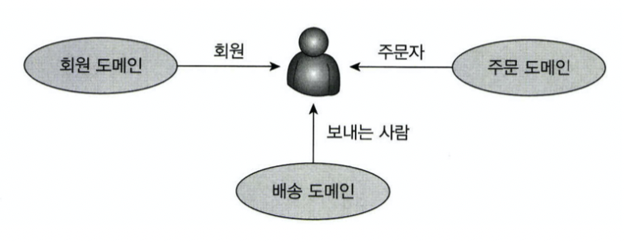
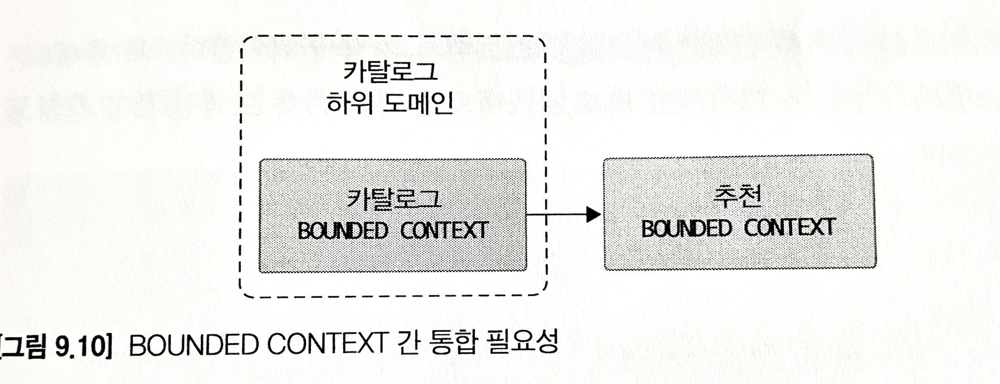
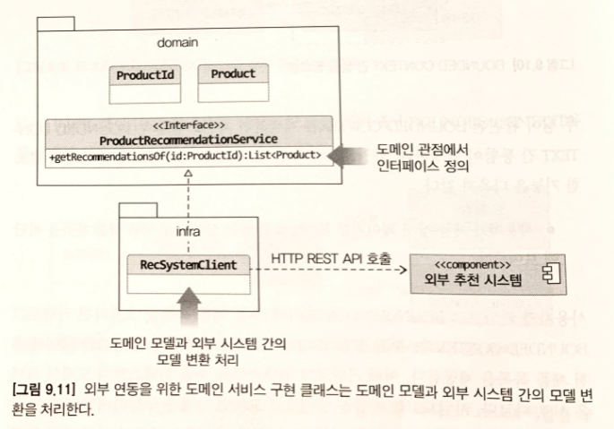
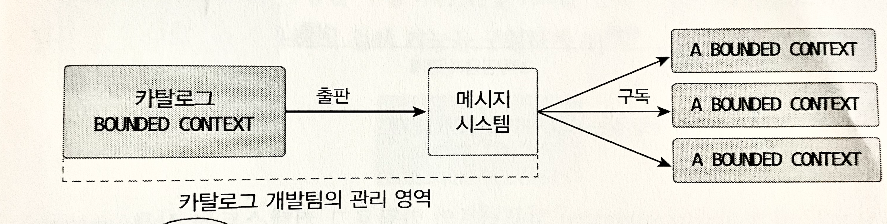
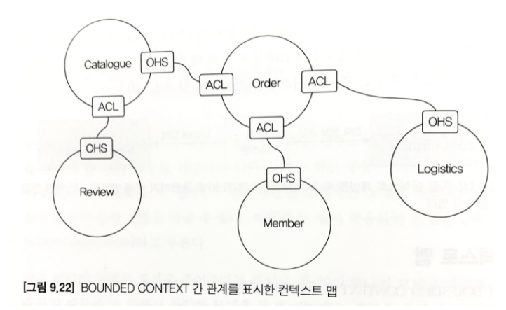

# 9장 도메인 모델과 BOUNDED CONTEXT
- BOUNDED CONTEXT
- BOUNDED CONTEXT 간 통합과 관계

## 도메인 모델과 경계
- 처음 도메인 모델 설계시 하기 쉬운 실수 = **도메인을 완벽히 표현하는 단일 모델** 을 만들고자 하는 것
- 한 도메인은 여러 서브 도메인으로 나뉘기 때문에 한 개의 모델로 여러 하위 도메인을 모두 표현하려고 하면 모든 하위 도메인에 맞지 않는 모델을 만들게 된다.


- 하위 도메인 마다 같은 용어라도, 의미가 다르고 지칭하는 용어가 다를 수 있기 때문에, 한 개의 모델로 모든 하위 도메인을 표현할 수 없다.
- 여러 하위 도메인의 모델이 섞이기 시작하면, 모델의 의미를 파악하기 어렵고 요구사항을 모델에 반영하기 어렵다.
- 모델은 구분되는 경계를 가지게 되는데 이를 **BOUNDED CONTEXT** 라고 한다.

## BOUNDED CONTEXT
- 모델의 경계를 결정하며, 한 개의 BOUNDED CONTEXT 는 논리적으로 한 개의 모델을 갖는다.
  - 카탈로그와 재고 컨텍스트는 서로 다른 용어를 사용하므로 컨텍스트를 분리할 수 있음
- 이상적인 경우는 하위 도메인과 BOUNDED CONTEXT 가 일대일 관계를 가지는 것이지만, 아직 명확하게 구분되지 않은 경우 두 하위 도메인을 한 BOUNDED CONTEXT 에서 구현한다.
- 규모가 작은 기업은 여러 하위 도메은 (회원, 카탈라고, 재고 등등..) 을 하나의 BOUNDED CONTEXT 로 구현한다.
  - 하위 도메인 모델이 섞이면 안됨
  - 한 개의 BOUNDED CONTEXT 에서 여러 하위 도메인을 포함하더라도, 하위 도메인마다 구분되도록 패키지를 나누어 구현해야 하위 도메인을 위한 모델이 서로 섞이지 않아 하위 도메인마다 BOUNDED CONTEXT 를 갖게 된다.
- BOUNDED CONTEXT = 도메인 모델을 구분하는 경계
- BOUNDED CONTEXT 는 구현하는 하위 도메인에 맞는 모델을 포함한다.
- 같은 사용자 라고 하더라도, 주문 컨텍스트와 회원 컨텍스트가 가지는 모델이 달라진다.

## BOUNDED CONTEXT 의 구현
- BOUNDED CONTEXT 는 도메인 모델 외에 표현 영역, 응용 서비스, 인프라 영역 등을 모두 포함한다.
- 도메인 모델의 데이터 구조가 변경되면 DB 테이블의 스키마도 함께 변경되어야 하기때문에 해당 테이블도 컨텍스트에 포함한다.
- **모든 BOUNDED CONTEXT 를 반드시 도메인 주도로 개발할 필요는 없다**
- 복잡한 도메인 로직을 갖지 않는 서비스라면 CRUD 방식으로 구현해야 된다.
  - DAO 와 데이터 중심의 밸류 객체를 이용해 리뷰 기능을 구현해도 유지보수하는 데 큰 문제가 없다.


- 한 BOUNDED CONTEXT 에서 두 방식을 혼합해서 사용할 수도 있는데, 대표 적인 예 => CQRS 패턴
  - 상태변경을 명령 기능과 냉요을 조회하는 쿼리 기능을 위한 모델로 구분하는 패턴.


- 각 BOUNDED CONTEXT 는 서로 다른 구현 기술을 사용할 수 있으며, 반드시 사용자에게 보여지는 UI 가 포함되는것이 아닌 JSON 으로 응답할 숟 ㅗ있다.
- 혹은 별도 UI 처리 서버를 두고, UI 서버에서 각 컨텍스트와 통신해 사용자 요청을 처리하는 방법도 있다. (파사드 역할)

## BOUNDED CONTEXT 간 통합
- 온라인 쇼핑 사이트에서 매출 증대를 위해 카탈로그 하위 도메인에 추천 기능을 도입했다고 하자. 
- 기존 카탈로그 시스템을 개발하던 팀과 별도로 추천 시스템을 담당하는 팀이 생겨 만들기로 했다. 
- 이렇게 되면 카탈로그 하위 도메인에는 기존 카탈로그를 위한 Bounded Context와 추천 기능을 위한 Bounded Context가 생기고 Bounded Context 통합이 발생한다.


- 카탈로그 시스템은 추천 시스템을 통해 데이터를 받아오지만, 카탈로그에서는 추천 도메인 모델이 아닌, 카탈로그의 도메인 모델을 사용해 추천 상품을 표현해야 함.

```java
// 상품 추천 기능을 표현하는 도메인 서비스
public interface ProductRecommendationService {
  public List<Product> getRecommendationsOf(ProductId id);
}
```
- 도메인 서비스를 구현한 클래스는 인프라스트럭처 영역에 위치하여, 외부 시스템과의 연동을 처리하고 도메인 모델간 변환을 책임진다.


- 외부 추천 시스템이 제공하는 REST API를 이용하여 특정 상품을 위한 추천 상품 목록을 로딩하고 **카탈로그 도메인에 맞는 상품 모델로 변환**한다.
- REST API 를 활용하는 방법외에 컨텍스트의 통합방식이 있다.
  - 메세지 큐를 이용해 간접적으로 통합하는 방법



`마이크로 서비스와 BOUNDED CONTEXT`
- 넷플릭스 아마존 등 많은 기업이 점차 마이크로서비스 아키텍처를 수용하는 추세이다. 마이크로 서비스는 애플리케이션을 작은 서비스로 나누어 개발하는 아키텍처 스타일이다.
- 개별 서비스를 독립된 프로세스로 실행하고 각 서비스가 REST API나 메시징을 이용해서 통신하는 구조를 갖는다.
- 이런 마이크로서비스의 특징은 Bounded Context와 잘 어울린다. 각 Bounded Context는 모델의 경계를 형성하는데, Bounded Context를 마이크로서비스로 구현하면 자연스럽게 컨텍스트별로 모델이 분리된다. 코드로 치면 마이크로서비스마다 프로젝트를 
- 생성하므로 Bounded Context마다 프로젝트를 만들게 된다. 이는 코드 수준에서 모델을 분리해 두 Bounded Context의 모델이 섞이지 않게 해준다.
- 별도 프로세스로 개발한 Bounded Context는 독립적으로 배포하고 모니터링하고 확장하게 되는데 이 역시 마이크로서비스의 특징이다.

## BOUNDED CONTEXT 간 관계
- Bounded Context는 어떤 식으로든 연결되기 때문에 두 Bounded Context는 다양한 방식으로 관계를 맺는다.
- 가장 흔한 관계는 한쪽에서 API를 제공하고 한 쪽에서 그 API를 호출하는 관계이다. REST API가 대표적이다.
- 이 관계에서 API를 사용하는 Bounded Context(하류downstream 컴포넌트)는 API를 제공하는 Bounded Context(상류upstream 컴포넌트)에 의존하게 된다.
- 상류 팀의 고객인 하류 팀이 다수 존재하면 상류 팀은 여러 하류 팀의 요구사항을 수용할 수 있는 API를 만들고 이를 서비스 형태로 공개해서 서비스의 일관성을 유지할 수 있다. 
- 이런 서비스를 가리켜 **공개 호스트 서비스(Open Host Service, OHS)** 라고 한다.
- OHS의 대표적인 예가 검색이다. 블로그, 카페, 게시판과 같은 서비스를 제공하는 포탈은 각 서비스별로 검색 기능을 구현하기보다는 검색을 위한 전용 시스템을 구축하고 검색 시스템과 각 서비스를 통합한다. 
- 이 때 검색 시스템은 상류 컴포넌트가 되고 각 서비스들은 하류 컴포넌트가 된다.
- 하류 컴포넌트는 **상류 서비스의 모델이 자신의 도메인 모델에 영향을 주지 않도록 보호해 주는 완충 지대** 를 만들어야 하는데, 
- 이는 이미 앞서 언급한 모델 변환을 해주어 내 모델이 깨지는 것을 막아 주는 **안티코럽션 계층(Anticorruption Layer, ACL)** 이 된다.
- 두 Bounded Context가 같은 모델을 공유하는 경우도 있다. 
- 예를 들어, 운영자를 위한 주문 관리 도구를 개발하는 팀과 고객을 위한 주문 서비스를 개발하는 팀이 다르다고 가정했을 때, 
- 이 경우 두 팀은 **주문 을 표현하는 모델을 공유함으로써 중복 개발을 막을 수 있다.*8
- 이렇게 공유하는 모델을 **공유 커널(Shared Kernel)** 이라고 부른다.
  - 공유 커널의 장점은 중복을 줄여준다는 것이다. 
  - 때문에 한 팀이 임의로 모델을 변경하거나 밀접한 관계를 형성할 수 없다면 오히려 개발이 지연되고 정체되는 문제가 더 커지게 된다.
- 마지막으로 살펴볼 관계는 **독립 방식(Separate Way) 관계** 이다. 
- 그냥 **서로 통합하지 않는 방식으로서 서로 독립적으로 모델을 발전** 시킨다. 
- 독립 방식에서 두 Bounded Context간 통합은 수동으로 이뤄지는데 예를 들어, 온라인 쇼핑몰 솔루션과 외부의 ERP 서비스를 사용한다고 가정했을 때, 운영자는 쇼핑몰에서의 판매정보를 직접 ERP에 수동 입력해야 한다. 
- 규모가 커지는 경우 중간에 통합 시스템을 별도로 구축하여 처리할 수도 있다.

## 컨텍스트 맵
- 컨텍스트 맵은 Bounded Context 간의 관계를 표시한 것이다.
- Bounded Context 영역에 주요 애그리거트를 함께 표시하면 모델에 대한 관계가 더 명확히 드러난다. 
- 추가로 OHS와 ACL까지 표시한다면 도메인간 조직 구조를 알 수 있어 전체 관계를 이해하는 데 도움이 된다.
- 컨텍스트 맵을 그리는 규칙은 따로 없고 단순하기 때문에 화이트보드나 파워포인트와 같은 도구를 이용해 쉽게 그릴 수 있다.


