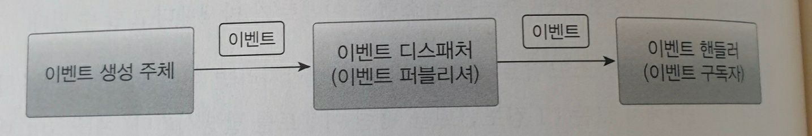
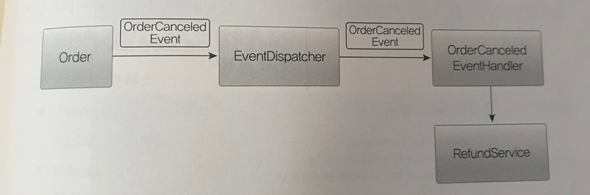
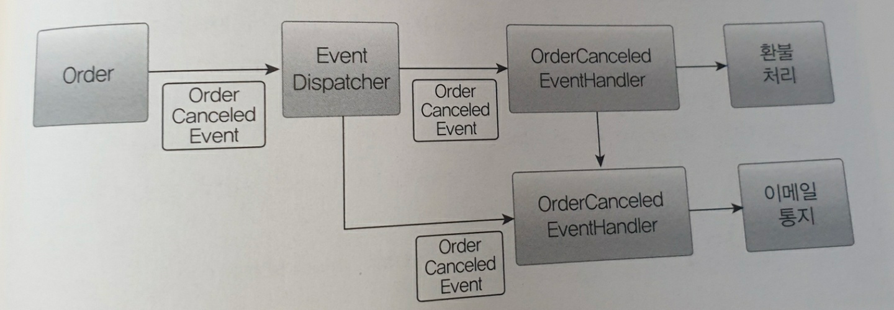
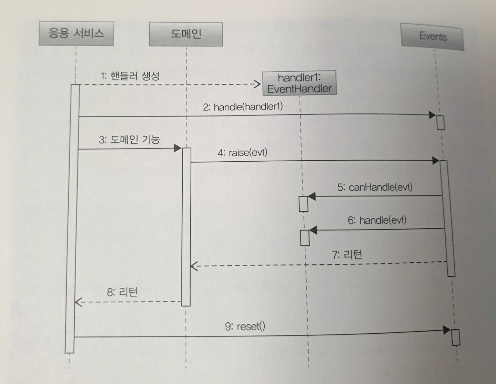
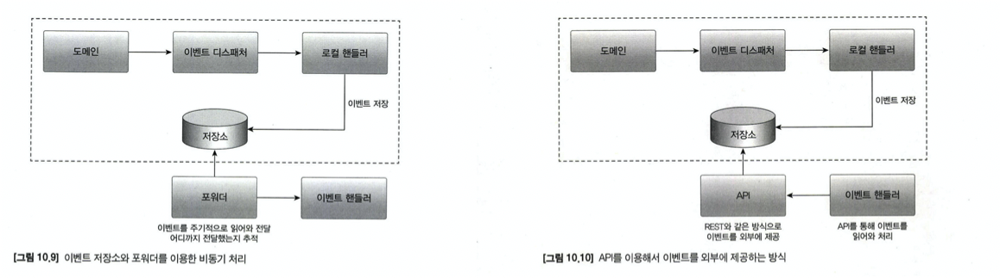

# 10장 이벤트
- 이벤트의 용도와 장점
- 핸들러 디스패치와 핸들러 구현
- 비동기 이벤트 처리

## 시스템 간 강결합 문제
- 쇼핑몰에서 구매 취소시, 환불 처리를 해야한다.
- 환불 기능의 주체는 주몬 엔티티.
- 도메인 객체에서 환불 기능 실행시 도메인 서비스를 파라미터로 받아 취소 도메인 기능에서 도메인을 서비스를 실행해야 한다.

```java
public class Order {
    
    // ...
    
    public void cancel(RefundService refundService) {
        // ...
        refundService.refund(getPaymentId()); // 인자로 받은 도메인 서비스를 실행
        //.. 
    }
}
```
- 위 방법 외에 응용 서비스에서 환불 기능을 실행할 수도 있다.

```java
public class CancelOrderService {
    private RefundService refundService;
    
    @Transactional
    public void cancel(OrderNo orderNo) {
        Order order findOrder(orderNo);
        order.cancel();
        refundService.refund(order.getPaymentId());
        // ...
    }
}
```
- 환불 기능을 실행하는 과정에서 예외가 발생하면 이는 어떻게 처리해야 하는가 ?
  - 외부 시스템이 정상이지 않은 경우, 트랜잭션 처리를 어찌해야할지 애매 하다.
  - 환불 실패시 반드시 트랜잭션 롤백을 하는것이 아니라,. 주문을 취소상태로 변경하고 환불만 나중에 다시 시도할 수도 있다.
  - 외부 시스템의 응답 시간이 길어질 경우 내부 시스템의 성능 또한 영향을 받는다.

> 이런 문제가 발생하는 이유 ? => 내부 BOUNDED CONTEXT 와 결제 BOUNDED CONTEXT 간의 높은 결합도 때문이다.
- 외부 시스템 과의 결합도를 낮추는 방법 ? => **이벤트**

## 이벤트 개요
- 여기서 말하는 이벤트 는 **과거에 벌어진 어떠한 것** 을 의미한다.
- 이벤트가 발생한다 => 상태가 변경되었음을 의미
- 도메인 모델에 이벤트를 도입하려면, 아래와 같은 네 개의 구성요소를 구현해야 한다.


- 도메인 모델에서 이벤트 주체는 엔티티, 밸류, 도메인 서비스와 같은 도메인 객체이다.
- 도메인 객체 :  도메인 로직을 실행해 상태가 바뀌면 관련 이벤트를 실행한다.
- 이벤트 핸들러 : 이벤트 생성 주체가 발행한 이벤트에 반응한다.
  - 발행한 이벤트를 전달받아 이벤트에 담긴 데이터를 이용해 원하는 기능을 실행한다.
- 이벤트 디스패처 : 생성 주체와 핸들러를 연결해준다.
  - 해당 이벤트를 처리할 수 있는 핸들러에 이벤트를 전파한다.
  - 디스패처 구현 방식에 따라 이벤트 생성/처리를 동기 혹은 비동기로 실행한다.

### 이벤트의 구성
- 이벤트는 발생항 이벤트에 대한 정보를 담는다.
  - 이벤트 종류 : 클래스 명 등으로 표현
  - 이벤트 발생 시간
  - 추가 데이터 : 주문 번호, 신규 배송지 등..

```java
public class Order {
    public void changeShippingInfo(ShippingInfo newShippingInfo) {
        Events.raise(new ShippingInfoChangedEvent(number, new ShippingInfo()));
    }
}
```
- 이벤트는, 핸들러가 작업하는데 필요한 최소한의 데이터를 담아야 함.

```java
public class ShippingInfoChangedHandler implement EventHandler<ShippingInfoChangedEvent> {
  @Override
  public void handle(ShippingInfoChangedEvent evt) {
   //이벤트가 필요한 데이터를 담고 있지 않으면, 직접 조회해와야한다.
  Order order = orderRepository.findById(evt.getOrderNo());
  shippingInfoSynchronizer.sync(
      order.getNumber().getValue(),
      order.getNewShippingInfo());
  }
} 
```

### 이벤트의 용도

`트리거`
- 도메인의 상태가 바뀔 떄 후처리가 필요한 경우 후처리를 위한 트리거로 이벤트를 사용할 수 있다.



`타 시스템간의 데이터 동기화`
- 이벤트를 사용하면 서로 다른 도메인 로직이 섞이는 것을 방지할 수 있다.




## 이벤트, 핸들러, 디스패처 구현

`이벤트 관련 클래스`
- 이벤트 클래스
- EventHandler : 이벤트 핸들러를 위한 상위 타입으로 모든 핸들러는 이 인터페이스를 구현한다.
- Evetns : 이벤트 디스패처, 이벤트 발행, 핸들러 등록, 이벤트를 핸들러에 등록하는 기능을 제곻안다.

### 이벤트 클래스
- 이벤트는 과거에 벌어진 상태 변화나 사건을 의미한다.
- 이벤트 클래스의 이름을 결정할 때 과거 시제를 사용해야 한다는 점만 유의하면 된다.
- 이벤트 자체를 위한 상위 타입은 존재하지 않는다.

```java
class OrderCanceledEvent {
    private String orderNumber;
    
    public OrderCanceledEvent(String number) {
        this.orderNumber = orderNumber;
    }
}
```
- 모든 이벤트가 공통으로 받는 프로퍼티가 있다면, 상위 클래스를 둘 수도 있다.

### EventHandler 인터페이스
- EventHandler 인터페이스는 이벤트 핸들러를 위한 상위 인터페이스이다.

```java
interface EventHandler<T> {
    void handle(T event);
    
    default boolean canHandle(Object event) {
        Class<?>[] typeArgs = TypeResolver.resolveRawArguments(
                EventHandler.class, this.getClass()
        );
        return typeArgs[0].isAssignableFrom(event.getClass());
    }
}
```
- 도메인을 사용하는 응용 서비스는 이벤트를 받아 처리할 핸들러를 Events.handle() 로 등록후 도메인 기능을 실행한다.
- Events는 내부적으로 핸들러 목록을 유지하기 위해 ThreadLocal을 사용한다.
  Events.handle() 메서드는 인자로 전달받은 EventHandler를 List에 보관한다. 
- 이벤트가 발생하면 이벤트를 처리할 Eventhandler를 List에서 찾아 EventHandler의 handle() 메서드를 호출해서 이벤트를 처리한다.

### 이벤트 처리 흐름
1. 이벤트 처리에 필요한 이벤트 핸들러를 생성한다.
2. 이벤트 발생 전에 이벤트 핸들러를 Events.handle() 메서드를 이용해 등록한다.
3. 이벤트를 발생하는 도메인 기능을 실행한다.
4. 도메인은 Events.raise()를 이용해서 이벤트를 발생시킨다.
5. Events.raise()는 등록된 핸들러의 canHandle()을 이용해서 이벤트를 처리할 수
   있는지 확인한다.
6. 핸들러가 이벤트를 처리할 수 있다면 handle() 메서드를 이용해서 이벤트를 처리한다.
7. Events.raise() 실행을 끝내고 리턴한다.
8. 도메인 기능 실행을 끝내고 리턴한다.
9. Events.reset()을 이용해서 ThreadLocal을 초기화한다.



## 동기 이벤트 처리 문제
- 이벤트를 사용해 강결합은 해소했지만, 외부 서비스에 영향을 받는 문제가 있다.
- 외부 환불 기능이 느려진다면, cancel() 메소드도 느려지게 된다.
- 외부 서비스 성능저하 => 시스템 내 성능 저하로 연결된다.
- 이는 트랜잭션도 문제가 된다.
- 이를 해소하는 방법 중 하나 => 이벤트를 비동기로 처리하는 것.

## 비동기 이벤트 처리
- 구현 방법은 매우 다양하다.
  - 로컬 핸들러를 비동기로 실행
  - 메세지 큐 사용
  - 이벤트 저장소와 포워더 사용
  - 이벤트 저장소와 이벤트 제공 API 사용

### 이벤트 저장소를 이용한 비동기 처리

`포워더 방식`
- 이벤트를 스토리지에 저장하고, 포워더가 주기적으로 이벤트를 가져와 핸들러를 실행한다.
- 포워더는 별도 스레드를 이용하므로 발행과 처리가 비동기로 처리된다.
- 이는 도메인 상태와 이벤트 저장소로 동일 DB 를 사용한다.
- 도메인 상태 변화와 이벤트 저장이 **로컬 트랜잭션** 으로 처리됨.

`이벤트 API 방식`
- API 와 포워더 방식의 차이 => 이벤트를 전달하는 방식
- 포워더는 포워더를 이용해 외부로 전달하지만, API 는 외부 핸들러가 API 를 통해 목록을 가져온다
- 포워더 방식은 API 추적 역할이 포워더에 있지만, API 는 외부 핸들러가 알고 있어야 한다.



## 구현시 고려할 점
- 포워더에서 전송 실패를 얼마나 허용할 것인지 ?
  - 특정 이벤트에서 계속 전송에 실패하면 나머지 이벤트들을 전송할 수 없게 됨.
  - 포워더 구현시, 실패한 이벤트의 재전송 횟수 제한을 두어야 한다.
- 이벤트 손실
  - 로컬 핸드러를 이용해 비동기 처리시 이벤트 처리에 실패하면 이벤트를 유실할 수 있다.
- 이벤트 순서
  - 발생 순서대로 외부 시스템에 전달해야 하는경우 이벤트 저장소를 쓰는 것이 좋다
  - 메시징 시스템은 사용 기술에 따라 발생 순서, 메세지 전달 순서가 다를 수 있다.
- 이벤트 재처리
  - 동일 이벤트를 재처리할 때 어떻게 할지 결정해야 한다.
  - 마지막 이벤트의 순번을 저장하는 방법. (이미 처리한 순번이라면 무시)
  - 이벤트 처리를 멱등으로 처리하기.