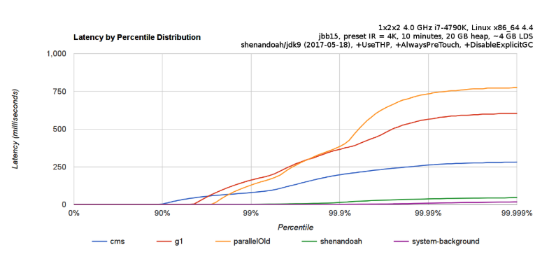
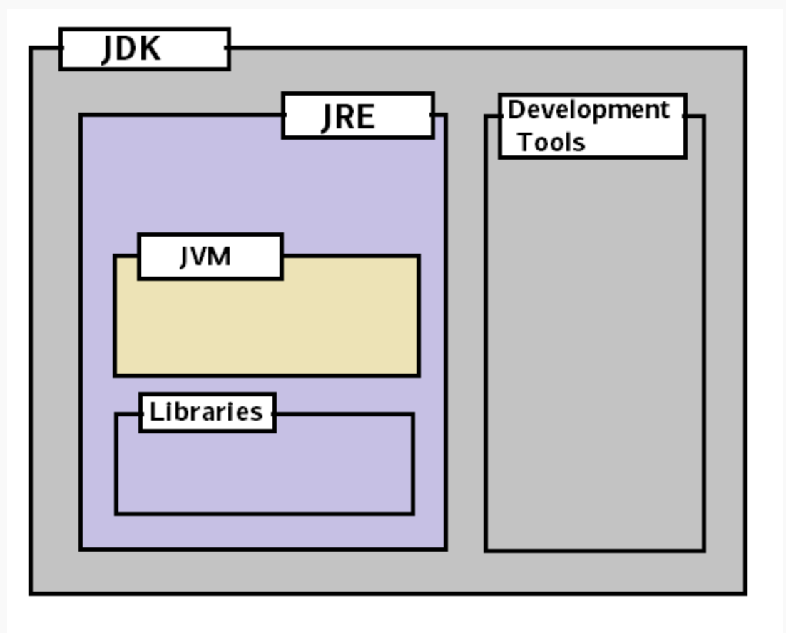
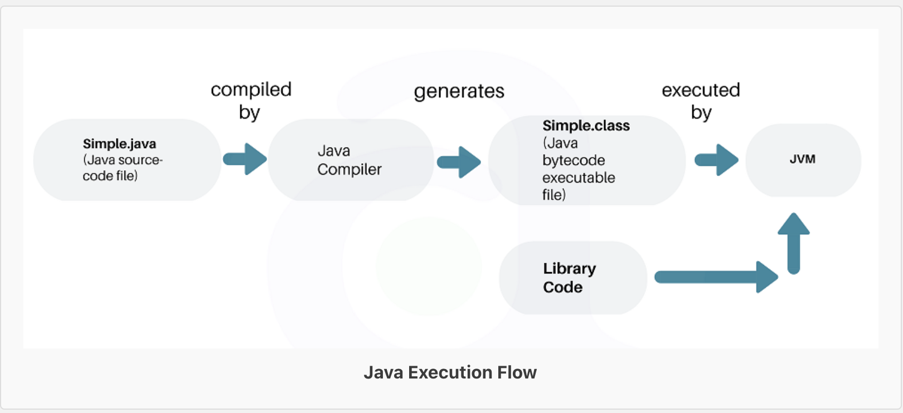
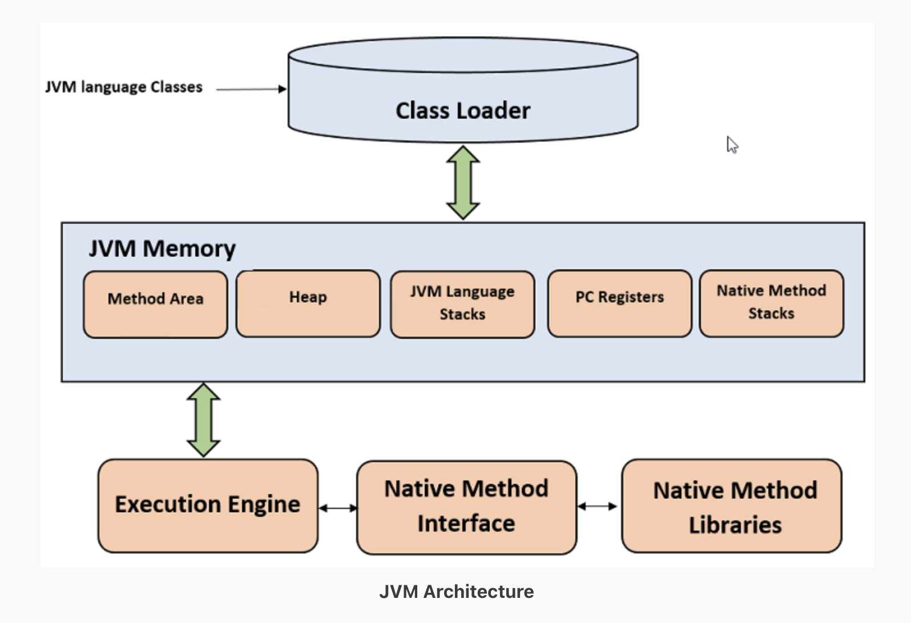
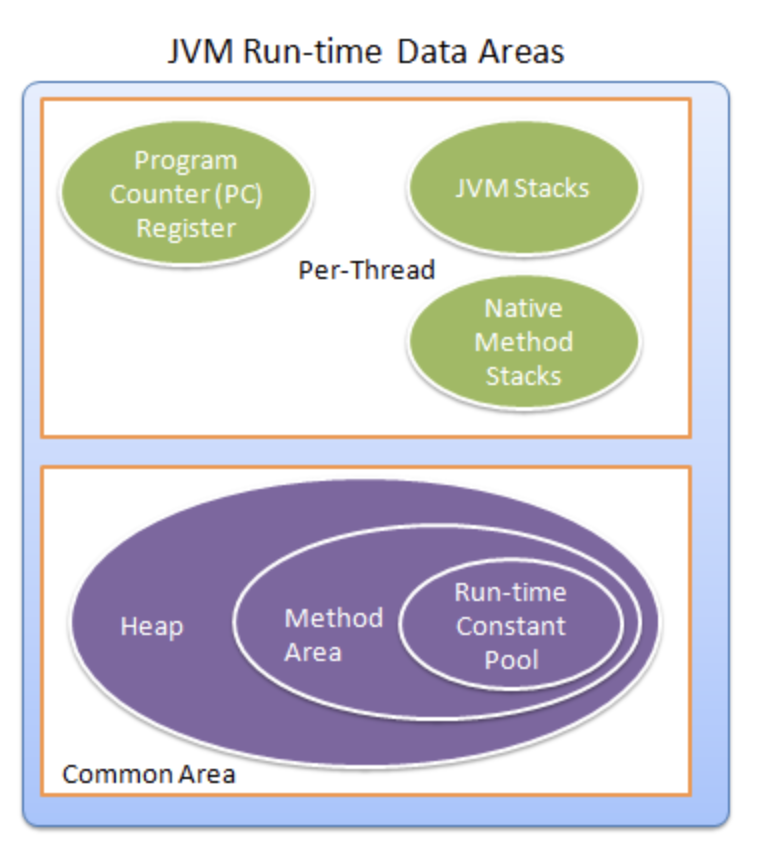
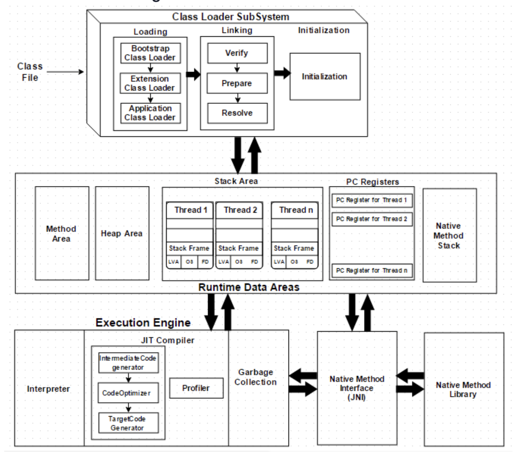
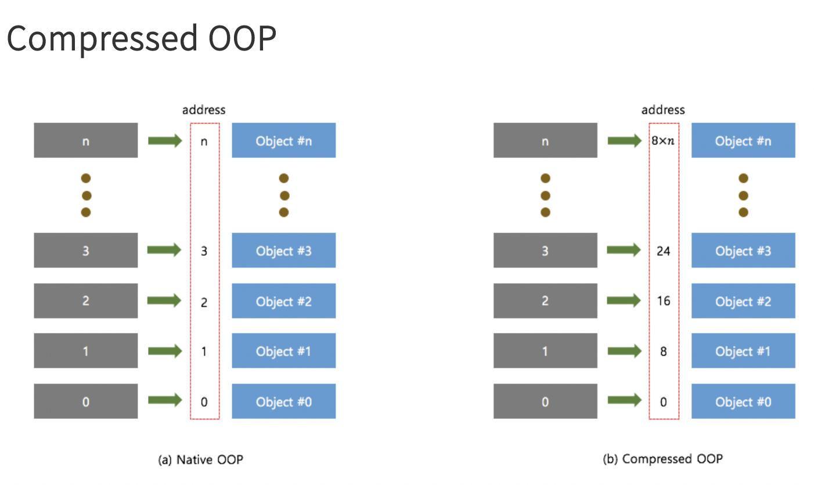

# 지옥자바 스터디 - 01 자바 소개

## 자바란 ?
- 자바는 Sun Microsystems 에서 개발하여 1996년 1월에 공식적으로 발표한 객체지향 프로그래밍 언어
- 중요한 특징은 운영체제에 독립적이라는 점
    - WRITE ONCE RUN ANYWHERE
    - 여기서 오해가 있는게 운영체제에 독립적이라는 것이다. -> JVM 자체는 플랫폼(OS) 종속적이다.
- 자바 또한 JVM 에서 돌아가기 때문에, VM 언어가 가지는 장점을 가지고 있다.
    - 메모리 관리 등..
- 반면 단점은 아무래도 가장 부각 되는 것이 컴파일 언어 (C, C++ 계열) 에 비해 퍼포먼스가 떨어진다는 단점이 있다.
- 하지만 단순 속도 비교라면 이는 **여러 지표중 하나의 불과** 하다고 생각한다.
- 속도를 만드는 방법은 단순 루프와 같은것이 아니라 다양한 방법이 존재한다.
    - 분산/병렬 처리, 설계 및 알고리즘 을 더 쉽게 이용할 수 있는 것이 좋다고 생각한다.
- **망치를 가진 사람 눈에는 모든 것이 못으로 보인다.** 라는 말을 기억하라.

> 웹 개발을 하면서 언어의 퍼포먼스가 그만큼 중요하다면 자바는 지금처럼 성장하기 힘들었을 것이고, 앞으로도 그럴 것이라고 생각한다. <br/>
> 웹 개발을 하면서 발생하는 대부분의 성능 문제는 I/O 쪽에서 발생한다.

- JVM 을 기반으로 하는 다양한 언어 들도 존재한다.
    - 스칼라, 코틀린 등..
- 이를 통틀어 자바 진영 언어라고 표현했을때... 이들이 가지는 강점은 단순 JVM 위에서 돌아가는 언어가 아닌, 자바 생태계 자체가 장점을 가진다고 생각한다.
    - 그만큼 오래되었고, 다양한 프레임워크, 오픈소스 생태계 들이 강점이라고 생각...

### 자바의 역사
- 자바는 1991년에 Oak 라는 언어에서 부터 시작되었다.
    - 자바도 코볼 계열언어 이다.
    - 코볼은 포트란에 이어 두 번째로 개발된 고급 언어
    - 기업 사무처리에 적합한 언어로 개발되었고, 사람이 쉽게 이해하도록 작성이 가능했다.
- C++ 의 장점을 도입하고, 단점을 보완한 새로운 언어를 개발 한것 -> Java
    - C++ 과 자바의 장점을 합쳐서 만든게 C# 이고, 좀 더 개발자 친화적이라는데 이부분은 잘 모르겠다.
    - C# 에서 가장 눈여겨본 점은 **async await 와 같은 비동기 처리** 를 단순하게 할 수 있다는점과 **ODBC 비동기 지원** 한다는점..
- 1996년 1월에 정식 버전을 발표했고, 그후 Applet 으로 웹 페이지에서 많이 사용함
- 그후 Servlet / JSP (Java Server Page) 와 같은 기술이 나오게 되고, 지금은 안드로이드 개발에도 많이 사용한다.

> https://en.wikipedia.org/wiki/List_of_JVM_languages

### 자바의 특징
1. 운영체제에 독립적
    - JVM 으로 인해 운영체제에 독립적이나, JVM 자체는 운영체제에 종속적이다.
    - WRITE ONCE RUN ANYWHERE
2. 객체지향 언어
    - 객체지향 언어중 하나이고, 객체지향 언어의 특징인 상속 / 캡슐화 / 다형성이 잘 적용된 순수 객체지향 언어라는 평가를 받고 있다.
3. 상대적으로 낮은 러닝커브
    - C++ 이나 small-talk 에서 주로 사용하는 특징이나 문법들을 많이 채용했기 때문에 상대적으로 러닝커브가 낮다. 
4. 메모리 관리 지원
    - 가비지 컬렉터 (GC) 가 메모리 관리를 해주기 때문에 개발자는 메모리 관리를 따로 하지 않아도 된다.
    - GC 관련 얘기를 하자면 다양한 GC 알고리즘이 있는데 대부분 CMS 혹은 G1 GC 를 사용할 것이다.
    - 가장 최근에 나온 **Shenandoah GC** 가 있음.
5. 네트워크 및 분산처리를 지원
    - 대규모 분산 환경을 염두해 다양한 네트워크 프로그래밍 라이브러리를 지원한다.
6. 멀티스레드 지원
    - 멀티쓰레드 구현을 OS 와 관계없이 구현이 가능하고, 관련 라이브러리를 제공한다.
    - 또한 여러 스레드에 대한 스케쥴링을 인터프리터가 담당한다.
    - [Thread-Scheduler](https://github.com/ces518/TIL/blob/master/java/Java%20Thread%20%EA%B8%B0%EB%B3%B8.md#jvm-thread-scheduler)    
7. 동적 로딩 지원
    - 자바로 작성된 애플리케이션은 다수의 클래스로 구성되어 있다.
    - 동적 로딩을 지원하기 때문에, 애플리케이션 실행시 모든 클래스를 로딩하지 않고, 필요한 시점에 클래스를 로딩하여 사용한다.
    - 이를 이용한 가장 Modern 한 **Singleton 구현 방식 (Lazy-Holder)** 도 제시되고 있다.

`Shenandoah GC`

- 이는 low-pause GC 라고 불리고, 작은 GC 단위로 여러번 수행한다는 컨셉이다.
- CPU 를 더 많이 사용하는 대신 STW 를 줄인다.
- Oracle ZGC 도 잇는데, 이와 비슷한 매커니즘으로 동작하고 jdk 11 이상만 지원한다.
- 반만에 Shenandoah GC 는 OpenJDK 12 에 나왔고, jdk11, jdk8 까지 backporting 을 지원한다.
- CMS 가 가진 단편화 문제와 G1 이 가진 STW 이슈를 해결한 방식이다.
- 강력한 Concurrency 를 지원하고, 가벼운 GC 로직을 이용해 heap 사이즈에 영향없이 일정한 STW 가 발생한다.



> https://velog.io/@recordsbeat/Low-Pause-Shenandoah-GC?fbclid=IwAR1heQT6jURViu28HWXRS5iHTdPU63_8t0MqoXMSQ7SVq8Yo9rTraKymMqw

`Lazy-Holder 기법`

```java
class Hello {
	
	private Hello() {}
    
    public static Hello getInstance() {
		return LazyHolder.IT;
    }
    
    private static class LazyHolder {
		private static final Hello IT = new Hello();
    }
}
```
- 기존의 다양한 방식의 싱글톤 구현 방식은 동시성 문제가 있다..
- Lazy Loading 을 이용해 동시성 문제를 JVM 에 위임해버리는 방식

`Kotlin 에서 Singleton 을 보장하는 방식`

- kotlin 에서는 object 키워드를 이용해 **언어레벨** 에서 singleton 객체를 보장한다.
    - 위와 비슷하게 Lazy Loading 을 이용해 동시성 문제를 JVM 에 위임하는 방식을 이용한다.

```kotlin

// source
object HelloSingleton {

    fun greeting(): String {
        return "hello"
    }
}

// decompile-java
@Metadata(
    mv = {1, 5, 1},
    k = 1,
    xi = 48,
    d1 = {"\u0000\u0012\n\u0002\u0018\u0002\n\u0002\u0010\u0000\n\u0002\b\u0002\n\u0002\u0010\u000e\n\u0000\bÆ\u0002\u0018\u00002\u00020\u0001B\u0007\b\u0002¢\u0006\u0002\u0010\u0002J\u0006\u0010\u0003\u001a\u00020\u0004¨\u0006\u0005"},
    d2 = {"LHelloSingleton;", "", "()V", "greeting", "", "untitled"}
)
public final class HelloSingleton {
    @NotNull
    public static final HelloSingleton INSTANCE = new HelloSingleton();

    private HelloSingleton() {
    }

    @NotNull
    public final String greeting() {
        return "hello";
    }
}
```

## JVM, JRE, JDK 이해하기



### JVM (Java-Virtual-Machine)
- JVM 은 직역하면 자바 가상머신 이라고 할 수 있다.
- 가상 머신은 쉽게 생각하면 OS 가 직접 컴파일된 결과물을 실행하는것이 아니라, OS 사이에 추상화된 영역이 존재하고, 해당 영역에서 이를 실행한다고 이해하면 좋을듯 하다.
- 자바로 작성된 애플리케이션은 모두 JVM 에서만 실행되고, 자바를 실행하기 위해서는 JVM 이 반드시 필요하다.
- 일반적인 소스코드의 경우 OS 가 직접 실행하는 반면 자바는 JVM 을 한번 더 거쳐 바이트코드로 변환하기 때문에 100% 컴파일된 상태가 아니다.
- 때문에 실행시 해석기 (interpreter) 가 필요하고, 해석하는 과정 때문에 속도가 느리다는 단점이 있다.
- 하지만 반복되는 구문을 지속적으로 해석하는 경우 성능상 손해를 보기 때문에 이를 바이트코드로 변환해주는 JIT 컴파일러 및 최적화 기술이 적용되어 격차가 많이 줄어든 상황이다. 
- JVM 자체는 **표준**, 즉 스펙이라고 생각하면 되고 특정 벤더 (Oracle, Amazon, Azul 등..) 이 구현한 JVM 이 바로 **구현체** 이다.
    - [JVM Spec](https://docs.oracle.com/javase/specs/index.html)
    - 대부분 Hotspot JVM (Oracle) 을 사용했을 것

`JVM 의 역할`


- JVM 의 역할은 크게 4가지로 구분된다.
1. 클래스를 읽어들인다.
2. 메모리에 로드한다.
3. 여러 구역으로 나뉘어진 메모리 공간을 관리한다.
4. 바이트 코드를 실행한다.

`JVM 아키텍쳐`







- **ClassLoader**
    - 클래스 파일을 로드 하는 역할
    - 로딩, 링크, 초기화 3가지 동작으로 크게 구분할 수 있다.
    - **ClassLoader - Loading**
        - JVM 에서는 3가지 종류의 클래스 로더가 있다.
            - Bootstrap, Extension, Application
        - 클래스파일 로딩이 시작되면, JVM은 로드한 클래스가 의존중인 의존성을 먼저 찾게된다.
        - 1. Bootstrap ClassLoader 가 rt.jar 내부에 lib 폴더를 찾는다.
        - 2. 의존성을 찾지 못한경우, Extension ClassLoader 가 jre\lib\ext 폴더를 찾는다.
        - 3. 그래도 찾지 못한경우, Application ClassLoader 가 CLASSPATH 에 존재하는 시스템 환경 변수 및 모든 jar 파일을 통해 찾는다.
        - 4. 3번까지 해도 찾지 못한경우, ClassNotFoundException 이 발생한다.
    - **ClassLoader - Linking**
        - 클래스가 로드된 이후 Linking 이라는 작업이 진행된다.
        - Linking 하는 과정에서, Class 의 **static 변수 및 메소드를 메모리에 할당** 한다.
        - 1. Verify
            - 바이트코드 검증기를 이용하여 바이트코드가 올바른지 검사하고, 만약 유효하지 않다면 에러가 발생한다.
        - 2. Prepare
            - 모든 static 변수가 할당되고, 기본 값으로 초기화 된다.
        - 3. Resolve
            - 클래스의 상수 풀 내 모든 symbolic 참조를 method area 에 존재하는 원본 참조로 변경된다.
    - **ClassLoader - Initialization**
        - 클래스로더의 마지막 과정
        - 이 과정에서 모든 static 변수가 초기화되고, static block 이 실행된다.
    
- **JVM Memory Areas (Runtime Data Area)**
    - **Method Area**
        - 메소드 영역은, class 의 메타정보, 런타임 상수풀 및 메소드 코드와 같은 클래스 구조를 저장한다.
    - **Heap**
        - 애플리케이션 실행시점에 생성되는 모든 객체를 저장한다.
        - Young, Old, Perm 세가지 영역으로 구분된다.
        - Young : 새롭게 생성된 객체가 저장되고, 대부분의 객체가 여기서 사라진다.
        - Old : Young 에서 살아남은 reachable (참조중인 상태) 상태를 가진 객체가 여기로 이동된다.
        - Perm : Method Area 라고도 하며 클래스와 메소드 메타 정보가 저장된다. (8버전 부터 제거됨)
    - **Stacks**
        - 로컬변수, 메소드 연산 결과를 저장하며 이렇게 생성된 변수는 변수가 생성되는 스레드의 지역성을 띄고 있다.
        - 각 스레드들은 각자의 JVM Stack 을 가지고 있고, 스레드 생성과 동시에 Stack 이 생성된다.
        - 그래서 모든 로컬 변수는 **스레드 로컬 변수** 라고도 한다.
        - 이름에서도 알 수 있듯이 내부에 StackFrame (Method Call) 을 쌓아가는 구조 
        - StackFrame 은 크게 3가지 로 구성된다.
        - 1. Local Variable Array
            - 메소드와 관련된 로컬 변수가 저장된다.
            - 0번 인덱스에는 해당 객체의 this 참조가 저장된다.
            - 1번 부터 파라미터들이 저장되고, 그 이후 메소드의 지역 변수들이 저장된다.
        - 2. Operand Stack
            - 중간 작업이 필요한 경우, Operand Stack 이 작업을 수행하기 위한 **런타임 실행 공간 역할**을 수행한다.
                - 이 말이 잘 이해가 되지 않았는데 학부생 시절에 하던 **Stack 기반의 계산기 프로그램 (중위 연산, 후위 연산 등) 과 비슷한 느낌** 임..
            - arguments 들을 저장하고, 여러 중간 연산의 값을 반환한다.
        - 3. Frame data
            - Constant Pool Resolution (런타임 상수풀 의 참조)
                - Resolution? -> Symbolic 참조를 Direct 참조로 변경하는 것
                - 런타임 상수풀의 Pointer 라고 생각하면 됨
            - 이전에 자신을 호춣나 Stack-Frame Pointer 정보를 저장되어 있다.
            - 예외가 발생할 경우 이를 핸들링 하기 위해 try-catch block 의 정보가 저장되어 있다.
    - **PC register**
        - PC = Program Counter 의 약자
        - 실행할 StackFrame 을 가리키는 포인터가 있다.
        - 자바는 각 스레드에 별도의 PC register 가 존재한다.
    - **Native Method Stack (Thread)**
        - Native Method 를 지원
            - 대부분의 로우 레벨 코드는 C, C++ 과 같은 언어로 작성되어 있다. (Native Method 는 Method 에 Native 라는 키워드가 붙어 있음)
        - Native Method 호출시마다 별도로 쌓이는 스택이고, 각 스레드 마다 생성된다.
        - JVM 에서 Native Method 를 호출 할 수 없는 경우 이는 필요가 없다.
        - 일반 JVM 과 유사하게 메모리 관리가 되고 있고, OOM, StackOverFlow 에러 가 발생할 수 있다.
        - Native Method Stack 에는 Native 코드의 명령이 포함되어 있다.
        - **JNI** 를 통해 Native Method Library 를 사용한다.
    
- **JNI (Java Native Interface)**
    - Java 에서 C, C++, 어셈블리로 작성된 함수를 사용할 수 있는 방법을 제공한다.
    - [JNI 를 이용한 Native Method 구현](https://schlining.medium.com/a-simple-java-native-interface-jni-example-in-java-and-scala-68fdafe76f5f)

`Operand Stack`

```java
public int hello(int a, double b, String c) {
    return a;
}
```
- 위와 같은 메소드가 있다고 가정하면, Local Variable Array 은 다음과 같이 생성된다.

```text
  +-----------+
0 | reference | this (hidden)
  +-----------+
1 | int       | int a
  +-----------+
2 |           | double b
  + double    +
3 |           |
  +-----------+
4 | reference | String c
  +-----------+
```
- reference 는 heap 메모리의 reference 를 의미한다.
- primitive 타입은, 값 자체를 프레임에 저장하기 때문에, Wrapper 타입보다 좀 더 빠르다.
- int 와 비교했을때 double 과 long 타입은 두배의 공간을 차지한다.


- **Execution Engine**
    - **Interpreter**
        - 인터프리터는 바이트코드 해석은 빠르지만, 실행은 느리다.
        - 인터프리터의 단점은 반복되는 구문이 존재해도, 매번 재해석을 해야한다는 점이다. (인터프리터 언어의 단점)
        - JVM 은 기본적으로 인터프리터를 이용하여 동작한다.
    - **JIT Compiler**
        - Just-In-Time
        - 인터프리터의 단점을 보완하기 위해 도입됨 (기본적으로 활성화 되어 있다.)
        - 인터프리터 방식으로 실행하다가 반복되는 구문이 발생하면 해당 부분을 컴파일하여 변경후, 해당 코드는 인터프리팅 하지 않는다.
        - JIT 컴파일러는 4가지 구성요소가 있다.
        - 1. Intermediate Code Generator : **중간 코드 : IR(Intermediate Representation)** 생성기 (바로 네이티브 코드로 변환하지 않고, 최적화를 위해 중간 코드를 거친다.)
        - 2. Code Optimizer : 중간코드 생성기가 생성한 코드의 최적화를 담당한다.
        - 3. Target Code Generator : 네이티브 코드 생성을 담당한다.
        - 4. Profiler : 동일한 메소드를 반복해서 호출하는 등 핫스팟 요소를 찾는 역할을 담당 (프로파일러의 대상이 되면 최적화 대상이됨)
    - **Garbage Collector**
        - 참조되지 않는 객체들을 정리해주는 역할
        - System.gc() 를 호출해서 가비지 컬렉션을 트리거 할 수 있지만, 실행이 보장되지는 않는다.
        - GC 를 위해 애플리케이션이 멈추는 순간이 있는데 이를 STW 라고 한다.
        - GC 튜닝은 이러한 STW 타임을 최소화 하는것
    
### GC Deep Dive
- GC 의 과정을 표현하자면 **Mark and Sweep** 이라고 표현할 수 있다.
- **Mark** 는 GC 가 모든 변수 혹은 객체를 스캔하며, 각 어떤 객체를 참조 하고 있는지 찾는 과정을 말한다.
    - 이 과정에서 STW 가 발생한다.
- **Sweep**
    - Mark 되어 있지 않은 객체들을 힙에서 제거하는 과정이다.

`Minor GC / Major GC`
- Heap 영역은 Young, Old, Perm 세 영역으로 구분된다.
- Young 에서 발생한 GC = Minor GC
- 나머지 영역에서 발생한 GC = Major GC (Full GC)

`Old 영역에서 Young 영역의 객체를 참조하면 ?..`
- Old 영역에서 Young 영역의 객체를 참조하는 경우를 처리하기 위해 **512 Bytes 의 카드 테이블** 이 존재한다.
- 카드 테이블은 Old 영역의 객체가 Young 영역의 객체를 참조할때 마다 정보가 표시되고, Minor GC 가 발생할때 카드 테이블만을 뒤져 GC 대상을 식별한다.

`Young 영역 살펴보기`
- Young 영역은 다시 3개의 영역으로 구성되는데, Eden, Survivor1, Survivor2 가 있다.
- Eden : 새로 생성된 대부분의 객체가 위치, GC 가 발생한뒤 Survivor 영역중 한곳으로 이동한다.
- Survivor1, Survivor2 : Survivor 영역중 한곳이 가득차면 GC 가 발생하고, 그중 살아남은 객체를 다른 Survivor 영역으로 이동한다.
    - 이과정을 반복하다 Old 영역으로 이동하게 된다.

> Survivor 영역중 한곳은 반드시 비어 있어야하며, 양쪽 모두 데이터가 존재하는 등의 상황이라면 정상적인 상황이 아니다.

`bump-the-pointer`
- 빠른 메모리 할당을 위한 기술
- 별도의 pointer 를 두어, Eden 영역에 할당된 마지막 객체를 추적하는 방식이다.
- 마지막 객체는 Eden 영역의 가장 위에 있고, 새로운 객체 생성시 마다 마지막에 추가된 객체만 점검하면 되기때문에 빠른 메모리할당이 가능하다.

`Mutli-Thread 환경이라면 ?..`
- 멀티 스레드 환경이라면 Thread-Safe 하게 동작하기 위해선 Lock 매커니즘을 이용할 수 밖에 없고 이로 인해 성능저하가 발생한다.
- HotSpotVM 에서 이를 해결하기 위해 제시한 방법이 *TLABs*
    - Thread-Local Allocation Buffers
- 각 스레드들이 Eden 영역을 스레드 수 만큼 작은 덩어리로 찢어 나눠같는 방식 -> Lock 없이 Thread-Safe 한 메모리 할당이 가능하다.

### JVM Deep Dive

`Client-Server Model`

- JVM 은 **Client**, **Server** 두가지 모델이 존재한다.
- 두 모델은 비슷한데, Server 모델은 오래시간 구동되는 상황에서 더 최적화된 버전이다.
- **Client** 모델은, JIT 컴파일러를 사용하기 전에, 서버 시작은 빨라지고, 더 적은 메모리 사용량 (foot-print) 를 사용한다.
    - GUI (Swing), 또는 작은 시스템 구동시 사용하기 좋다.
- **Server** 모델은, Client 보다 더 많은 최적화를 진행한다.
    - 빠른 Operation 이 위 보다 더 중요한 상황에서 사용하기 적합하다.
    - 일반적으로 애플리케이션 서버로 사용할 경우 사용한다.
- -client, -server 옵션을 이용해 모델을 선택할 수 있다.

`JVM Options`

- Xms
    - JVM 시작시 Heap Size
- Xmx
    - 최대 Heap Size

> 일반적으로 Xms, Xmx 를 동일하게 세팅하는것을 추천한다. <br/>
> Heap 사이즈를 늘리거나 하는 불필요한 오버헤드를 줄일 수 있고, 최신 JVM 에서는 설정하지 않는것을 추천한다고 한다.

[참고](https://newrelic.com/blog/nerd-life/state-of-java)
```text
In very early versions of the adaptive sizing algorithms there may have been some advantage to running with this combination, but for modern workloads it’s almost always counterproductive. 
If you set this combination, the JVM is constrained in how it can resize and shape the heap, making it less responsive to sudden changes in traffic behavior or request rate.
```

- networkaddress.cache.ttl
- sun.net.inetaddr.ttl
    - JVM DNS Cache 설정
    - -1 : 무기한 캐시
    - 0 : 캐시를 사용하지 않음
- XX:MaxPermSize
- XX:PermSize
    - 1.8 버전 이전에는 Perm 영역이 존재하였으나, Deprecated 되었다.
    - 1.8 버전 이후 Native Memory 영역으로 이동하여 Metaspace 영역으로 변경되었다.
        - Perm 은 JVM 에 의해 크기가 강제되었지만, Metaspace 는 OS 가 자동으로 크기를 조절하며, 옵션으로 크기를 줄일 수 있다.
        - Perm 이 제거된 가장 큰 이유는, 각종 메타 정보를 OS 가 관리하는 영역을 옮겨 Perm 의 사이즈 제한을 늘린 것이다.
        - [JEP 122](https://openjdk.java.net/jeps/122) 에서 JRockit / Hotspot 을 통일하기 위해 Perm 영역을 삭제했다.
        - JEP (JDK Enhancement Proposal) 는 JDK, OpenJDK 개선을 위한 프로세스
-XX:MaxMetaspaceSize
    - 사라진 Perm 영역을 대체하는 옵션
    - 별도로 설정하지 않는다면 NONE
    - OS 에서 관리하기 때문에 별도로 설정하지 않아도 된다 라고 하지만 정말 그래도 될까? ..
    - [MaxMetaspaceSize 반드시 해야하는가 ?](https://blog.voidmainvoid.net/210?category=608632)

- JDK 7, JDK 8 의 메모리 구조 및 변경점을 살펴보면 다음과 같다.
```text
// ~ JDK 7
<----- Java Heap ----->             <--- Native Memory --->
+------+----+----+-----+-----------+--------+--------------+
| Eden | S0 | S1 | Old | Permanent | C Heap | Thread Stack |
+------+----+----+-----+-----------+--------+--------------+
                        <--------->
                       Permanent Heap
S0: Survivor 0
S1: Survivor 1

// JDK 8 ~
<----- Java Heap -----> <--------- Native Memory --------->
+------+----+----+-----+-----------+--------+--------------+
| Eden | S0 | S1 | Old | Metaspace | C Heap | Thread Stack |
+------+----+----+-----+-----------+--------+--------------+
```

| - | Java 7 | Java 8 |
| --- | --- | --- |
| Class, Method 메타 데이터 | Perm | Metaspace |
| static object 변수, 상수 | Perm | Heap 으로 이동 (GC 대상이 될수 있도록) |
| 메모리 튜닝 | Heap, Perm 튜닝 | Heap 튜닝 / Native 영역은 OS Level |

> Java7 까지의 클래스 메타 데이터와 static 변수들은, class 로드가 해제될때 gc 처리된다는 점이 차이가 있다.

`Heap Size 는 얼마나 잡아야 할까?`
- 오픈톡방에서 몇번 한 얘기지만.. 또 하자면...
- 32bit 운영체제는 최대 Heap Size는 4GB 까지 사용할 수 있고, 64bit 는 그보다 더 사용할 수 있다.
    - 하지만 64bit 는 **포인터 크기가 증가** 함에 따라 불필요한 메모리를 사용하게 되고, 퍼포먼스가 떨어질 수 밖에 없다.
    - 만약 4GB 힙을 사용하다가, 5GB 로 증가해도 이래야 할까 ?.. -> 이는 매우 낭비이다.
- 이는 비효율적이기 때문에 **Compressed Ordinary object pointers (OOP)** 를 사용한다.


- 이는 32 bit 기반으로 4GB 이상의 영역을 가리킬 수 있게 하는 방식이다.
- Native OOP 의 경우 Object 의 주소를 바로 가리키지만, Compressed OOP는 주소가 아닌 주소의 offset 을 가리킨다.
- 오프셋은 8의 N 배수로 계산되고, N 개의 OOP 로 8배 많은 공간을 가리킬 수 있게 한다.
    - 무슨소린고 하니, 쉽게 생각하면 1bit 공간에 1bit 씩 넣는게 아닌, 1bit 공간을 8등분해서 사용한다 라고 이해하면 쉽다.
- 8배수 단위로 Object 를 저장하기 위해 left-shift 연산을 이용한다.
    - shift 연산으로 오버헤드가 존재하지만, 큰 성능저하가 발생하진 않는다.
- 또한 힙 사이즈가 32GB 가 넘어가면 64bit 기반 OOP 를 사용하기 때문에 Heap 영역은 32GB 미만 으로 사용하도록 권고한다.
    - ES 에서도 권고함

`Zero Based Heap Memory Issue`
- Compressed OOP 는 shift 연산이 필요하기 때문에, 주소 공간이 0 부터 시작한다면 shift 연산 이외의 연산은 필요없게 된다.
- 하지만 0 부터 시작하는것이 아니라면 오프셋 계산을 위해 shift 연산 이외에 추가적인 연산이 필요하다.
- 만약 많은 영역의 메모리를 사용중이라면 이는 성능에 영향을 줄 수 있다.

`Zero Base 한계치 확인`

```shell
-XX:+UnlockDiagosticVMOptions -XX:+PrintCompressedOopsMode
```

`적절한 힙메모리 설정`

1. 시스템 전체 메모리의 절반만 사용
2. 32GB 이하로 사용하고, 테스트를 통해 CompressedOOP 의 임계치 확인
3. Zero Base Compressed OOP 를 사용 가능한 임계치 확인

`JDK Vendor 관련`

- [OpenJDK vs HotspotVM](https://stackoverflow.com/questions/44335605/openjdk-vs-java-hotspotvm)
- [TCK](https://en.wikipedia.org/wiki/Technology_Compatibility_Kit) 관련 문제
    - AdoptOpenJdk 가 TCK 인증을 받지 못했는데 받았다고 설명 올린게 있음
    - 베네로그 / 루기님이 보고 이의제기해서 해당 설명 내린상태
    - TCK 에 준하는 자체적인 테스트를 자기들이 거쳤다. 라고 정리됨
- [OCTLA Signatories List](https://openjdk.java.net/groups/conformance/JckAccess/jck-access.html)
    - 사내표준은 AdoptOpenJDK 흠.. ㅎ


### JRE (Java Runtime Environment)
- JVM 은 홀로 제공되지 않고, 최소한의 배포단위는 **JRE** 이다.
- JVM 및 실행하기 위한 몇몇 라이브러리를 같이 배포한다.
- Java 애플리케이션을 실행하도록 하는것이 JRE 의 목적이다.
- Java 애플리케이션을 실행하기 위한 **최소한의 패키지 단위** 이다.
- 개발에 필요한 Tool 은 제공하지 않고, 컴파일러도 포함되어 있지 않다.

### JDK (Java Development Kit)
- JRE + 개발에 필요한 툴
- Java 11 버전 부터는 JDK 만 제공하고, JRE 는 별도로 제공하지 않는다.
- Java 9 버전부터 모듈 시스템을 제공하고, 모듈 시스템을 이용하여 별도로 JRE 를 구성할 수 있다.
    - Jlink
    - [Easy JRE](https://justinmahar.github.io/easyjre/)

`jlink 실습`

```shell
./jlink --output jre---e---w---x--sqt---z--aou--s---------c---t--w------uv--9--x-f-z-i----------l--5-------z-3-2-p-------f---fn--f-0---------c---p----2--n7----s---kk--0- --compress=2 --no-header-files --no-man-pages --module-path ../jmods --add-modules ,,,"sȅs�QN�I�h�eQ"��,"sȅs�QN�I�h�eQ"��,-�*�ou�z�U�P�0,201222051" �'?s�,==�<�<�<�<�<�<�=�=>!>6>B>L>]>m>{>�>�>�>�>�>�>?? ?2?J?Y?�?�?"`�Q#`",H�H�= EH�5�DH��L�%A��H�5�DL��H��1�A��H�5�DL��L��H��A��L����L�����	����%�C�%�C�%�C�%�C�%�C�%�C�%�C�%�C�%�C�%�CL��DAS�%��h������h������h������h������h�����h�����h����h����hB����hr����,__cfstring__DATA_CONSTP,__got__DATA_CONST`,`t,`t,h���/System/Library/Frameworks/CoreFoundation.framework/Versions/A/CoreFoundation& )(���,h���/System/Library/Frameworks/CoreFoundation.framework/Versions/A/CoreFoundation&�)��P�,�,�,�A�3���0X�Z2�h���es�g^e�I�v�3e�w��-��z0�v0U�0U�0�0U+�iG�v	��k�.,�A�3���0X�Z2�h���es�g^e�I�v�3e�w��-��z0�v0U�0U�0�0U+�iG�v	��k�.,�D ������� ��6X �i6Xq(��,�X�Q=�W=�Z=�]=�l=��=��=��=��=��=��=��=��=��=��=��=��=,�� H__PAGEZERO(__TEXT,��1"�0,��1"�0,��1B�0,��1B�0,��1b�0,��1b�0,��1�0,��1��0,��1��0,��1��0,��1��0,��N�;Y����6x�s��L��H��P׆�+�S�(0(�������Xo��f����kOX�|�|z�ڽ�H�,����Xo��f����kOX�|�|z�ڽ�H�,�G����=�r�l,��n1Tm	�<��9���`"]�䄢,��n1Tm	�<��9���`"]�䄢,���P��[�]�Te�s/b�8�drm|iGa�&���,$�j�?��̬)L�Iy�uv����	�LSx��v����2ʑ���9���j��f� K�;-���Ɉ-i¤*a/ۇ�!�L����-�r�n�?��̣,���P��[�]�Te�s/b�8�drm|iGa�&���,$�j�?��̬)L�Iy�uv����	�LSx��v����2ʑ���9���j��f� K�;-���Ɉ-i¤*a/ۇ�!�L����-�r�n�?��̣,����
```

> 굉장히 이상하게 나오는데 ... 그냥 이런게 있다 정도만 알면 될듯...

## 참고
- https://wiki.openjdk.java.net/display/shenandoah/Main
- https://howtodoinjava.com/java/basics/jdk-jre-jvm/
- https://brunch.co.kr/@alden/35
- https://nesoy.github.io/articles/2019-08/JVM-Options
- https://johngrib.github.io/wiki/java8-why-permgen-removed/
- https://stackoverflow.com/questions/44335605/openjdk-vs-java-hotspotvm
- https://javapapers.com/core-java/java-jvm-run-time-data-areas/#Program_Counter_PC_Register
- https://dzone.com/articles/jvm-architecture-explained
- http://www.mit.edu/afs.new/sipb/user/marc/hotjava/doc/vmspec/vmspec_9.html
- https://johngrib.github.io/wiki/jvm-stack/
- https://d2.naver.com/helloworld/1230
- https://d2.naver.com/helloworld/1329
- https://www.kdata.or.kr/info/info_04_view.html?field=&keyword=&type=techreport&page=19&dbnum=183668&mode=detail&type=techreport
- https://perfectacle.github.io/2019/05/11/jvm-gc-advanced/