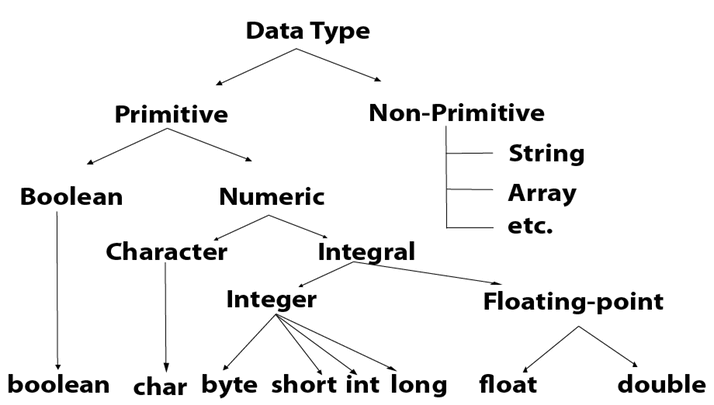
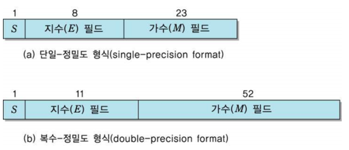

# 지옥자바 스터디 - 02 변수

## 변수 ?
- 수학에서 변수는 **변하는 수** 라고 정의하지만, 프로그래밍 에서의 변수는 **값을 저장하는 메모리 공간** 을 의미한다.
- 저장된 값이 변경될 수 있기 때문에 **변수** 라는 수학적 용어와 상통하는 면이 존재해서 이런식으로 붙여 졌다.

> 하나의 변수에는 하나의 값만 저장할 수 있고, 새로운 값을 저장하며 기존 값은 사라진다.

## 변수 선언 및 초기화

`변수 선언`

```java
[ type ][ name ]
    int age;
```
- **타입** 은 변수에 저장될 값이 어떤 **타입 (type)** 인지 선언 하는 것
- **이름** 은 변수에 붙인 이름, 메모리 공간에 이름을 붙여주는 것

> 변수 선언시, 메모리의 빈 공간에 변수 타입에 맞게 메모리가 할당되고, 변수를 통해 접근할 수 있다.

`변수 초기화`

- 변수를 사용하기 이전에는 반드시 변수를 **초기화** 해주는 작업이 필요하다.
- 메모리는 여러 애플리케이션이 공유하는 자원이기 때문에 다른 애플리케이션에 의해 저장된 알수 없는 값 (쓰레기값) 이 남아 있을 수 있다.
- 변수에 값을 저장시 **대입 연산자 (=)** 를 이용한다.

```java
int age = 25;
```
- 위 구문은 변수 age 를 선언하고 25 로 **초기화** 한다.
- 변수의 초기화는, 변수를 사용하기 전에 최초 값을 저장하는 행위를 말한다.
- 위 구문은 변수를 선언 과 동시에 초기화를 했기 때문에 **선언 및 초기화** 라고도 한다.

## 변수의 명명 규칙
- 변수 명 같이 프로그래밍에서 사용되는 모든 이름을 **식별자 (identifier)** 라고 하며, 식별자는 같은 영역 내에서 서로 식별 될 수 있어야 한다.

`식별자 생성 규칙`
1. 대소문자는 구분되고, 길이에 제한이 없다.
2. 예악어는 사용해서는 안된다.
3. 숫자로 시작해서는 안된다.
4. 특수문자는 _ 와 $ 만을 허용한다.

> 예약어는 키워드 혹은 리져브드 워드 라고도 하며, 프로그래밍 언어 구문에 사용되는 단어를 의미한다. <br/>
> 따라서 예약어는 클래스 / 변수 / 메소드명의 식별자로 사용할 수 없다.

`Style Guide`
- 각 프로그래밍 언어하다 선호하는 스타일 관례가 있고, 자바는 대표적으로 Google-Style-Guide 를 많이 따른다.
    - https://velog.io/@new_wisdom/JAVA-Google-Java-Style-Guide-%EB%B2%88%EC%97%AD
    - https://github.com/raywenderlich/java-style-guide#packages

## 변수의 타입
- **자료형 (data-type)** 은, 데이터의 종류에 따라 값이 저장될 공간의 크기과, 저장형식을 정의한 것이다.
- 자료형은 크게 기본형 과 참조형 두가지로 나눌 수 있다.



`기본형 (Primitive Type)`
- 기본형은 실제 **값** 을 저장한다.
- 자바는 C 계열 언어와 달리 참조형 변수 간의 연산을 할 수 없기 때문에 실제 연산에 사용되는 것은 모두 기본형 변수이다.
- 기본형 타입은 프로그래밍 언어마다 저장 방식은 조금씩 차이가 있지만 종류는 거의 비슷하다.

| 구분 | 타입 | 메모리 크기 | 기본 값 | 범위 |
| --- | --- | --- | --- | --- |
| 논리형 | boolean | 1 byte | false | true / false |
| 문자형 | char | 2 byte | '\u0000' | '\u0000' ~ '\uffff' |
| 정수형 | byte | 1 byte | 0 | -128 ~ 127 |
| 정수형 | short | 2 byte | 0 | -32,768 ~ 32767 |
| 정수형 | int | 4 byte | 0 | -2,147,483,648 ~ 2,147,483,647 |
| 정수형 | long | 8 byte | 0L | -9,223,372,036,854,775,808 ~ 9,223,372,036,854,775,807 |
| 실수형 | float | 4 byte | 0.0f | (3.4 X 10^-38) ~ (3.4 X 10^38) 의 근사값 |
| 실수형 | double | 8 byte | 0.0 | (1.7 X 10^-308) ~ (1.7 X 10^308) 의 근사값 |

`정수형 선언시 int 를 사용하라`
- 정수형 타입 선언시 byte, short 를 사용하라는 말이 있다.
- 이는 JVM 의 동작방식과 관련이 있다.
- JVM 은 기본적으로 32bit 기반으로 동작한다.
    - 정확하게 말하자면 StackFrame 의 Operand Stack 이 최소 단위를 모두 4바이트 크기로 만들어서 관리하기 때문이다.
- 배열에서 사용할때는 얘기가 또 다르다.

`문자형은 **유니코드 (unicode)** 를 사용한다`
- 문자형 타입은 char 는 문자를 내부적으로 정수(유니코드) 로 저장하기 때문에 정수 또는 실수형 타입과 연산도 가능하다.
- 유니코드는 세계 각국의 문자를 2byte 로 표현가능한 **국제 표준 규약**
- 흔히 말하는 인코딩, UTF-8... MS949 와 같은 **인코딩** 은 유니코드를 표현하는 **인코딩 방식** 이다.

`float 과 double 의 차이`
- 실수형 데이터 타입을 다룰때 가장 중요한 것은 **정밀도 (precision)** 이다.
    - 정밀도는 몇 자리 까지 오차 없이 표현할 수 있는가 ? 를 의미한다.
- float 보다 높은 정밀도가 필요하다면 double 을 사용해야 한다.
    - ~~자바 초기에 배울적에 float 이 더 정확하다고 알려준놈 아직도 기억나네... 후~~

| 자료형 | 크기 | 유효자릿수 | 비고 |
| --- | --- | --- | --- |
| float | 4byte | 7 | IEEE 754 단정밀도 부동소수점 |
| double | 8byte | 16 | IEEE 754 배정밀도 부동소수점 |

`실수형의 저장 방식`
- 4byte 정수와 4byte 실수는 같은 메모리 공간을 사용하는데 어떻게 더 큰 값을 표현할 수 있을까 ?
    - 이유는 두 가지 값이 저장하는 방식이 다르기 때문이다.
    - int 는 32비트 중 1비트 = 부호비트를 , 31비트는 값을 표현하는데 사용한다.
- **부동소수점 (floating-point)** 방식을 이용해 **근사 값** 을 표현한다.
    - IEEE 754 표준 방식
    - 컴퓨터에서 가장 널리 사용되는 방식
- IEEE 754 표준 방식에서는 부호, 지수, 가수 세 부분으로 구성된다.
    - 부호 : 1비트, 숫자의 부호를 나타내며 양수 = 0, 음수는 1 를 표현한다.
    - 지수 : 지수를 표현한다. (float : -127 ~ 128), (double : -1023 ~ 1024)
    - 가수 : 가수 또는 유효 숫자를 표현한다. (float : 7자리), (double : 15자리)



- 단정밀도 (single-precision)
    - 32비트로 표현된 부동 소수점
- 배정밀도 (double-precision)
    - 64비트로 표현된 부동 소수점

> float 과 double 은 Binary 32, Binary 64 방식을 이용해서 실수를 표현한다.

`Java 실수형의 문제`
- 아래 테스트는 실패한다.

```java
@Test
void test() {
    double a = 10.005;
    double b = 1.004;
    
    assertThat(a - b).isEqualTo(9.001);
}
// 테스트 결과
org.opentest4j.AssertionFailedError:
expected: 9.001
but was: 9.001000000000001
Expected :9.001
Actual   :9.001000000000001
```
- 이런 문제는 특히 돈과 관련되면 굉장히 민감해지는데.. 이런 문제를 해결하기 위해 **java.math.BigDecimal** 클래스를 제공한다.
- BigDecimal 은, Java 에서 숫자를 정밀하게 저장 하고 표현할 수 있는 **유일한 방법**
- 실수형 타입은 float 과 double 은 **근사치** 를 저장하기 때문에 값이 유실될 수 있다.
- BigDecimal 은 IEEE 754 의 **Decimal128** 을 지원한다.

> [BigDecimal](https://jsonobject.tistory.com/466)

`상수와 리터럴 (constant & literal)`
- **상수** 는 변수와 값을 저장할 수 있는 공간이지만, 변수와 달리 **한번 값을 저장하면 다른 값으로 변경할 수 없다.**
- Java 에서 상수를 선언하는 방법은 final 키워드를 사용한다.
- 또한 상수는 ~~반드시 선언과 동시에 초기화를 진행해야 하며~~, 그 후 부터는 상수의 값을 변경할 수 없다.
    - 상수를 초기화 하는 여러 방법을 제공한다.
    - 선언 및 초기화, 생성자, 초기화 블록 (static 상수의 경우 선언및 초기화 / 초기화 블록에서만 가능)
- 상수 선언과 즉시 초기화는 1.6 부터 안해도 된다.

```java
// 선언 및 초기화
final int MAX_SPEED = 10;

final int MAX_SPEED;
// 초기화 블록
{
    MAX_SPEED = 10;
}

// 생성자
NoteHighlightTest() {
    MAX_SPEED = 10;
}
```
- 초기화 블록에서 상수의 초기화를 진행했다면 생성자에서 재 할당할 수 없다.
- **리터럴** 은 프로그래밍에서 상수를 값을 한번 저장하면 재 할당 할 수 없는 공간으로 지정하였기 때문에 원래 상수의 의미와 구분하기 위해 리터럴 이라는 용어를 사용한다.
- 리터럴은, 우리가 기존에 알고 있던 상수의 다른 이름이다.
- JDK 1.7 부터 리터럴 중간에 **구분자 '_'** 를 넣을 수 있어 큰 숫자의 가독성이 좋아 졌다.
    - 참고로 코틀린은 1.1 부터 지원
- 리터럴 타입은, 타입이 다르더라도 저장범위가 넓은 타입에 좁은 타입의 값을 저장하는 것이 허용된다.

`상수가 필요한 이유?`
- 리터럴 보단 상수를 사용하자.
- 프로그래밍에서 상수로 선언하지 않고, 사용한 문자를 **매직 넘버**, 문자열을 **매직 리터럴** 이라고 표현한다.
    - 이 둘을 통틀어 매직넘버 라고도 표현하기도 한다.
- 코드에 상수로 선언되어 있지 않은 숫자, 문자열은 **그 의미를 파악하기 힘들다.**
- 이를 상수로 선언함으로 써 이름을 부여하고, **어떤 역할을 하는지 파악** 이 가능하다.

`참조형 (Reference Type)`
- 참조형은 실제 값이 아닌, **주소** 를 저장한다.
    - 여기서의 주소는, Heap 메모리에 저장된 주소이다.
- 위에서 살펴본 8가지 기본형 타입을 제외한 나머지는 모두 참조형 타입이다. (배열 포함)
- 참조형 변수 선언시에는 변수의 타입으로 **클래스의 이름** 을 사용한다.

```java
클래스명 변수명;
```

`Call by Value ? Call by Reference ?`
- Call by Value 와 Call by Reference 라는 말을 한번 쯤은 들어 봤을 것이다.
- 직역하면 전자는 값에 의한 복사, 후자는 참조(주소)에 의한 복사 이다.
    - 참조의 복사 = Pointer 를 넘긴다 고 이해하면 편리하다.
- 그럼 자바는 Call by Value 일가 ? Call by Reference 일까 ?
- 자바는 **Call by Value** 로 동작한다.
- 그럼 여기서 반발할 수 도 있는데...
- 다음 예제를 살펴보자.

```java
class Hello {
	String message = "greeting";
}

public void start() {
	Hello hello = new Hello();
	// hello.message : greeting
	changeMessage(hello);
	// hello.message : wow
}

public void changeMessage(Hello hello) {
	hello.message = "wow";
}
```
- 위 예제에서 참조를 이용해 객체의 내부 값을 변경할 수 있으니 Call by Reference 라고 주장하는 할 수 있다.
- 하지만 다음의 경우에는 changeMessage 메소드 내에서 hello 변수에 할당된 객체를 새롭게 생성하면 결과는 어떻게 될까

```java
class Hello {
	String message = "greeting";
}

public void start() {
	Hello hello = new Hello();
	// hello.message : greeting
	changeMessage(hello);
	// hello.message : greeting
}

public void changeMessage(Hello hello) {
	hello = new Hello();
	hello.message = "wow";
}
```
- 과연 의도한대로 동작하였는가 ?...
- 자바가 Call by Value 라고 표현한 이유는, JVM 동작 방식을 제대로 이해하고 있다면 어떤 의미인지 알 수 있을 것이다.
- 참조 변수를 넘기더라도, 포인터를 넘긴것이 아닌, 주소값을 **복사** 해서 넘기기 때문에 의도한대로 동작하지 않았고
- 참조 변수를 넘길때 Call by Reference 처럼 보이는 것 뿐이다..

## 진법

`10진법과 2진법`
- **10 진법** 사람이 이해하기 쉬운 방식, 우리가 일상에서 주로 사용한다.
- **2 진법** 컴퓨터가 이해할 수 있는 방식, 대부분의 컴퓨터는 2진법으로 설계 되었다.
    - 2진법은 0과 1로만 데이터를 표현하기 때문에 10진법에 비해 많은 자리수를 필요로 한다.

`비트와 바이트`
- 한 자리의 2진수를 **비트 (bit, binary bit)** 이라고 하며, 1 비트는 컴퓨터가 값을 저장할 수 있는 **최소 단위** 이다.
- 1비트는 너무 작은 값이기 때문에 8개의 비트를 묶어 **바이트 (byte)** 라는 단위로 정의해 데이터의 기본 단위로 사용한다.
- **워드 (word)** 라는 단위가 있는데, 워드는 **CPU 가 한 번에 처리할 수 있는 데이터의 크기** 를 의미한다.
    - 참고로 자바는 1word 의 단위가 8bit 이다.

`8진법과 16진법`
- 2진법으로 값을 표현하면 자리수가 상당히 길어진다는 단점이 있다.
- 이를 보완하기 위해 나온 방식이 8진법과 16진법이다.
- 8진법은 2진수 3자리를, 16진수를 2진수 4자리를 각각 한자리로 표현한다.
- 때문에 자리수가 짧아 알아보기 쉽고, 서로 간의 변환 도 간단하다.

## 형변환

`형변환 (캐스팅, casting)`
- 프로그램을 작성하다 보면 서로 다른 타입간의 연산을 수행해야 하는 경우가 있는데, 이럴때 연산을 수행하기전 타입을 일치시키는 작업이 필요하다.
- 이를 형변환 이라고 한다.

`형변환 방법`
- 형 변환 방법은 매우 간단하다.
- 변환하고자 하는 변수 또는 리터럴 값 앞에 변환하고자 하는 타입을 **괄호*8와 함께 써주면 된다.
    - 여기서 사용되는 괄호는 캐스팅 연산자, 형변환 연산자 라고도 한다.
```java
(타입) 피연산자
```

> 기본형 타입에서의 형변환은 boolean 을 제외하면 서로 형변환이 가능하다.

`자동 형변환`
- 자동 형변환은 편의상 이유로 특정한 경우에 생략이 가능하다.
- 형변환이 이뤄지는것이 아닌 컴파일러가 자동적으로 추가해 주는 것이다.

`자동 형변환의 규칙`
- 컴파일러가 판단하는 기준은 다음과 같다.
- "기존 값을 최대한 보존할 수 있는 타입으로 자동 형변환"
- 이해하기 쉽게 표현하자면, 범위가 좁은 타입 > 큰 타입 인 경우 값 손실이 없기 때문에 자동 형변환을 지원하지만, 반대의 경우는 그렇지 않다.


## 참고
- https://codetorial.net/articles/floating_point.html
- https://devlog-wjdrbs96.tistory.com/254
- https://gigglehd.com/gg/hard/5427559
- https://velog.io/@new_wisdom/Java-BigDecimal%EA%B3%BC-%ED%95%A8%EA%BB%98%ED%95%98%EB%8A%94-%EC%95%84%EB%A7%88%EC%B0%8C%EC%9D%98-%EB%84%88%EB%93%9C%EC%A7%93
- https://jsonobject.tistory.com/466
- https://brunch.co.kr/@kd4/2