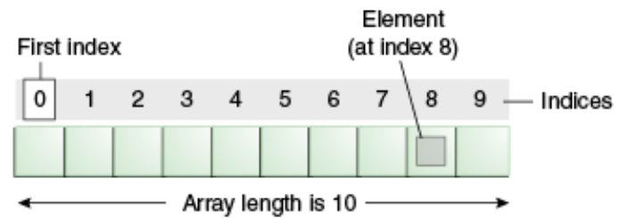
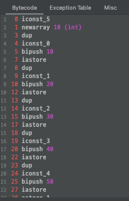
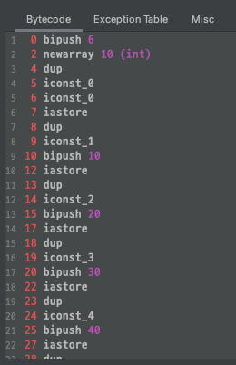
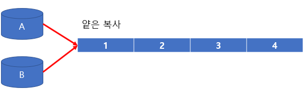
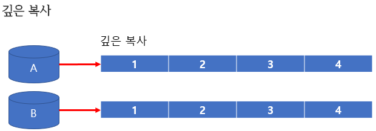
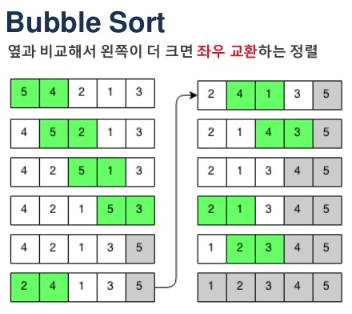

# 지옥자바 스터디 - 05 배열

## 배열

`배열 이란?`



- **배열 (Array)** 은 선형 자료구조중 하나
- 동일한 타입의 데이터를 메모리에 연속적으로 저장하여, 하나의 변수로 묶어 관리하기 위함
    - 서로 다른 타입의 변수로 구성된 배열을 만들 수 없다.
- 배열의 특징 배열을 구성하는 각 요소의 저장공간이 **연속적으로 배치** 된다는 점
- 그리고 **최초 선언한 길이가 고정** 되며, **인덱스 (index)** 를 통해 데이터에 접근이 가능하다.
    - 인덱스는 배열의 요소 마다 붙혀진 번호이고, 각 요소를 구분할때 사용한다.
    - 0 부터 시작하기 때문에 인덱스의 범위는 0 ~ 배열의 길이 - 1 까지 이다.
- **Heap 메모리에 저장** 된다.

> 가장 기본적인 자료인 만큼 거의 모든 언어에서 지원하고 있다.

`배열의 선언 및 초기화`
- 배열은 시그니쳐에 대괄호 [] 를 사용하며, 이를 선언 및 초기화 하는 다양한 방법을 제공한다.
    - 배열을 초기화 할때 **길이** 를 지정해 주어야한다.
    - 단 배열의 선언 및 값 초기화 방식을 사용하면, 길이를 자동으로 계산한다.
```java
// 배열의 선언
int[] arr;
int arr[];

// 배열의 선언 및 초기화
int[] arr = new int[10];
int arr[] = new int[10];

// 배열 선언 후 초기화
int[] arr;
arr = new int[10];

// 선언 및 값 초기화
int[] arr = { 1, 2, 3, 4, 5 };
int[] arr = new int[] { 1, 2, 3, 4, 5 };
```

> 기본형 타입 (Primitive Type) 의 경우 선언과 동시에 값 초기화를 하지 않으면 기본 값을 가지지만, 참조타입의 배열을 선언한 경우 초기값은 null 이다.

- 배열의 선언 및 초기화시 **값 초기화를 함께 수행** 하면 new 타입[] 이 생략이 가능하다.
- 배열의 선언과 초기화를 별도로 진행하는 경우 / 메소드 인자 위치에서 바로 선언 및 값 초기화를 수행하는 경우 생략할 수 없다. 

`재밌는 예시`

```java
// 컴파일하면 ?
public class Hello {
	public static void main(String[] args) {
		int arr[] = { 10, 20, 30, 40, 50 };
	}
}

public class Hello {
	public Hello() {
	}

	public static void main(String[] args) {
		int[] var10000 = new int[]{10, 20, 30, 40, 50};
	}
}
```


- 바이트코드를 살펴보면 유추해볼 수 있는것
- 위 코드는 다음과 같이 동작한다.

```java
int arr[] = new int[5]
arr[0] = 10;
arr[1] = 20;
arr[2] = 30;
arr[3] = 40;
arr[4] = 50;
```
- iconst_5 는 뭐지 ?.. 하고 찾아보고 실험해보니..
- 이번엔 배열의 크기를 6으로 늘려보자.
```java
public class Hello {
	public static void main(String[] args) {
		int arr[] = { 0, 10, 20, 30, 40, 50 };
	}
}
```



- 살펴보다 보니 재밌는점.. 리터럴 -1 ~ 5 까지는 bipush 연산이 일어나지 않는다?..
    - 리터럴 상수가 5보다 클경우 bipush 연산이 발생함
- 정수 상수를 operand stack 으로 저장하는 여러 명령어들이 있음..
1. iconst_<N>
    - 값 자체가 opcode 로 인코딩되어 있기 때문에 1byte 크기를 가짐
2. bipush
    - -128 ~ 127 범위의 상수를 push 할 수 있다.
    - 이 명령은 2bytes 의 크기를 가진다. 1byte 는 opcode, 나머지 1byte 는 8bit signed 정수로 구성되어 있다. 
3. sipush
    - bipush 가 8bit 범위의 정수를 저장한다면, 이는 16bit 범위를 저장하는 명령어이다. 
    - 3bytes 크기를 가진다.
    
> 16bit 를 넘어가는 정수는 어떻게 저장될까요 ?.. <br/>
> 이 경우 상수풀을 이용한다. (idc 또는 idc_w 명령어 이용)
> 가끔 iload 라는 코드가 보이는데 이는 로컬변수를 로드하는 것과 전혀 관계가 없다. 

`배열의 요소 접근 및 저장`
- 배열의 값을 읽고 쓰는 방법은 변수와 동일하다.
- 변수 명 대신 "배열명 [인덱스]" 의 형태로 접근한다는 점이 유일한 차이점이다.

```java
score[3] = 100;
int value = score[3];
```

> index 가 오는 자리에 리터럴 상수 대신 변수 또는 수식이 사용 가능 하다. <br/>
> 만약 배열의 유효범위를 벗어나는 위치에 접근을 할 경우 ArrayIndexOutOfBoundsException 이 발생한다.

`배열의 길이`
- JVM은 모든 배열의 길이를 별도로 관리한다.
- 배열의 이름.length 를 호출하면 배열 길이에 대한 정보를 얻을 수 있다.

```java
int[] arr = new int[5];
arr.length; // 5
```

> 한번 생성된 배열은 **길이를 변경할 수 없다**

`배열의 길이 변경하기`
- 한번 생성된 배열은 길이를 변경할 수 없다고 했는데, 만약 배열의 저장공간이 부족해지면 어떻게 해야하는가 ?
- 1. 기존의 배열보다 더 큰 길이를 가진 배열을 생성한다.
- 2. 기존 배열의 내용을 새로운 배열에 복사한다.

> 추후 배울 Collection 들에서 요소를 저장할때 배열을 사용하며, 컬렉션의 크기에 따라 크기가 더 큰 배열을 생성하고 기존 요소를 복사하는 방식을 취한다.

`배열의 출력`
- 배열에 저장된 값을 출력할때 일반적으로 for 문을 이용한다.
- 간단한 방법으로 출력할 수 있는 방법은 Arrays 클래스의 toString 함수를 이용하는 것이다.

```java
// for 문을 이용한 출력
for (int i = 0; i < arr.length; i++) {
	System.out.println(arr[i]);
}

// Arrays.toString()
System.out.println(Arrays.toString(arr));
```

`배열의 복사`
- 배열을 복사하는 방법은 크게 두 가지가 있다.
    - for 문을 사용하는 방법
    - JDK 에서 제공하는 메소드를 사용하는 방법
- 배열을 복사하는 방식으로 는 크게 **깊은 복사 (deep copy)** 와 **얕은 복사 (shallow copy)** 가 있다.

> 얕은 복사 : 복사된 배열 또는 원본 배열이 변경되면 양쪽 모두 변경된다. <br/>
> 깊은 복사 : 복사된 배열 또는 원본 배열이 변경되어도 서로 영향을 미치지 않는다.



```java
int[] a = { 1, 2, 3, 4 };
int[] b = a;
```
- 두개의 참조 변수가 하나의 주소값을 바라보고 있는 형태
- ~~배열을 복사하는 의미가 없다.~~
    - 복사라기 보단 같은 주소를 바라본다.



```java
int[] a = { 1, 2, 3, 4};
int b = new int[a.length];
for (int i = 0; i < a.length; i++) {
    b[i] = a[i];	
}
```
- 각 배열이 서로다른 주소를 가리키고, **배열의 요소가 복사하는 방식**
- 실제 의미있는 복사 

`배열을 복사하는 다양한 메소드`

Object.clone()

```java
int[] a = { 1, 2, 3, 4 };
int[] b = a.clone();
```
- 가장 단순한 배열 복사 방식

System.arraycopy()

```java
int[] a = { 1, 2, 3, 4 };
int[] b = new int[a.length];
System.arraycopy(a, 0, b, 0, a.length);
```
- 가장 기본적인 배열 복사 방식
- 지정한 배열을 대상 배열에 복사한다.

Arrays.copyOf()

```java
int[] a = { 1, 2, 3, 4 };
int[] b = Arrays.copyOf(a, a.length);
```
- 심플하게 사용가능한 배열 복사 방식
- 배열의 시작점 ~ 원하는 length 까지 복사한다.

> Arrays.copyOf 메소드도 내부적으로 System.arraycopy() 메소드를 활용한다.

Arrays.copyOfRange()

```java
int[] a = { 1, 2, 3, 4 };
int[] b = Arrays.copyOfRange(a, 1, a.length);
```
- copyOfRange() 메소드는 이름에서 알 수 있듯이 시작점 ~ 종료지점 즉 **범위를 지정** 할 수 있다.
- Arrays.copyOf 메소드와 마찬가지로 내부적으로 System.arraycopy() 메소드를 활용한다.

> 위 메소드들은 모두 **기본 자료형과 1차원 배열에 한해서만 깊은 복사를 지원** 한다. <br/>

`배열의 정렬`
- 반복문을 이용한 직접 정렬을 구현
  - **버블 정렬**을 사용

```java
for (int i = 0; i < arr.length - 1; i++) {
    for (int j = 0; j < arr.length - 1 - i ; j++) {
    	if (arr[j] > arr[j + 1]) {
    	    int tmp = arr[j];
    	    arr[j] = arr[j + 1];
    	    arr[j + 1] = tmp;
        }
    }
}
```

`버블 정렬`



- 서로 인접한 두 원소를 검사하여 정렬하는 알고리즘

> 알고리즘 스터디가 아니기에... 다양한 정렬 알고리즘은 생략

`Arrays.sort()`
- 반복문으로 직접 구현하는 방법 외에 JDK 에서 제공하는 Arrays.sort 메소드가 있다.
- 기본적으로 오름차순 정렬이 되고, **전략 패턴** 이 적용되어 있음
    - **기본형 타입** 의 경우 **DualPivotQuickSort [O(n log(n))]** 를 사용하고, **참조형 타입** 의 경우 **[TimSort](https://d2.naver.com/helloworld/0315536)** 를 사용한다.
    - DualPivotQuickSort
      - 이름 그대로 피벗을 2개 두고 정렬을 진행한다.
      - 일반적인 퀵 정렬에 비해 평균적으로 좋은 성능을 냄
    - TimSort
      - Insertion sort (Binary Insertion sort) 와 Merge sort를 결합한 알고리즘
      - 
```java
int arr[] = {4,23,33,15,17,19};
Arrays.sort(arr);
```

`Collections.sort()`
- 뒷쪽에서 살펴볼 **컬렉션** 에 대해 정렬을 할 수 있도록 제공하는 메소드
- TimSort 를 사용한다.
- JDK 8 부터 Collections.sort 보다는 List.sort 를 권장
  - JDK 8 부터 Collections.sort 구현이 List.sort 로 위임하고있음

`왜 사용하는 정렬 알고리즘이 다를까 ?`
- 이유는 **[참조 지역성(Locality of Reference)](https://jwprogramming.tistory.com/18)** 때문
  - 동일한 값 혹은 인접한 스토리지가 자주 액세스 되는 특성
  - CPU 캐싱 전략에 영향을 미친다.
- 정렬의 실제 동작시간은 **C * 시간복잡도 + a**
  - C라는 값이 바로 참조 지역성의 영향을 받게된다.
- **기본형 타입의 배열** 의 경우 일반적으로 각 값들이 연속적인 메모리 공간에 위치 하고 있기 때문에 C 의 값이 낮다.
- **Object 타입** 의 경우 기본형 데이터와 달리 메모리가 분산되어 있을 확률이 매우 높다.
  - 이럴 경우 위에서 말한 C 의 값이 높기 때문에 퀵 정렬 보다, Tim 정렬을 사용하는게 평균적으로 더 좋은 성능이 나옴

> https://docs.oracle.com/en/java/javase/11/docs/api/java.base/java/util/Arrays.html#sort(java.lang.Object%5B%5D) <br/>
> https://stackoverflow.com/questions/32334319/why-does-collections-sort-use-mergesort-but-arrays-sort-does-not

// TODO
- 팀 정렬 공부 및 추가 정리
- Arrays.sort 관련 알고리즘 정리 (Counting Sort 등..)
- Arrays.parellesort 정리

`Arrays.parelleSort`
- 벙렬 정렬

## 참고
- https://ifuwanna.tistory.com/231
- https://stackoverflow.com/questions/30744648/why-does-the-jvm-have-the-iconst-2-iconst-5-opcodes
- https://coding-factory.tistory.com/548
- https://blog.tomclansys.com/51
- https://sabarada.tistory.com/138
- https://stackoverflow.com/questions/32334319/why-does-collections-sort-use-mergesort-but-arrays-sort-does-not
- https://en.wikipedia.org/wiki/Quicksort
- https://www.google.com/search?q=collections.sort+vs+list.sort&oq=Collections.sort+List.sort&aqs=chrome.2.69i57j0i8i30l3&sourceid=chrome&ie=UTF-8
- https://www.baeldung.com/java-sorting
- https://docs.oracle.com/en/java/javase/11/docs/api/java.base/java/util/Arrays.html#sort(java.lang.Object%5B%5D)
- https://jwprogramming.tistory.com/18
- https://d2.naver.com/helloworld/0315536